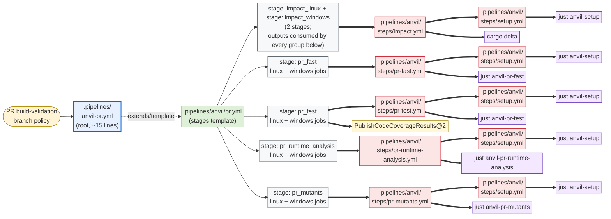
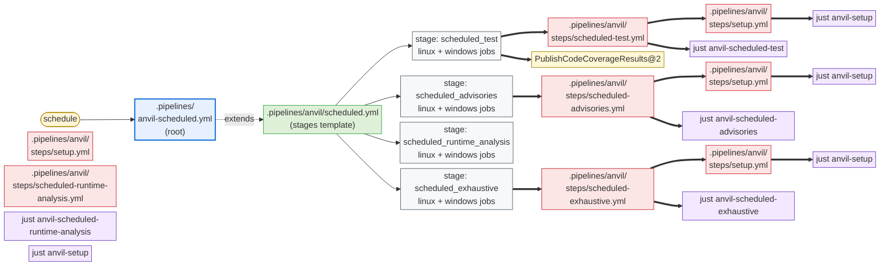

# Azure DevOps Pipelines Integration

This document describes what `cargo anvil --backend ado` emits for Azure DevOps
Pipelines, and how a repo wires those files into its own cloud workflows.

anvil emits three layers, all owned by anvil with the standard owned-file flow (edit →
dirty → `.anvil-proposed` sibling on next update). The split is by what users actually
need to change:

1. **Root pipelines** (`anvil-pr.yml`, `anvil-scheduled.yml` at `.pipelines/`). Triggers,
   runner pool, secret variable groups, and the optional `extends:` to a compliance
   template (1ESPT/SubstratePT/CloudBuild) live here. anvil ships an opinionated default;
   users who need to customize edit in place and accept the proposal-on-update flow.
   anvil's emitted root pipelines contain **no** references to compliance harnesses —
   wrapping with 1ESPT is purely a user-side edit.
2. **Stages templates** (`anvil/pr.yml`, `anvil/scheduled.yml`), containing the impact stage
   and the per-group stages that download the impact artifact it publishes. These
   change when anvil's groups or impact wiring evolve; most users won't ever edit them.
3. **Per-group step templates** (`anvil/steps/*.yml`). Each is a multi-step template that
   runs setup + the matching `just anvil-<tier>-<group>` recipe.

See also:

- [design.md §6](./design.md#6-repo-layout) for the file-category model.
- [checks.md](./checks.md) for what each group runs.
- [local.md](./local.md) for the `just` recipes the templates invoke.
- [github.md](./github.md) for the GitHub Actions counterpart.

## 1. Why three layers

- **Frequently-changing wiring** (group set, impact computation, fan-out, output-variable
  plumbing) lives in the stages template. Updates apply automatically; users don't have
  to merge changes.
- **Per-repo customization** (triggers, runner pool, compliance harness, secrets) lives
  in the root pipeline. Users who customize it accept the cost of merging the
  `.anvil-proposed` sibling when the anvil defaults evolve — which is rare, since the
  root pipeline is intentionally minimal.
- **Compliance composition** is purely a user concern. anvil's stages template is plain
  ADO YAML; 1ESPT/SubstratePT/CloudBuild composition happens in the user's root pipeline
  by way of `extends:` and `parameters.stages`.

The PR pipeline:



(Every job in `pr_fast`, `pr_test`, `pr_runtime_analysis`, and `pr_mutants` is rendered through the per-job wrapper at `steps/job.yml`; that uniform indirection is elided from the diagram. See §4.1 for the wrapper's role as a 1ESPT extensibility point.)

The scheduled pipeline (same colour key):



Every PR-tier group stage declares `dependsOn: [impact_linux, impact_windows]` so it can read the cargo-delta output variables. That fan-in is elided from the diagram to keep it readable.

Note the ADO topology differs from GitHub Actions in two places:
1. **No reusable workflow indirection**: ADO `extends:` is one-shot; the root pipeline extends a single template. We compensate by putting all stages in `pr.yml` / `scheduled.yml` as direct templates.
2. **Per-job wrapper**: the `steps/job.yml` template is ADO-specific. GitHub composite actions are uniform; ADO 1ESPT requires per-job extensibility hooks that the wrapper exposes through its `name`/`pool`/`steps`/`artifacts` parameter contract (see §4.1).

## 2. Emitted artifacts

```text
.pipelines/
├── anvil-pr.yml                    owned   (root PR pipeline)
├── anvil-scheduled.yml               owned   (root scheduled pipeline)
└── anvil/
    ├── pr.yml                      owned   (PR-tier stages template)
    ├── scheduled.yml               owned   (scheduled-tier stages template)
    ├── custom-pr-stages.yml        owned-but-user-customizable
    │                                   (empty stub; add your own PR-tier
    │                                    stages here -- see §3.1)
    ├── custom-scheduled-stages.yml owned-but-user-customizable
    │                                   (empty stub; add your own
    │                                    scheduled-tier stages here)
    └── steps/
        ├── setup.yml               owned   (install just + catalog tools)
        ├── impact.yml              owned   (cargo-delta impact step; omitted if .delta.toml disabled)
        ├── job.yml                 owned-but-user-customizable
        │                                   (per-job wrapper; takes `name`,
        │                                    `pool`, `steps`, `artifacts`;
        │                                    users edit to inject 1ESPT
        │                                    `templateContext:` etc.)
        ├── pr-fast.yml             owned   (one step template per group)
        ├── pr-test.yml            owned
        ├── pr-runtime-analysis.yml            owned
        ├── pr-mutants.yml            owned
        ├── scheduled-test.yml        owned
        ├── scheduled-advisories.yml  owned
        ├── scheduled-runtime-analysis.yml  owned
        └── scheduled-exhaustive.yml  owned
```

All files are regular owned files tracked by the sidecar `.anvil.lock` manifest
(no in-file checksum line; see [updates.md §1](./updates.md#1-the-manifest)).
`steps/job.yml` deserves special mention: it is emitted as owned (so first-time
adoption gets a working file with no extra steps), but is *expected* to be
customized by adopters whose ADO instance requires extension templates
(1ES PT, SubstratePT, M365PT). Once a user edits it, the standard dirty-file
flow kicks in — subsequent anvil updates Propose into a `.proposed` sibling
rather than overwriting. The stages templates address the wrapper only via its
parameter contract (`name`, `pool`, `steps`, `artifacts`), so the wrapper can
diverge arbitrarily without blocking stage-shape updates. See §4.1.

## 3. Root pipelines

The default `anvil-pr.yml` anvil emits is the minimum needed to run anvil's stages
template. PR validation for the pipeline is configured via Azure DevOps branch policies in
the project UI — the YAML `pr:` trigger is ignored for Azure Repos and only relevant for
GitHub-hosted repos consumed via an Azure Pipelines service connection (in which case the
adopter adds their own `pr:` block).

```yaml
# .pipelines/anvil-pr.yml
trigger: none

stages:
- template: anvil/pr.yml
  parameters:
    linuxPool:   { vmImage: ubuntu-latest }
    windowsPool: { vmImage: windows-latest }
- template: anvil/custom-pr-stages.yml
  parameters:
    linuxPool:   { vmImage: ubuntu-latest }
    windowsPool: { vmImage: windows-latest }
```

The scheduled root pipeline adds a schedule:

```yaml
# .pipelines/anvil-scheduled.yml
trigger: none
pr: none

schedules:
- cron: "0 6 * * *"
  displayName: anvil scheduled
  branches:
    include: [main, master]
  always: true

stages:
- template: anvil/scheduled.yml
  parameters:
    linuxPool:   { vmImage: ubuntu-latest }
    windowsPool: { vmImage: windows-latest }
- template: anvil/custom-scheduled-stages.yml
  parameters:
    linuxPool:   { vmImage: ubuntu-latest }
    windowsPool: { vmImage: windows-latest }
```

The schedule lists both `main` and `master` so adopters using either canonical-branch
name get coverage out of the box. ADO matches each entry against existing branches; an
entry that matches nothing contributes nothing, so a repo using only `main` runs the
schedule exactly once per cron tick.

### 3.1 Custom stages extension point

Some repos need their own stages — a deploy stage, a compliance gate, a downstream
trigger — without forking the anvil-owned root pipeline or stages template. Each root
pipeline therefore references a per-tier **`custom-*-stages.yml`** after the anvil
stages:

- `.pipelines/anvil/custom-pr-stages.yml` — runs in the PR pipeline.
- `.pipelines/anvil/custom-scheduled-stages.yml` — runs on the schedule.

anvil emits each as an empty `stages: []` stub that declares the `linuxPool` /
`windowsPool` parameters the root passes (so custom stages can reuse the same pools).
Because the overall pipeline already carries the anvil stages, an empty custom stub is
valid — it simply contributes nothing until the adopter fills it in. These files are
**owned-but-user-customizable** like `steps/job.yml`: once edited, the dirty-file flow
takes over (anvil Proposes into a `.proposed` sibling rather than overwriting), so a
repo's custom stages survive subsequent `cargo anvil` runs while the anvil-owned root and
stages templates keep tracking upstream changes. ADO runs stages sequentially by default,
so a custom stage depends on the preceding anvil stage unless it sets `dependsOn`
explicitly.

For an internal/compliance pipeline, the user replaces their root pipeline with one that
extends 1ESPT/SubstratePT and passes anvil's stages template as the stages parameter,
overriding the pools with the team's 1ESPT pools:

```yaml
# .pipelines/anvil-pr.yml (user-edited for 1ESPT)
trigger: none

resources:
  repositories:
  - repository: 1ESPipelineTemplates
    type: git
    name: 1ESPipelineTemplates/1ESPipelineTemplates
    ref: refs/tags/release

extends:
  template: v1/1ES.Unofficial.PipelineTemplate.yml@1ESPipelineTemplates
  parameters:
    pool: { name: <your-default-1ESPT-pool> }
    stages:
    - template: /.pipelines/anvil/pr.yml@self
      parameters:
        linuxPool:   { name: <your-1ESPT-linux-pool> }
        windowsPool: { name: <your-1ESPT-windows-pool> }
```

The `extends:` keyword, the resources block, and the pool definitions are entirely the
user's business. anvil's `pr.yml` is a plain stages template that drops in unchanged.
The default matrix is Linux + Windows in all cases — adopters who want a narrower or
wider matrix edit the emitted stages template directly (taking ownership via the
dirty-file flow).

## 4. Owned stages templates

**ARM coverage gap (ADO).** Unlike GitHub, ADO has no Microsoft-hosted ARM agents
(no `vmImage` exists for Linux aarch64 or Windows aarch64). The ADO backend's default
matrix is therefore x86_64 only — `linuxPool` (`ubuntu-latest`) + `windowsPool`
(`windows-latest`). This matches the platforms list `oxidizer`'s root pipelines emit.
Adopters with self-hosted ARM agents extend the stages template in their own root
pipeline (or fork the emitted stages); anvil itself does not ship ARM legs on ADO.
The catalog and recipes are identical across backends — the asymmetry is purely in the
wiring layer's default OS matrix. See
[checks.md §1](./checks.md#1-groups-and-tiers) for the per-group OS scope tables.

The `pr.yml` stages template is where the wiring lives. The impact stage publishes the
`anvil-impact` artifact (via `job.yml`'s `artifacts` parameter); every downstream group
stage declares it as an input (via `job.yml`'s `inputArtifacts` parameter) and the recipes
read the restored cache files. Which tiers a group's checks actually consume is the catalog's
concern, not the wiring layer's. This means moving a check between groups (e.g. `clippy` from
`pr-fast` to `scheduled-advisories`) never changes the stages template.

### 4.1 Per-job wrapper (`steps/job.yml`) — the 1ESPT extensibility point

Every job in `pr.yml` and `scheduled.yml` is rendered through a wrapper template at
`.pipelines/anvil/steps/job.yml` rather than declared inline. The wrapper exists
to give adopters whose ADO instance requires extension templates (1ES PT,
SubstratePT, M365PT, custom corporate templates) a single, narrow place to inject
the per-job boilerplate those templates require — `templateContext:` blocks,
build-provenance attributes, SDL hooks, custom checkout depths, etc. — without
forking the much larger owned stages templates.

The contract is intentionally small and stable:

| Parameter   | Type       | Required | Meaning                                                                                                                                                                                |
|-------------|------------|----------|----------------------------------------------------------------------------------------------------------------------------------------------------------------------------------------|
| `name`      | `string`   | yes      | Job name; ADO derives the display name from it.                                                                                                                                        |
| `pool`      | `object`   | yes      | Pool block, passed verbatim to ADO's `pool:` key. `linuxPool` and `windowsPool` at the stage level are object parameters, so users can override their shape (e.g. `{ name, os, image }` for 1ESPT). |
| `steps`     | `stepList` | yes      | Body of the job. Templated step lists are fine — the wrapper splices them in via `${{ each step in parameters.steps }}: - ${{ step }}`.                                                |
| `artifacts` | `object`   | no       | List of pipeline artifacts to **publish**. Each item: `{ name: string, path: string }`. Default wrapper appends one `PublishPipelineArtifact@1` per entry; 1ESPT wrappers translate the same list into `templateContext.outputs.pipelineArtifact` blocks. The stages templates don't need to know which backend they're targeting. |
| `inputArtifacts` | `object` | no   | List of pipeline artifacts to **consume**. Each item: `{ name: string, path: string }`. Default wrapper prepends one `DownloadPipelineArtifact@2` per entry; 1ESPT wrappers translate the same list into `templateContext.inputs` (`{ input: pipelineArtifact, … }`) blocks. This is the symmetric counterpart of `artifacts`: `DownloadPipelineArtifact@2` is a `task:` step, which some compliance extension templates (1ESPT/SubstratePT) disallow in job bodies and require to be declared as `templateContext.inputs` instead — so, exactly as with the publish side, the *list of artifacts* is the stable contract and how it's materialized is the wrapper's concern. |

The default wrapper anvil ships is a few lines of logic:

```yaml
parameters:
  - { name: name, type: string }
  - { name: pool, type: object }
  - { name: steps, type: stepList }
  - { name: artifacts, type: object, default: [] }
  - { name: inputArtifacts, type: object, default: [] }
jobs:
  - job: ${{ parameters.name }}
    pool: ${{ parameters.pool }}
    steps:
      - ${{ each artifact in parameters.inputArtifacts }}:
          - task: DownloadPipelineArtifact@2
            displayName: Download ${{ artifact.name }}
            inputs:
              artifact: ${{ artifact.name }}
              path: ${{ artifact.path }}
      - ${{ each step in parameters.steps }}:
          - ${{ step }}
      - ${{ each artifact in parameters.artifacts }}:
          - task: PublishPipelineArtifact@1
            displayName: Publish ${{ artifact.name }}
            condition: succeededOrFailed()
            inputs:
              targetPath: ${{ artifact.path }}
              artifact: ${{ artifact.name }}
```

A 1ESPT user replaces the wrapper body with something like:

```yaml
jobs:
  - job: ${{ parameters.name }}
    pool: ${{ parameters.pool }}
    templateContext:
      inputs:
        - input: checkout
          repository: self
          fetchDepth: 0
        - ${{ each artifact in parameters.inputArtifacts }}:
            - input: pipelineArtifact
              artifactName: ${{ artifact.name }}
              targetPath: ${{ artifact.path }}
      outputs:
        - ${{ each artifact in parameters.artifacts }}:
            - output: pipelineArtifact
              targetPath: ${{ artifact.path }}
              artifactName: ${{ artifact.name }}
              condition: succeededOrFailed()
    steps:
      - ${{ each step in parameters.steps }}:
          - ${{ step }}
```

`pool` shape is *also* an extensibility point — `linuxPool` / `windowsPool` are
`type: object` at the stage level, so the same root-pipeline that swaps in a
1ESPT-shaped pool (`{ name, os, image }` instead of `{ vmImage }`) doesn't need
any other changes.

**Why a dedicated wrapper file rather than parameterizing the stages template?**
Because the wrapper is short and stable, but the stages template is long and
changes often (new groups, new dependsOn rules, new artifact wiring). Putting
the user's customization in a separate file means stages updates flow through
without merging, and the user's wrapper changes survive every anvil upgrade.

**Why is the wrapper "owned" rather than "proposed-once"?** So that first-time
adoption needs zero extra steps — a fresh `cargo anvil` writes a
working wrapper and the pipeline runs. The dirty-file behavior kicks in only
after the user actually edits the file: from then on, anvil Proposes into
`.proposed` siblings on conflict. This is the same mechanism every other owned
file uses; the wrapper isn't special — it just happens to be the one file most
internal adopters will customize.

**Template-path note.** Each entry in the `steps:` parameter at the call site
contains a `template:` reference (e.g. `template: steps/pr-fast.yml`). ADO
resolves template paths relative to the file containing the `template:`
keyword, which for parameters defined at the call site is the stages template
itself — so the path is written relative to `pr.yml` / `scheduled.yml`, *not*
relative to `steps/job.yml`.

### 4.2 Stages template shape

Approximate shape (anvil writes this verbatim; users normally don't edit it):

```yaml
# .pipelines/anvil/pr.yml   (owned by cargo-anvil)
parameters:
  - name: linuxPool
    type: object
    default: { vmImage: ubuntu-latest }
  - name: windowsPool
    type: object
    default: { vmImage: windows-latest }

stages:
  - stage: impact
    displayName: anvil impact
    jobs:
      - template: steps/job.yml
        parameters:
          name: compute
          pool: ${{ parameters.linuxPool }}
          # job.yml publishes the artifact (default: PublishPipelineArtifact@1;
          # 1ESPT: templateContext.outputs). impact.yml just runs the recipe.
          artifacts:
            - { name: anvil-impact, path: $(Build.SourcesDirectory)/target/anvil/impact }
          steps:
            - template: steps/impact.yml

  - stage: pr_fast
    displayName: anvil pr-fast
    dependsOn: impact
  - stage: pr_fast
    displayName: anvil pr-fast
    dependsOn: impact
    # Gate on impact via the default succeeded() condition (no explicit
    # `condition:`). A failed impact stage skips pr-* and fails the pipeline,
    # rather than leaving it green with a lone red impact stage. The scope
    # itself arrives as the downloaded impact artifact (job.yml inputArtifacts),
    # not as stage-output variables.
    jobs:
      - template: steps/job.yml
        parameters:
          name: linux
          pool: ${{ parameters.linuxPool }}
          # job.yml restores the artifact (default: DownloadPipelineArtifact@2;
          # 1ESPT: templateContext.inputs) before the group steps run.
          inputArtifacts:
            - { name: anvil-impact, path: $(Build.SourcesDirectory)/target/anvil/impact }
          steps:
            - template: steps/pr-fast.yml
      - template: steps/job.yml
        parameters:
          name: windows
          pool: ${{ parameters.windowsPool }}
          inputArtifacts:
            - { name: anvil-impact, path: $(Build.SourcesDirectory)/target/anvil/impact }
          steps:
            - template: steps/pr-fast.yml

  # pr_test, pr_runtime_analysis, and pr_mutants each follow the same shape and
  # run as independent parallel stages.
```

The pr-* stages gate on the impact stage *succeeding* (the default `succeeded()`
condition on their `dependsOn: impact`): if impact fails, pr-* are skipped and the
pipeline fails at impact. This is deliberate — using `succeededOrFailed()` would let
pr-* run on a failed impact, leaving the pipeline green with a single red impact
stage and misleading reviewers into investigating a "failure" while every actual
check is green. Treating impact as a gate turns a broken impact into an unambiguous,
blocking failure.

The artifact is published and restored through `job.yml`'s `artifacts` / `inputArtifacts`
parameters (§4.1), **not** by a raw `PublishPipelineArtifact@1` / `DownloadPipelineArtifact@2`
step inside the group template. This matters because `DownloadPipelineArtifact@2` is a `task:`
step that 1ESPT/SubstratePT job templates reject in the job body — they require pipeline-input
artifacts to be declared as `templateContext.inputs`. By routing both directions through
`job.yml`, the one wrapper an adopter already overrides for compliance is the single place
that decides *how* artifacts move; the stages template only declares *which* artifact each
stage produces or consumes. There is no stage-output → variable plumbing at all. (Contrast the
previous design, which threaded `include_modified` / `include_affected` / `include_required`
as `stageDependencies.impact.compute.outputs[...]` runtime variables into every downstream
stage.)

The wiring never branches jobs on impact's *output values*. Each group always runs (once
its impact dependency has succeeded); recipes inside the group decide whether a given check
no-ops by resolving its tier's include value and testing for the literal sentinel `--skip`.
This matters because unscoped checks
(`deny`, `audit`, `aprz`, `pr-title`, `mutants-full`) must run on every PR. See
[local.md §4](./local.md#4-impact-scoping) for the recipe-side contract.

anvil unrolls the OS axis into two explicit jobs (`linux` and `windows`) at
template-compile time rather than using `strategy.matrix`, so that each leg is a distinct
`steps/job.yml` invocation — the per-job wrapper (and its `templateContext` extensibility
point for 1ESPT inputs/outputs) is the unit of customization, which a matrix job would
collapse. Setting `windowsPool: {}` in the user's root pipeline can elide the Windows job
entirely if their root pipeline is shaped to support that.

The scheduled stages template is simpler — it omits the `impact` stage and runs each
group full-workspace, with the same `linuxPool` / `windowsPool` parameter shape and
the same `steps/job.yml` delegation. Scheduled step templates set `ANVIL_IMPACT: off` so a
check's `: anvil-impact` dependency no-ops and recipes fall through to `--workspace`; they
take no `include*` parameters.

If `.delta.toml`'s managed region is disabled
([updates.md §opt-out](./updates.md#6-opting-out-in-file-stubs)), the impact step is
unaffected — `cargo delta impact` uses its own defaults when the config file is missing
or empty.

## 5. Per-group step templates

Each per-group step template has a minimal parameter surface — a per-template handful of
PR-context strings, no impact parameters. The scope arrives as a downloaded artifact, and the
download itself is **not** in the step template: it's declared on the enclosing job via
`job.yml`'s `inputArtifacts` parameter (§4.1, §4.2), so it materializes as
`DownloadPipelineArtifact@2` on a default agent and as a `templateContext.inputs` pipeline
artifact under 1ESPT. The step template just runs setup + the group recipe, which reads the
restored cache files. The stages template therefore doesn't need to know which tiers a group's
checks consume. Moving a check between groups (or between tiers) is a pure catalog change.

```yaml
# .pipelines/anvil/steps/pr-fast.yml  (owned by cargo-anvil)
steps:
- template: setup.yml
  parameters: { group: pr-fast }   # includes cargo-delta for the recompute fallback
# ADO has no PR-title predefined variable (System.PullRequest.Title does
# not exist), so resolve it from the REST API on PR builds and publish it
# as PR_TITLE. Best-effort: empty on non-PR / fork / API failure, in which
# case anvil-pr-title skips.
- pwsh: |
    $prId = $env:SYSTEM_PULLREQUEST_PULLREQUESTID
    if (-not $prId) { Write-Host '##vso[task.setvariable variable=PR_TITLE]'; exit 0 }
    $uri = "$($env:SYSTEM_COLLECTIONURI)$($env:SYSTEM_TEAMPROJECTID)/_apis/git/repositories/$($env:BUILD_REPOSITORY_ID)/pullRequests/${prId}?api-version=7.0"
    try { $r = Invoke-RestMethod -Uri $uri -Headers @{ Authorization = "Bearer $($env:SYSTEM_ACCESSTOKEN)" }; Write-Host "##vso[task.setvariable variable=PR_TITLE]$($r.title)" }
    catch { Write-Host '##vso[task.setvariable variable=PR_TITLE]' }
  env:
    SYSTEM_ACCESSTOKEN: $(System.AccessToken)
- script: just anvil-pr-fast
  displayName: anvil pr-fast
  env:
    PR_TITLE: $(PR_TITLE)
    # The enclosing job already restored target/anvil/impact/ (via job.yml's
    # inputArtifacts). The checks' `: anvil-impact` dep finds the cache fresh
    # and no-ops, then reads include_*.txt. If the artifact is absent, the dep
    # recomputes in place.
```

The group templates take no per-group parameters in the cache model — PR-context that a
check needs is resolved inside the template:

| Template                  | PR-context                                                              |
|---------------------------|-------------------------------------------------------------------------|
| `pr-fast.yml`             | `PR_TITLE` resolved from the REST API (ADO has no PR-title variable), published as a job variable |
| `pr-mutants.yml`            | the mutants recipe resolves its diff base itself (`BASE_REF` → origin/main → origin/master) |
| `pr-test.yml`, `pr-runtime-analysis.yml`, `scheduled-*.yml` | —                                                                       |

The impact scope itself flows through the downloaded cache files (job.yml `inputArtifacts`),
not through parameters. The catalog records the check → tier
mapping (see [checks.md §5](./checks.md#5-impact-scoping-check--tier-mapping)). This is the
right separation: the stages template declares which artifact each stage produces or consumes;
`job.yml` decides how artifacts move; recipes decide which check runs.

These templates are consumed primarily by anvil's own stages template. Users who want to
plug individual groups into an unrelated pipeline can `template:` them directly; without the
artifact, the group's `: anvil-impact` dependency recomputes the impact set on the spot, or
they can force a full-workspace run with `ANVIL_IMPACT=off`.

### `setup.yml` and `impact.yml`

`setup.yml` is a step template that installs `just`
(`cargo install just --locked`) and then invokes the catalog setup recipes. It
takes a single `group` parameter that controls which recipes run:

- empty (default): runs `just anvil-setup` -- the full catalog. Use for "give
  me everything" flows.
- `none`: skips the catalog setup entirely. Used by `impact.yml`, which only
  needs `cargo-delta` and installs it itself afterwards.
- any other value (e.g. `pr-fast`, `scheduled-advisories`): runs
  `just anvil-<group>-setup` -- only the tools, components, and toolchains
  that group actually needs. Every per-group step template
  (`.pipelines/anvil/steps/<group>.yml`) passes its own group name here, so a
  `pr-fast` matrix leg never installs cargo-mutants.

The template does not install Rust; it expects `cargo` on PATH -- provided by the
user's msrustup step in 1ESPT pipelines or by a previous step in OSS pipelines
(see §6). ADO uses the default `install` backend (source builds) because
`cargo-binstall` has unresolved compliance issues for internal ADO pipelines.

`impact.yml` invokes `setup.yml` with `group: none`, installs `cargo-delta` via
`anvil-tool-cargo-delta-install`, then runs `just anvil-impact` with `BASE_REF` set from
`$(System.PullRequest.TargetBranch)` (or an adopter override). The recipe snapshots the
base ref and HEAD, runs `cargo delta impact`, and writes `impact.json`, the three
`include_*.txt` files, and the snapshot cache markers under `target/anvil/impact/`.

`impact.yml` does **not** itself publish the artifact — publishing is declared on the
enclosing job through `job.yml`'s `artifacts` parameter (§4.2), so the same list materializes
as `PublishPipelineArtifact@1` on a default agent and as `templateContext.outputs` under
1ESPT. This replaces the previous output-variable approach
(`##vso[task.setvariable …;isOutput=true]` + downstream `$[ stageDependencies… ]`
references): the artifact is the interface, the formatting logic lives once in the recipe, and
downstream stages restore the directory via `job.yml`'s `inputArtifacts`. The share is an
optimization — if a group stage runs without it, its `: anvil-impact` dependency recomputes
the set in place, which is why every PR-tier group's setup includes `cargo-delta`.

The check → tier mapping is in
[checks.md §5](./checks.md#5-impact-scoping-check--tier-mapping). The recipe-side
mechanics are in [local.md §4](./local.md#4-impact-scoping).

## 6. Rust toolchain

anvil does not install Rust on ADO. The step templates assume `cargo` is on PATH. The
user's root pipeline (or compliance template) installs Rust before the anvil stages run.

Why anvil doesn't ship a Rust install step:

- **1ESPT compliance.** Compliance pipelines install Rust via msrustup
  (Microsoft-internal). The standard `RustInstaller` ADO task is not used. anvil must
  emit nothing that conflicts with that.
- **Toolchain choice is a repo decision.** msrustup channels (`ms-prod-1.93`, etc.) are
  repo-policy questions anvil has no business making.

In the OSS / non-1ESPT case, the user adds a `RustInstaller@1` task (or a rustup
shell script) to their root pipeline before the anvil stages template runs. A typical
placement: a setup stage that `dependsOn`s nothing and runs first, followed by the anvil
stages.

`anvil-tool-rustc-validate-prereqs` (depended on by every check that needs rustc)
validates the installed `rustc` against the catalog minimum at recipe time; a
below-minimum `rustc` produces a clean failure message. For nightly-requiring
checks (miri, careful, udeps), the matching toolchain-validate-prereqs recipe
fails with a suggestion to ask the team's pipeline owner to add `nightly` to
msrustup.

## 7. Caching

`setup.yml` computes a cache key from: OS, rustc version (read from
`rust-toolchain.toml`), `Cargo.lock`, `.cargo/config.toml`, and `versions.just`
(the single source of truth for catalog tool/toolchain pins). Uses the ADO
pipeline workspace cache (`Cache@2` task). `CARGO_HOME` is pinned to a
workspace-scratch location to keep cache scoping predictable.

The cache covers:

- The `cargo install`-ed tools installed by the catalog setup recipes.
- The `target/` directory (per anvil recipe; a per-recipe cache scope means a `pr-test`
  cache hit doesn't have to wait on a `pr-fast` cache miss).

Cache scoping inside 1ESPT-compliant pipelines is bounded by the template's allowed cache
namespaces; the emitted cache step uses the project-scoped namespace by default and the
user can override via a parameter on `setup.yml` if their compliance policy requires a
different one.

## 8. Security

The step templates do nothing privileged on their own — they just install tools and
invoke `just`. The user's root pipeline controls service-connection scoping, secret
variable groups, and approval gates.

Recommended user-pipeline shape:

- PR pipelines and scheduled pipelines are separate root files (so they can have separate
  triggers, separate variable groups, and different `extends:` if needed).
- Scheduled-tier variable groups (with any external-service credentials) are referenced only by
  the scheduled pipeline.
- All cargo-tool installs done by `setup.yml` use `--locked`. No `cargo-binstall`.

## 9. Incremental adoption

For repos with an existing 1ESPT-extending pipeline, adopting anvil is incremental:

1. Run `cargo anvil --backend ado` to emit owned templates and root pipelines.
2. Either delete the emitted root pipelines (`.pipelines/anvil-{pr,scheduled}.yml`) if they
   conflict with the repo's existing ones, or edit the existing pipelines to call out to
   `anvil/pr.yml` / `anvil/scheduled.yml`.
3. In the repo's existing pipeline, add a stage that does
   `template: /.pipelines/anvil/pr.yml@self` under `parameters.stages` of the 1ESPT
   `extends:` block.
4. Verify the stage runs green on a PR.
5. Optionally split into individual group stages by hand if the compliance template
   requires it.

anvil's owned templates compose cleanly with the 1ESPT `enableStages` flag system: each
group is its own job inside the `ANVIL_pr` stage, so 1ESPT can gate or split them as
needed. The pre-existing repo-specific compliance steps (msrustup, NuGet pushes, signing,
…) keep running alongside the anvil stage. anvil does not own the pipeline's shape —
it just contributes a stage.

## 10. Coverage upload

After `pr-test` (and `scheduled-test`) runs the `anvil-llvm-cov` recipe, the stages
template adds a `PublishCodeCoverageResults@2` step on **each** OS job that ingests
`target/coverage/cobertura.xml`. The cobertura format is the modern recommendation for
the task (lcov is not accepted) and is produced alongside lcov.info by the same
instrumented test run.

```yaml
- task: PublishCodeCoverageResults@2
  condition: and(succeededOrFailed(), ne(variables.include_affected_linux, '--skip'))
  displayName: Publish coverage (linux)
  inputs:
    summaryFileLocation: target/coverage/cobertura.xml
    failIfCoverageEmpty: false
```

Both the Linux and Windows jobs publish so that OS-gated code is fully represented in
the resulting coverage report -- a single-leg publish would systematically under-report
the coverage of `cfg(target_os = ...)` branches. ADO's `PublishCodeCoverageResults@2`
coalesces multiple publishes against the same build into one combined report.
The `condition: ne(variables.include_affected_*, '--skip')` skips the upload when impact
scoping decided no tests needed to run; `failIfCoverageEmpty: false` keeps the step from
failing the build
when the upstream cobertura file is missing (e.g. a tooling issue or a skip outcome that
didn't get caught by the condition).

The data appears in the ADO build page's "Code Coverage" tab natively — totals, file
tree, and a per-file annotation view. ADO does not natively compute diff coverage
between PR and base; that's a known limitation of the platform (see `coverage.md`
for the unified-coverage discussion).

anvil does not gate the PR on coverage. The cobertura upload is informational;
adopters who want gating add `BuildQualityChecks@9` (Microsoft DevLabs marketplace
task) downstream of the test step and configure it via their branch policy.

## 11. Advisory PR comments

Recipes that surface non-blocking findings exit 0 and write a markdown body to
`target/anvil/comments/<NAME>.md` (see [checks.md §6](./checks.md#6-advisory-pr-comments)
for the cross-backend convention). The ADO backend turns presence/absence of those
files into upserts/deletions of a sticky PR comment via the Azure DevOps REST API
(ADO has no marketplace equivalent of marocchino's sticky-comment action; the REST
path is the supported way).

The wiring lives in the `pr_fast` stage of `pr-stages.yml`, as a pwsh step that runs
on the canonical Linux leg after the `pr-fast` group's `bash: just anvil-pr-fast`
step:

```yaml
- task: PowerShell@2
  displayName: anvil advisory PR comments
  condition: and(succeededOrFailed(), eq(variables['Build.Reason'], 'PullRequest'))
  env:
    SYSTEM_ACCESSTOKEN: $(System.AccessToken)
  inputs:
    targetType: inline
    pwsh: true
    script: |
      # iterate known files, find existing thread by HTML marker,
      # PATCH first comment / POST new thread / set status: closed
```

Key ADO-specific details:

- **Marker-based thread lookup**. ADO comments have no "sticky header" parameter; we
  embed an HTML marker (`<!-- anvil-<NAME> -->`) as the first line of the comment
  body. The script lists PR threads (`GET pullRequests/{id}/threads`), finds the one
  whose first comment contains the marker, and PATCHes its first comment with the new
  body or sets the thread `status` to `closed` when there's nothing to report. The
  marker is invisible to human readers.
- **`$(System.AccessToken)` opt-in**. ADO does not expose `System.*` variables to
  scripts by default. The step explicitly maps it via `env:`, and `checkout` must run
  with `persistCredentials: true` so the token actually carries write permission.
- **Build identity permission**. The "Project Collection Build Service (<org>)"
  identity needs **Contribute to pull requests** on the repo. 1ESPT pipelines usually
  have this; vanilla ADO sometimes requires a one-time admin grant. Without it the
  REST call returns 403 and the comment is silently skipped (the step is wrapped to
  exit 0 on auth failures so it doesn't break PRs in repos that haven't opted in).
- **No fork story**. ADO's PR-from-fork support is limited compared to GitHub; the
  REST call works for same-org PRs, which is the only case 1ESPT actually supports
  on internal repos. Forks fail closed (no comment posted) rather than fail open
  (build red).
- **Canonical leg**. As on the GitHub side, the step runs only on the Linux job so the
  Linux/Windows matrix doesn't race on the same thread.

Adding a new advisory check is a two-step change: the recipe writes
`target/anvil/comments/<NEW>.md` (and removes it on a clean run); the pwsh step's
`@checks` table gains a `@{ name = '<NEW>'; file = 'target/anvil/comments/<NEW>.md' }`
entry. There's deliberately no auto-discovery loop over the convention dir — explicit
per-check entries keep stale comments deterministically clearable when a check is
removed from the catalog.
