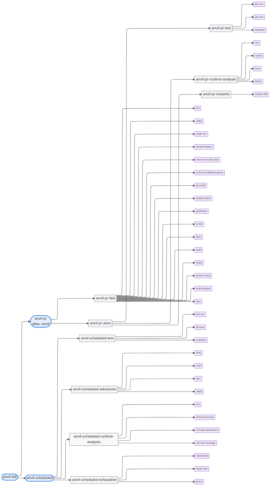

# Check Catalog

This document defines the opinionated default profile: which checks ship, how they're
grouped, which tier they belong to, and how the tool-version policy works. It is the
canonical source for "what does anvil actually run?"

See also:

- [design.md](./design.md) for the overall principles and CLI shape.
- [local.md](./local.md) for how the catalog is exposed as `just` recipes.
- [github.md](./github.md) / [ado.md](./ado.md) for how groups map to cloud-workflow building blocks.

## 1. Groups and tiers

The check catalog is hardcoded in the binary. Each check belongs to one or more *groups*, and
each group belongs to exactly one *tier*. Groups are the unit of cloud workflows parallelization (one cloud workflows
job per group) and the unit of local invocation through `just` (one `just` recipe per group).
A user (or cloud workflows) never has to enumerate individual checks — they operate at the group level.

The **single-tier-per-group** rule is deliberate: if you see `just anvil-pr-fast` in cloud workflows logs,
you know it is a PR-tier check; if you see `just anvil-scheduled-exhaustive`, you know it is
scheduled-only. This makes "what gets executed" trivially answerable from the group name.

A consequence is that some checks must appear in two groups -- one PR group and one scheduled
group -- when the check should run in both tiers. The two invocations may differ (e.g.
`mutants` runs diff-scoped in PR and full-workspace in scheduled) or be identical (e.g. `tests`
runs the same way in both, but the scheduled run catches flakes/environmental drift on `main`).

Group recipes follow the pattern `anvil-<tier>-<group>` (e.g. `anvil-pr-fast`,
`anvil-scheduled-exhaustive`). The tier prefix removes the need to pick distinct names for groups
in different tiers and makes the tier of any failing job obvious from its name alone.

Visually:

(Tier nodes are the user-facing entry points; group nodes are the unit of cloud workflows parallelization; check nodes are the individual `anvil-<check>` recipes. `pr-test`, `pr-runtime-analysis`, and `pr-mutants` were split out from a single `pr-slow` group so the three workloads run as parallel cloud-workflow jobs per OS leg rather than sequentially in one job. Locally, `just anvil-pr-slow` is an umbrella recipe that invokes the three sub-recipes in order, and `just anvil` is an alias for `just anvil-pr`.)

### PR tier (4 groups)

| Group              | OS scope                              | Purpose                                                                                                              |
|--------------------|---------------------------------------|----------------------------------------------------------------------------------------------------------------------|
| `pr-fast`          | Linux x86_64 + Windows x86_64 + Linux aarch64 + Windows aarch64 (GH) / Linux x86_64 + Windows x86_64 (ADO) | All static analysis: clippy, `udeps`, `semver-check`, `external-types`, plus the text/metadata checks (fmt, license-headers, ...). Cross-OS because clippy, doc-build, udeps, semver-check, and external-types all compile per host target. Text/metadata checks run on every leg too; the redundancy cost is negligible compared to a separate job's setup overhead. |
| `pr-test`         | Same default as `pr-fast`             | Tests + coverage: `llvm-cov` (instrumented `nextest`), `doc-test`, `examples`. Coverage is uploaded once from the canonical x86_64 Linux leg. |
| `pr-runtime-analysis`         | Same default as `pr-fast`             | Stricter-runtime correctness: `miri`, `careful`, `loom` (concurrency model checking), `bolero` (short-duration fuzzing smoke). Impact-scoped via `ANVIL_INCLUDE_AFFECTED` so wall-clock is proportional to the PR's blast radius; the cheap checks (loom/bolero) self-skip when no affected crate ships their harness. |
| `pr-mutants`         | Linux x86_64 + Windows x86_64 + Linux aarch64 (GH) / Linux x86_64 + Windows x86_64 (ADO) | Diff-scoped mutation testing (`mutants --in-diff`). The recipe self-skips on `aarch64-pc-windows-msvc` (cargo-mutants doesn't build there), so the GH windows-arm leg is a no-op rather than a job failure. |

The three `pr-slow*` groups are independent: failures in `pr-test` don't block `pr-runtime-analysis` or `pr-mutants` from running, and overall PR wall-clock is `max(pr-test, pr-runtime-analysis, pr-mutants)` per leg rather than the sum. Locally, `just anvil-pr-slow` is an umbrella recipe that runs all three sub-recipes sequentially so adopters who want "run everything slow" don't have to type three commands.

### scheduled tier (4 groups)

| Group                | OS scope                  | Purpose                                                                                                                                |
|----------------------|---------------------------|----------------------------------------------------------------------------------------------------------------------------------------|
| `scheduled-test`       | Same default as `pr-test` | Re-runs the test suite on `main` (with coverage instrumentation) to catch flakes/environment-dependent failures and to publish a full coverage snapshot of the current `main`. |
| `scheduled-advisories` | Same default as `pr-fast` | Re-runs every check whose outcome can change without a commit to this repo: `deny`, `audit`, `aprz` (external databases), `clippy` (lint set evolves with toolchain). Cross-OS because clippy compiles per host. |
| `scheduled-runtime-analysis` | Same default as `pr-runtime-analysis` | Whole-workspace runtime correctness under profiles too expensive (or too non-deterministic) for PR: `miri` (stacked borrows, full-workspace re-run of the PR-tier impact-scoped check), `miri-tree-borrows`, `miri-strict-provenance`, `miri-race-coverage`. Each profile is a separate cloud-workflow job so they fan out in parallel rather than serializing into a single multi-hour run. OS scope matches `pr-runtime-analysis` -- if miri-under-stacked-borrows is worth running on a given OS leg in PR, the harder miri profiles are worth running there too: their job is precisely to surface UB that the more permissive stacked-borrows model misses. Adopters who can't afford the full matrix (each profile costs hours per leg) override the matrix in their root workflow / pipeline. |
| `scheduled-exhaustive` | Linux x86_64 + Windows x86_64 | The expensive whole-workspace permutations that don't fit the PR budget: full `cargo mutants`, `cargo-hack --feature-powerset`, and `cargo bench --no-run` plus a single-iteration smoke run per bench target. Cross-OS to match `oxidizer`'s policy and to give cargo-hack / bench compile coverage for cfg-gated code. **x86_64-only**: same `cargo-mutants` / `winapi` constraint as `pr-mutants`. Adopters who can't afford the full matrix (mutants-full can run for hours per leg) override the matrix in their root workflow / pipeline. |

**Backend asymmetry on ARM coverage.** The GitHub backend ships a four-leg default matrix
(Linux/Windows × x86_64/aarch64) because GH has Microsoft-hosted ARM runners
(`ubuntu-24.04-arm`, `windows-11-arm`). The ADO backend ships a two-leg default
(x86_64 only) because ADO has no hosted ARM agents; adopters with self-hosted ARM pools
extend the stages template themselves. The catalog and recipes are identical across
backends — the asymmetry is purely in the wiring layer's default OS matrix.

OS-scope is an opinion anvil ships and the user overrides per-repo through the
backend-specific knobs ([github.md §4](./github.md#4-owned-reusable-workflows) for
the per-leg runner-label inputs and forking the workflow when the matrix shape itself
needs to change, [ado.md §4](./ado.md#4-owned-stages-templates) for
`linuxPool`/`windowsPool`).
Locally there is no OS matrix; `just anvil-pr-slow` (the umbrella recipe) runs the three sub-recipes in sequence against whatever OS the
developer is on. See [design.md §8.3](./design.md#83-cross-os-test-matrices) for the
overall rationale.

The `scheduled-exhaustive` group's checks are independent and could in principle live in
separate parallel jobs; they're folded into one group because each individually is just
one check, and scheduled tolerates the longer wall-clock that serial execution within one
job implies. Repos that want to parallelize them can split the recipe into separate group
recipes locally.

## 2. Checks by group

The cell format is `cargo invocation (short rationale)`. "Source" cites the surveyed repo
that provided the strongest version of the check.

### `pr-fast`

| Check                          | Invocation                                                | Source |
|--------------------------------|-----------------------------------------------------------|--------|
| `fmt`                          | `cargo +<pinned-nightly> fmt --all --check`               | all |
| `clippy`                       | `cargo clippy --workspace --all-targets --all-features --locked -- -D warnings` | all |
| `cargo-sort`                   | `cargo sort --workspace --check`                          | oxidizer-github |
| `license-headers`              | `cargo heather --workspace`                               | oxidizer (`heather`), oxidizer-github |
| `ensure-no-cyclic-deps`        | `cargo ensure-no-cyclic-deps --workspace`                 | oxidizer-github (sibling crate in `ox-tools-gh`) |
| `ensure-no-default-features`   | `cargo ensure-no-default-features --workspace`            | oxidizer-github |
| `doc-build`                    | `RUSTDOCFLAGS='-D warnings' cargo doc --workspace --all-features --no-deps` | oxidizer-github |
| `readme-check`                 | `cargo doc2readme --check` for each crate that opts in (presence of a `[package.metadata.doc2readme]` table) | oxidizer-github |
| `spellcheck`                   | `cargo spellcheck check --code 1`                         | oxidizer-github |
| `pr-title`                     | Conventional-Commits regex applied to the title in the `PR_TITLE` env var. Skipped silently only when the env var is **unset** (intermediate local runs, scheduled-tier builds); a non-empty-but-invalid value fails loudly (a misconfigured cloud variable is a real error, not a skip). Written as a `[script("pwsh")]` recipe (the one check that needs scripting; see [design.md §8.3](./design.md#83-cross-os-test-matrices)). cloud-workflow wiring: GitHub's per-group composite action reads `${{ inputs.pr_title }}` populated from `${{ github.event.pull_request.title }}` in the reusable PR workflow; ADO has **no** PR-title predefined variable (`System.PullRequest.Title` does not exist), so `group.yml` resolves the title from the REST API on PR builds and publishes it as `PR_TITLE` (empty on non-PR / fork / API failure, where the recipe no-ops). | oxidizer-github |
| `deny`                         | `cargo deny check`                                        | all |
| `audit`                        | `cargo audit`                                             | oxidizer |
| `udeps`                        | `cargo +<pinned-nightly> udeps --workspace --all-features` run **twice** — once with default targets (lib + bins) and once with `--all-targets`. cargo-udeps only analyzes the targets it's told to, and each run catches a variant the other masks: the default-targets run surfaces a dep in `[dependencies]` referenced only by tests/benches/examples (it should be a dev-dep; `--all-targets` would see it as "used"), while the `--all-targets` run surfaces unused `[dev-dependencies]` (never compiled by the default-targets run). Together they cover unused deps, unused dev-deps, and deps that should be dev-deps. | oxidizer, oxidizer-github |
| `semver-check`                 | `cargo semver-checks` per library crate (per-package because `--workspace` fails on bin-only members, and we tolerate "not found in registry" / "no library targets found" for unpublished or bin→lib-transition crates). **Advisory only**: findings do not fail the recipe (breaking changes between unreleased commits are normal — the major-version bump happens at release time, not on every PR). Instead the recipe writes a markdown body to `target/anvil/comments/semver.md` when there are findings and removes the file when the tree is clean; cloud-workflow wiring turns presence/absence into a sticky PR comment (see §6 below). | oxidizer-github |
| `external-types`               | `cargo +<pinned-nightly-rustdoc-schema> check-external-types --manifest-path` per library crate (per-manifest because the tool has no `--workspace`/`--package`; bin-only crates have no public API surface and are skipped). Nightly is pinned narrowly to the rustdoc JSON schema version the tool expects (`rust_nightly_external_types` in `versions.just`); the pin is bumped alongside any cargo-check-external-types upgrade. With the pin in place, the check is deterministic and PR-suitable. | oxidizer-github |
| `aprz`                         | `cargo aprz check` — third-party risk analysis published on crates.io | oxidizer |

### `pr-slow`

The PR-tier slow checks are split into three independent cloud-workflow-visible groups —
`pr-test`, `pr-runtime-analysis`, `pr-mutants` — that each run as their own job (GitHub) or
stage (ADO) in parallel. An umbrella `anvil-pr-slow` recipe is also provided in
`groups.just` for local use; it invokes the three sub-recipes sequentially so
adopters can type one command to run "everything slow" without needing the cloud workflow
matrix overhead.

#### `pr-test` (tests + coverage)

| Check        | Invocation                                                                  | Source |
|--------------|-----------------------------------------------------------------------------|--------|
| `llvm-cov`   | One self-contained instrumented run **per feature config** — `cargo +<pinned-nightly> llvm-cov nextest --no-report` with `--all-features`, then again with `--no-default-features`, each preceded by a full `llvm-cov clean` so its `report` is scoped to that config's objects only. Each config emits `report --lcov` → `target/coverage/lcov-<config>.info` and `report --cobertura` → `target/coverage/cobertura-<config>.xml`. The configs are deliberately **not** merged into one `report`: a union report shells one `--object=` per test binary and overflows the Windows `CreateProcess` command-line limit (os error 206) on large workspaces; each per-config report references only ~half the objects. The two configs are reconciled downstream instead — `cargo-coverage-gate` merges the two lcov files at the line level, Codecov ingests both, and ADO's `PublishCodeCoverageResults@2` coalesces both cobertura files (no platform-specific `lcov -a` merge, which is Linux-only). HTML output is dropped (no cloud consumer; it would reintroduce the overflowing union report — run `cargo llvm-cov --html` ad hoc locally). **Runs on nightly**: cargo-llvm-cov only sets the `cfg(coverage_nightly)` that gates `#[cfg_attr(coverage_nightly, coverage(off))]` exclusions when it instruments on a nightly toolchain; on stable those exclusions are inert and untestable code (process-shelling error paths, script-only crates) wrongly counts against coverage. The dual run catches code paths that only execute when default features are off. After the reports render, the recipe invokes `cargo coverage-gate --lcov target/coverage/lcov-all-features.info --lcov target/coverage/lcov-no-default.info`, which merges both and compares per-package line coverage against thresholds declared in `Cargo.toml` (`[package.metadata.coverage-gate] min-lines-percent`, falling back to `[workspace.metadata.coverage-gate]`, then `100.0`). A failure here fails the recipe -- coverage gating no longer depends on Codecov's project-coverage check; the Codecov upload stays purely for display and historical trend. | oxidizer, oxidizer-github; gate via [`cargo-coverage-gate`](../../../cargo-coverage-gate) |
| `doc-test`   | Two cargo-test runs over the same affected set: `cargo test --doc --workspace --all-features --locked` and `cargo test --doc --workspace --locked` (default features). Running both catches doctests that only compile under one feature configuration (oxidizer-github runs both). nextest does not run doctests, so this stays a separate cargo-test invocation. | oxidizer, oxidizer-github |
| `examples`   | `cargo build --workspace --examples --all-features --locked` -- verifies that example targets compile. Running each example is intentionally not part of the check (examples are not test scaffolding; their runtime behavior isn't part of what we gate on). | oxidizer, oxidizer-github |

This is the same set of checks that used to live in the standalone `pr-test` group; merging into `pr-test` removes one cloud-workflow job from the matrix without changing what runs.

#### `pr-runtime-analysis` (stricter-runtime correctness)

| Check     | Invocation                                                                                                                                                           | Source |
|-----------|----------------------------------------------------------------------------------------------------------------------------------------------------------------------|--------|
| `miri`    | `cargo +<pinned-nightly> miri nextest run` over the impact-affected packages. Slow tests should opt out per-test with `#[cfg_attr(miri, ignore)]` -- anvil doesn't pass exotic `MIRIFLAGS`; the per-test opt-out is the canonical mechanism. The recipe defaults to `--workspace` locally when no impact env vars are set, so plain `just anvil-pr-runtime-analysis` runs the full miri suite. Recipe passes `--no-tests=pass` so crates with all-FS-tests (skipped under miri) don't fail the run. | oxidizer, oxidizer-github |
| `careful` | `cargo +<pinned-nightly> careful test --all-features --locked` over the impact-affected packages. cargo-careful uses a debug-instrumented std (extra runtime checks, no validation skipped). Typical slowdown is 2-3x over plain `cargo test`; well within PR budget for the affected set. cargo-careful builds that std into a **stable** cache path and runs the workspace with `--sysroot <that path>`; because cargo's fingerprint hashes the RUSTFLAGS *string* (the path) but not the sysroot's *contents*, a nightly (or cargo-careful) bump would rebuild std in place while cargo still reuses workspace artifacts linked against the old std (→ "incompatible version of rustc" / metadata mismatch). The recipe guards against this by recording the careful build identity (`rustc -vV` of the pinned nightly + the cargo-careful version) in `target/anvil/careful-sysroot.id` and running `cargo clean` when it changes. | oxidizer-github |
| `loom`    | For each `[[test]]` target that declares `required-features = ["loom"]`, `cargo test -p <pkg> --release --all-features --locked --test <target> -- --test-threads=1` with `RUSTFLAGS="--cfg loom"`. [`loom`](https://crates.io/crates/loom) is a permutation-based concurrency model checker that explores thread interleavings. Targets are detected **structurally** from `cargo metadata` (a test target whose `kind` contains `test` and whose `required-features` contains `loom`) -- not via a filename/cfg/comment heuristic -- and only those targets run, so loom never touches a crate's ordinary tests. The `loom` feature selects the target (`required-features`); `--cfg loom` activates loom (source swaps std↔loom atomics on `#[cfg(loom)]`, and `[target.'cfg(loom)'.dependencies] loom` links only under the cfg) -- both are required. Scoped per-package with `-p` (never `--workspace`) so the global cfg never leaks into deps reachable only through other members. **Fail-loud**: a crate that declares loom support (a `loom` feature or a `cfg(loom)` dependency) but exposes no such test target errors out rather than silently no-opping. When no crate ships a loom target the recipe skips (exit 0). | oxidizer-github |
| `bolero`  | `cargo +<pinned-nightly> bolero test --workspace --release --engine libfuzzer -T 60s` over the impact-affected packages. Smoke-only -- one minute per harness is enough to surface obvious crashes/hangs introduced by a PR without paying for a full fuzzing campaign. **Linux-only**: cargo-bolero's libfuzzer engine and its `bolero-afl` build dependency only build on Linux (the AFL native C needs POSIX headers MSVC lacks), so the tool install/validate and the check itself self-skip on non-Linux hosts -- matching oxidizer's reference workflow, whose bolero job runs exclusively on ubuntu. The Windows/ARM `pr-runtime-analysis` legs treat bolero as a no-op; bolero harnesses are still compiled and exercised as ordinary tests by `llvm-cov` on every leg. Crates with no [`bolero`](https://crates.io/crates/bolero) harness see no targets matched and the recipe no-ops. Adopters who want longer campaigns wire a separate scheduled job; anvil deliberately does not ship a long-form fuzz tier (the failure surface there is too repo-specific to standardize). | oxidizer-github |

#### `pr-mutants` (mutation testing)

| Check     | Invocation                                                                  | Source |
|-----------|-----------------------------------------------------------------------------|--------|
| `mutants` | `cargo mutants --in-diff <base>..HEAD --no-shuffle --jobs 0` (diff-scoped). Self-skips on aarch64-pc-windows-msvc where cargo-mutants doesn't build (upstream winapi incompat); other ARM legs run normally. | oxidizer-github |

The mutants check requires a base ref: locally the recipe resolves `BASE_REF` (if set), then `origin/main`, then `origin/master`, then errors out. In GitHub Actions the workflow passes `${{ github.event.pull_request.base.sha }}`; in ADO the impact step exports `$(System.PullRequest.TargetBranch)` as `BASE_REF`.

### `scheduled-test`

Same three checks as `pr-test` -- `llvm-cov`, `doc-test`, `examples` -- and the same
recipe invocations, with the same per-config output paths
(`target/coverage/lcov-<config>.info` and `target/coverage/cobertura-<config>.xml`).
The recipe is shared between tiers; only the cloud workflow
wiring around it changes (PR uploads lcov to Codecov / cobertura to ADO from each
PR run; scheduled does the same against `main` plus flags the upload as `scheduled` in
Codecov so the two streams stay distinguishable in the UI). Two purposes for re-running
on scheduled: catch flakes/environmental sensitivities that didn't trip in PR, and
publish a full-coverage snapshot for the current state of `main`.

### `scheduled-advisories`

| Check    | Invocation                                                          | Source |
|----------|---------------------------------------------------------------------|--------|
| `deny`   | `cargo deny check`                                                  | all |
| `audit`  | `cargo audit`                                                       | oxidizer |
| `aprz`   | `cargo aprz check`                                                  | oxidizer |
| `clippy` | `cargo clippy --workspace --all-targets --all-features --locked -- -D warnings` | all |

These checks share a property: their outcome can change without a commit to this repo.
`deny`/`audit`/`aprz` consult external databases (RustSec advisory DB, license registries,
Azure risk indices). `clippy` reflects whatever lint set ships with the currently-installed
toolchain -- even when `rust-toolchain.toml` is pinned, repos using floating channels
(`stable`, or msrustup channel pointers like `ms-prod-1.93`) can pick up new lints when the
pointer is bumped upstream. Re-running these on the scheduled tier turns "something landed
upstream yesterday" into a tracked failure rather than an invisible regression discovered
next time someone opens an unrelated PR.

(`udeps` and `external-types` use pinned nightlies and are not re-run here: their outcome is
deterministic given the source + pinned tool versions, so re-running on the same `main`
commit can't surface anything new.)

### `scheduled-runtime-analysis`

| Check                    | Invocation                                                                                                                                                                                                                                                                                                                              | Source |
|--------------------------|-----------------------------------------------------------------------------------------------------------------------------------------------------------------------------------------------------------------------------------------------------------------------------------------------------------------------------------------|--------|
| `miri`                   | Same recipe as the `pr-runtime-analysis` member, but invoked without impact env vars so the run is full-workspace. PR-tier miri is impact-scoped (so a PR touching crate A never exercises crate B under miri); the scheduled re-run ensures every crate gets miri coverage on `main` at least daily, catching UB introduced by an inter-crate change whose PR happened to scope it out. | oxidizer, oxidizer-github |
| `miri-tree-borrows`      | `MIRIFLAGS='-Zmiri-tree-borrows' RUSTFLAGS='--cfg miri_tree_borrows' cargo +<pinned-nightly> miri test --all-features --workspace --lib --tests`. Tree-borrows tracks per-byte aliasing provenance and can exceed the 16 GB Linux runner; tests known to OOM under tree-borrows are quarantined per-test in source via `#[cfg_attr(miri_tree_borrows, ignore = "<reason>")]` so the suppression lives next to the test rather than in a sidecar file. The recipe declares the cfg name via `--check-cfg=cfg(miri_tree_borrows)` so non-miri builds don't warn. | oxidizer-github (rewritten as cfg-based) |
| `miri-strict-provenance` | `MIRIFLAGS='-Zmiri-strict-provenance' RUSTFLAGS='--cfg miri_strict_provenance' cargo +<pinned-nightly> miri test --all-features --workspace --lib --tests`. Surfaces integer-to-pointer casts that don't satisfy strict provenance; complementary to tree-borrows. Per-test opt-outs use `#[cfg_attr(miri_strict_provenance, ignore = "<reason>")]`. | oxidizer-github |
| `miri-race-coverage`     | `MIRIFLAGS="-Zmiri-many-seeds=<low>..<high>" RUSTFLAGS='--cfg miri_race_coverage' cargo +<pinned-nightly> miri test --all-features --workspace --lib --tests`. The `<low>..<high>` window rotates daily based on day-of-month (day N -> seeds `2N-1..2N+1`, exclusive upper bound -> 2 seeds/day, ~62 seeds/month). Rotating amortizes the seed space across the schedule rather than retesting the same seeds every night; race conditions surface as inter-seed nondeterminism rather than per-seed crashes, so coverage matters more than depth-per-seed. Per-test opt-outs use `#[cfg_attr(miri_race_coverage, ignore = "<reason>")]`. | oxidizer-github |

These profiles each cost hours per leg (oxidizer caps `miri-race-coverage` at 12 h), which is why they live in scheduled rather than PR. They share `miri` setup but use disjoint `MIRIFLAGS`/`RUSTFLAGS`, so anvil emits one cloud-workflow job per profile (parallel rather than serial). The OS matrix matches `pr-runtime-analysis` (4 legs on GitHub, 2 on ADO) so any OS already considered "worth running miri on" gets the harder profiles too -- the single-tier-per-group rule forbids running tree-borrows on a strict subset of the OSes where stacked-borrows runs, which would silently hide tree-borrows-only UB on the dropped legs.

Per-test opt-outs live in source via `#[cfg_attr(miri_<profile>, ignore = "<reason>")]`. Each miri-profile recipe sets the matching `--cfg` in `RUSTFLAGS`; the cfg names are also declared in the workspace lints region (`unexpected_cfgs` + `check-cfg`) so non-miri builds don't warn. This keeps the suppression next to the test (and behind code review) rather than in a sidecar file the build system has to parse out-of-band.

The `miri` row above is the one place the catalog deliberately duplicates a check across tiers: PR runs it impact-scoped (fast, narrow), scheduled runs it full-workspace (slow, complete). The single-tier-per-group rule is preserved because the PR copy lives in `pr-runtime-analysis` and the scheduled copy lives in `scheduled-runtime-analysis` -- two different groups.

### `scheduled-exhaustive`

| Check                 | Invocation                                                                                                   | Source |
|-----------------------|--------------------------------------------------------------------------------------------------------------|--------|
| `mutants-full`        | `cargo mutants --workspace --no-shuffle --jobs 0`                                                            | oxidizer-github, oxidizer (sharded cross-OS) |
| `cargo-hack` powerset | `cargo hack --workspace --feature-powerset --depth 2 check`                                                  | oxidizer, oxidizer-github |
| `bench`               | `cargo bench --workspace --all-features --no-run` ＋ a single-iteration smoke benchmark for each bench target | oxidizer |

## 3. Per-check vs grouped cloud workflows execution

Each *group* is one cloud-workflow job. Within a job, the checks belonging to the group run sequentially
as the `just` recipe defines them. A failure in any check fails the group; the per-check log
lines are visible in the job log but the cloud workflow surface (the green/red pill in the PR view) is
per-group.

Each group and tier recipe lists its `*-validate-prereqs` aggregate as its **first** dependency, so all
of the group's tool/component checks run **up front** -- a missing tool fails immediately rather than
only when the recipe that needs it is finally reached, which matters most for a local `just anvil-pr`.
Because `just` runs each recipe at most once per invocation, the per-check `validate-prereqs` dependency
(e.g. `anvil-fmt: anvil-fmt-validate-prereqs`) is satisfied by the up-front aggregate and is not re-run,
while still validating correctly when a single check is invoked on its own.

This is the deliberate middle ground between "one giant cloud workflows step running `just anvil-pr`"
(loses all per-check structure, one red X for any failure) and "twenty-five individual cloud workflows
steps" (unmaintainable YAML, fragile, and the tool would have to re-emit the workflow file
every time the catalog changes). Groups are stable units of meaning the user can talk about;
checks are implementation details that can churn.

## 4. What scheduled does and does not re-run

The rule is simple: **a check belongs in scheduled iff its outcome can change without a
commit to this repo.** Re-running everything else on the scheduled tier would just burn cloud workflows time
duplicating PR signal.

What that means concretely:

- **Re-run in scheduled** (in addition to PR):
  - `llvm-cov`, `doc-test`, `examples` (in `scheduled-test`) -- non-determinism, environment
    sensitivity, runner drift can produce flakes that the PR run missed.
  - `deny`, `audit`, `aprz`, `clippy` (in `scheduled-advisories`) -- see §2.
  - `miri` (in `scheduled-runtime-analysis`) -- the PR-tier run is impact-scoped, so
    crates not touched by a given PR can go indefinitely without miri coverage; the
    scheduled re-run is full-workspace and closes that gap.
- **Run only in PR** -- checks whose outcome is fully determined by the source tree and
  the pinned tool versions, so re-running on the same `main` commit can't surface anything
  new: `fmt`, `cargo-sort`, `license-headers`, `ensure-no-cyclic-deps`,
  `ensure-no-default-features`, `doc-build`, `readme-check`, `spellcheck`, `pr-title`,
  `udeps`, `semver-check`, `external-types`, `careful`, `loom`, `bolero`,
  diff-scoped `mutants`.
- **Run only in scheduled** -- the expensive whole-workspace work that doesn't fit a PR
  budget: the non-stacked miri profiles `miri-tree-borrows`, `miri-strict-provenance`,
  `miri-race-coverage` (in `scheduled-runtime-analysis`); full `mutants`,
  `cargo-hack --feature-powerset`, `bench` (in `scheduled-exhaustive`).

The single-tier-per-group rule still holds: when a check appears in both tiers it lives in
two different groups (one PR group, one scheduled group). Repos that want a
belt-and-suspenders cron run of `just anvil-pr` on `main` can wire one up in their own
workflow/pipeline file alongside the anvil composite actions / step templates.

## 5. Impact-scoping check → env-var mapping

The tool uses [`cargo-delta`](https://crates.io/crates/cargo-delta) to skip checks for
unaffected workspace members on PR runs. cargo-delta computes three concentric impact tiers
(`required ⊇ affected ⊇ modified`) and emits each as a list of crate names. The
`anvil-impact` building block formats each tier into a pre-built `--package X@ver --package Y@ver`
string (or the literal sentinel `--skip` when the tier is empty), publishes the result as
`ANVIL_INCLUDE_MODIFIED`, `ANVIL_INCLUDE_AFFECTED`, and `ANVIL_INCLUDE_REQUIRED`
env vars, and the recipes in `checks.just` consume them. Each package is a version-qualified
cargo spec (`name@version`) so `-p` resolves uniquely to the workspace member even when a
like-named crate is also pulled in as a different-versioned transitive dependency.

Each catalog check is tagged with one of four buckets:

| Bucket    | Env var consumed              | Behavior in cloud workflows                                                              | Behavior locally (env unset)        |
|-----------|-------------------------------|-----------------------------------------------------------------------------|--------------------------------------|
| modified  | `ANVIL_INCLUDE_MODIFIED`   | If `--skip`: exit 0. Otherwise run unconditionally (tool is workspace-wide). | Run unconditionally.                 |
| affected  | `ANVIL_INCLUDE_AFFECTED`   | If `--skip`: exit 0. Otherwise splice the value into the cargo invocation.   | Default to `--workspace`.            |
| required  | `ANVIL_INCLUDE_REQUIRED`   | If `--skip`: exit 0. Otherwise splice the value into the cargo invocation.   | Default to `--workspace`.            |
| unscoped  | *(none)*                       | Always run.                                                                  | Always run.                          |

Bucket assignments per check:

| Bucket    | Checks                                                                                                                |
|-----------|-----------------------------------------------------------------------------------------------------------------------|
| modified  | `fmt`, `cargo-sort`, `license-headers`, `ensure-no-cyclic-deps`, `ensure-no-default-features`, `readme-check`, `spellcheck` |
| affected  | `clippy`*, `llvm-cov`, `doc-test`, `examples`, `mutants` (diff and full), `miri`, `careful`, `loom`, `bolero`, `semver-check`, `external-types`, `bench` |
| required  | `doc-build`, `udeps`, `cargo-hack` (feature powerset)                                                                  |
| unscoped  | `pr-title`, `deny`, `audit`, `aprz`, `mutants-full`, `miri-tree-borrows`, `miri-strict-provenance`, `miri-race-coverage` |

\* cargo-delta's README recommends `clippy` with the modified tier. anvil deliberately
runs it on the affected set instead: a change in a crate's API can introduce clippy lints
(trait-bound mismatches, obviously-truthy-condition warnings keying off changed types) in a
dependent crate, so downstream rev-deps need to lint too. The cost is small — clippy is
incremental — and the recall benefit avoids a class of merge surprises.

`required` is `affected ∪ workspace-internal transitive deps`, not "the whole workspace".
For a small PR it can still be much narrower than `--workspace`. It is used for tools
whose correctness resolves through the dep graph: `cargo doc` (intra-doc links walk into
deps), `cargo udeps` (unused-deps detection needs the resolved graph), `cargo hack
--feature-powerset` (feature combinations cascade through dep features).

`unscoped` is for checks that have nothing to do with workspace-member identity:
`deny`/`audit` read `Cargo.lock`, `pr-title` reads PR metadata, `aprz` consults an
external risk DB. These ignore the env vars and always run.

The sentinel `--skip` is a magic string that cannot be a valid cargo argument, so there
is no collision with real package names. Recipes test for it with
`[ "$VAR" = "--skip" ]` and exit 0 to keep the cloud-workflow job green while signalling that
nothing in that tier needed to run.

The recipe-side mechanics are in
[local.md §4](./local.md#4-impact-scoping-pass-through-env-vars). the cloud workflow-side wiring (the
`anvil-impact` building block, how downstream jobs consume the include vars) is in
[github.md](./github.md#impact-scoping) and [ado.md](./ado.md#impact-scoping).

Trade-off acknowledged: the risk cargo-delta introduces is that a misconfigured analysis
silently skips checks that should have run, leaving "all green" on a PR that actually broke
something. The design mitigates this with: (1) trip-wire patterns in `.delta.toml` that
bias toward full runs whenever config changes; (2) `unscoped` checks (`deny`, `audit`,
`aprz`, `pr-title`, `mutants-full`) always run regardless of impact analysis;
(3) scheduled always runs full-workspace, catching anything the PR-scoping missed within 24
hours;

## 6. Advisory PR comments

Some checks surface findings that are informative for the reviewer but should not block
the PR. The canonical example is `semver-check`: breaking changes between unreleased
commits are normal, and forcing every breaking-API PR to bump the major version (or wait
on a release) would push enforcement to the wrong moment in the lifecycle. The change is
verifiable at release time, not per PR.

To carry this signal without making the recipe non-zero, anvil uses a single shared
convention:

1. **Recipe writes a file**. Advisory recipes write a complete markdown body to a
   well-known path, then exit 0. The convention is
   `target/anvil/comments/<NAME>.md`, where `<NAME>` matches the recipe stem
   (`semver` for `anvil-semver-check`). When the recipe has nothing to report it
   removes that file. The body's first line is an invisible HTML marker
   (`<!-- anvil-<NAME> -->`) so a backend without a native "sticky comment header"
   concept (ADO) can find an existing thread to update.
2. **cloud-workflow wiring upserts a sticky PR comment**. After each PR job that runs an
   advisory-emitting recipe, anvil's cloud workflows templates inspect the convention directory
   and:
   - if `<NAME>.md` exists, upsert a sticky PR comment headed `anvil-<NAME>` with the
     file's contents;
   - if `<NAME>.md` does not exist (the recipe removed it because the tree is now
     clean), clear any prior sticky comment with that header.
3. **One canonical leg per matrix**. cloud-workflow runs the same recipe on multiple OS legs; the
   upsert/clear steps run only on the x86_64 Linux leg so the matrix doesn't race on the
   same PR thread. The recipe still writes the file on every leg (local-vs-cloud workflows parity).

Backend wiring:

- **GitHub Actions** — [`marocchino/sticky-pull-request-comment@v3`](https://github.com/marocchino/sticky-pull-request-comment)
  is invoked twice: with `path:` to upsert when the file exists, and with `delete: true`
  to clear when it does not. The workflow's reusable job declares
  `permissions: pull-requests: write`. Fork PRs are skipped via a
  `github.event.pull_request.head.repo.full_name == github.repository` guard because
  forks can't be granted write tokens.
- **Azure DevOps Pipelines** — a pwsh step uses the Azure DevOps REST API
  (`$(System.AccessToken)` + the project-collection build identity's "Contribute to
  pull requests" permission) to scan PR threads for the HTML marker, then `PATCH`s the
  thread's first comment when the file exists or sets the thread `status: closed` when
  it does not.

Local runs (no PR context) just write/remove the file; nothing posts it. This keeps the
file useful as a self-service diagnostic and makes the behaviour bit-identical between
local and cloud workflows.

Currently `semver-check` is the only advisory-emitting recipe. The convention extends
to any future check that surfaces non-blocking findings (e.g. coverage deltas, security
advisories) by following the same `target/anvil/comments/<NAME>.md` ↔
`anvil-<NAME>` mapping; the catalog's wiring templates list each known file
explicitly so stale comments can be cleared deterministically.
