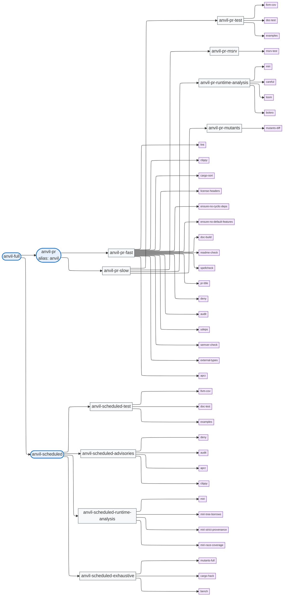

# Check Catalog

This document defines the opinionated default profile: which checks ship, how they're
grouped, which tier they belong to, and how the tool-version policy works. It is the
canonical source for "what does anvil actually run?"

See also:

- [README.md](./README.md) for the overall principles and CLI shape.
- [local.md](./local.md) for how the catalog is exposed as `just` recipes.
- [github.md](./github.md) / [ado.md](./ado.md) for how groups map to cloud-workflow building blocks.

## 1. Groups and tiers

The check catalog is hardcoded in the binary. Each check belongs to one or more *groups*, and
each group belongs to exactly one *tier*. Groups are the unit of cloud workflows parallelization (one cloud workflows
job per group) and the unit of local invocation through `just` (one `just` recipe per group).
A user (or cloud workflows) never has to enumerate individual checks — they operate at the group level.

The **single-tier-per-group** rule is deliberate: if you see `just anvil-pr-fast` in cloud workflows logs,
you know it is a PR-tier check; if you see `just anvil-scheduled-exhaustive`, you know it is
scheduled-only. This makes "what gets executed" trivially answerable from the group name.

A consequence is that some checks must appear in two groups -- one PR group and one scheduled
group -- when the check should run in both tiers. The two invocations may differ (e.g.
`mutants` runs diff-scoped in PR and full-workspace in scheduled) or be identical (e.g. `tests`
runs the same way in both, but the scheduled run catches flakes/environmental drift on `main`).

Group recipes follow the pattern `anvil-<tier>-<group>` (e.g. `anvil-pr-fast`,
`anvil-scheduled-exhaustive`). The tier prefix removes the need to pick distinct names for groups
in different tiers and makes the tier of any failing job obvious from its name alone.

Visually:

```mermaid
%%{init: {"flowchart": {"defaultRenderer": "elk", "nodeSpacing": 10, "rankSpacing": 35, "padding": 3}}}%%
flowchart LR
    full([anvil-full]):::tier
    pr([anvil-pr<br/>alias: anvil]):::tier
    sched([anvil-scheduled]):::tier

    full --> pr
    full --> sched

    pr --> pr_fast[anvil-pr-fast]:::group
    pr --> pr_slow[anvil-pr-slow]:::group
    pr_slow --> pr_test[anvil-pr-test]:::group
    pr_slow --> pr_msrv[anvil-pr-msrv]:::group
    pr_slow --> pr_runtime_analysis[anvil-pr-runtime-analysis]:::group
    pr_slow --> pr_mutants[anvil-pr-mutants]:::group

    sched --> s_test[anvil-scheduled-test]:::group
    sched --> s_adv[anvil-scheduled-advisories]:::group
    sched --> s_runtime[anvil-scheduled-runtime-analysis]:::group
    sched --> s_exh[anvil-scheduled-exhaustive]:::group

    pr_fast --> fmt[fmt]:::check
    pr_fast --> clippy[clippy]:::check
    pr_fast --> cargo_sort[cargo-sort]:::check
    pr_fast --> license_headers[license-headers]:::check
    pr_fast --> ensure_no_cyclic_deps[ensure-no-cyclic-deps]:::check
    pr_fast --> ensure_no_default_features[ensure-no-default-features]:::check
    pr_fast --> doc_build[doc-build]:::check
    pr_fast --> readme_check[readme-check]:::check
    pr_fast --> spellcheck[spellcheck]:::check
    pr_fast --> pr_title[pr-title]:::check
    pr_fast --> deny[deny]:::check
    pr_fast --> audit[audit]:::check
    pr_fast --> udeps[udeps]:::check
    pr_fast --> semver_check[semver-check]:::check
    pr_fast --> external_types[external-types]:::check
    pr_fast --> aprz[aprz]:::check

    pr_test --> llvm_cov[llvm-cov]:::check
    pr_test --> doc_test[doc-test]:::check
    pr_test --> examples[examples]:::check
    pr_msrv --> msrv_test[msrv-test]:::check

    pr_runtime_analysis --> miri[miri]:::check
    pr_runtime_analysis --> careful[careful]:::check
    pr_runtime_analysis --> loom[loom]:::check
    pr_runtime_analysis --> bolero[bolero]:::check

    pr_mutants --> mutants_diff[mutants-diff]:::check

    s_test --> s_llvm_cov[llvm-cov]:::check
    s_test --> s_doc_test[doc-test]:::check
    s_test --> s_examples[examples]:::check

    s_adv --> s_deny[deny]:::check
    s_adv --> s_audit[audit]:::check
    s_adv --> s_aprz[aprz]:::check
    s_adv --> s_clippy[clippy]:::check

    s_runtime --> s_miri[miri]:::check
    s_runtime --> miri_tb[miri-tree-borrows]:::check
    s_runtime --> miri_sp[miri-strict-provenance]:::check
    s_runtime --> miri_rc[miri-race-coverage]:::check

    s_exh --> mutants_full[mutants-full]:::check
    s_exh --> cargo_hack[cargo-hack]:::check
    s_exh --> bench[bench]:::check

    classDef tier fill:#e6f0ff,stroke:#0366d6,stroke-width:2px;
    classDef group fill:#f6f8fa,stroke:#586069,stroke-width:1px;
    classDef check fill:#f3e8ff,stroke:#6f42c1,stroke-width:1px,font-size:10px;
```

(Tier nodes are the user-facing entry points; group nodes are the unit of cloud
workflows parallelization; check nodes are the individual `anvil-<check>` recipes.
The groups collected by the `pr-slow` umbrella run as parallel cloud-workflow
jobs/stages. Locally, `just anvil-pr-slow` invokes those groups in order, and
`just anvil` is an alias for `just anvil-pr`.)

### PR tier

| Group              | OS scope                              | Purpose                                                                                                              |
|--------------------|---------------------------------------|----------------------------------------------------------------------------------------------------------------------|
| `pr-fast`          | Linux x86_64 + Windows x86_64 + Linux aarch64 + Windows aarch64 (GH) / Linux x86_64 + Windows x86_64 (ADO) | All static analysis: clippy, `udeps`, `semver-check`, `external-types`, plus the text/metadata checks (fmt, license-headers, ...). Cross-OS because clippy, doc-build, udeps, semver-check, and external-types all compile per host target. Text/metadata checks run on every leg too; the redundancy cost is negligible compared to a separate job's setup overhead. |
| `pr-test`         | Same default as `pr-fast`             | Tests + coverage: `llvm-cov` (instrumented `nextest`), `doc-test`, `examples`. Coverage is uploaded once from the canonical x86_64 Linux leg. |
| `pr-msrv`         | Same default as `pr-test`             | Affected-package all-target tests under the declared MSRV, in all-features and default-features configurations. The recipe is a no-op when no root MSRV is declared. |
| `pr-runtime-analysis`         | Same default as `pr-fast`             | Stricter-runtime correctness: `miri`, `careful`, `loom` (concurrency model checking), `bolero` (short-duration fuzzing smoke). Impact-scoped to the affected set so wall-clock is proportional to the PR's blast radius; the cheap checks (loom/bolero) self-skip when no affected crate ships their harness. |
| `pr-mutants`         | Linux x86_64 + Windows x86_64 + Linux aarch64 (GH) / Linux x86_64 + Windows x86_64 (ADO) | Diff-scoped mutation testing (`mutants --in-diff`). The recipe self-skips on `aarch64-pc-windows-msvc` (cargo-mutants doesn't build there), so the GH windows-arm leg is a no-op rather than a job failure. |

The `pr-slow` groups are independent: failures in `pr-test` don't block
`pr-msrv`, `pr-runtime-analysis`, or `pr-mutants`, and overall PR wall-clock is
their maximum rather than their sum. Locally, `just anvil-pr-slow` is an umbrella
recipe that invokes those groups sequentially.

### scheduled tier

| Group                | OS scope                  | Purpose                                                                                                                                |
|----------------------|---------------------------|----------------------------------------------------------------------------------------------------------------------------------------|
| `scheduled-test`       | Same default as `pr-test` | Re-runs the test suite on `main` (with coverage instrumentation) to catch flakes/environment-dependent failures and to publish a full coverage snapshot of the current `main`. |
| `scheduled-advisories` | Same default as `pr-fast` | Runs checks whose outcome can change without a commit to this repo: `deny`, `audit`, `aprz` (external databases), `clippy` (lint set evolves with toolchain). Cross-OS because clippy compiles per host. |
| `scheduled-runtime-analysis` | Same default as `pr-runtime-analysis` | Whole-workspace runtime correctness under `miri`, tree-borrows, strict-provenance, and race-coverage. One job per OS leg runs the four profiles sequentially so they share setup and cache state; parallelism is across OS legs. |
| `scheduled-exhaustive` | Linux x86_64 + Windows x86_64 | Full `cargo mutants`, cargo-hack feature powerset, and benchmark compilation. The default matrix is x86-only because cargo-mutants is unsupported on Windows ARM. |

**Backend asymmetry on ARM coverage.** The GitHub backend ships a four-leg default matrix
(Linux/Windows × x86_64/aarch64) because GH has Microsoft-hosted ARM runners
(`ubuntu-24.04-arm`, `windows-11-arm`). The ADO backend ships a two-leg default
(x86_64 only) because ADO has no hosted ARM agents; adopters with self-hosted ARM pools
extend the stages template themselves. The catalog and recipes are identical across
backends — the asymmetry is purely in the wiring layer's default OS matrix.

OS-scope is an opinion anvil ships and the user overrides per-repo through the
backend-specific knobs ([github.md §4](./github.md#4-owned-reusable-workflows) for
the per-leg runner-label inputs and forking the workflow when the matrix shape itself
needs to change, [ado.md §4](./ado.md#4-owned-stages-templates) for
`linuxPool`/`windowsPool`).
Locally there is no OS matrix; `just anvil-pr-slow` (the umbrella recipe) invokes its groups in sequence against whatever OS the
developer is on. See [README.md §8.3](./README.md#83-cross-os-test-matrices) for the
overall rationale.

The `scheduled-exhaustive` group's checks are independent and could in principle live in
separate parallel jobs; they're folded into one group because each individually is just
one check, and scheduled tolerates the longer wall-clock that serial execution within one
job implies. Repos that want to parallelize them can split the recipe into separate group
recipes locally.

## 2. Checks by group

The cell format is `cargo invocation (short rationale)`. "Source" cites the surveyed repo
that provided the strongest version of the check.

Invocations shown without a pinned nightly or MSRV use the selected stable
compiler. Caller-provided `RUSTUP_TOOLCHAIN` remains a native rustup input and
is inherited unchanged by child commands. The presence of either root
toolchain-file spelling suppresses an explicit selector so rustup can process
the file natively at each command's working directory. Only the root MSRV
fallback produces an explicit `+toolchain`; with no source, the command fails.
Setup makes the selected compiler available before stable Cargo or Rust runs,
while paired prerequisite validation remains read-only.

### `pr-fast`

| Check                          | Invocation                                                | Source |
|--------------------------------|-----------------------------------------------------------|--------|
| `fmt`                          | `cargo each --workspace --keep-going -- cargo +<pinned-nightly> fmt --manifest-path {manifest} --check`. `cargo-each` resolves workspace membership and invokes rustfmt once per manifest, keeping child commands bounded on every platform while reporting every failing member. Unlike `cargo fmt --all`, local path dependencies outside the workspace are not included. | all |
| `clippy`                       | `cargo clippy --workspace --all-targets --all-features --locked -- -D warnings` | all |
| `cargo-sort`                   | `cargo sort --workspace --grouped --check --check-format`. Since cargo-sort 2.1.2, formatting-only differences are warnings unless `--check-format` is set; Anvil keeps it load-bearing so dependency ordering and Cargo manifest formatting are both enforced. `--grouped` preserves intentional blank-line-separated dependency groups. | oxidizer-github |
| `license-headers`              | `cargo heather --workspace`                               | oxidizer (`heather`), oxidizer-github |
| `ensure-no-cyclic-deps`        | `cargo ensure-no-cyclic-deps --workspace`                 | oxidizer-github (sibling crate in `ox-tools-gh`) |
| `ensure-no-default-features`   | `cargo ensure-no-default-features --workspace`            | oxidizer-github |
| `doc-build`                    | `RUSTDOCFLAGS='-D warnings' cargo doc --workspace --all-features --no-deps` | oxidizer-github |
| `readme-check`                 | `cargo doc2readme --check` for each publishable crate that does not opt out through `[package.metadata.ox-gen-readme]`; generation and checking share one crate-selection path, library or proc-macro rustdoc is preferred, and binary rustdoc is used for bin-only crates | oxidizer-github |
| `spellcheck`                   | `cargo spellcheck check --code 1`                         | oxidizer-github |
| `pr-title`                     | Repository policy regex applied to the title in the `PR_TITLE` env var. The accepted types (`feat`, `fix`, `chore`, `docs`, `refactor`, `test`, `build`, `ci`, `perf`, `revert`) are a deliberate subset of Conventional Commits, not the complete grammar. The title must occupy a single line, so trailing content after the description is rejected. A rejected title reports the accepted title formats and the case-insensitive type names, so the author can correct the title from the check output alone. Skipped only outside a pull request context, where `PR_TITLE` is unset or empty (local runs and cloud builds that are not pull request builds); an invalid title or failure to retrieve a known PR's title fails loudly. GitHub supplies the event title directly. ADO resolves it through the REST API because `System.PullRequest.Title` does not exist. | oxidizer-github |
| `deny`                         | `cargo deny check`                                        | all |
| `audit`                        | `cargo audit`                                             | oxidizer |
| `udeps`                        | `cargo +<pinned-nightly> udeps --workspace --all-features` run **twice** — once with default targets (lib + bins) and once with `--all-targets`. cargo-udeps only analyzes the targets it's told to, and each run catches a variant the other masks: the default-targets run surfaces a dep in `[dependencies]` referenced only by tests/benches/examples (it should be a dev-dep; `--all-targets` would see it as "used"), while the `--all-targets` run surfaces unused `[dev-dependencies]` (never compiled by the default-targets run). Together they cover unused deps, unused dev-deps, and deps that should be dev-deps. | oxidizer, oxidizer-github |
| `semver-check`                 | `cargo semver-checks --baseline-rev <baseline>` per affected publishable library crate. Crates with `publish = false` and bin-only crates are skipped. The PR target is the baseline. Exit 100 is a completed check with deny-level findings; exit 101 or another nonzero status means the comparison was inconclusive. Both outcomes write `target/anvil/comments/semver.md` and remain advisory, matching the repository's native `semver` job (`continue-on-error: true`). Proven rename and bin→lib transitions with no comparable baseline, and dependencies proven to be yanked only in the checked-out baseline tree, are skipped without a comment. Anvil preflight failures such as invalid current-workspace metadata or an unavailable baseline ref still fail because the recipe cannot establish what to compare. | oxidizer-github |
| `external-types`               | `cargo +<catalog-nightly-rustdoc-schema> check-external-types --manifest-path` per library crate (per-manifest because the tool has no `--workspace`/`--package`; bin-only crates have no public API surface and are skipped). Setup installs the catalog version but validation accepts newer installed tools. The selected nightly is tested with the catalog version; an incompatible newer tool fails closed with a tool/nightly compatibility diagnostic rather than silently selecting a different schema. | oxidizer-github |

### `pr-slow` umbrella

The PR-tier slow checks are split into independent cloud-workflow-visible groups —
`pr-test`, `pr-msrv`, `pr-runtime-analysis`, `pr-mutants` — that each run as their own job (GitHub) or
stage (ADO) in parallel. An umbrella `anvil-pr-slow` recipe is also provided in
`groups.just` for local use; it invokes those groups sequentially so
adopters can type one command to run "everything slow" without needing the cloud workflow
matrix overhead.

#### `pr-test` (tests + coverage)

| Check        | Invocation                                                                  | Source |
|--------------|-----------------------------------------------------------------------------|--------|
| `llvm-cov`   | Runs tests for every affected package under both feature configurations. Packages with a positive coverage threshold run through self-contained `cargo +<catalog-nightly> llvm-cov nextest --no-report` invocations and produce per-config lcov/cobertura reports. Packages declaring `min-lines-percent = 0` still run through plain `cargo nextest`; the opt-out disables measurement and gating, never tests. Per-config reports avoid Windows command-line overflow and are reconciled downstream by cargo-coverage-gate, Codecov, and ADO. Codecov is display-only; the local coverage gate is authoritative. | oxidizer, oxidizer-github; gate via [`cargo-coverage-gate`](../../../cargo-coverage-gate) |
| `doc-test`   | Two cargo-test runs over affected library and proc-macro packages: `cargo test --doc --all-features --locked` and `cargo test --doc --locked` (default features). Bin-only packages are removed because Cargo errors when they are the only selected packages and they have no rustdoc tests. Running both feature modes catches doctests that only compile under one configuration. nextest does not run doctests, so this stays separate. | oxidizer, oxidizer-github |
| `examples`   | `cargo build --workspace --examples --all-features --locked` -- verifies that example targets compile. Running each example is intentionally not part of the check (examples are not test scaffolding; their runtime behavior isn't part of what we gate on). | oxidizer, oxidizer-github |

#### `pr-msrv` (minimum-version tests)

When the root manifest declares an MSRV, Anvil runs `cargo test --tests`
for affected packages under that compiler. `--tests` selects every target that
carries `test = true` -- library and binary unit tests, and integration tests.
Anvil runs exactly two feature configurations: `--all-features` and
the default features. It does not add a `--no-default-features` pass; such a
pass can exercise feature-negative code, but it is outside the current policy.
This is the test execution at the minimum supported compiler;
`pr-test` runs the same affected suite through coverage instrumentation on the
catalog nightly. Other checks that use the selected stable compiler do not execute
this suite, so an MSRV fallback does not make `pr-msrv` a duplicate.
A selecting toolchain file does not suppress the MSRV run, even when it selects the
same compiler, because the MSRV group is the authoritative minimum-version test
result.

The check deliberately does **not** use `--all-targets`. That flag expands to
`--lib --bins --tests --benches --examples`, which makes `cargo test` build *and
execute* every bench harness. A bench declared `harness = false` delegates its
run to a separate driver binary -- criterion's, or a profiler runner such as
`gungraun-runner` driving Valgrind -- and `anvil-msrv-test-setup` installs only
the MSRV toolchain, so that driver is absent and the group fails on a
prerequisite it never declares. That failure says nothing about the minimum
supported version. It also matches the repository-wide policy that benches and
examples are compiled but never run: `bench` uses `cargo bench --no-run` and
`examples` uses `cargo build --examples`, and both keep that compile coverage on
the selected stable compiler. `--tests` is preferred over the equivalent
`--lib --bins --tests` because `--lib` errors with "no library targets found" on
a bin-only affected package under impact scoping, the same reason `miri` uses it.
No doctest coverage is lost, since `--all-targets` suppresses doctests too and
`doc-test` owns them.

The group uses the same OS/architecture matrix and per-OS impact sets as `pr-test`
so cfg-gated targets and dependencies are exercised under the MSRV. It runs in
parallel with the other PR groups. When no root MSRV exists,
`anvil-msrv-test` reports the skip and exits successfully without running tests.
Setup installs the declared MSRV through rustup when it is not already
available.

#### `pr-runtime-analysis` (stricter-runtime correctness)

| Check     | Invocation                                                                                                                                                           | Source |
|-----------|----------------------------------------------------------------------------------------------------------------------------------------------------------------------|--------|
| `miri`    | `cargo +<pinned-nightly> miri test --all-features --tests` over the impact-affected packages. Uses libtest (one process per test binary), **not** `cargo miri nextest run`: under miri, nextest's process-per-test model pays miri's expensive std-initialization re-interpretation for *every* test and roughly doubles wall-time on a large suite (the dominant cost on the PR critical path). `--tests` runs lib/bin unit tests and integration tests (the same target set nextest ran) while excluding doctests, which miri can't run; it is used in preference to `--lib --tests` because `--lib` errors with "no library targets found" on a bin-only affected package under impact scoping. Slow tests opt out per-test with `#[cfg_attr(miri, ignore)]` -- anvil doesn't pass exotic `MIRIFLAGS`; the per-test opt-out is the canonical mechanism. libtest exits 0 when a binary's tests are all skipped, so no `--no-tests=pass` workaround is needed. The recipe reads its scope from the `target/anvil/impact/` cache via `_anvil-impact-include`; because it depends on `anvil-impact`, a clean direct or PR invocation is impact-scoped (unaffected packages are skipped). It runs the full workspace only when scoping is off — the scheduled/full tiers set `ANVIL_IMPACT=off`, and a dirty local tree widens for safety. | oxidizer, oxidizer-github |
| `careful` | `cargo +<catalog-nightly> careful test --all-features --locked` over the impact-affected packages. cargo-careful uses a debug-instrumented std in a stable cache path. Because Cargo fingerprints the sysroot path rather than its contents, the recipe records the actual `rustc -vV` and SHA-256 of the resolved `cargo-careful` executable in `target/anvil/careful-sysroot.id`; either changing triggers `cargo clean`. The executable hash is used because cargo-careful rejects version-only invocations. This remains correct when validation accepts a newer installed cargo-careful. | oxidizer-github |
| `loom`    | For each `[[test]]` target that declares `required-features = ["loom"]`, `cargo test -p <pkg> --release --all-features --locked --test <target> -- --test-threads=1` with `RUSTFLAGS="--cfg loom"`. [`loom`](https://crates.io/crates/loom) is a permutation-based concurrency model checker that explores thread interleavings. Anvil does not impose a global exploration bound; each model remains responsible for tractable exhaustive exploration. Targets are detected **structurally** from `cargo metadata` (a test target whose `kind` contains `test` and whose `required-features` contains `loom`) -- not via a filename/cfg/comment heuristic -- and only those targets run, so loom never touches a crate's ordinary tests. The `loom` feature selects the target (`required-features`); `--cfg loom` activates loom (source swaps std↔loom atomics on `#[cfg(loom)]`, and `[target.'cfg(loom)'.dependencies] loom` links only under the cfg) -- both are required. Scoped per-package with `-p` (never `--workspace`) so the global cfg never leaks into deps reachable only through other members. **Fail-loud**: a crate that declares loom support (a `loom` feature or a `cfg(loom)` dependency) but exposes no such test target errors out rather than silently no-opping. When no crate ships a loom target the recipe skips (exit 0). | oxidizer-github |
| `bolero`  | Uses the catalog nightly and release profile consistently to discover targets one package at a time, then runs each affected libfuzzer target for 60 seconds on Linux. Explicitly selecting `release` avoids cargo-bolero's implicit, adopter-defined `fuzz` profile and matches target execution. Adopters that disable `bolero`'s default features must enable its `std` feature for libfuzzer support. Per-package discovery is required because `cargo-bolero list` accepts only one `--package`; local whole-workspace runs enumerate workspace members before discovery. A successful empty discovery is a no-op; metadata, discovery, or parsing failure fails the check. Non-Linux hosts skip because cargo-bolero's native dependencies are unsupported there, while harnesses still run as ordinary tests. | oxidizer-github |

#### `pr-mutants` (mutation testing)

| Check     | Invocation                                                                  | Source |
|-----------|-----------------------------------------------------------------------------|--------|
| `mutants` | Resolves the base ref, writes `git diff <base>..HEAD` to a temporary unified-diff file, then runs `cargo mutants --in-diff <file> --no-shuffle --jobs 0`. Self-skips on aarch64-pc-windows-msvc where cargo-mutants doesn't build; other ARM legs run normally. | oxidizer-github |

The mutants check requires a base ref: locally the recipe resolves `BASE_REF` (if set), then `origin/main`, then `origin/master`, then errors out. GitHub passes `${{ github.event.pull_request.base.sha }}` as `BASE_REF`; on ADO the shared resolver reads `$(System.PullRequest.TargetBranch)` from the environment.

### `scheduled-test`

Same three checks as `pr-test` -- `llvm-cov`, `doc-test`, `examples` -- and the same
recipe invocations, with the same per-config output paths
(`target/coverage/lcov-<config>.info` and `target/coverage/cobertura-<config>.xml`).
The recipe is shared between tiers; only the cloud workflow
wiring around it changes (PR uploads lcov to Codecov / cobertura to ADO from each
PR run; scheduled does the same against `main` plus flags the upload as `scheduled` in
Codecov so the two streams stay distinguishable in the UI). Two purposes for re-running
on scheduled: catch flakes/environmental sensitivities that didn't trip in PR, and
publish a full-coverage snapshot for the current state of `main`.

### `scheduled-advisories`

| Check    | Invocation                                                          | Source |
|----------|---------------------------------------------------------------------|--------|
| `deny`   | `cargo deny check`                                                  | all |
| `audit`  | `cargo audit`                                                       | oxidizer |
| `aprz`   | `cargo aprz check`                                                  | oxidizer |
| `clippy` | `cargo clippy --workspace --all-targets --all-features --locked -- -D warnings` | all |

These checks share a property: their outcome can change without a commit to this repo.
`deny`/`audit`/`aprz` consult external databases (RustSec advisory DB, license registries,
Azure risk indices). `clippy` reflects whatever lint set ships with the currently-installed
toolchain -- even when `rust-toolchain.toml` is pinned, repositories using a
floating channel such as `stable` can pick up new lints when the channel moves.
Re-running these on the scheduled tier turns "something landed
upstream yesterday" into a tracked failure rather than an invisible regression discovered
next time someone opens an unrelated PR.

(`udeps` and `external-types` use pinned nightlies and are not re-run here: their outcome is
deterministic given the source + pinned tool versions, so re-running on the same `main`
commit can't surface anything new.)

### `scheduled-runtime-analysis`

| Check                    | Invocation                                                                                                                                                                                                                                                                                                                              | Source |
|--------------------------|-----------------------------------------------------------------------------------------------------------------------------------------------------------------------------------------------------------------------------------------------------------------------------------------------------------------------------------------|--------|
| `miri`                   | Same recipe as the `pr-runtime-analysis` member, but the `scheduled-runtime-analysis` group forces `ANVIL_IMPACT=off` (emit-time `__IMPACT_MODE__`) so the run is full-workspace. PR-tier miri is impact-scoped (so a PR touching crate A never exercises crate B under miri); the scheduled re-run ensures every crate gets miri coverage on `main` at least daily, catching UB introduced by an inter-crate change whose PR happened to scope it out. | oxidizer, oxidizer-github |
| `miri-tree-borrows`      | `MIRIFLAGS='-Zmiri-tree-borrows' RUSTFLAGS='--cfg miri_tree_borrows' cargo +<pinned-nightly> miri test --all-features --tests`. Tree-borrows tracks per-byte aliasing provenance and can exceed the 16 GB Linux runner; tests known to OOM under tree-borrows are quarantined per-test in source via `#[cfg_attr(miri_tree_borrows, ignore = "<reason>")]` so the suppression lives next to the test rather than in a sidecar file. The recipe declares the cfg name via `--check-cfg=cfg(miri_tree_borrows)` so non-miri builds don't warn. | oxidizer-github (rewritten as cfg-based) |
| `miri-strict-provenance` | `MIRIFLAGS='-Zmiri-strict-provenance' RUSTFLAGS='--cfg miri_strict_provenance' cargo +<pinned-nightly> miri test --all-features --tests`. Surfaces integer-to-pointer casts that don't satisfy strict provenance; complementary to tree-borrows. Per-test opt-outs use `#[cfg_attr(miri_strict_provenance, ignore = "<reason>")]`. | oxidizer-github |
| `miri-race-coverage`     | `MIRIFLAGS="-Zmiri-many-seeds=<low>..<high>" RUSTFLAGS='--cfg miri_race_coverage' cargo +<pinned-nightly> miri test --all-features --tests`. The `<low>..<high>` window rotates daily based on day-of-month (day N -> seeds `2N-1..2N+1`, exclusive upper bound -> 2 seeds/day, ~62 seeds/month). Rotating amortizes the seed space across the schedule rather than retesting the same seeds every night; race conditions surface as inter-seed nondeterminism rather than per-seed crashes, so coverage matters more than depth-per-seed. Per-test opt-outs use `#[cfg_attr(miri_race_coverage, ignore = "<reason>")]`. | oxidizer-github |

These profiles each cost hours per leg (oxidizer caps `miri-race-coverage` at 12 h), which is why they live in scheduled rather than PR. They share `miri`'s setup and run sequentially within the `scheduled-runtime-analysis` group. Each uses a profile-specific `MIRIFLAGS` (the actual miri mode, e.g. `-Zmiri-tree-borrows`) plus a profile-specific `--cfg miri_<profile>` in `RUSTFLAGS`; the distinct cfg is what lets a test opt out of just one profile via `#[cfg_attr(miri_<profile>, ignore = "…")]` without affecting the others. The OS matrix matches `pr-runtime-analysis` (4 legs on GitHub, 2 on ADO) so any OS already considered "worth running miri on" gets the harder profiles too -- the single-tier-per-group rule forbids running tree-borrows on a strict subset of the OSes where stacked-borrows runs, which would silently hide tree-borrows-only UB on the dropped legs.

Per-test opt-outs live in source via `#[cfg_attr(miri_<profile>, ignore = "<reason>")]`. Each miri-profile recipe sets the matching `--cfg` in `RUSTFLAGS`; the cfg names are also declared in the workspace lints region (`unexpected_cfgs` + `check-cfg`) so non-miri builds don't warn. This keeps the suppression next to the test (and behind code review) rather than in a sidecar file the build system has to parse out-of-band.

The `miri` row above is the one place the catalog deliberately duplicates a check across tiers: PR runs it impact-scoped (fast, narrow), scheduled runs it full-workspace (slow, complete). The single-tier-per-group rule is preserved because the PR copy lives in `pr-runtime-analysis` and the scheduled copy lives in `scheduled-runtime-analysis` -- two different groups.

### `scheduled-exhaustive`

| Check                 | Invocation                                                                                                   | Source |
|-----------------------|--------------------------------------------------------------------------------------------------------------|--------|
| `mutants-full`        | `cargo mutants --workspace --no-shuffle --jobs 0`                                                            | oxidizer-github, oxidizer (sharded cross-OS) |
| `cargo-hack` powerset | `cargo hack --workspace --feature-powerset --depth 2 check`                                                  | oxidizer, oxidizer-github |
| `bench`               | `cargo bench --workspace --all-features --no-run`; benchmark execution is intentionally outside the catalog because runtime requirements are repository-specific | oxidizer |

## 3. Per-check vs grouped cloud workflows execution

Each *group* is one cloud-workflow job. Within a job, the checks belonging to the group run sequentially
as the `just` recipe defines them. A failure in any check fails the group; the per-check log
lines are visible in the job log but the cloud workflow surface (the green/red pill in the PR view) is
per-group.

Each group and tier recipe lists its `*-validate-prereqs` aggregate as its **first** dependency, so all
of the group's tool/component checks run **up front** -- a missing tool fails immediately rather than
only when the recipe that needs it is finally reached, which matters most for a local `just anvil-pr`.
Because `just` runs each recipe at most once per invocation, the per-check `validate-prereqs` dependency
(e.g. `anvil-fmt: anvil-fmt-validate-prereqs`) is satisfied by the up-front aggregate and is not re-run,
while still validating correctly when a single check is invoked on its own.

This is the deliberate middle ground between "one giant cloud workflows step running `just anvil-pr`"
(loses all per-check structure, one red X for any failure) and "twenty-five individual cloud workflows
steps" (unmaintainable YAML, fragile, and the tool would have to re-emit the workflow file
every time the catalog changes). Groups are stable units of meaning the user can talk about;
checks are implementation details that can churn.

## 4. What scheduled does and does not re-run

The rule is simple: **a check belongs in scheduled iff its outcome can change without a
commit to this repo.** Re-running everything else on the scheduled tier would just burn cloud workflows time
duplicating PR signal.

What that means concretely:

- **Re-run in scheduled** (in addition to PR):
  - `llvm-cov`, `doc-test`, `examples` (in `scheduled-test`) -- non-determinism, environment
    sensitivity, runner drift can produce flakes that the PR run missed.
  - `deny`, `audit`, `clippy` (in `scheduled-advisories`) -- see §2.
  - `miri` (in `scheduled-runtime-analysis`) -- the PR-tier run is impact-scoped, so
    crates not touched by a given PR can go indefinitely without miri coverage; the
    scheduled re-run is full-workspace and closes that gap.
- **Run only in scheduled** -- `aprz` performs a network-heavy, full-workspace appraisal
  against external services and belongs in `scheduled-advisories`, not on the PR critical path.
- **Run only in PR** -- checks whose outcome is fully determined by the source tree and
  the pinned tool versions, so re-running on the same `main` commit can't surface anything
  new: `fmt`, `cargo-sort`, `license-headers`, `ensure-no-cyclic-deps`,
  `ensure-no-default-features`, `doc-build`, `readme-check`, `spellcheck`, `pr-title`,
  `udeps`, `semver-check`, `external-types`, `careful`, `loom`, `bolero`,
  diff-scoped `mutants`.
- **Run only in scheduled** -- the expensive whole-workspace work that doesn't fit a PR
  budget: the non-stacked miri profiles `miri-tree-borrows`, `miri-strict-provenance`,
  `miri-race-coverage` (in `scheduled-runtime-analysis`); full `mutants`,
  `cargo-hack --feature-powerset`, `bench` (in `scheduled-exhaustive`).

The single-tier-per-group rule still holds: when a check appears in both tiers it lives in
two different groups (one PR group, one scheduled group). Repos that want a
belt-and-suspenders cron run of `just anvil-pr` on `main` can wire one up in their own
workflow/pipeline file alongside the anvil composite actions / step templates.

## 5. Impact-scoping check → include mapping

The tool uses [`cargo-delta`](https://crates.io/crates/cargo-delta) to skip checks for
unaffected workspace members. cargo-delta computes three concentric impact tiers
(`required ⊇ affected ⊇ modified`) from the committed diff against the base ref. The
shared `anvil-impact` recipe (see [local.md §4](./local.md#4-impact-scoping-via-the-anvil-impact-recipe))
runs cargo-delta once, writes `target/anvil/impact/`, and projects each tier — via the
`_anvil-impact-format` helper — into one selector token per line: `--package`, a bare
workspace package name, and so on, or `--none` when the tier is empty. Unscoped tiers
resolve to `--workspace`. `cargo-each` resolves those workspace names from live Cargo
metadata and emits version-qualified specs to child Cargo commands, so the impact cache
does not duplicate package versions.

Every **impact-scoped** check depends on `anvil-impact` and resolves its category by
calling `_anvil-impact-include <category>`. Ordinary checks splat those tokens directly
into `cargo each`; its empty-set success behavior replaces recipe-specific skip guards,
and `{packages}` injects the resolved package set into a single child Cargo invocation.
Checks that must perform work before or around cargo-each capture the same token array
and handle `--none` first; this includes `fmt`, whose modified selector admits a separate
full-workspace per-manifest fan-out. The **same** cache is read in cloud workflows — the impact job
uploads `target/anvil/impact/` as an artifact and each group job downloads it — so the
identical code path runs locally and in CI, with no scoping threaded through environment
variables. Scoping is on by default both locally and in CI; it is disabled only by
`ANVIL_IMPACT=off` (the scheduled/full tiers), which makes every tier resolve to
`--workspace`.

Each catalog check is tagged with one of four buckets:

| Bucket    | Selector source                     | Behavior when scoped                                                        | Behavior when unscoped (`ANVIL_IMPACT=off` / no cache) |
|-----------|-------------------------------------|-----------------------------------------------------------------------------|--------------------------------------|
| modified  | `_anvil-impact-include modified`    | `--none` skips through `cargo-each`; otherwise the admitted command uses its normal full input domain. | `--workspace` admits the command. |
| affected  | `_anvil-impact-include affected`    | `cargo-each` resolves and forwards the selected packages.                    | `--workspace`.                       |
| required  | `_anvil-impact-include required`    | `cargo-each` resolves and forwards the selected packages.                    | `--workspace`.                       |
| unscoped  | *(none)*                            | Always run.                                                                  | Always run.                          |

Bucket assignments per check:

| Bucket    | Checks                                                                                                                |
|-----------|-----------------------------------------------------------------------------------------------------------------------|
| modified  | `fmt`, `cargo-sort`, `license-headers`, `ensure-no-cyclic-deps`, `ensure-no-default-features` |
| affected  | `clippy`*, `llvm-cov`, `doc-test`, `examples`, `msrv-test`, `mutants-diff`, `miri`, `miri-tree-borrows`, `miri-strict-provenance`, `miri-race-coverage`, `careful`, `loom`, `bolero`, `semver-check`, `external-types`, `bench` |
| required  | `doc-build`, `udeps`, `cargo-hack` (feature powerset)                                                                  |
| unscoped  | `pr-title`, `deny`, `audit`, `aprz`, `mutants-full`, `readme-check`, `spellcheck` |

\* cargo-delta's README recommends `clippy` with the modified tier. anvil deliberately
runs it on the affected set instead: a change in a crate's API can introduce clippy lints
(trait-bound mismatches, obviously-truthy-condition warnings keying off changed types) in a
dependent crate, so downstream reverse dependencies need to lint too. The cost is small — clippy is
incremental — and the recall benefit avoids a class of merge surprises.

`required` is `affected ∪ workspace-internal transitive deps`, not "the whole workspace".
For a small PR it can still be much narrower than `--workspace`. It is used for tools
whose correctness resolves through the dep graph: `cargo doc` (intra-doc links walk into
deps), `cargo udeps` (unused-deps detection needs the resolved graph), `cargo hack
--feature-powerset` (feature combinations cascade through dep features).

`unscoped` is for checks that have nothing to do with workspace-member identity:
`deny`/`audit` read `Cargo.lock`, `pr-title` reads PR metadata, `aprz` consults an
external risk DB. `readme-check` and `spellcheck` also belong here: their inputs include
repo-level files cargo-delta does not map to any package — the workspace-level README
template (`crates/README.j2` / `README.j2`) and the root `.spelling` dictionary — so a
change to one of those would be silently scoped out. These ignore impact scoping and
always run.

An empty tier is represented by cargo-each's native `--none` selector. Ordinary recipes
delegate the successful no-op directly to cargo-each; orchestration-heavy recipes detect
`--none` before doing domain-specific setup.

Impact and target discovery use three outcomes: work found, proven no work, and
failure. Only the first two may continue successfully. Malformed impact tiers,
unknown package names, failed Cargo metadata, unavailable PR metadata in a PR
build, and failed tool discovery are errors; they never collapse to `--none`.
When cargo-delta reports a manifest directory leaf instead of a package or library
name, Anvil accepts it only if it uniquely identifies one workspace package;
missing or ambiguous aliases fail rather than silently dropping affected work.
Advisory checks may report policy findings without failing, but failure to execute
the advisory tool is still an operational error unless the baseline itself has become
unusable because one of its dependency versions was subsequently yanked.

The recipe-side mechanics are in
[local.md §4](./local.md#4-impact-scoping-via-the-anvil-impact-recipe). The cloud workflow-side wiring (the
`anvil-impact` building block, how downstream jobs consume the include files) is in
[github.md](./github.md#impact-scoping) and [ado.md](./ado.md#impact-scoping).

Trade-off acknowledged: the risk cargo-delta introduces is that a misconfigured analysis
silently skips checks that should have run, leaving "all green" on a PR that actually broke
something. The design mitigates this with: (1) managed trip-wire patterns in
`.delta.toml` that
bias toward full runs whenever config changes; (2) `unscoped` checks (`deny`, `audit`,
`aprz`, `pr-title`, `mutants-full`) always run regardless of impact analysis;
(3) scheduled always runs full-workspace, catching anything the PR-scoping missed within 24
hours;

## 6. Advisory PR comments

Some checks surface findings that are informative for the reviewer but should not block
the PR. The canonical example is `semver-check`: breaking changes between unreleased
commits are normal, and forcing every breaking-API PR to bump the major version (or wait
on a release) would push enforcement to the wrong moment in the lifecycle. The change is
verifiable at release time, not per PR.

The SemVer comparison is also inconclusive when `cargo-semver-checks` cannot materialize
or build the target-branch baseline, for example because that baseline resolves a yanked
dependency. Such an operational failure is reported in the same advisory comment and does
not block the PR: a broken baseline is not evidence that the PR broke the public API, and
blocking would prevent the PR that repairs the baseline from merging. This deliberately
matches the repository's native `semver` job, whose comparison step uses
`continue-on-error: true`. Failures in Anvil's own preflight (before invoking
`cargo-semver-checks`) remain enforcing because they indicate that the recipe cannot
identify the current packages or requested baseline.

To carry this signal without making the recipe non-zero, anvil uses a single shared
convention:

1. **Recipe writes a file**. Advisory recipes write a complete markdown body to a
   well-known path, then exit 0. The convention is
   `target/anvil/comments/<NAME>.md`, where `<NAME>` matches the recipe stem
   (`semver` for `anvil-semver-check`). When the recipe has nothing to report it
   removes that file. The body's first line is an invisible HTML marker
   (`<!-- anvil-<NAME> -->`) so a backend without a native "sticky comment header"
   concept (ADO) can find an existing thread to update.
2. **cloud-workflow wiring upserts a sticky PR comment**. After each PR job that runs an
   advisory-emitting recipe, anvil's cloud workflows templates inspect the convention directory
   and:
   - if `<NAME>.md` exists, upsert a sticky PR comment headed `anvil-<NAME>` with the
     file's contents;
   - if `<NAME>.md` does not exist (the recipe removed it because the tree is now
     clean), clear any prior sticky comment with that header.
3. **One canonical leg per matrix**. cloud-workflow runs the same recipe on multiple OS legs; the
   upsert/clear steps run only on the x86_64 Linux leg so the matrix doesn't race on the
   same PR thread. The recipe still writes the file on every leg (local-vs-cloud workflows parity).

Backend wiring:

- **GitHub Actions** — [`marocchino/sticky-pull-request-comment`](https://github.com/marocchino/sticky-pull-request-comment)
  is invoked twice: with `path:` to upsert when the file exists, and with `delete: true`
  to clear when it does not. The workflow's reusable job declares
  `permissions: pull-requests: write`. Fork PRs are skipped via a
  `github.event.pull_request.head.repo.full_name == github.repository` guard because
  forks can't be granted write tokens.
- **Azure DevOps Pipelines** — a pwsh step uses the Azure DevOps REST API
  (`$(System.AccessToken)` + the project-collection build identity's "Contribute to
  pull requests" permission) to scan PR threads for the HTML marker, then `PATCH`s the
  thread's first comment when the file exists or sets the thread `status: closed` when
  it does not.

Local runs (no PR context) just write/remove the file; nothing posts it. This keeps the
file useful as a self-service diagnostic and makes the behaviour bit-identical between
local and cloud workflows.

Currently `semver-check` is the only advisory-emitting recipe. The convention extends
to any future check that surfaces non-blocking findings (e.g. coverage deltas, security
advisories) by following the same `target/anvil/comments/<NAME>.md` ↔
`anvil-<NAME>` mapping; the catalog's wiring templates list each known file
explicitly so stale comments can be cleared deterministically.
