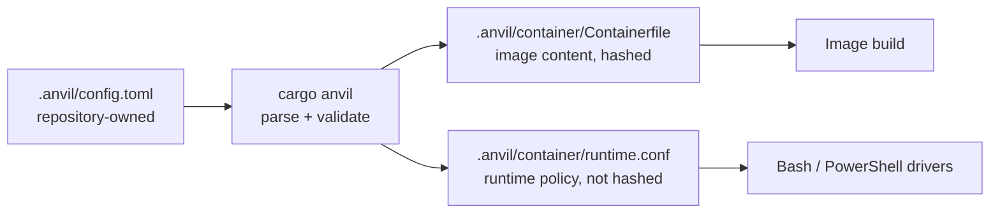

# cargo-anvil declarative container configuration

This document describes the public contract a repository uses to extend the
Anvil container image, declare additional mounts and persistent caches, and
register repository-owned commands, without replacing the generated
`Containerfile` or forking the host drivers.

It is a companion to [containers.md](./containers.md), which describes
container execution itself, and to [extensibility.md](./extensibility.md),
which describes how a downstream catalog customizes what Anvil emits.

The intended audience is `cargo-anvil` maintainers and downstream catalog
authors. User-facing setup lives in the generated
`.anvil/container/README.md`.

## 1. Problem

Public Anvil offers repositories exactly one specialization seam for container
execution: `customize.sh` / `customize.ps1`
([containers.md §8](./containers.md#8-container-customization)). Those files are
arbitrary host scripts that run with the developer's permissions before
container isolation. That is the right shape for acquiring a short-lived
credential, and the wrong shape for everything else a full development
environment needs:

| Need | Why `customize.*` is wrong for it |
|---|---|
| Extra system packages and pinned tools in the image | Deliberately excluded from image identity and the build context, so it cannot change image content at all |
| Persistent toolchain caches | No shared naming, ownership initialization, or scope semantics; every repository invents its own |
| Access to a sibling repository | Reduces to unvalidated `docker run` arguments, so nothing checks what is being exposed |
| Running a repository's own build or test command in the image | The command surface accepts only `anvil-*` recipe names, with no parameters |

The consequences are the same in every case: no validation, no actionable
diagnostics, no participation in the content-addressed image identity, no way
for a future editor adapter to consume the same declarations, and no way for a
downstream catalog to constrain what a repository may do.

Repositories work around this by forking the drivers or by hand-maintaining a
second container definition beside the Anvil one. Both defeat the purpose of
generating the drivers in the first place.

## 2. Design principles

These follow from [design.md §4](./design.md#4-guiding-principle) and
[containers.md §2](./containers.md#2-design-principles); this document adds no
new ones.

- **`cargo-anvil` writes files; the drivers run them.** The generator is not
  involved when a container starts.
- **Declarative data over host scripts.** Anything that can be described as
  data is described as data, validated once, in Rust.
- **Nothing is enabled by default.** A repository that declares nothing
  produces byte-identical output to today
  ([§7.3](#73-repositories-that-declare-nothing)).
- **Declared static image inputs select the image tag.** Runtime policy never
  changes what an image tag names.
- **The catalog stays compiled in.** See
  [§10](#10-relationship-to-catalog-extensibility).

## 3. Trust model

> [!WARNING]
> `.anvil/config.toml` is trusted, capability-bearing repository content, in
> the same class as `customize.sh` / `customize.ps1`. Checking out a branch
> that adds or changes it, and then running `just anvil-container`, grants
> that branch the capabilities it declares.

This is stated first because it governs every section below. The file is
validated data rather than a host script, and validation prevents whole
classes of accident, but it is **not** a sandbox and does not make untrusted
branches safe to run:

- A `[[container.mount]]` grants containerized code access to a host path.
  Anvil rejects the worst targets ([§6](#6-validation-and-diagnostics)), but a
  mount is a deliberate hole in container isolation by definition, and every
  recipe running in that container can use it — not only the declaration that
  asked for it.
- A `[[container.image.step]]` is a shell script that runs during image
  construction with network access.
- A `[[container.command]]` runs repository code in the container with the
  worktree mounted read/write.

Reviewing a branch that changes this file is reviewing code that will run.
Anvil's validation is a guard against mistakes and against accidental
privilege, not a security boundary against a hostile branch.

## 4. Where the declaration lives

A repository declares its container configuration in a repository-owned TOML
file:

```text
.anvil/config.toml
```

It sits beside `customize.sh` / `customize.ps1`, which are also
repository-owned files inside an otherwise generated tree. `cargo-anvil` reads
it, never writes it, and never reformats it.

### 4.1 Why the drivers do not read it

The drivers are Bash and PowerShell. Neither has a TOML parser, and neither
has a dependency mechanism to acquire one. Implementing a parser and a
validator twice would double the surface most likely to disagree between the
two hosts — exactly the class of defect the existing driver tests exist to
catch — and would move validation to container-start time, after the user has
already waited.

So the declaration is compiled, not interpreted:



Validation happens once, in Rust, at generation time — before any image is
built and before any container starts. The drivers consume only generated
data in a line-oriented format they can read without a parser.

This is the same split the tool already applies everywhere else: the generator
owns meaning, the generated files own behavior.

## 5. Schema

Every section is optional. Unknown tables and keys are rejected rather than
ignored, so a typo is a loud error instead of silence.

```toml
# .anvil/config.toml — repository-owned. Run `cargo anvil` after editing.

[container.image]
# Installed with the package manager declared by the effective Containerfile.
packages = ["protobuf-compiler", "libpq-dev"]

# Set before `anvil-setup` and present at runtime.
[container.image.env]
PROTOC = "/usr/bin/protoc"

# Copied from the repository into the image.
[[container.image.file]]
source = "build/pip.conf"
target = "/etc/pip.conf"

# Arbitrary build steps, applied in declaration order.
[[container.image.step]]
name = "install-kubectl"
run = """
curl -fsSLo /tmp/kubectl https://dl.k8s.io/release/v1.31.4/bin/linux/amd64/kubectl
echo '<sha256>  /tmp/kubectl' | sha256sum -c -
install -m 0755 /tmp/kubectl /usr/local/bin/kubectl
rm /tmp/kubectl
"""

# A persistent named volume, owned and initialized by Anvil.
[[container.cache]]
name = "pip"
target = "/tmp/anvil-user/.cache/pip"
scope = "worktree"

# An explicit host mount. Absent unless declared.
[[container.mount]]
name = "shared-protos"
source = { sibling = "shared-protos" }
target = "/shared-protos"
mode = "read-only"

# A repository-owned command runnable inside the container.
[[container.command]]
name = "build-image"
recipe = "build-service-image"
workdir = "services/gateway"

[[container.command.arg]]
name = "tag"
type = "token"
required = true
```

### 5.1 `[container.image]` — image extensions

| Key | Type | Meaning |
|---|---|---|
| `packages` | string array | Installed with the package manager declared by the effective `Containerfile` |
| `env` | table of strings | `ENV` declarations |
| `file` | array of tables | `source` (worktree-relative regular file) copied to absolute `target` |
| `step` | array of tables | `name` plus a `run` script, applied in declaration order |

All of it is static image content, so all of it participates in image identity
([§7](#7-image-identity)).

`packages` is a convenience over `step` for the overwhelmingly common case. A
repository that needs a lock file, a specific repository configuration, or a
non-package installer uses `step` instead.

`env` may not set a key Anvil owns: `HOME`, `PATH`, `CARGO_HOME`,
`RUSTUP_HOME`, `ANVIL_IN_CONTAINER`, or any `ANVIL_CONTAINER_*` name. The
drivers set several of these at runtime, so an image-level declaration would
be silently overridden — a confusing failure rather than a useful one.

`file` sources must be regular files, not directories, symlinks, or special
files, so that what is hashed is exactly what is copied
([§7.1](#71-what-the-guarantee-covers)).

### 5.2 `[[container.cache]]` — managed cache volumes

| Key | Type | Meaning |
|---|---|---|
| `name` | string | Matches `^[a-z0-9][a-z0-9-]{0,31}$`; unique within the file |
| `target` | string | Absolute container path |
| `scope` | string | `worktree` (default), `image`, or `global` |

Anvil creates the volume, initializes its top-level ownership to the invoking
non-root user, and mounts it. Scope determines the volume name, and therefore
what is shared:

| Scope | Volume name | Shared across |
|---|---|---|
| `worktree` | `anvil-cache-<name>-<worktree-id>` | Every image of one worktree |
| `image` | `anvil-cache-<name>-<worktree-id>-<image-id>` | One worktree at one image identity |
| `global` | `anvil-cache-<name>` | Every repository and worktree on the host |

`<worktree-id>` is the existing 12-character hash **of the worktree path**, and
`<image-id>` the first 12 characters of the image ID, so naming matches the
Cargo registry and `target` volumes Anvil already manages.

The default scope is named `worktree`, not `repository`, because that is what
the identifier actually is. Two linked worktrees of one repository
([containers.md §6.1](./containers.md#61-linked-git-worktrees)) hash to
different values and therefore do **not** share a `worktree`-scoped cache.
Naming the scope accurately is the point: `repository` would be a promise the
identifier does not keep. A repository that wants sharing across worktrees uses
`global` with a name that already encodes what makes the content
interchangeable. Redefining the identifier to the common Git directory would
silently rename the existing Cargo caches, which is out of scope here.

`global` is not the default because cross-repository sharing is a policy
decision, and because a volume shared across repositories is also shared across
whatever UIDs those invocations run as.

Every Anvil-created volume carries labels recording the worktree path, the
declaration name, the scope, and the image ID where applicable, so the
lifecycle commands planned separately (WI 7689202) can identify and prune them
without inferring meaning from name shapes. This contract removes nothing.

### 5.3 `[[container.mount]]` — explicit host mounts

| Key | Type | Meaning |
|---|---|---|
| `name` | string | Matches `^[a-z0-9][a-z0-9-]{0,63}$`; unique within the file |
| `source` | table | Exactly one of the source kinds below |
| `target` | string | Absolute container path |
| `mode` | string | `read-only` (default) or `read-write` |

`source` is a tagged table rather than a bare string, so that what a path means
is stated rather than inferred from whether it happens to begin with `..`:

| Form | Resolves to | Notes |
|---|---|---|
| `{ repository = "build/fixtures" }` | Inside the worktree | Must not escape the worktree root |
| `{ sibling = "shared-protos" }` | A sibling of the worktree root | Exactly one path segment; no separators, no `..` |
| `{ host = "/opt/toolchains/foo" }` | An absolute host path | Machine-specific; see below |

The `sibling` form exists because it is the actual use case — a checkout beside
this one — and it is the only one of the three that is both portable across
machines and expressible without an absolute path. A bare relative source
containing `..` is rejected outright: it reads like a worktree-relative path
while behaving like an escape.

The `host` form is accepted, because some toolchains genuinely live at a fixed
absolute path, but a committed configuration that uses it will fail on a
colleague's machine. Anvil reports a missing source as an actionable error
rather than starting a container with an empty directory.

Ownership of a mounted host path is never modified. Read-only is the default
and is always emitted explicitly.

### 5.4 `[[container.command]]` — registered repository commands

| Key | Type | Meaning |
|---|---|---|
| `name` | string | Matches `^[a-z0-9][a-z0-9-]{0,63}$`; must not start with `anvil-` or `_anvil-` |
| `recipe` | string | A repository-owned `just` recipe; matches `^[A-Za-z0-9][A-Za-z0-9_-]{0,63}$` |
| `workdir` | string | Optional; worktree-relative, defaults to the worktree root |
| `arg` | array of tables | Ordered parameters: `name`, `type`, optional `required` (default `true`) |

Invocation reuses the existing command surface. Because a command name can
never start with `anvil-`, the first argument disambiguates without a flag:

```text
just anvil-container anvil-clippy anvil-fmt   # every argument is an anvil recipe
just anvil-container build-image v1.2.3       # one registered command with arguments
```

This preserves the current rule — an argument list of `anvil-*` recipes — as
the behavior whenever no registered command is named.

Required arguments must precede optional ones, so positional binding is
unambiguous. The recipe is invoked as `just <recipe> -- <args>` so a value can
never be read as a `just` option. A registered command is classified for
GitHub-token acquisition by its resolved recipe name, and is exposed to
`customize.*` through the existing requested-recipes input, so the
customization contract sees one vocabulary rather than two.

Argument values reach the driver through `just`'s `*recipe` variadic, which
splits on whitespace. Because every argument type below excludes whitespace,
that split is lossless. Values containing whitespace are not supported, and the
driver rejects them rather than silently re-splitting.

#### 5.4.1 Argument types, not regular expressions

Arguments are validated against a closed set of named types rather than
author-supplied regular expressions:

| `type` | Accepts |
|---|---|
| `token` | `^[A-Za-z0-9][A-Za-z0-9._-]{0,127}$` — tags, names, versions |
| `integer` | `^-?[0-9]{1,18}$` |
| `path` | A worktree-relative path that normalizes inside the worktree |
| `enum` | One of an explicit `values` list |

An arbitrary-regex field was the obvious design and is rejected deliberately.
Three engines would have to agree on one pattern: Rust `regex` at generation
time, Bash `=~` (POSIX ERE) in one driver, and .NET in the other. They differ
in escaping, character classes, and anchoring, so the same declaration could
validate on Windows and reject on Linux — a defect that surfaces only on the
host the author does not use. A closed type set behaves identically everywhere
because each type is emitted as a per-host literal the generator controls, and
it covers what registered commands actually take. A repository needing richer
validation performs it in its own recipe, which is repository code either way.

## 6. Validation and diagnostics

Validation happens at generation time and fails the whole run. Every diagnostic
names the file, the table, the offending value, and the remedy.

**Structural.** Unknown tables and keys, wrong types, duplicate `cache`,
`mount`, or `command` names, duplicate argument names within a command, an
optional argument preceding a required one, and an `enum` argument with no
`values`.

**Container paths.** Targets must be absolute and normalized. A target may not
equal, nest inside, **or contain** a path Anvil owns: `/workspace`,
`/usr/local/cargo/registry`, `/usr/local/cargo/git`, `/workspace/target`,
`/anvil-git`, `/run/secrets`, `/tmp/anvil-lfs`. Checking both directions
matters: `/workspace/target` must be rejected as a descendant, and `/usr` must
be rejected as an ancestor that would shadow the Cargo mounts. Two declared
targets may not collide or nest in either direction, because the result would
otherwise depend on Docker's mount ordering.

**Host paths.** `repository` mount sources, `path` arguments, `workdir`, and
image `file` sources must normalize to a path inside the worktree. Because
lexical normalization cannot see through symlinks, the drivers additionally
resolve these paths at runtime and refuse to proceed when resolution escapes
the worktree. The check must exist on both sides: a symlink can be introduced
after generation, and the generator is not running when the container starts.

**No shell or delimiter metacharacters in path fields.** The generated runtime
file is line- and tab-oriented, and Docker's `--mount` syntax is
comma-delimited and `=`-separated. Paths, names, and targets are therefore
restricted to a conservative character set that excludes whitespace, tabs,
newlines, commas, equals signs, and shell metacharacters. This is defense in
depth: the drivers must also never interpolate a declared value into a shell
string ([§9.1](#91-no-value-reaches-a-shell)).

**Reserved environment keys.** As listed in
[§5.1](#51-containerimage-image-extensions).

**Secrets.** The configuration file is committed content. It carries no
credential mechanism, and there is deliberately no key for one. Authenticated
installation continues to use BuildKit secrets through the existing
`customize.*` build-argument contract
([containers.md §8](./containers.md#8-container-customization)), which is
excluded from image layers.

**Capability.** If the effective `Containerfile` declares no extension support
([§8](#8-downstream-catalog-specialization)) and the repository declares image
extensions, generation fails, naming the tool whose catalog produced that
`Containerfile`.

## 7. Image identity

[containers.md §5](./containers.md#5-image-construction-and-identity) hashes
build-relevant generated content and excludes execution-only files. This
contract extends that split rather than changing it:

| Artifact | In image identity? | In the build context? |
|---|---|---|
| Rendered image extensions inside `.anvil/container/Containerfile` | **Yes** | **Yes** |
| Files named by `[[container.image.file]]` | **Yes** | **Yes** |
| `.anvil/container/runtime.conf` | No | **No** |
| `.anvil/config.toml` | No | **No** |

Adding a package, file, or build step selects a **new** image ID, so the next
invocation builds it and images for other branches remain usable. Adding a
cache, mount, or command does **not**, so tuning runtime policy never triggers
a multi-minute rebuild.

Identity and build context must be excluded **together**. The generated
`Containerfile` runs `COPY . .` over a context whose ignore file currently
un-ignores `.anvil/container/*` wholesale. A file excluded from the hash but
present in the context would change image content under an unchanged tag — the
exact failure a content-addressed tag exists to prevent. The ignore file
therefore lists build inputs explicitly instead of un-ignoring a directory, so
a newly generated execution-only file cannot silently become image content.
`image-id.*` and the ignore file are generated from one list, so they cannot
disagree.

`image-id.*` learns which files a repository declared from the generated
`Containerfile` itself, which names them in its `COPY` instructions. There is
no second list to keep in sync and no TOML parsing in the helpers.

### 7.1 What the guarantee covers

The tag is a hash of **the declared static build instructions and inputs**: the
generated `Containerfile`, the pinned base image, the generated recipes, and
the contents of files declared for copying. It is not, and cannot be, a hash of
the resulting filesystem.

Two builds of the same tag can still differ, because:

- a `packages` entry resolves against a package repository that changes over
  time;
- a `step` script fetches from the network;
- file mode and other metadata are not part of the hashed content.

This is a property the existing `Containerfile` already has — it `apt-get
install`s unpinned packages and downloads tools by URL — so this contract does
not weaken an existing guarantee. It is stated explicitly because a consumer
adding a `step` is likely to assume more than the tag promises. A repository
needing stronger reproducibility pins versions and verifies checksums inside
its own `step`, exactly as the public `Containerfile` does for `just`, Rustup,
and PowerShell.

### 7.2 Staleness

Because the generated artifacts, not the input, are what the runtime sees, an
edited `.anvil/config.toml` that was never regenerated would otherwise be
silently ignored. Hashing the input into the image ID would fix that but would
rebuild the image on every runtime-only edit, so instead the generator records
a **coherence record** in `runtime.conf`:

- a marker distinguishing "no configuration file" from "empty configuration
  file", so adding the file for the first time is detected;
- the SHA-256 of `.anvil/config.toml`;
- the SHA-256 of every generated artifact derived from it — currently the
  `Containerfile` and `runtime.conf` itself.

The drivers verify all of these before doing anything else and refuse to run on
a mismatch:

```text
anvil-container: .anvil/container/ is out of date with .anvil/config.toml.
Run `cargo anvil` to regenerate it, then rerun.
```

Hashing the derived artifacts, not just the input, is what makes the guard
sound. Anvil's update algorithm leaves a user-modified file alone and writes a
`.anvil-proposed` sibling instead ([updates.md](./updates.md)). Without the
derived hashes, a repository whose `Containerfile` was locally modified would
regenerate `runtime.conf`, match on the input checksum, and then run against a
`Containerfile` that never received the declared package. Generation therefore
also **fails** when a configuration-derived artifact cannot be updated in
place, rather than emitting a runtime file that promises something the image
does not deliver.

`runtime.conf` is written last, after every artifact it vouches for, so an
interrupted generation leaves a mismatch that fails closed rather than a
coherent-looking lie.

Both drivers already compute SHA-256 for the image ID, so this costs a few
comparisons and no new dependency.

### 7.3 Repositories that declare nothing

`runtime.conf` is emitted only when `.anvil/config.toml` exists. A repository
that declares nothing keeps exactly today's generated tree, byte for byte, and
today's image ID.

The drivers treat "no configuration file and no runtime file" as the ordinary
no-configuration case, and either file existing without the other as a
staleness failure. That covers both directions: adding the configuration
without regenerating, and deleting it without regenerating.

## 8. Downstream catalog specialization

The public `Containerfile` carries two marker lines: one declaring how packages
are installed, and one naming where consumer extensions are rendered.

```dockerfile
# anvil-container-packages: apt-get update && apt-get install -y --no-install-recommends {{packages}} && rm -rf /var/lib/apt/lists/*
# anvil-container-extensions
```

`cargo-anvil` replaces the extension marker with the rendered block, and
removes both markers when nothing is declared. Splitting position from policy
keeps a catalog that only wants to move the insertion point from having to
restate the package command, and vice versa.

A downstream catalog already owns the `Containerfile` through
`replace_artifact` ([extensibility.md §4](./extensibility.md)), so it
specializes the mechanism by editing those lines:

- **Another package ecosystem.** Replace the package command, for example
  `tdnf install -y --refresh {{packages}} && tdnf clean all`.
- **A different position.** Move the extension marker, for example after an
  internal registry has been configured so consumer packages resolve through
  it.
- **No consumer image extensions.** Omit both markers. Repositories that
  declare them get an actionable error instead of a silently ignored
  declaration.

Exactly one of each marker may appear; zero or duplicate markers are a
generation error naming the file and the line numbers. `{{packages}}` is
substituted with shell-quoted package names. `COPY` instructions are rendered
in JSON form so paths cannot be re-split, and `ENV` values are quoted and
escaped.

This requires no new catalog API. The constraint is expressed in the artifact
the catalog already replaces, so there is no second place where support can
drift out of agreement with the file that implements it.

### 8.1 What a catalog cannot yet constrain

Caches, mounts, and commands are engine-owned runtime mechanisms with no
ecosystem variance, so they have no equivalent marker. A catalog that must
forbid them today can only do so by replacing the drivers.

That is an acknowledged limitation rather than a recommendation: driver
replacement moves policy back to runtime, duplicates it across two hosts, and
would be bypassed by any other consumer of `runtime.conf` — including the
planned Dev Container adapter. If a downstream catalog needs to restrict
runtime declarations, the right fix is a typed, generator-side policy on
`Catalog` that every consumer inherits. That is deliberately not specified
here: no consumer needs it yet, and specifying a policy API before there is a
policy to express would fix the wrong shape. It is called out so the gap stays
a known one rather than a discovered one.

## 9. Runtime data and driver obligations

`.anvil/container/runtime.conf` is a generated, line-oriented, tab-separated
file with one record per declaration, plus the coherence record from
[§7.2](#72-staleness). Both drivers read it into argument arrays; the
PowerShell driver additionally translates host paths with `wslpath`, exactly as
it already does for the repository root.

Keeping caches, mounts, and commands in one generated file means every consumer
sees one source of truth. The Dev Container adapter planned separately (WI
7689200) consumes the same file, so a repository cannot end up with a CLI
environment and an editor environment that disagree.

### 9.1 No value reaches a shell

The drivers currently initialize volume ownership by passing a **string** to
`sh -c`:

```text
docker run --user 0:0 … "$image" sh -c "chown $uid:$gid /usr/local/cargo/registry …"
```

Appending declared cache targets to that string would make a target such as
`/tmp/x;id` execute as root in a container with the worktree mounted
read/write. Character-set validation ([§6](#6-validation-and-diagnostics))
already rejects that value, but a validation-only defense is one regression
away from a root shell.

The ownership container therefore invokes `chown` with positional arguments
instead of a shell string, and mounts only the volumes it is initializing — not
the worktree. A declared value is passed as a distinct argv element everywhere
it is used, never interpolated into a command string, on both hosts.

### 9.2 Where declarations apply

| Container | Caches | Mounts | Purpose |
|---|---|---|---|
| Ownership (root) | Yes | No | Initializes volume ownership only; no worktree, no host paths |
| Preparation | Yes | Yes | Downstream dependency preparation |
| APRZ (isolated) | Yes | Yes | Authenticated GitHub phase |
| Recipe or command | Yes | Yes | The requested work |

Host mounts never reach the root container, because Anvil does not modify
ownership of host paths. Cache targets are container paths, so they compose
with the linked-worktree `/anvil-git` mount
([containers.md §6.1](./containers.md#61-linked-git-worktrees)) without
interaction; `/anvil-git` is a reserved target, so a declaration cannot shadow
it.

### 9.3 Concurrency

Two concurrent invocations may both create the same volume. `docker volume
create` is idempotent, and ownership initialization is repeated rather than
raced. This matches the existing stance on concurrent cold image builds
([containers.md §10](./containers.md#10-requirements-controls-and-limitations)):
the local backend accepts redundant work instead of introducing cross-platform
lock ownership and stale-lock recovery.

Anvil does not serialize concurrent access to a cache volume's *contents*. A
cache whose consumer is unsafe under concurrent use should be declared with
`image` scope, or not at all.

## 10. Relationship to catalog extensibility

[extensibility.md §9](./extensibility.md#9-non-goals) rules out "runtime
plugins / dynamic loading: a catalog is Rust code compiled into the downstream
binary, not a config file discovered at runtime." This contract does not
weaken that.

`.anvil/config.toml` describes **one repository's environment needs**. It
cannot add, replace, or remove a catalog artifact; it cannot define a recipe, a
managed region, or a backend; and it cannot change the update algorithm, drift
detection, or opt-out semantics. The catalog remains compiled into the binary
and remains the only thing that decides *what* Anvil emits. The configuration
file only supplies values that the catalog's own artifacts declared themselves
willing to host.

The distinction is the same one the tool already makes for
`rust-toolchain.toml`: repository-owned input the generator reads, not a
plugin.

## 11. Ordering

The rendered `Containerfile` applies, in order:

1. the digest-pinned base image;
2. public Anvil system prerequisites and pinned tools (`just`, Rustup,
   PowerShell);
3. downstream catalog specialization, wherever that catalog placed it;
4. **consumer `packages`**;
5. **consumer `file` copies**;
6. **consumer `step` scripts, in declaration order**;
7. **consumer `env` declarations**;
8. `COPY . .` and `just anvil-setup`;
9. the entrypoint and image label.

Consumer extensions land before `anvil-setup` because `anvil-setup` compiles
Cargo tools that may need consumer-provided system libraries, headers, or
environment variables.

They land after the public tool installs for ordering, not for protection.
Extensions run as root with network access and can overwrite anything the
public layers installed; the reserved-key rule in
[§5.1](#51-containerimage-image-extensions) prevents accidental `PATH` or
`HOME` shadowing, not deliberate replacement. Per [§3](#3-trust-model), image
extensions are trusted repository code.

Ordering within `step` is declaration order, and steps are rendered as separate
`RUN` instructions so a failure names the step that failed. Layer count is not
optimized: these are local development images, and a readable failure is worth
more than a smaller image.

## 12. Non-goals

- **Arbitrary `docker run` arguments as the primary API.** That remains
  `customize.*`, which is documented as trusted host code.
- **A sandbox.** See [§3](#3-trust-model).
- **Secrets in configuration.** See [§6](#6-validation-and-diagnostics).
- **Author-supplied regular expressions.** See
  [§5.4.1](#541-argument-types-not-regular-expressions).
- **Argument values containing whitespace.** See
  [§5.4](#54-containercommand-registered-repository-commands).
- **A Dockerfile templating language.** `step` is an escape hatch for
  installation scripts, not a general macro system. A repository needing more
  owns a derived `Containerfile` through a downstream catalog.
- **Runtime discovery.** The drivers never read `.anvil/config.toml`.
- **Volume garbage collection.** Volumes are labeled here so lifecycle
  commands (WI 7689202) can prune them; this contract removes nothing.
- **Generator-side policy for runtime declarations.** See
  [§8.1](#81-what-a-catalog-cannot-yet-constrain).
- **Windows containers, remote images, and CI container jobs.** Unchanged from
  [containers.md §10](./containers.md#10-requirements-controls-and-limitations).

## 13. Verification

- **Unit tests** for parsing and validation: every rejection in
  [§6](#6-validation-and-diagnostics) has a test asserting the diagnostic,
  table-driven over the reserved target and reserved environment lists so a
  future addition cannot land without a test.
- **Fixture tests** for rendering: a sample repository with a configuration
  file produces the expected `Containerfile`, ignore file, and `runtime.conf`.
- **Snapshot tests** pin that a repository without the file produces output
  byte-identical to today ([§7.3](#73-repositories-that-declare-nothing)).
- **Driver tests** in Bash and PowerShell exercise cache creation, ownership,
  and argv construction; mount arguments and modes; command selection, argument
  typing, working directories, and exit codes; and every rejection path, using
  the existing fake-`docker` and fake-`wsl` harnesses.
- **Identity tests** assert that an image extension or a declared file's
  contents change the ID, that a cache, mount, or command does not, and that no
  execution-only file reaches the build context.
- **Coherence tests** assert that an edited configuration, a stale
  `Containerfile`, a `.anvil-proposed` sibling, and a missing or orphaned
  `runtime.conf` each fail before any `docker` invocation.

## 14. Alternatives considered

- **Parse TOML in the drivers.** Rejected in
  [§4.1](#41-why-the-drivers-do-not-read-it): two parsers, two validators, and
  validation deferred to container-start time.
- **Author-supplied regular expressions for arguments.** Rejected in
  [§5.4.1](#541-argument-types-not-regular-expressions): three engines would
  have to agree, and disagreement appears only on the host the author does not
  use.
- **A bare string mount source.** Rejected in
  [§5.3](#53-containermount-explicit-host-mounts): `../sibling` reads as
  worktree-relative and behaves as an escape. Tagged source kinds make intent
  explicit and let the common sibling case stay machine-independent.
- **Declare in `Cargo.toml` under `[workspace.metadata.anvil]`.** Avoids a new
  file, but puts host paths and container policy in the package manifest, which
  is already a managed-region host. A dedicated file keeps the two ownership
  models apart.
- **Generate `docker run` arguments directly from `customize.*`.** This is what
  repositories do today. It is why nothing validates them, why no two
  repositories name volumes alike, and why an editor adapter has nothing to
  read.
- **A new catalog builder API for the package ecosystem.** Rejected in
  [§8](#8-downstream-catalog-specialization): the marker lines put the
  constraint in the artifact the catalog already owns, so support cannot drift
  from the file that implements it.
- **Hash the configuration file into image identity.** Simpler than the
  coherence record, but every mount or cache edit would rebuild the image.
- **Hash only the configuration input for staleness.** Rejected in
  [§7.2](#72-staleness): a locally modified `Containerfile` would pass the
  guard while missing a declared package.
