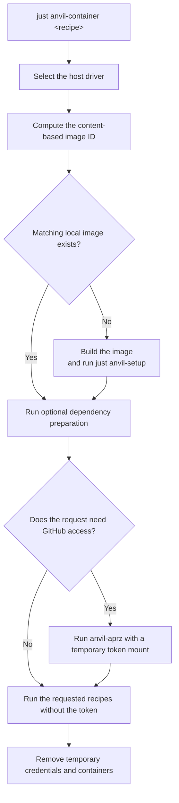
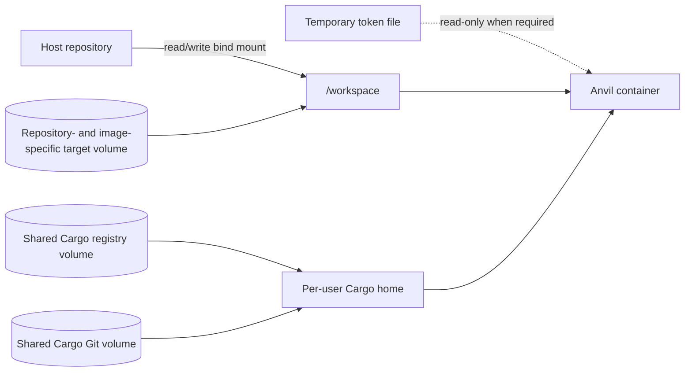

# cargo-anvil container execution

This document describes `cargo-anvil`'s optional support for running generated
Anvil recipes in a reproducible local Linux container. Native execution remains
the default.

The intended audience is `cargo-anvil` maintainers and downstream catalog
authors. User setup and troubleshooting are documented in the generated
`justfiles/anvil/container/README.md`.

## 1. Problem

Anvil recipes normally use the developer's host toolchain. That is the fastest
inner loop, but it cannot always reproduce:

- Linux-specific behavior from a Windows or macOS host;
- failures caused by differences between the host distribution and a pinned
  build environment;
- the exact Rust toolchain and Cargo tools selected by the generated catalog;
- fast repeated container runs without reinstalling tools or rebuilding
  unchanged dependencies.

Container support provides an explicit way to run the same recipes in a
pinned Linux environment. It is a local development feature, not a replacement
for native execution or the generated GitHub Actions and Azure DevOps
workflows. After the initial build, it reuses the matching image, dependency
caches, and compilation output.

## 2. Design principles

- **Generated files remain the product.** `cargo-anvil` emits the container
  recipe, image definition, and host drivers. The generator is not involved
  when a recipe runs.
- **Recipes are unchanged.** The container invokes the existing generated
  `anvil-*` recipes rather than maintaining container-specific copies.
- **Container use is explicit or deliberately selected.** There is no `PATH`
  shim, replacement `just` binary, or implicit command rewriting.
- **Runtime policy is not generator state.** Selecting the container runner
  does not change `.anvil.lock` or the update algorithm.
- **The generated catalog is the image's source of truth.** The image installs
  tools through `just anvil-setup`, using the same generated pins and setup
  recipes that checks validate.
- **Environment-specific behavior is replaceable.** Downstream catalogs can
  replace the image definition and add authentication hooks without forking the
  public drivers or execution model.

## 3. User experience

Run any generated Anvil recipe in the container:

```text
just anvil-container anvil-clippy
just anvil-container anvil-pr
```

With no recipe, the command opens an interactive shell:

```text
just anvil-container
```

Native tier execution remains the default. The three public tiers can instead
route through the container:

- for one invocation: `just anvil_runner=container anvil-pr`;
- for the current shell: set `ANVIL_RUNNER=container`;
- for the repository: change the default in the `anvil-runner` region of the
  repository-root `Justfile` and commit that policy.

`ANVIL_RUNNER=native` overrides a repository container default for the current
shell.

The tier recipes delegate to a tool-owned `_anvil-run` seam. Inside the image,
`ANVIL_IN_CONTAINER=1` forces that seam to select native execution, so the
existing private tier runs without recursively launching another container.
Ad-hoc checks remain explicit through `anvil-container`.

## 4. Architecture

Container support consists of a generated artifact group under
`justfiles/anvil/container/`. `container.just` selects the PowerShell driver on
Windows and the Bash driver on Unix hosts. Both drivers implement the same
lifecycle:



The driver:

1. validates the host prerequisites and locates the Git repository root;
2. computes the image ID from build-relevant generated content;
3. builds the matching image when it is not already available;
4. runs an optional downstream dependency-preparation command;
5. prepares any credentials required by the requested recipe;
6. starts a short-lived container with the repository and named caches mounted;
7. invokes the requested recipe with `just`, or starts an interactive shell;
8. removes temporary credential files on success or failure.

## 5. Image construction and identity

The public `Containerfile` starts from a pinned public Linux base and installs
`just`, Rustup, and PowerShell. It copies the generated Anvil tree and the
repository-owned `rust-toolchain.toml`, then runs:

```text
just anvil-setup
```

This makes the generated setup recipes and the container image use one source
of truth for Rust toolchains and Cargo tools.

The local image tag is a SHA-256 hash of build-relevant repository content:

- `rust-toolchain.toml`;
- generated `justfiles/anvil/**/*.just` recipes;
- the `Containerfile`, entrypoint, ignore file, and other static image inputs.

Execution-only drivers, image-ID helpers, the entry recipe, user
documentation, and `customize.sh`/`customize.ps1` are excluded. Customization
source is runtime orchestration, not image content: it is excluded from both
image identity and the build context, so it can never silently change what a
tag names. See [8.9](#89-image-identity-and-the-build-context). Paths are
sorted and deduplicated, and line endings are normalized so the Bash and
PowerShell helpers produce the same ID.

By default, the image is tagged `anvil-dev:<image-id>`. A changed tool pin,
recipe, toolchain, or other static image artifact selects a new immutable tag.
The next invocation builds that image, while images for older branches remain
available. Runtime execution uses `--pull=never` and never substitutes
`latest`.

Container execution requires a `rust-toolchain.toml` in the repository root. It
does not choose a default Rust channel when that file is absent.

## 6. Runtime and cache model

Each invocation uses a short-lived container and persistent named volumes:



- The repository is bind-mounted read/write at `/workspace`.
- Cargo registry and Cargo Git data use named volumes shared across image IDs.
- `target/` uses a repository- and image-specific named volume mounted over
  `/workspace/target`. Container builds therefore do not use the host
  `target/`.
- Podman runs the image as `linux/amd64` with `--userns keep-id`.
- The image sets `ANVIL_IN_CONTAINER=1` and uses `--pull=never`.

The entrypoint creates a writable Cargo home for the invoking non-root user. It
copies Cargo installation metadata so `cargo install --list` can discover tools
installed into the image, then links the shared registry and Git caches into
that Cargo home.

The separate target volume prevents incompatible host and container artifacts
from mixing. Including the image ID in its name also prevents an older branch
from reusing target output produced by a different toolchain or generated
catalog.

After the initial image build, repeated container runs reuse the image,
dependency caches, and compilation output, substantially reducing warm-run
time.

## 7. Authentication and secret isolation

Authentication has distinct public and downstream extension paths.

### 7.1 GitHub API access

The public `anvil-aprz` recipe requires authenticated GitHub API access. The
drivers recognize `anvil-aprz` and aggregate tiers that invoke it, then obtain a
token from the host `GITHUB_TOKEN` or an authenticated host `gh` session.

For an aggregate tier, the driver:

1. writes the token to a user-only temporary file;
2. runs `anvil-aprz` in a separate container with that file mounted read-only;
3. marks APRZ as complete;
4. runs the remaining checks without the token mount;
5. removes the temporary file during cleanup.

An interactive invocation can pause while the user completes `gh auth login`.
A non-interactive invocation fails with an actionable error before building the
image when authentication is unavailable.

### 7.2 Downstream and repository customization

Section 8 defines the full customization contract. In summary, the driver
sources a repository-owned `customize.sh` or `customize.ps1` before image
construction and runtime preparation, whenever the standard path is present —
regardless of whether a repository committed it directly or a derived
`cargo-anvil` distribution generated it.

## 8. Container customization

This section is the normative contract for customizing container construction
and execution. It applies to any repository, and a derived `cargo-anvil`
distribution can provide the same customization files automatically.

### 8.1 Audience

This interface is for:

- maintainers of repositories that need project-specific container behavior;
- authors of derived `cargo-anvil` distributions that provide shared
  organization-wide behavior.

Typical scenarios include an organization-specific base image, a private Rust
toolchain installer, private Cargo registries, short-lived credentials for
image construction or dependency download, corporate certificate or proxy
setup, and authenticated dependency preparation followed by credential-free
checks.

It is optional advanced repository configuration and should not be presented
as a required step in the public customer quick start; see the generated
`justfiles/anvil/container/README.md`.

### 8.2 Trust boundary

Customization files are trusted host code. The driver sources `customize.sh`
or `customize.ps1` directly into its process. The customization therefore runs
on the developer's host, with the developer's permissions, outside the
container sandbox, and before image construction and recipe execution. It can
execute arbitrary host commands and can influence Podman arguments.

Users must only run generated container files from a catalog they trust. The
driver provides a controlled lifecycle and validates the shape of the
contract, but it cannot make malicious customization safe. This interface is
not a general Podman plugin framework, does not run untrusted code, and does
not guarantee cleanup after host termination, forcible process kill, or
machine failure.

### 8.3 Providing customization

The runtime contract is file-based and ownership-neutral. The driver loads the
standard `customize.sh`/`customize.ps1` paths when present and does not
distinguish between files committed directly by a repository and files
generated by a derived `cargo-anvil` distribution:

```text
justfiles/anvil/container/customize.sh
justfiles/anvil/container/customize.ps1
```

For a regular repository, the customization files are repository-owned; the
public generator does not create, update, or delete them. A derived
distribution can package the same files through the public Rust artifact API:

```rust
use cargo_anvil::{Catalog, artifacts};

pub fn catalog() -> Catalog {
    Catalog::anvil()
        .into_builder()
        .with_artifact(artifacts::container::customize_shell(include_str!(
            "../templates/container/customize.sh"
        )))
        .with_artifact(artifacts::container::customize_powershell(include_str!(
            "../templates/container/customize.ps1"
        )))
        .build()
        .expect("derived catalog must be valid")
}
```

A derived distribution can independently replace static image artifacts such
as the `Containerfile` and entrypoint:

```rust
.replace_artifact(
    artifacts::container::containerfile()
        .with_body(include_str!("../templates/container/Containerfile")),
)
```

Static image customization belongs in those hashed artifacts. Runtime
credential acquisition and Podman invocation customization belong in
`customize.*`.

### 8.4 Versioned contract

The initial interface version is `1`. Before sourcing the customization file,
the driver defines:

| Bash | PowerShell |
|---|---|
| `ANVIL_CONTAINER_CUSTOMIZATION_API_VERSION=1` | `$AnvilContainerCustomizationApiVersion = 1` |

A customization must check that it supports the provided version and fail with
an actionable message otherwise. Changing variable names, types, lifecycle
ordering, or phase semantics requires either a new interface version or a
compatibility period in which the driver supports both contracts.

### 8.5 Lifecycle

The customization file is loaded once for each `anvil-container` invocation, in
this order:

1. Validate host prerequisites and resolve the repository root.
2. Compute the content-addressed image ID.
3. Check whether the matching image already exists.
4. Initialize the customization API version, inputs, and empty outputs.
5. Register the driver's cleanup handler.
6. Source the platform-appropriate customization file if present.
7. Validate the customization outputs.
8. Build the matching image when absent.
9. Run the optional preparation container.
10. Apply built-in GitHub credential isolation when required.
11. Run the requested recipe or interactive shell.
12. Invoke customization cleanup while the driver exits.

A customization failure stops the invocation. Image-build or preparation
failure stops the invocation before the main container starts. The
image-exists input allows customization that is needed only for image
construction to avoid acquiring build credentials on a warm run.

### 8.6 Inputs provided to customization

Only the values in this table are part of the supported input contract:

| Purpose | Bash | PowerShell | Type |
|---|---|---|---|
| API version | `ANVIL_CONTAINER_CUSTOMIZATION_API_VERSION` | `$AnvilContainerCustomizationApiVersion` | Integer |
| Repository root | `ANVIL_CONTAINER_REPO_ROOT` | `$AnvilContainerRepoRoot` | Absolute path |
| Container directory | `ANVIL_CONTAINER_DIR` | `$AnvilContainerDir` | Absolute path |
| Resolved image | `ANVIL_CONTAINER_RESOLVED_IMAGE` | `$AnvilContainerResolvedImage` | Image name plus content tag |
| Matching image exists | `ANVIL_CONTAINER_IMAGE_EXISTS` | `$AnvilContainerImageExists` | Boolean |
| Requested recipes | `ANVIL_CONTAINER_REQUESTED_RECIPES` | `$AnvilContainerRequestedRecipes` | String array |
| Host is Windows | Not applicable | `$AnvilContainerHostIsWindows` | Boolean |

The driver marks input values read-only where supported. Customization files
must not depend on other driver-local variables, helper functions, temporary
filenames, or Podman argument ordering.

### 8.7 Outputs provided by customization

The driver initializes these outputs before sourcing the customization:

| Purpose | Bash | PowerShell | Type and default |
|---|---|---|---|
| Image-build invocation arguments | `ANVIL_CONTAINER_BUILD_ARGS` | `$AnvilContainerBuildArgs` | String array, empty |
| Preparation arguments | `ANVIL_CONTAINER_PREPARE_ARGS` | `$AnvilContainerPrepareArgs` | String array, empty |
| Preparation command | `ANVIL_CONTAINER_PREPARE_COMMAND` | `$AnvilContainerPrepareCommand` | String array, empty |
| Main runtime arguments | `ANVIL_CONTAINER_RUN_ARGS` | `$AnvilContainerRunArgs` | String array, empty |
| Cleanup callback | `ANVIL_CONTAINER_CLEANUP` | `$AnvilContainerCleanup` | Function name or script block, no-op |
| Build inside Podman machine | Not applicable | `$AnvilContainerBuildInMachine` | Boolean, false |

Customizations append to argument arrays rather than replacing them. After
sourcing, the driver validates:

- every argument and command output is an array of non-empty strings;
- the cleanup value is callable when provided;
- the in-machine build value is Boolean;
- preparation arguments are empty when no preparation command is configured.

Validation failure stops before Podman is invoked.

### 8.8 Phase semantics

**Image build.** Image-build arguments are appended only when the matching
image is absent. Allowed purposes are BuildKit `--secret` mounts, SSH
forwarding required for authenticated package retrieval, read-only host mounts
needed by the build process, and host-path translation required by the Podman
machine. Customization must not use image-build arguments to select
non-secret image contents dynamically; in particular, secrets must not be
supplied through `--build-arg`. Non-secret image behavior belongs in the
`Containerfile`, entrypoint, or other checked-in container files included in
image identity.

**Preparation.** When the preparation command is non-empty, the driver starts
one short-lived container before the main container with the standard
repository, Cargo cache, and target mounts (not main runtime arguments):

```text
podman run --rm <standard mounts> <preparation arguments> <image> <preparation command>
```

The intended use is authenticated dependency download into shared caches so
the main checks can run offline and without registry credentials.

**Main runtime.** Main runtime arguments apply to the requested recipe
container or interactive shell. They also apply to a built-in isolated
`anvil-aprz` invocation because that invocation executes as part of the
requested recipe lifecycle; this behavior is part of the versioned contract.
Credentials required only during image construction or preparation must not be
added to main runtime arguments.

**Cleanup.** The cleanup callback removes every temporary file or
authentication artifact created by the customization. Bash supplies the name
of a function invoked by the driver's `EXIT` trap; PowerShell supplies a
script block invoked from `finally`. The customization must register cleanup
immediately after creating temporary state. Cleanup runs after successful
recipe execution, ordinary image-build, preparation, or recipe failure, and
interactive-shell exit. Cleanup is not guaranteed after forcible process
termination or machine failure.

**Build inside the Podman machine.** `$AnvilContainerBuildInMachine` is
PowerShell-only. When true, the driver executes `podman build` through `podman
machine ssh` so repository and secret paths resolve inside the Podman virtual
machine. This changes where the build command executes, not the image
contents or identity.

### 8.9 Image identity and the build context

`customize.sh` and `customize.ps1` are runtime orchestration files and are
excluded from image identity. They are also excluded from the image build
context and must never be copied into the image. Excluding customization from
both the image ID and build context is load-bearing: excluding it from only
the image ID would allow the image contents to change without selecting a new
tag.

Image identity includes all checked-in files that define image contents,
including `rust-toolchain.toml`, generated Anvil recipes, the `Containerfile`,
the entrypoint, scripts copied into or executed while building the image, and
non-secret static configuration used during image construction. This
separation prevents changes to token acquisition, cleanup, diagnostics, or
runtime mounts from forcing an unrelated image rebuild.

Because customization source is not hashed, it must not dynamically change
non-secret image contents. If a repository or derived distribution needs a new
non-secret image setting — a base image, package source, toolchain channel,
certificate, or tool installation command — it must update a hashed image
artifact instead. Secret values are intentionally excluded from image
identity.

### 8.10 Security contract

The public driver guarantees:

- the public catalog emits no customization file;
- contract inputs and outputs are initialized before customization runs;
- output types are validated before Podman runs;
- preparation and main containers are short-lived and use `--rm`;
- customization cleanup is invoked after ordinary success and failure;
- runtime secret values and temporary secret-file contents are not included in
  image identity;
- built-in GitHub credentials use a restricted temporary file and are isolated
  to the isolated `anvil-aprz` invocation.

The customization author must acquire the minimum required credential scope
and lifetime, write credentials only to user-restricted temporary files, use
BuildKit secret mounts for image construction, use read-only mounts for
container secrets, avoid secret-bearing build arguments and persistent
environment variables, avoid copying secrets into the repository or image
build context, keep the main checks credential-free when preparation is
sufficient, register cleanup immediately after creating temporary state, clear
in-memory credential values when practical, provide equivalent Bash and
PowerShell behavior, and produce actionable authentication and validation
errors.

The driver cannot prevent trusted customization from executing arbitrary host
commands, adding unsafe Podman arguments, exposing credentials to a container,
persisting secrets, omitting required cleanup, or leaking a temporary resource
created before its own cleanup callback was registered. Documentation must
express secret safety as customization-author requirements, not as
unconditional framework guarantees.

### 8.11 Cross-platform parity

A repository or derived distribution supporting both Windows and Unix hosts
provides both customization files, with equivalent credential acquisition,
minimum token-lifetime checks, image-build secret handling, preparation
behavior, runtime credential scope, cleanup, and error conditions.
Platform-specific path conversion is allowed, but it must not change the
logical container behavior.

### 8.12 Compatibility

The stable compatibility surface consists of the `customize.sh` and
`customize.ps1` managed paths, the Rust artifact-constructor names, API
version semantics, supported input and output names and types, lifecycle
ordering, phase isolation, failure and cleanup behavior, image-identity
treatment, and application of main runtime arguments to the isolated
`anvil-aprz` invocation. Customizations must not depend on unspecified driver
internals.

## 9. Downstream extensibility

Container support is a normal catalog artifact group. A downstream catalog can:

- replace the `Containerfile` or entrypoint;
- add an optional `customize.sh`/`customize.ps1` customization file and
  supporting files;
- inherit the public recipe, drivers, image-ID helpers, cache layout, and
  runtime contract unchanged;
- remove the container artifact group when container execution is not
  supported.

This keeps public behavior generic while allowing a downstream catalog to
provide an internal base image, toolchain installer, registry configuration,
and short-lived authentication.

See [extensibility.md](./extensibility.md) for the catalog builder API.

## 10. Requirements, controls, and limitations

Host requirements:

- Podman 4.3 or newer;
- `git` and `just`;
- Bash on Linux, WSL, and macOS;
- PowerShell Core (`pwsh`) on Windows;
- a running Podman machine on Windows and macOS;
- `linux/amd64` execution support;
- a repository-owned `rust-toolchain.toml`.

Runtime controls:

| Variable | Effect |
|---|---|
| `ANVIL_CONTAINER_IMAGE` | Overrides the local image name; the content hash remains the tag |
| `ANVIL_CONTAINER_NO_REBUILD=1` | Fails when the matching image is absent |
| `ANVIL_RUNNER` | Selects `native` or `container` tier execution |
| `ANVIL_IN_CONTAINER` | Internal recursion guard set by the image |

The initial image build installs the complete pinned tool catalog and can take
several minutes. Later runs with the same image ID reuse the image and target
volume; Cargo registry and Git caches are reused across image IDs.

The initial implementation is deliberately limited to:

- local developer execution;
- Linux containers using `linux/amd64`;
- local image construction.

CI container jobs, remote image publication, registry consumption, and Windows
containers are separate concerns and are not part of this local container
support.

## 11. Generated artifact reference

| Path | Purpose |
|---|---|
| `container/container.just` | Public `anvil-container` entry recipe |
| `container/Containerfile` | Generic Linux image definition |
| `container/container.ignore` | Restricted image build context |
| `container/entrypoint.sh` | Non-root Cargo initialization |
| `container/image-id.ps1` | Windows image-ID helper |
| `container/image-id.sh` | Unix image-ID helper |
| `container/run-in-container.ps1` | Windows Podman driver |
| `container/run-in-container.sh` | Linux, WSL, and macOS Podman driver |
| `container/customize.ps1` | Optional, not emitted by default; repository or derived-distribution Windows customization, see §8 |
| `container/customize.sh` | Optional, not emitted by default; repository or derived-distribution Unix customization, see §8 |
| `container/README.md` | Generated user instructions and troubleshooting |
| `runner.just` | Native/container tier dispatch |

The paths above are relative to `justfiles/anvil/`. The catalog also emits the
user-owned `anvil-runner` region in the repository-root `Justfile`.

## 12. References

- [Overall cargo-anvil design](./design.md)
- [Local recipe design](./local.md)
- [Catalog extensibility](./extensibility.md)
- [Continuous verification](../verification.md)
