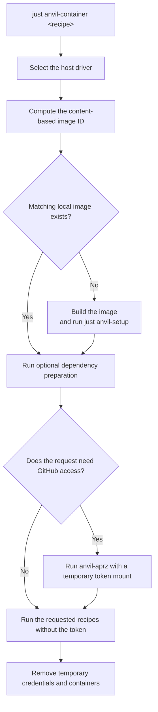
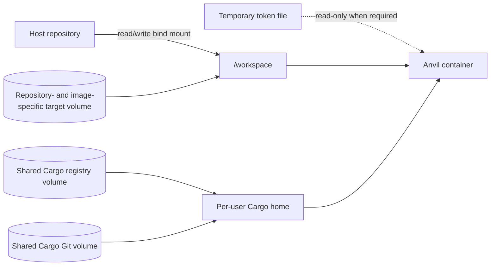

# cargo-anvil container execution

This document describes `cargo-anvil`'s optional support for running generated
Anvil recipes in a reproducible local Linux container. Native execution remains
the default.

The intended audience is `cargo-anvil` maintainers and downstream catalog
authors. User setup and troubleshooting are documented in the generated
`justfiles/anvil/container/README.md`.

## 1. Problem

Anvil recipes normally use the developer's host toolchain. That is the fastest
inner loop, but it cannot always reproduce:

- Linux-specific behavior from a Windows or macOS host;
- failures caused by differences between the host distribution and a pinned
  build environment;
- the exact Rust toolchain and Cargo tools selected by the generated catalog;
- fast repeated container runs without reinstalling tools or rebuilding
  unchanged dependencies.

Container support provides an explicit way to run the same recipes in a
pinned Linux environment. It is a local development feature, not a replacement
for native execution or the generated GitHub Actions and Azure DevOps
workflows. After the initial build, it reuses the matching image, dependency
caches, and compilation output.

## 2. Design principles

- **Generated files remain the product.** `cargo-anvil` emits the container
  recipe, image definition, and host drivers. The generator is not involved
  when a recipe runs.
- **Recipes are unchanged.** The container invokes the existing generated
  `anvil-*` recipes rather than maintaining container-specific copies.
- **Container use is explicit or deliberately selected.** There is no `PATH`
  shim, replacement `just` binary, or implicit command rewriting.
- **Runtime policy is not generator state.** Selecting the container runner
  does not change `.anvil.lock` or the update algorithm.
- **The generated catalog is the image's source of truth.** The image installs
  tools through `just anvil-setup`, using the same generated pins and setup
  recipes that checks validate.
- **Environment-specific behavior is replaceable.** Downstream catalogs can
  replace the image definition and add authentication hooks without forking the
  public drivers or execution model.

## 3. User experience

Run any generated Anvil recipe in the container:

```text
just anvil-container anvil-clippy
just anvil-container anvil-pr
```

With no recipe, the command opens an interactive shell:

```text
just anvil-container
```

Native tier execution remains the default. The three public tiers can instead
route through the container:

- for one invocation: `just anvil_runner=container anvil-pr`;
- for the current shell: set `ANVIL_RUNNER=container`;
- for the repository: change the default in the `anvil-runner` region of the
  repository-root `Justfile` and commit that policy.

`ANVIL_RUNNER=native` overrides a repository container default for the current
shell.

The tier recipes delegate to a tool-owned `_anvil-run` seam. Inside the image,
`ANVIL_IN_CONTAINER=1` forces that seam to select native execution, so the
existing private tier runs without recursively launching another container.
Ad-hoc checks remain explicit through `anvil-container`.

## 4. Architecture

Container support consists of a generated artifact group under
`justfiles/anvil/container/`. `container.just` selects the PowerShell driver on
Windows and the Bash driver on Unix hosts. Both drivers implement the same
lifecycle:



The driver:

1. validates the host prerequisites and locates the Git repository root;
2. computes the image ID from build-relevant generated content;
3. builds the matching image when it is not already available;
4. runs an optional downstream dependency-preparation command;
5. prepares any credentials required by the requested recipe;
6. starts a short-lived container with the repository and named caches mounted;
7. invokes the requested recipe with `just`, or starts an interactive shell;
8. removes temporary credential files on success or failure.

## 5. Image construction and identity

The public `Containerfile` starts from a pinned public Linux base and installs
`just`, Rustup, and PowerShell. It copies the generated Anvil tree and the
repository-owned `rust-toolchain.toml`, then runs:

```text
just anvil-setup
```

This makes the generated setup recipes and the container image use one source
of truth for Rust toolchains and Cargo tools.

The local image tag is a SHA-256 hash of build-relevant repository content:

- `rust-toolchain.toml`;
- generated `justfiles/anvil/**/*.just` recipes;
- the `Containerfile`, entrypoint, ignore file, and other static image inputs.

Execution-only drivers, image-ID helpers, the entry recipe, user
documentation, and `customize.sh`/`customize.ps1` are excluded. Customization
source is runtime orchestration, not image content: it is excluded from both
image identity and the build context, so it can never silently change what a
tag names. See [8.9](#89-image-identity-and-the-build-context). Paths are
sorted and deduplicated, and line endings are normalized so the Bash and
PowerShell helpers produce the same ID.

By default, the image is tagged `anvil-dev:<image-id>`. A changed tool pin,
recipe, toolchain, or other static image artifact selects a new immutable tag.
The next invocation builds that image, while images for older branches remain
available. Runtime execution uses `--pull=never` and never substitutes
`latest`.

Container execution requires a `rust-toolchain.toml` in the repository root. It
does not choose a default Rust channel when that file is absent.

## 6. Runtime and cache model

Each invocation uses a short-lived container and persistent named volumes:



- The repository is bind-mounted read/write at `/workspace`.
- Cargo registry and Cargo Git data use named volumes shared across image IDs.
- `target/` uses a repository- and image-specific named volume mounted over
  `/workspace/target`. Container builds therefore do not use the host
  `target/`.
- Podman runs the image as `linux/amd64` with `--userns keep-id`.
- The image sets `ANVIL_IN_CONTAINER=1` and uses `--pull=never`.

The entrypoint creates a writable Cargo home for the invoking non-root user. It
copies Cargo installation metadata so `cargo install --list` can discover tools
installed into the image, then links the shared registry and Git caches into
that Cargo home.

The separate target volume prevents incompatible host and container artifacts
from mixing. Including the image ID in its name also prevents an older branch
from reusing target output produced by a different toolchain or generated
catalog.

After the initial image build, repeated container runs reuse the image,
dependency caches, and compilation output, substantially reducing warm-run
time.

## 7. Authentication and secret isolation

Authentication has distinct public and downstream extension paths.

### 7.1 GitHub API access

The public `anvil-aprz` recipe requires authenticated GitHub API access. The
drivers recognize `anvil-aprz` and aggregate tiers that invoke it, then obtain a
token from the host `GITHUB_TOKEN` or an authenticated host `gh` session.

For an aggregate tier, the driver:

1. writes the token to a user-only temporary file;
2. runs `anvil-aprz` in a separate container with that file mounted read-only;
3. marks APRZ as complete;
4. runs the remaining checks without the token mount;
5. removes the temporary file during cleanup.

An interactive invocation can pause while the user completes `gh auth login`.
A non-interactive invocation fails with an actionable error before building the
image when authentication is unavailable.

## 8. Container customization

Repositories and derived `cargo-anvil` distributions can customize image
construction, dependency preparation, runtime arguments, and cleanup through:

```text
justfiles/anvil/container/customize.sh
justfiles/anvil/container/customize.ps1
```

The public catalog does not generate these files. A repository can commit them
directly, or a derived distribution can add them through the artifact API in
[extensibility.md](./extensibility.md). The driver treats both sources
identically. These files are trusted host code, sourced with the developer's
permissions outside the container sandbox.

The version `1` interface provides these read-only inputs:

| Purpose | Bash | PowerShell | Type |
|---|---|---|---|
| API version | `ANVIL_CONTAINER_CUSTOMIZATION_API_VERSION` | `$AnvilContainerCustomizationApiVersion` | Integer |
| Repository root | `ANVIL_CONTAINER_REPO_ROOT` | `$AnvilContainerRepoRoot` | Absolute path |
| Container directory | `ANVIL_CONTAINER_DIR` | `$AnvilContainerDir` | Absolute path |
| Resolved image | `ANVIL_CONTAINER_RESOLVED_IMAGE` | `$AnvilContainerResolvedImage` | Image name plus content tag |
| Matching image exists | `ANVIL_CONTAINER_IMAGE_EXISTS` | `$AnvilContainerImageExists` | Boolean |
| Requested recipes | `ANVIL_CONTAINER_REQUESTED_RECIPES` | `$AnvilContainerRequestedRecipes` | String array |
| Host is Windows | Not applicable | `$AnvilContainerHostIsWindows` | Boolean |

The driver initializes and validates these outputs:

| Purpose | Bash | PowerShell | Type and default |
|---|---|---|---|
| Image-build invocation arguments | `ANVIL_CONTAINER_BUILD_ARGS` | `$AnvilContainerBuildArgs` | String array, empty |
| Preparation arguments | `ANVIL_CONTAINER_PREPARE_ARGS` | `$AnvilContainerPrepareArgs` | String array, empty |
| Preparation command | `ANVIL_CONTAINER_PREPARE_COMMAND` | `$AnvilContainerPrepareCommand` | String array, empty |
| Main runtime arguments | `ANVIL_CONTAINER_RUN_ARGS` | `$AnvilContainerRunArgs` | String array, empty |
| Cleanup callback | `ANVIL_CONTAINER_CLEANUP` | `$AnvilContainerCleanup` | Function name or script block, no-op |
| Build inside Podman machine | Not applicable | `$AnvilContainerBuildInMachine` | Boolean, false |

The driver checks image availability before sourcing customization, validates
outputs before invoking Podman, then runs the build, optional preparation,
requested recipe, and cleanup phases in order. Failures stop the invocation and
run registered cleanup.

- Build arguments apply only when constructing a missing image. Use BuildKit
  secret mounts, not secret-bearing `--build-arg` values.
- Preparation runs in a separate short-lived container with the standard
  repository and cache mounts, but without main runtime arguments.
- Runtime arguments apply to the requested recipe and the isolated
  `anvil-aprz` invocation. Do not forward credentials needed only during build
  or preparation.
- Cleanup runs after ordinary success, failure, or interactive-shell exit. It
  cannot run after forcible process termination or machine failure.

Customization authors are responsible for least-privilege credentials,
user-restricted temporary files, read-only secret mounts, immediate cleanup
registration, and equivalent Bash and PowerShell behavior. The driver cannot
prevent trusted customization from exposing or persisting secrets.

`customize.*` is excluded from both image identity and the build context.
Non-secret behavior that changes image contents belongs in hashed static files
such as the `Containerfile`, entrypoint, or supporting build scripts.

The documented paths, variables, lifecycle, and image-identity behavior form
the compatibility contract. Customizations must not depend on other driver
internals.

## 9. Downstream extensibility

Container support is a normal catalog artifact group. A downstream catalog can:

- replace the `Containerfile` or entrypoint;
- add an optional `customize.sh`/`customize.ps1` customization file and
  supporting files;
- inherit the public recipe, drivers, image-ID helpers, cache layout, and
  runtime contract unchanged;
- remove the container artifact group when container execution is not
  supported.

This keeps public behavior generic while allowing a downstream catalog to
provide an internal base image, toolchain installer, registry configuration,
and short-lived authentication.

See [extensibility.md](./extensibility.md) for the catalog builder API.

## 10. Requirements, controls, and limitations

Host requirements:

- Podman 4.3 or newer;
- `git` and `just`;
- Bash on Linux, WSL, and macOS;
- PowerShell Core (`pwsh`) on Windows;
- a running Podman machine on Windows and macOS;
- `linux/amd64` execution support;
- a repository-owned `rust-toolchain.toml`.

Runtime controls:

| Variable | Effect |
|---|---|
| `ANVIL_CONTAINER_IMAGE` | Overrides the local image name; the content hash remains the tag |
| `ANVIL_CONTAINER_NO_REBUILD=1` | Fails when the matching image is absent |
| `ANVIL_RUNNER` | Selects `native` or `container` tier execution |
| `ANVIL_IN_CONTAINER` | Internal recursion guard set by the image |

The initial image build installs the complete pinned tool catalog and can take
several minutes. Later runs with the same image ID reuse the image and target
volume; Cargo registry and Git caches are reused across image IDs.

The initial implementation is deliberately limited to:

- local developer execution;
- Linux containers using `linux/amd64`;
- local image construction.

CI container jobs, remote image publication, registry consumption, and Windows
containers are separate concerns and are not part of this local container
support.

## 11. Generated artifact reference

| Path | Purpose |
|---|---|
| `container/container.just` | Public `anvil-container` entry recipe |
| `container/Containerfile` | Generic Linux image definition |
| `container/container.ignore` | Restricted image build context |
| `container/entrypoint.sh` | Non-root Cargo initialization |
| `container/image-id.ps1` | Windows image-ID helper |
| `container/image-id.sh` | Unix image-ID helper |
| `container/run-in-container.ps1` | Windows Podman driver |
| `container/run-in-container.sh` | Linux, WSL, and macOS Podman driver |
| `container/customize.ps1` | Optional, not emitted by default; repository or derived-distribution Windows customization, see §8 |
| `container/customize.sh` | Optional, not emitted by default; repository or derived-distribution Unix customization, see §8 |
| `container/README.md` | Generated user instructions and troubleshooting |
| `runner.just` | Native/container tier dispatch |

The paths above are relative to `justfiles/anvil/`. The catalog also emits the
user-owned `anvil-runner` region in the repository-root `Justfile`.

## 12. References

- [Overall cargo-anvil design](./design.md)
- [Local recipe design](./local.md)
- [Catalog extensibility](./extensibility.md)
- [Continuous verification](../verification.md)
