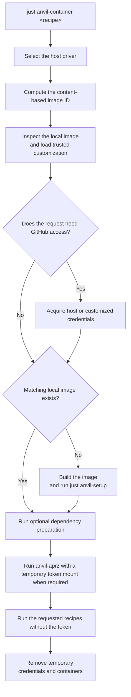
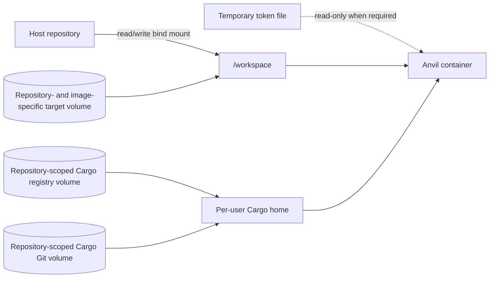

# cargo-anvil container execution

This document describes `cargo-anvil`'s optional support for running generated
Anvil recipes in a reproducible local Linux container. Native execution remains
the default.

The intended audience is `cargo-anvil` maintainers and downstream catalog
authors. User setup and troubleshooting are documented in the generated
`.anvil/container/README.md`.

## 1. Problem

Anvil recipes normally use the developer's host toolchain. That is the fastest
inner loop, but it cannot always reproduce:

- Linux-specific behavior from a Windows host;
- failures caused by differences between the host distribution and a pinned
  build environment;
- Linux binaries that require a newer glibc than their deployment environment;
- the exact Rust toolchain and Cargo tools selected by the generated catalog;
- fast repeated container runs without reinstalling tools or rebuilding
  unchanged dependencies.

Container support provides an explicit way to run the same recipes in a
pinned Linux environment. It is a local development feature, not a replacement
for native execution or the generated GitHub Actions and Azure DevOps
workflows. After the initial build, it reuses the matching image, dependency
caches, and compilation output.

## 2. Design principles

- **Generated files remain the product.** `cargo-anvil` emits the container
  recipe, image definition, and host drivers. The generator is not involved
  when a recipe runs.
- **Recipes are unchanged.** The container invokes the existing generated
  `anvil-*` recipes rather than maintaining container-specific copies.
- **Container use is explicit or deliberately selected.** There is no `PATH`
  shim, replacement `just` binary, or implicit command rewriting.
- **Runtime policy is not generator state.** Selecting the container runner
  does not change `.anvil.lock` or the update algorithm.
- **The generated catalog is the image's source of truth.** The image installs
  tools through `just anvil-setup`, using the same generated pins and setup
  recipes that checks validate.
- **Environment-specific behavior is replaceable.** Downstream catalogs can
  replace the image definition and add authentication hooks without forking the
  public drivers or execution model.

## 3. User experience

Run any generated Anvil recipe in the container:

```text
just anvil-container anvil-clippy
just anvil-container anvil-pr
```

Every positional argument is a recipe name and must match `anvil-*` or
`_anvil-*`. Recipe parameters are not part of this command surface.

With no recipe, the command opens an interactive shell:

```text
just anvil-container
```

Native tier execution remains the default. The three public tiers — and, because
they route through the same `_anvil-run` seam, the four scheduled *group* recipes
(`anvil-scheduled-test`, `-advisories`, `-runtime-analysis`, `-exhaustive`) — can
instead route through the container:

- for one invocation: `just anvil_runner=container anvil-pr`;
- for the current shell: set `ANVIL_RUNNER=container`;
- for the repository: change the default in the `anvil-runner` region of the
  repository-root `Justfile` and commit that policy.

`ANVIL_RUNNER=native` overrides a repository container default for the current
shell.

This makes group-level container routing asymmetric: the scheduled groups go
through `_anvil-run` (to force the full-workspace backstop), so
`just anvil_runner=container anvil-scheduled-test` containerizes, whereas the PR
group recipes (`anvil-pr-fast`, …) run natively even under `anvil_runner=container`
because the PR tier invokes them directly rather than through the seam. Run a PR
group in a container via the whole tier (`anvil_runner=container anvil-pr`) or with
`anvil-container` directly.

The tier recipes and the four scheduled group recipes delegate to a tool-owned `_anvil-run` seam. Inside the image,
`ANVIL_IN_CONTAINER=1` forces that seam to select native execution, so the
existing private tier runs without recursively launching another container.
Ad-hoc checks remain explicit through `anvil-container`.

`just` does not support conditional dependency lists, so `_anvil-run` starts a
second `just` invocation for the selected private tier. It reuses the exact
parsed Justfile and preserves ordinary native output and exit status. Global
CLI options, variable assignments, dependency introspection, and `--dry-run`
apply to the outer invocation and are not propagated to the selected tier.

## 4. Architecture

Container support consists of the generated recipe
`justfiles/anvil/container.just` and a generated artifact group under
`.anvil/container/`. The recipe selects the PowerShell driver on Windows and the
Bash driver on Linux or WSL. The PowerShell driver invokes Docker Engine in the
default WSL distribution; the Bash driver invokes the local Docker Engine
directly. Both implement the same lifecycle:


```mermaid
flowchart TD
    user["just anvil-container &lt;recipe&gt;"] --> dispatch["Select the host driver"]
    dispatch --> identity["Compute the content-based image ID"]
    identity --> customize["Inspect the local image<br/>and load trusted customization"]
    customize --> github{"Does the request need GitHub access?"}
    github -- Yes --> auth["Acquire host or customized credentials"]
    github -- No --> exists
    auth --> exists{"Matching local image exists?"}
    exists -- No --> build["Build the image<br/>and run just anvil-setup"]
    exists -- Yes --> prepare
    build --> prepare["Run optional dependency preparation"]
    prepare --> aprz["Run anvil-aprz with a temporary token mount when required"]
    aprz --> checks["Run the requested recipes without the token"]
    checks --> cleanup["Remove temporary credentials and containers"]
```

The driver:

1. validates the host prerequisites and locates the Git repository root;
2. computes the image ID from build-relevant generated content;
3. checks image availability and loads and validates trusted customization;
4. prepares any credentials required by the requested recipes;
5. builds the matching image when it is not already available;
6. runs an optional downstream dependency-preparation command;
7. starts a short-lived container with the repository and named caches mounted;
8. invokes the requested recipes with `just`, or starts an interactive shell;
9. removes temporary credential files on success or failure.

## 5. Image construction and identity

The public `Containerfile` starts from a pinned public Linux base and installs
`just`, Rustup, and PowerShell. It copies the generated Anvil tree, root
`Cargo.toml`, and optional repository toolchain file, then runs:

```text
just anvil-setup
```

This makes the generated setup recipes and the container image use one source
of truth for Rust toolchains and Cargo tools.

The local image tag is a SHA-256 hash of build-relevant repository content:

- root `Cargo.toml`;
- an optional `rust-toolchain` or `rust-toolchain.toml`;
- the generated stable-toolchain resolver;
- generated `justfiles/anvil/**/*.just` recipes;
- the `Containerfile`, `Containerfile.dockerignore`, entrypoint, and other
  static image inputs.
- the selected digest-pinned base image from `ANVIL_CONTAINER_BASE_IMAGE`, or
  the `Containerfile` default when the variable is absent.

Execution-only drivers, image-ID helpers, the entry recipe, user
documentation, and `customize.sh`/`customize.ps1` are excluded. Customization
source is runtime orchestration, not image content: it is excluded from both
image identity and the build context, so it can never silently change what a
tag names. See [8.9](#89-image-identity-and-the-build-context). Paths are
sorted and deduplicated, and line endings are normalized so the Bash and
PowerShell helpers produce the same ID.

By default, the image is tagged `anvil-dev:<image-id>`. A changed tool pin,
recipe, toolchain, or other static image artifact selects a new immutable tag.
The next invocation builds that image, while images for older branches remain
available. Runtime execution uses `--pull=never` and never substitutes
`latest`.

Container execution uses the same deterministic stable-toolchain selection as
native execution: an existing `RUSTUP_TOOLCHAIN`, a selecting repository
toolchain file, or the root manifest's MSRV. It fails rather than choosing a
runner or image default when none is available.

The restricted image-construction context does not contain workspace member
manifests, so uniform per-package MSRV validation runs in native and cloud setup
rather than during image construction. Container checks still use the selected
root MSRV; a package that requires a newer compiler fails normally.

The public default is digest-pinned Debian Bookworm. A user or automation can
select another image compatible with the generated Debian-based
`Containerfile` through `ANVIL_CONTAINER_BASE_IMAGE`. This supports a lower
glibc baseline such as Debian Bullseye without replacing the generated file.
A distribution with a different package ecosystem requires a derived
`Containerfile`. Unpinned tags are rejected.

## 6. Runtime and cache model

Each invocation uses a short-lived container and persistent named volumes:


```mermaid
flowchart LR
    repo["Host repository"] -->|read/write bind mount| workspace["/workspace"]
    token["Temporary token file"] -.->|read-only when required| runtime["Anvil container"]
    registry[("Repository-scoped Cargo registry volume")] --> cargo["Per-user Cargo home"]
    git[("Repository-scoped Cargo Git volume")] --> cargo
    target[("Repository- and image-specific target volume")] --> workspace
    workspace --> runtime
    cargo --> runtime
```

- The repository is bind-mounted read/write at `/workspace`.
- Cargo registry and Cargo Git data use repository-specific named volumes
  shared across branches and image IDs of that repository.
- `target/` uses a repository- and image-specific named volume mounted over
  `/workspace/target`. Container builds therefore do not use the host
  `target/`.
- Docker runs the image as `linux/amd64` with the invoking Linux/WSL user's
  numeric user and group IDs.
- The image sets `ANVIL_IN_CONTAINER=1` and uses `--pull=never`.

The driver creates the named volumes explicitly, initializes their top-level
ownership in a short-lived root container, and runs preparation and recipe
containers as the non-root Linux/WSL user. The root container never runs
repository recipes.

The entrypoint creates a writable Cargo home for the invoking non-root user. It
copies Cargo installation metadata so `cargo install --list` can discover tools
installed into the image, then links the shared registry and Git caches into
that Cargo home.

The separate target volume prevents incompatible host and container artifacts
from mixing. Including the image ID in its name also prevents an older branch
from reusing target output produced by a different toolchain or generated
catalog.

After the initial image build, repeated container runs reuse the image,
dependency caches, and compilation output, substantially reducing warm-run
time.

## 7. Authentication and secret isolation

Authentication has distinct public and downstream extension paths.

### 7.1 GitHub API access

The public `anvil-aprz` recipe requires authenticated GitHub API access. The
drivers recognize `anvil-aprz` and aggregate tiers that invoke it, then obtain a
token from the host `GITHUB_TOKEN` or an authenticated host `gh` session.
Because customization loads first, trusted downstream customization can obtain
a short-lived token and assign it to the process `GITHUB_TOKEN`.

For an aggregate tier, the driver:

1. writes the token to a user-only temporary file;
2. runs `anvil-aprz` in a separate container with that file mounted read-only;
3. marks APRZ as complete;
4. runs the remaining checks without the token mount;
5. removes the temporary file during cleanup.

An interactive invocation can pause while the user completes `gh auth login`.
A non-interactive invocation fails with an actionable error before building the
image when authentication is unavailable.

## 8. Container customization

Repositories and derived `cargo-anvil` distributions can customize image
construction, dependency preparation, runtime arguments, and cleanup through:

```text
.anvil/container/customize.sh
.anvil/container/customize.ps1
```

> [!WARNING]
> These files execute on the host with the developer's permissions before
> container isolation. Checking out a branch that adds or changes one of them
> and then running `just anvil-container` executes that code on the host.

The public catalog does not generate these files. A repository can commit them
directly, or a derived distribution can add them through the artifact API in
[extensibility.md](./extensibility.md). The driver treats both sources
identically. These files are trusted host code, sourced with the developer's
permissions outside the container sandbox.

The customization interface provides these read-only inputs:

| Purpose | Bash | PowerShell | Type |
|---|---|---|---|
| Repository root | `ANVIL_CONTAINER_REPO_ROOT` | `$AnvilContainerRepoRoot` | Absolute path |
| Container directory | `ANVIL_CONTAINER_DIR` | `$AnvilContainerDir` | Absolute path |
| WSL repository root | Not applicable | `$AnvilContainerRepoRootWsl` | Absolute WSL path for Docker arguments |
| WSL container directory | Not applicable | `$AnvilContainerDirWsl` | Absolute WSL path for Docker arguments |
| Resolved image | `ANVIL_CONTAINER_RESOLVED_IMAGE` | `$AnvilContainerResolvedImage` | Image name plus content tag |
| Matching image exists | `ANVIL_CONTAINER_IMAGE_EXISTS` | `$AnvilContainerImageExists` | Boolean |
| Requested recipes | `ANVIL_CONTAINER_REQUESTED_RECIPES` | `$AnvilContainerRequestedRecipes` | String array |
| Host is Windows | Not applicable | `$AnvilContainerHostIsWindows` | Boolean |

The driver initializes and validates these outputs:

| Purpose | Bash | PowerShell | Type and default |
|---|---|---|---|
| BuildKit secret arguments | `ANVIL_CONTAINER_BUILD_ARGS` | `$AnvilContainerBuildArgs` | String array, empty |
| Preparation arguments | `ANVIL_CONTAINER_PREPARE_ARGS` | `$AnvilContainerPrepareArgs` | String array, empty |
| Preparation command | `ANVIL_CONTAINER_PREPARE_COMMAND` | `$AnvilContainerPrepareCommand` | String array, empty |
| Main runtime arguments | `ANVIL_CONTAINER_RUN_ARGS` | `$AnvilContainerRunArgs` | String array, empty |
| Requested recipes include APRZ | `ANVIL_CONTAINER_NEEDS_GITHUB_TOKEN` | `$AnvilContainerNeedsGitHubToken` | Boolean, derived from public recipes; customization can elevate to true |
| Cleanup callback | `ANVIL_CONTAINER_CLEANUP` | `$AnvilContainerCleanup` | Function name or script block, no-op |

The driver checks image availability before sourcing customization, validates
outputs, obtains any required GitHub token, then runs the build, optional
preparation, requested recipes, and cleanup phases in order. Failures stop the
invocation and run registered cleanup.

- Build arguments apply only when constructing a missing image and accept only
  BuildKit `--secret` options. Content-changing options such as `--build-arg`
  are rejected because their values are not part of the content-addressed
  image ID. Static build behavior belongs in hashed container files.
- Preparation runs in a separate short-lived container with the standard
  repository and cache mounts, but without main runtime arguments.
- Runtime arguments apply to the requested recipe and the isolated
  `anvil-aprz` invocation. Do not forward credentials needed only during build
  or preparation.
- Customization that provisions GitHub authentication can assign a short-lived
  token to process `GITHUB_TOKEN`. Register cleanup immediately for any
  supporting files or external credentials.
- A downstream catalog whose additional aggregate recipe invokes
  `anvil-aprz` can set the APRZ-classification output to true. The driver then
  performs the same isolated authenticated APRZ phase used by public tiers.
- Cleanup runs after ordinary success, failure, or interactive-shell exit. It
  cannot run after forcible process termination or machine failure.

Customization authors are responsible for least-privilege credentials,
user-restricted temporary files, read-only secret mounts, immediate cleanup
registration, and equivalent Bash and PowerShell behavior. The driver cannot
prevent trusted customization from exposing or persisting secrets.

`customize.*` is excluded from both image identity and the build context.
Non-secret behavior that changes image contents belongs in hashed static files
such as the `Containerfile`, entrypoint, or supporting build scripts.

The documented paths, variables, lifecycle, and image-identity behavior form
the compatibility contract. Customizations must not depend on other driver
internals.

## 9. Downstream extensibility

Container support is a normal catalog artifact group. A downstream catalog can:

- replace the `Containerfile` or entrypoint;
- add an optional `customize.sh`/`customize.ps1` customization file and
  supporting files;
- inherit the public recipe, drivers, image-ID helpers, cache layout, and
  runtime contract unchanged.

Container support is coupled to the generated imports, tier runner, and APRZ
guard. Removing only `container::all()` is therefore unsupported; a derived
catalog that does not expose container execution must replace that complete
recipe surface rather than removing the container files in isolation.

This keeps public behavior generic while allowing a downstream catalog to
provide an internal base image, toolchain installer, registry configuration,
and short-lived authentication.

See [extensibility.md](./extensibility.md) for the catalog builder API.

## 10. Requirements, controls, and limitations

Host requirements:

- Docker Engine 23.0 or newer, installed directly in Linux or WSL and usable by
  the current user;
- `git` and `just`;
- Bash on Linux and WSL;
- PowerShell Core (`pwsh`) and WSL 2 on Windows;
- Docker Engine running in the default WSL distribution when invoked from
  Windows; `wsl -e docker version` must succeed and the driver does not invoke
  Windows `docker.exe`;
- `linux/amd64` execution support;
- a root `Cargo.toml` whose MSRV is defined, unless a repository toolchain file
  selects the stable toolchain.

Runtime controls:

| Variable | Effect |
|---|---|
| `ANVIL_CONTAINER_BASE_IMAGE` | Selects a compatible digest-pinned Linux base image; included in the image ID |
| `ANVIL_CONTAINER_IMAGE` | Overrides the local image name; the content hash remains the tag |
| `ANVIL_CONTAINER_NO_REBUILD=1` | Fails when the matching image is absent |
| `ANVIL_RUNNER` | Selects `native` or `container` tier execution |
| `ANVIL_IN_CONTAINER` | Internal recursion guard set by the image |

The initial image build installs the complete pinned tool catalog and can take
several minutes. Later runs with the same image ID reuse the image and target
volume; Cargo registry and Git caches are reused across image IDs.

Two concurrent cold invocations can both observe that an image is absent and
build the same content-addressed tag. The local backend accepts this redundant
work instead of introducing cross-platform lock ownership and stale-lock
recovery. Both invocations use the same hashed static inputs and selected base
image. Build secrets are intentionally excluded from identity and must provide
equivalent authenticated access rather than select different image content.

On ARM64 hosts, Docker emulates `linux/amd64`. The driver warns about this
because image builds and checks can be substantially slower than on x86-64.

The initial implementation is deliberately limited to:

- local developer execution;
- Linux containers using `linux/amd64`;
- local image construction.

CI container jobs, remote image publication, registry consumption, and Windows
containers are separate concerns and are not part of this local container
support.

## 11. Alternatives considered

- **Native `just anvil-setup` only.** This remains the default and fastest
  inner loop, but it cannot provide a pinned Linux distribution or glibc
  baseline from Windows and other hosts.
- **VS Code Dev Containers.** They provide a full editor environment, but
  require a specific development workflow and do not provide a lightweight
  command surface for terminals, agents, or existing editors.
- **A plain `docker run -v` wrapper.** This is simpler initially, but leaves
  image construction, tool installation, cache ownership, content identity,
  GitHub-secret isolation, and downstream preparation to every repository.
- **Published prebuilt images.** They improve cold-start time but introduce a
  registry lifecycle, access policy, retention, and synchronization problem.
  Local content-addressed builds keep the initial public feature independent
  of registry infrastructure.
- **One fixed deployment distribution.** A Debian-compatible lower-glibc base
  can be selected through the base-image override. Azure Linux or another
  package ecosystem uses a derived `Containerfile`. The public default remains
  broadly available Debian rather than coupling the open-source catalog to one
  internal deployment target.

## 12. Generated artifact reference

| Path | Purpose |
|---|---|
| `justfiles/anvil/container.just` | Public `anvil-container` entry recipe |
| `.anvil/container/Containerfile` | Generic Linux image definition |
| `.anvil/container/Containerfile.dockerignore` | Restricted image build context |
| `.anvil/container/entrypoint.sh` | Non-root Cargo initialization |
| `.anvil/container/image-id.ps1` | Windows image-ID helper |
| `.anvil/container/image-id.sh` | Unix image-ID helper |
| `.anvil/container/run-in-container.ps1` | Windows driver for Docker Engine in WSL |
| `.anvil/container/run-in-container.sh` | Linux and WSL Docker Engine driver |
| `.anvil/container/customize.ps1` | Optional, not emitted by default; repository or derived-distribution Windows customization, see §8 |
| `.anvil/container/customize.sh` | Optional, not emitted by default; repository or derived-distribution Unix customization, see §8 |
| `.anvil/container/README.md` | Generated user instructions and troubleshooting |
| `justfiles/anvil/runner.just` | Native/container tier dispatch |

The catalog also emits the user-owned `anvil-runner` region in the
repository-root `Justfile`.

## 13. References

- [Overall cargo-anvil design](./README.md)
- [Local recipe design](./local.md)
- [Catalog extensibility](./extensibility.md)
- [Continuous verification](../verification.md)
