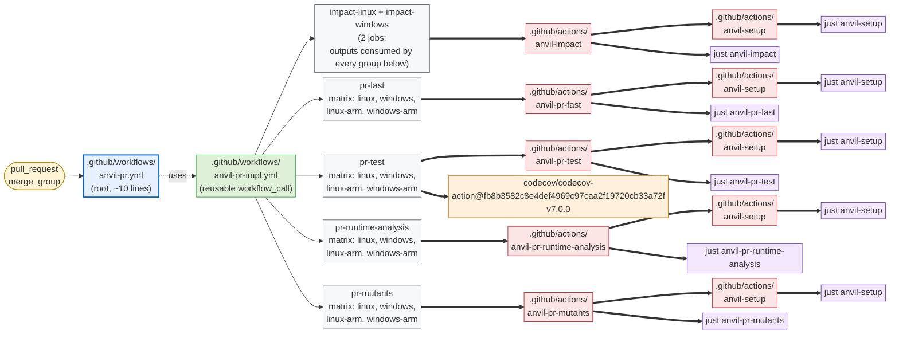
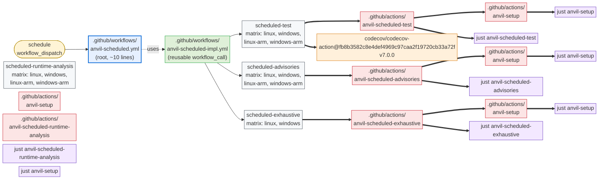

# GitHub Actions Integration

This document describes what `cargo anvil --backend github` emits for GitHub
Actions, and how a repo wires those files into its own cloud workflows.

anvil emits three layers, all owned by anvil with the standard owned-file flow (edit →
dirty → `.anvil-proposed` sibling on next update). The split is by what users actually
need to change:

1. **Root workflows** (`anvil-pr.yml`, `anvil-scheduled.yml` at `.github/workflows/`).
   Triggers, `permissions`, runner choice, any secret pass-through. anvil ships an
   opinionated default; users who need to customize edit in place and accept the
   proposal-on-update flow.
2. **Reusable workflows** (`anvil-pr-impl.yml`, `anvil-scheduled-impl.yml`), containing the
   impact jobs and the per-group jobs with all the impact-artifact upload/download
   plumbing. These change when anvil's groups or impact wiring evolve; most users won't
   ever edit them.
3. **Per-group composite actions** (`.github/actions/anvil-*/`). Each is a multi-step
   composite that runs setup + the matching `just anvil-<tier>-<group>` recipe.

See also:

- [design.md §6](./design.md#6-repo-layout) for the file-category model.
- [checks.md](./checks.md) for what each group runs.
- [local.md](./local.md) for the `just` recipes the composite actions invoke.
- [ado.md](./ado.md) for the ADO counterpart.

## 1. Why three layers

- **Frequently-changing wiring** (group set, impact computation, fan-out, `needs:` graph)
  lives in the reusable workflows. Updates apply automatically; users don't have to merge
  changes.
- **Per-repo customization** (triggers, permissions, runner pool, secret scoping) lives
  in the root workflows. Users who customize them accept the cost of merging the
  `.anvil-proposed` sibling when the anvil defaults evolve — which is rare, since the
  root workflow is intentionally minimal.
- The reusable-workflow seam ([`workflow_call`][1]) is GitHub's first-class mechanism for
  exactly this: a workflow can call another workflow in the same repo, passing inputs and
  secrets. We use it so the root workflow stays ~10 lines.

[1]: https://docs.github.com/en/actions/sharing-automations/reusing-workflows

The PR pipeline:



The scheduled pipeline (same colour key):



Every PR-tier group job declares `needs: [impact-linux, impact-windows]` so it can download the per-OS impact artifact. That fan-in is elided from the diagram to keep it readable; the scheduled tier has no such dependency because scheduled runs always operate on the full workspace.

## 2. Emitted artifacts

```text
.github/
├── actions/
│   ├── anvil-setup/action.yml         owned   (install just + group-scoped catalog tools)
│   ├── anvil-impact/action.yml        owned   (runs `just anvil-impact`; omitted if .delta.toml disabled)
│   ├── anvil-pr-fast/action.yml       owned   (one composite action per group)
│   ├── anvil-pr-test/action.yml      owned
│   ├── anvil-pr-runtime-analysis/action.yml      owned
│   ├── anvil-pr-mutants/action.yml      owned
│   ├── anvil-scheduled-test/action.yml  owned
│   ├── anvil-scheduled-advisories/action.yml  owned
│   ├── anvil-scheduled-runtime-analysis/action.yml  owned
│   └── anvil-scheduled-exhaustive/action.yml  owned
└── workflows/
    ├── anvil-pr-impl.yml              owned   (reusable workflow doing the wiring)
    ├── anvil-scheduled-impl.yml         owned   (reusable workflow for the scheduled tier)
    ├── anvil-pr.yml                   owned   (root workflow; triggers/permissions/runner)
    └── anvil-scheduled.yml              owned
```

All files are regular owned files tracked by the sidecar `.anvil.lock` manifest
(no in-file checksum line; see [updates.md §1](./updates.md#1-the-manifest)). Users
who customize the root workflow take ownership through the standard dirty-file
flow.

## 3. Root workflows

The default `anvil-pr.yml` anvil emits is the minimum needed to call the reusable
workflow:

```yaml
# .github/workflows/anvil-pr.yml
name: anvil-pr
on:
  pull_request: {}
  merge_group: {}
permissions:
  contents: read
jobs:
  anvil:
    uses: ./.github/workflows/anvil-pr-impl.yml
```

The scheduled root workflow adds a schedule and `workflow_dispatch`:

```yaml
# .github/workflows/anvil-scheduled.yml
name: anvil-scheduled
on:
  schedule: [{ cron: '0 6 * * *' }]
  workflow_dispatch: {}
permissions:
  contents: read
jobs:
  anvil:
    uses: ./.github/workflows/anvil-scheduled-impl.yml
```

Common edits users make to the root workflow (these flip the file to "dirty" and produce
a `.anvil-proposed` sibling on the next `update` — see
[updates.md §5](./updates.md#5-the-decision-algorithm)):

- **Self-hosted runners**: pass `with: { linux_runner: 'self-hosted-rust', windows_runner: 'self-hosted-rust-win', linux_arm_runner: 'self-hosted-rust-arm', windows_arm_runner: 'self-hosted-rust-win-arm' }`
- **Different OS matrix scope**: not a workflow input. The matrices are part of the
  workflow's identity — adopters who want to add macOS, drop ARM, or otherwise change
  the OS axis fork the emitted `anvil-pr-impl.yml` / `anvil-scheduled-impl.yml`
  in their own repo and dirty-file-flow takes over from there. Surveyed-repo precedent
  (`oxidizer-github`, `oxidizer`) does the same.
  to the reusable workflow. The runner inputs are CSV-keyed by OS (see §4 for the
  exact contract).
- **Different OS matrix scope**: not a workflow input. The matrices are part of the
  workflow's identity — adopters who want to add macOS, drop ARM, or otherwise change
  the OS axis fork the emitted `anvil-pr-impl.yml` / `anvil-scheduled-impl.yml`
  in their own repo and dirty-file-flow takes over from there. Surveyed-repo precedent
  (`oxidizer-github`, `oxidizer`) does the same.
  (`linux`/`windows`/`macos`), not runner labels — runner labels come from the separate
  `*_runner` inputs.
- **Different schedule** for the scheduled tier.
- **Path filters** to skip the workflow on docs-only PRs (though anvil's
  `cargo delta impact` step already produces a `--skip` sentinel for the include lists
  when nothing relevant changed).

anvil ships two defaults in the root workflow that adopters typically keep but can
remove if they have specific reasons:

- `concurrency: { group: anvil-pr-${{ github.head_ref || github.ref }}, cancel-in-progress: true }`
  on `anvil-pr.yml`. Prevents two anvil runs from racing on the same PR
  branch — the newer push cancels the older. Removing it costs cloud workflows minutes but
  is otherwise harmless.
- `secrets: inherit` on the `anvil:` job. Forwards the calling repo's
  secrets (notably `CODECOV_TOKEN`) into the reusable workflow without each
  adopter having to enumerate them. Removing it disables Codecov uploads
  for private repos but doesn't affect anything else.

## 4. Owned reusable workflows

`anvil-pr-impl.yml` is where the wiring lives. Every per-group job downloads the per-OS
impact artifact into `target/anvil/impact/` before running its composite action; which
tiers a group's checks actually consume from that cache is the catalog's concern, not
the wiring layer's. Moving a check between groups never changes the reusable workflow.

Approximate shape (anvil writes this verbatim; users never edit it):

```yaml
# .github/workflows/anvil-pr-impl.yml   (owned by cargo-anvil)
on:
  workflow_call:
    inputs:
      linux_runner:       { type: string, default: ubuntu-latest }
      windows_runner:     { type: string, default: windows-latest }
      linux_arm_runner:   { type: string, default: ubuntu-24.04-arm }
      windows_arm_runner: { type: string, default: windows-11-arm }

jobs:
  # Impact runs per OS family (see §6.1): a downstream leg consumes the
  # impact set computed on ITS host, so an OS-conditional dep change is never
  # scoped out. Each job UPLOADS its target/anvil/impact cache as an artifact;
  # the two arm legs reuse their OS counterpart's artifact.
  impact-linux:
    runs-on: ${{ inputs.linux_runner }}
    steps:
      - uses: actions/checkout
        with: { fetch-depth: 0 }
      - uses: ./.github/actions/anvil-impact   # runs `just anvil-impact` + upload-artifact anvil-impact-Linux
  impact-windows:
    runs-on: ${{ inputs.windows_runner }}
    steps:
      - uses: actions/checkout@v4
        with: { fetch-depth: 0 }
      - uses: ./.github/actions/anvil-impact   # uploads anvil-impact-Windows

  pr-fast:
    needs: [impact-linux, impact-windows]
    strategy:
      fail-fast: false
      matrix:
        os: [linux, windows, linux-arm, windows-arm]
    runs-on: ${{ matrix.os == 'linux' && inputs.linux_runner
      || matrix.os == 'windows' && inputs.windows_runner
      || matrix.os == 'linux-arm' && inputs.linux_arm_runner
      || inputs.windows_arm_runner }}
    steps:
      - uses: actions/checkout
        with: { fetch-depth: 0 }  # semver-check needs origin/<base> resolvable for --baseline-rev
      # Download the impact cache computed on this leg's OS into
      # target/anvil/impact/ (arm reuses its OS-family artifact). pr-test /
      # pr-runtime-analysis / pr-mutants do the identical download.
      - uses: actions/download-artifact@v4
        with:
          name: anvil-impact-${{ startsWith(matrix.os, 'linux') && 'Linux' || 'Windows' }}
          path: target/anvil/impact
      - uses: ./.github/actions/anvil-pr-fast   # no impact inputs; checks read the downloaded cache
        env:
          PR_TITLE: ${{ github.event.pull_request.title }}

  pr-test:
    # Tests + coverage: llvm-cov, doc-test, examples. Coverage upload
    # is gated to the canonical x86_64 Linux leg (omitted here for brevity).
    needs: [impact-linux, impact-windows]
    strategy:
      fail-fast: false
      matrix:
        os: [linux, windows, linux-arm, windows-arm]
    runs-on: ${{ matrix.os == 'linux' && inputs.linux_runner
      || matrix.os == 'windows' && inputs.windows_runner
      || matrix.os == 'linux-arm' && inputs.linux_arm_runner
      || inputs.windows_arm_runner }}
    steps:
      - uses: actions/checkout
      - uses: ./.github/actions/anvil-pr-test
      - uses: ./.github/actions/anvil-pr-test  # preceded by the same per-OS download-artifact step as pr-fast
        with:
          free-disk-space: true

  # pr-runtime-analysis (miri + careful) and pr-mutants (mutants) follow the same
  # shape; pr-mutants additionally sets `env: BASE_REF` for diff-scoped
  # cargo-mutants, and the anvil-mutants-diff recipe self-skips on
  # aarch64-pc-windows-msvc (where cargo-mutants doesn't build).
```

Every multi-OS job hardcodes its OS axis as an inline YAML array. Per-leg runner
*labels* are inputs (so adopters can swap in self-hosted runners), but the OS axis
itself is part of the workflow's identity. Adopters who need a different shape (add
macOS, drop ARM, mix in exotic targets) fork the reusable workflow and let
dirty-file-flow take over. The previously-considered `fromJSON(inputs.X)` pattern
was rejected because it added a silent failure mode (mis-formatted inputs produced
empty matrices that GitHub Actions silently treats as "no legs to run") without
meaningfully expanding what adopters could customize — anyone who wants to change
the OS axis is almost certainly making other changes too.

The pr-* jobs gate on the impact jobs *succeeding*: their `needs: [impact-linux,
impact-windows]` uses GitHub's default behavior, so if an impact job fails the pr-*
jobs are skipped and the run fails at impact (we add no `if: always()` / `if:
!cancelled()` override that would let them run anyway). This keeps a broken impact a
blocking failure rather than leaving the run green with a lone red impact job.

The wiring never branches on impact's *output values*, though. When impact succeeds,
each group always runs; recipes inside the group decide whether a given check no-ops,
by testing for the literal sentinel `--skip` in the relevant include var. This matters
because unscoped checks (`fmt`, `deny`, `audit`, `aprz`, `pr-title`, `mutants-full`)
must run on every PR, including docs-only PRs where every tier comes back `--skip`. See
[local.md §4](./local.md#4-impact-scoping-via-the-anvil-impact-recipe) for the recipe-side
contract.

The scheduled reusable workflow is simpler — it omits the `impact` job and runs each group
full-workspace. The include inputs default to empty strings, so recipes fall through to
their local-default behavior (`--workspace`):

```yaml
# .github/workflows/anvil-scheduled-impl.yml  (owned)
on:
  workflow_call:
    inputs:
      linux_runner:       { type: string, default: ubuntu-latest }
      windows_runner:     { type: string, default: windows-latest }
      linux_arm_runner:   { type: string, default: ubuntu-24.04-arm }
      windows_arm_runner: { type: string, default: windows-11-arm }
jobs:
  scheduled-test:
    strategy:
      fail-fast: false
      matrix:
        os: [linux, windows, linux-arm, windows-arm]
    runs-on: ${{ matrix.os == 'linux' && inputs.linux_runner
      || matrix.os == 'windows' && inputs.windows_runner
      || matrix.os == 'linux-arm' && inputs.linux_arm_runner
      || inputs.windows_arm_runner }}
    steps: [ { uses: actions/checkout }, { uses: ./.github/actions/anvil-scheduled-test } ]
  scheduled-advisories:
    strategy:
      fail-fast: false
      matrix:
        os: [linux, windows, linux-arm, windows-arm]
    runs-on: ${{ matrix.os == 'linux' && inputs.linux_runner
      || matrix.os == 'windows' && inputs.windows_runner
      || matrix.os == 'linux-arm' && inputs.linux_arm_runner
      || inputs.windows_arm_runner }}
    steps: [ { uses: actions/checkout }, { uses: ./.github/actions/anvil-scheduled-advisories } ]
  scheduled-exhaustive:
    # x86_64 only -- cargo-mutants constraint.
    strategy:
      fail-fast: false
      matrix:
        os: [linux, windows]
    runs-on: ${{ matrix.os == 'linux' && inputs.linux_runner || inputs.windows_runner }}
    steps: [ { uses: actions/checkout }, { uses: ./.github/actions/anvil-scheduled-exhaustive } ]
```

Scheduled composite actions don't receive any `include_*` inputs at all — their inputs
default to empty strings (recipes default to `--workspace`) and the reusable workflow
omits the passthrough. Threading them through is purely a PR-tier optimization;
the scheduled tier never benefits.

If `.delta.toml`'s managed region is emptied
([updates.md §opt-out](./updates.md#6-opting-out-in-file-stubs)),
`cargo delta impact` runs with its own defaults — the file is optional configuration, not
a feature gate — and the `impact` job still emits include lists that recipes interpret
normally. The user has opted out of *anvil's curated cargo-delta config*, not out of
impact scoping itself.

The reusable workflow declares a small input set so the root workflow can pass overrides:

| Input                | Type   | Default              | Meaning                                                |
|----------------------|--------|----------------------|--------------------------------------------------------|
| `linux_runner`       | string | `ubuntu-latest`      | Runner label for x86_64 Linux jobs and the single-leg `impact` job. |
| `windows_runner`     | string | `windows-latest`     | Runner label for x86_64 Windows jobs.                  |
| `linux_arm_runner`   | string | `ubuntu-24.04-arm`   | Runner label for aarch64 Linux jobs.                   |
| `windows_arm_runner` | string | `windows-11-arm`     | Runner label for aarch64 Windows jobs.                 |

The input surface is intentionally narrow: only per-leg *runner labels* are exposed,
because swapping in self-hosted runners is the one common need that doesn't require
otherwise touching the workflow. The OS matrix shape (which legs run) is fixed in the
workflow source — see the discussion under the PR snippet above.

The reusable workflows also declare an optional `workflow_call` secret
`CODECOV_TOKEN`. See §10 (Coverage upload) for how it's used.

We deliberately keep this input surface minimal. Anything more elaborate (e.g.
per-job runner overrides) lives in the user's own workflow, which can compose its own
`uses:`-of-reusable-workflow shape.

## 5. Per-group composite actions

Each per-group composite action takes **no impact inputs**. The impact set is shared as
a downloaded artifact (§6.1): the reusable workflow downloads `anvil-impact-<os>` into
`target/anvil/impact/` before invoking the action, and the group's scoped checks read
that cache directly via their `anvil-impact` dependency — the same code path as a local
run. The only inputs a group action declares are the disk-cleanup switch
(`free-disk-space`) and the PR-context strings a check needs (e.g. `pr_title` for
`anvil-pr-fast`). Moving a check between groups is a pure catalog change.

```yaml
# .github/actions/anvil-pr-fast/action.yml  (owned)
name: anvil-pr-fast
description: anvil PR fast group
inputs:
  pr_title:
    description: PR title for the pr-title check.
    required: false
    default: ""
  free-disk-space:
    description: Remove unused toolchains from GitHub-hosted runners before setup.
    required: false
    default: "false"
runs:
  using: composite
  steps:
    - uses: ./.github/actions/anvil-setup
      with:
        group: pr-fast
        free-disk-space: ${{ inputs.free-disk-space }}
    - shell: bash
      env:
        PR_TITLE: ${{ inputs.pr_title }}
      run: |
        # consume: a PR group job downloaded the impact cache -> trust it
        # verbatim (no snapshot, no cargo-delta, no base ref). off: no cache
        # (scheduled tier) -> anvil-impact no-ops and tiers default to
        # --workspace.
        if [ -f target/anvil/impact/impact.state ]; then
          export ANVIL_IMPACT=consume
        else
          export ANVIL_IMPACT=off
        fi
        just anvil-pr-fast
```

Per-action inputs (only where the action consumes PR-context strings the recipe needs;
every group action also takes `free-disk-space` (default `"false"`), forwarded to
`anvil-setup` to reclaim runner disk before setup):

| Action                       | Inputs                                                                 |
|------------------------------|-------------------------------------------------------------------------|
| `anvil-pr-fast`              | `pr_title`                                                              |
| `anvil-pr-mutants`             | `base_ref`                                                              |
| `anvil-pr-test`, `anvil-pr-runtime-analysis`, `anvil-scheduled-*` | —                                                                       |

The recipes themselves consume the impact cache (via `_anvil-impact-include`) and only
the PR-context env vars they need; the catalog records the tier mapping (see
[checks.md §5](./checks.md#5-impact-scoping-check--env-var-mapping)).

These actions are consumed primarily by anvil's own reusable workflow. Users who want to
plug individual groups into an unrelated workflow can `uses:` them directly (downloading
the impact artifact first, or letting the action fall back to full-workspace).

### `anvil-setup`

`anvil-setup` is a composite action that installs `just`
(`cargo install just --locked`) and then invokes the catalog setup recipes. Its
`group` input controls which recipes run:

- empty (default): runs `just anvil-setup binstall` -- the full catalog. Use
  for local "give me everything" flows.
- `none`: skips the catalog setup entirely. Used by `anvil-impact`, which only
  needs `cargo-delta` and installs it itself afterwards.
- any other value (e.g. `pr-fast`, `scheduled-advisories`): runs
  `just anvil-<group>-setup binstall` -- only the tools, components, and
  toolchains that group actually needs. Every per-group composite action
  (`.github/actions/anvil-<group>`) passes its own group name here, so a
  `pr-fast` matrix leg never installs cargo-mutants.

The action does not install Rust; it expects `cargo` on PATH (see §7).
`anvil-impact` is described in §6 below.

Its optional `free-disk-space` input defaults to `false`. When enabled on a
GitHub-hosted runner, it removes pre-installed toolchains that anvil's Rust checks do
not use: Android, Haskell/GHC, Swift and browser drivers on Linux; Android and
Haskell/GHC on Windows. This reclaims approximately 18 GB on Linux and 17 GB on
Windows. It is a no-op on macOS and self-hosted runners. The generated reusable 
workflows explicitly enable this input only for `pr-test` and `scheduled-test`, 
mirroring the testing-job integration in [microsoft/oxidizer#583](https://github.com/microsoft/oxidizer/pull/583).
Other groups retain the action's disabled default.

## 6. Impact scoping

`.github/actions/anvil-impact/action.yml` is a composite action that runs the shared
`anvil-impact` recipe — the same impact building block adopters run locally (see
[local.md §4](./local.md#4-impact-scoping-via-the-anvil-impact-recipe)). It:

1. `./.github/actions/anvil-setup` with `group: none` (bootstrap rust + just +
   cache; no catalog tools).
2. `just anvil-tool-cargo-delta-install binstall` -- the only tool this composite
   needs. **This is the only job in the whole workflow that installs cargo-delta.**
3. `just anvil-impact`, which resolves the base ref (`_anvil-base-ref`), snapshots the
   base merge target (in a throwaway worktree) and the current tree, runs
   `cargo delta impact`, and writes the durable cache under `target/anvil/impact/`:
   the per-tier `include_<tier>.txt` lists (via `_anvil-impact-format`), `impact.json`,
   and the `snapshots/`.
4. Uploads that whole directory as the `anvil-impact-<runner.os>` artifact
   (`actions/upload-artifact`).

### 6.1 How the impact result propagates to the group jobs

The impact set propagates as an **uploaded pipeline artifact** — the entire
`target/anvil/impact/` cache — not as job outputs or environment variables. Each group
job **downloads** it and its scoped checks read the cache directly, exactly as a local
run does: this is the whole point — CI and local execution take the identical code
path (`anvil-impact` → `include_<tier>.txt` → `_anvil-impact-include`), rather than CI
threading pre-formatted strings that local runs never see. The chain in
`anvil-pr-impl.yml`:

1. **Two impact jobs**, `impact-linux` and `impact-windows`, each run the
   `anvil-impact` action, which uploads an `anvil-impact-Linux` / `anvil-impact-Windows`
   artifact. Impact is computed per OS *family* because an OS-conditional dependency
   (`[target.'cfg(target_os = …)'.dependencies]`) changes the reverse-dep set only in
   that host's `cargo metadata` graph, so a single-OS computation could scope out a
   cross-OS rev-dep; the two arm legs reuse their OS-family counterpart's artifact.
2. **Every group job** declares `needs: [impact-linux, impact-windows]` and, after
   checkout, downloads the matching leg's artifact into `target/anvil/impact/`,
   selecting by matrix OS — e.g.
   `name: anvil-impact-${{ startsWith(matrix.os, 'linux') && 'Linux' || 'Windows' }}`.
3. **The group composite action** (`group-action.yml`) runs `just anvil-<group>` with
   `ANVIL_IMPACT=consume` (it sees the downloaded cache's `impact.state`). In consume
   mode `anvil-impact` is a pure no-op — it trusts the downloaded cache verbatim and
   **neither snapshots nor recomputes**, so it needs neither cargo-delta nor a fetched
   base ref (a group job installs the former and shallow-checks-out without the latter).
   Each scoped check then reads its tier's scope from
   `target/anvil/impact/include_<tier>.txt` via `_anvil-impact-include` (into a local
   `$include` variable). This is why the group jobs stay lean and can't be tripped up by
   an environmental difference from the impact job.
4. **Scheduled group jobs download nothing** (the scheduled tier runs full-workspace).
   The group action sees no `target/anvil/impact/impact.state` and instead exports
   `ANVIL_IMPACT=off`, so `anvil-impact` no-ops and every tier defaults to `--workspace`.

The wiring never gates jobs on the impact result — every job runs regardless of `--skip`
status. This is intentional: unscoped checks (`deny`, `audit`, `aprz`, `pr-title`,
`mutants-full`) must run on every PR even when every tier reports `--skip`. Steps that
need a per-tier side decision read the downloaded cache file directly (e.g. the Codecov
upload is gated on the coverage files existing via `hashFiles(...)`), never on a job
output.


The check → bucket mapping is in
[checks.md §5](./checks.md#5-impact-scoping-check--env-var-mapping).

## 7. Rust toolchain

anvil does not install Rust on GitHub. The composite actions assume `cargo` is on PATH.
GH-hosted runners ship with a recent stable Rust and `rustup` pre-installed; if your
`rust-toolchain.toml` pins a different channel, the first `cargo` invocation in a job
triggers `rustup` to download the pinned toolchain. For a published stable channel this
typically takes 10–30 seconds on Linux (somewhat longer on Windows and longer still for
nightly with components). The auto-install runs once per job and is not cached across
jobs by anvil — `~/.rustup` has high invalidation churn and the install cost is small
relative to the cached cargo registry / `target/` paths (§8). Repos that want to skip
even this per-job overhead can add their own toolchain-install step (e.g.
`dtolnay/rust-toolchain@stable`) before the anvil composite action runs.

On self-hosted runners or pre-baked images without rustup, the user adds a Rust install
step to their root workflow before the `uses:` of the reusable workflow:

```yaml
jobs:
  anvil:
    uses: ./.github/workflows/anvil-pr-impl.yml
    # Self-hosted? Add a setup workflow that runs first and uploads
    # toolchain to a shared cache, then reference it here.
```

Since reusable workflows can't accept "previous step" handoff, self-hosted users usually
forgo the reusable-workflow shape and write a single workflow that calls the composite
actions directly. anvil's composite actions are exposed for that use case.

`anvil-tool-rustc-validate-prereqs` (depended on by every check that needs rustc)
validates the installed `rustc` against the catalog minimum at recipe time; a
below-minimum `rustc` produces a clean failure message.

## 8. Caching

The `anvil-setup` composite action computes a cache key from: OS, rustc version (read
from `rust-toolchain.toml`), `Cargo.lock`, `.cargo/config.toml`, and `versions.just`
(the single source of truth for catalog tool/toolchain pins). Uses `actions/cache`
natively. `CARGO_HOME` is pinned to a workspace-scratch location to keep cache
scoping predictable.

The cache covers:

- The `cargo install`-ed tools installed by the catalog setup recipes.
- The `target/` directory (per anvil recipe; a per-recipe cache scope means a `pr-test`
  cache hit doesn't have to wait on a `pr-fast` cache miss).

## 9. Security

The setup action uses `sudo rm -rf` only when `free-disk-space` is explicitly enabled
and the runner reports `runner.environment == 'github-hosted'`. It never performs disk
cleanup on self-hosted runners. Other composite-action steps install tools and invoke
`just`. The reusable workflow propagates only what the root workflow passes (and only
the inputs explicitly declared).

Recommended root workflow shape:

- `permissions: contents: read` at the workflow level. anvil's default ships with
  this.
- No `pull-requests: write` (the PR-title check only needs the title from the event
  payload, which is already in `${{ github.event.pull_request.title }}`).
- Scheduled-tier secrets, if any, live on `anvil-scheduled.yml` only — never on `anvil-pr.yml`.
- All cargo-tool installs done by the catalog setup recipes use `--locked` (with
  `cargo install` or `cargo binstall` depending on `installer`).

## 10. Coverage upload

After `pr-test` (and `scheduled-test`) runs the `anvil-llvm-cov` recipe, the reusable
workflow uploads the resulting `target/coverage/lcov.info` to Codecov from every leg of
the matrix except `windows-11-arm`. The windows-arm leg is excluded because its
LLVM-coverage instrumentation produces `malformed instrumentation profile data: symbol
name is empty` errors that make the profile unusable. Coverage from every other leg is
necessary because OS/arch-gated code (`cfg(target_os = ...)`, `cfg(target_arch = ...)`)
is only exercised on its native target, so a single-leg upload would systematically
under-report the coverage of those branches. Codecov coalesces multiple uploads against
the same commit; we pass `flags: ${{ matrix.os }}` so each per-leg slice is also
queryable individually in the Codecov UI.

The upload step:

```yaml
- name: Upload coverage to Codecov
  if: matrix.os != 'windows-arm' && hashFiles('target/coverage/lcov-all-features.info', 'target/coverage/lcov-no-default.info') != ''
  uses: codecov/codecov-action@fb8b3582c8e4def4969c97caa2f19720cb33a72f # v7.0.0
  with:
    files: target/coverage/lcov.info
    flags: ${{ matrix.os }}
    token: ${{ secrets.CODECOV_TOKEN }}
    fail_ci_if_error: false
```

The reusable workflow declares `CODECOV_TOKEN` as an optional `workflow_call` secret;
the root workflow's default `secrets: inherit` (see §3) forwards it without each adopter
having to enumerate. Public repos with Codecov OIDC trust configured need no token at
all; private repos set `CODECOV_TOKEN` at the repo level. `fail_ci_if_error: false`
keeps the build green when Codecov is unreachable (typical for internal repos that
can't reach `codecov.io`).

On the scheduled upload the step additionally combines the OS flag with a `scheduled`
marker (`flags: scheduled,${{ matrix.os }}`) so PR vs scheduled streams stay
distinguishable in the Codecov UI while still being queryable per-OS.

anvil does not gate the PR on coverage. The lcov upload is informational; Codecov's
own status check is the gating layer when the adopter wants one (configured in Codecov,
visible as a separate required check in branch protection).

## 11. Advisory PR comments

Recipes that surface non-blocking findings exit 0 and write a markdown body to
`target/anvil/comments/<NAME>.md` (see [checks.md §6](./checks.md#6-advisory-pr-comments)
for the cross-backend convention). The GitHub backend turns presence/absence of those
files into upserts/deletions of a sticky PR comment via
[`marocchino/sticky-pull-request-comment`](https://github.com/marocchino/sticky-pull-request-comment).

The wiring lives in the `pr-fast` job of `anvil-pr-impl.yml` (the only group whose
recipes emit comments today). Two steps run after the composite that executes the
`pr-fast` group:

```yaml
- name: Upsert anvil-semver advisory
  if: always() && github.event_name == 'pull_request' && matrix.os == 'linux'
      && github.event.pull_request.head.repo.full_name == github.repository
      && hashFiles('target/anvil/comments/semver.md') != ''
  uses: marocchino/sticky-pull-request-comment
  with:
    header: anvil-semver
    path: target/anvil/comments/semver.md
- name: Clear anvil-semver advisory
  if: always() && github.event_name == 'pull_request' && matrix.os == 'linux'
      && github.event.pull_request.head.repo.full_name == github.repository
      && hashFiles('target/anvil/comments/semver.md') == ''
  uses: marocchino/sticky-pull-request-comment
  with:
    header: anvil-semver
    delete: true
```

Conditions explained:

- `always()` keeps the comment in sync even if an unrelated `pr-fast` check failed; the
  advisory state is independent of the rest of the job's pass/fail.
- `github.event_name == 'pull_request'` skips the steps on `merge_group` and other
  triggers where there's no PR thread to post to.
- `matrix.os == 'linux'` picks the canonical x86_64 Linux leg so the four-OS matrix
  doesn't race on the same comment.
- `head.repo.full_name == github.repository` skips fork PRs. GitHub doesn't grant
  `pull-requests: write` to fork-PR workflow runs by default, so the action would 403.

Permissions: the reusable workflow's caller (`anvil-pr.yml`) declares
`pull-requests: write` on the `anvil-pr` job that calls `anvil-pr-impl.yml`. The
top-level `permissions:` block stays at `contents: read` so unrelated reads in the same
workflow are still least-privilege.

Adding a new advisory check is a two-step change: the recipe writes
`target/anvil/comments/<NEW>.md` (and removes it on a clean run); the workflow gains
a matching `Upsert anvil-<NEW>` / `Clear anvil-<NEW>` pair with
`header: anvil-<NEW>`. There's deliberately no auto-discovery loop over the
convention dir — explicit per-check steps keep stale comments deterministically
clearable when a check is removed from the catalog.
