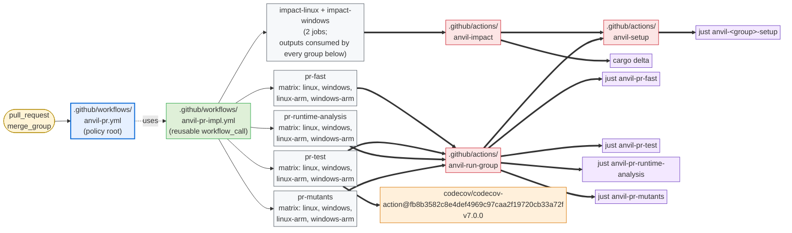

# GitHub Actions Integration

This document describes what `cargo anvil --backend github` emits for GitHub
Actions, and how a repo wires those files into its own cloud workflows.

anvil emits three layers, all owned by anvil with the standard owned-file flow (edit →
dirty → `.anvil-proposed` sibling on next update). The split is by what users actually
need to change:

1. **Root workflows** (`anvil-pr.yml`, `anvil-scheduled.yml` at `.github/workflows/`).
   Triggers, `permissions`, runner choice, any secret pass-through. anvil ships an
   opinionated default; users who need to customize edit in place and accept the
   proposal-on-update flow.
2. **Reusable workflows** (`anvil-pr-impl.yml`, `anvil-scheduled-impl.yml`), containing the
   impact job and the per-group jobs with all the `needs.impact.outputs.*` plumbing.
   These change when anvil's groups or impact wiring evolve; most users won't ever edit
   them.
3. **Shared composite actions** (`.github/actions/anvil-*/`). The reusable
   workflows pass a constant group name to one `anvil-run-group` action, which
   runs setup + the matching `just anvil-<tier>-<group>` recipe.
   The shared setup action registers a problem matcher that promotes Just's
   standard failing-recipe diagnostic to a GitHub check annotation. Group
   membership therefore remains solely in the Just recipe while the check UI
   identifies the individual recipe that failed. The shared group action also captures
   that same terminal diagnostic and fails through a final, dynamically named
   step such as `Failed Just recipe: anvil-license-headers`, making the failed
   recipe visible in the job's step list without copying group membership into
   YAML. For same-repository pull requests, it also publishes a dynamically
   named failure status per group job. The status name identifies the failed
   recipe directly in the PR check list.

See also:

- [README.md §6](./README.md#6-repo-layout) for the file-category model.
- [checks.md](./checks.md) for what each group runs.
- [local.md](./local.md) for the `just` recipes the composite actions invoke.
- [ado.md](./ado.md) for the ADO counterpart.

## 1. Why three layers

- **Frequently-changing wiring** (group set, impact computation, fan-out, `needs:` graph)
  lives in the reusable workflows. Updates apply automatically; users don't have to merge
  changes.
- **Per-repo customization** (triggers, permissions, runner pool, secret scoping) lives
  in the root workflows. Users who customize them accept the cost of merging the
  `.anvil-proposed` sibling when the anvil defaults evolve — which is rare, since the
  root workflow is intentionally minimal.
- The reusable-workflow seam ([`workflow_call`][1]) is GitHub's first-class mechanism for
  exactly this: a workflow can call another workflow in the same repo, passing inputs and
  secrets. We use it so the root workflow stays small and policy-focused.

[1]: https://docs.github.com/en/actions/sharing-automations/reusing-workflows

The PR pipeline:


```mermaid
%%{init: {"flowchart": {"nodeSpacing": 10, "rankSpacing": 35, "padding": 3}, "themeVariables": {"fontSize": "16px"}}}%%
flowchart LR
    pr_evt([pull_request<br/>merge_group]):::trigger
    pr_root[".github/workflows/<br/>anvil-pr.yml<br/>(policy root)"]:::root
    pr_impl[".github/workflows/<br/>anvil-pr-impl.yml<br/>(reusable workflow_call)"]:::impl
    impact["impact-linux + impact-windows<br/>(2 jobs;<br/>outputs consumed by every group below)"]:::job
    pr_fast_job["pr-fast<br/>matrix: linux, windows,<br/>linux-arm, windows-arm"]:::job
    pr_test_job["pr-test<br/>matrix: linux, windows,<br/>linux-arm, windows-arm"]:::job
    pr_runtime_analysis_job["pr-runtime-analysis<br/>matrix: linux, windows,<br/>linux-arm, windows-arm"]:::job
    pr_mutants_job["pr-mutants<br/>matrix: linux, windows,<br/>linux-arm, windows-arm"]:::job
    impact_act[".github/actions/<br/>anvil-impact"]:::action
    setup_act[".github/actions/<br/>anvil-setup"]:::action
    run_group_act[".github/actions/<br/>anvil-run-group"]:::action
    codecov_act["codecov/codecov-action@fb8b3582c8e4def4969c97caa2f19720cb33a72f<br/>v7.0.0"]:::external
    impact_just["cargo delta"]:::recipe
    fast_just["just anvil-pr-fast"]:::recipe
    test_just["just anvil-pr-test"]:::recipe
    runtime_just["just anvil-pr-runtime-analysis"]:::recipe
    mutants_just["just anvil-pr-mutants"]:::recipe
    setup_just["just anvil-&lt;group&gt;-setup"]:::recipe

    pr_evt --> pr_root
    pr_root -. uses .-> pr_impl
    pr_impl --> impact
    pr_impl --> pr_fast_job
    pr_impl --> pr_test_job
    pr_impl --> pr_runtime_analysis_job
    pr_impl --> pr_mutants_job

    impact ==> impact_act
    pr_fast_job ==> run_group_act
    pr_test_job ==> run_group_act
    pr_test_job ==> codecov_act
    pr_runtime_analysis_job ==> run_group_act
    pr_mutants_job ==> run_group_act

    impact_act ==> setup_act
    impact_act ==> impact_just
    run_group_act ==> setup_act
    run_group_act ==> fast_just
    run_group_act ==> test_just
    run_group_act ==> runtime_just
    run_group_act ==> mutants_just
    setup_act ==> setup_just

    classDef trigger fill:#fff4d6,stroke:#b08800,stroke-width:1px;
    classDef root fill:#e6f0ff,stroke:#0366d6,stroke-width:2px;
    classDef impl fill:#dff0d8,stroke:#28a745,stroke-width:1px;
    classDef job fill:#f6f8fa,stroke:#586069,stroke-width:1px;
    classDef action fill:#fce5e5,stroke:#cb2431,stroke-width:1px;
    classDef external fill:#fff0db,stroke:#d97706,stroke-width:1px;
    classDef recipe fill:#f3e8ff,stroke:#6f42c1,stroke-width:1px;
```

The scheduled pipeline (same colour key):


```mermaid
%%{init: {"flowchart": {"nodeSpacing": 10, "rankSpacing": 35, "padding": 3}, "themeVariables": {"fontSize": "16px"}}}%%
flowchart LR
    sched_evt([schedule<br/>workflow_dispatch]):::trigger
    sched_root[".github/workflows/<br/>anvil-scheduled.yml<br/>(policy root)"]:::root
    sched_impl[".github/workflows/<br/>anvil-scheduled-impl.yml<br/>(reusable workflow_call)"]:::impl
    stest_job["scheduled-test<br/>matrix: linux, windows,<br/>linux-arm, windows-arm"]:::job
    sadv_job["scheduled-advisories<br/>matrix: linux, windows,<br/>linux-arm, windows-arm"]:::job
    srun_job["scheduled-runtime-analysis<br/>matrix: linux, windows,<br/>linux-arm, windows-arm"]:::job
    sexh_job["scheduled-exhaustive<br/>matrix: linux, windows"]:::job
    publish_job["publish-failure<br/>upsert incident issue"]:::job
    setup_act[".github/actions/<br/>anvil-setup"]:::action
    run_group_act[".github/actions/<br/>anvil-run-group"]:::action
    codecov_act["codecov/codecov-action@fb8b3582c8e4def4969c97caa2f19720cb33a72f<br/>v7.0.0"]:::external
    github_issues["GitHub Issues"]:::external
    stest_just["just anvil-scheduled-test"]:::recipe
    sadv_just["just anvil-scheduled-advisories"]:::recipe
    srun_just["just anvil-scheduled-runtime-analysis"]:::recipe
    sexh_just["just anvil-scheduled-exhaustive"]:::recipe
    setup_just["just anvil-&lt;group&gt;-setup"]:::recipe

    sched_evt --> sched_root
    sched_root -. uses .-> sched_impl
    sched_impl --> stest_job
    sched_impl --> sadv_job
    sched_impl --> srun_job
    sched_impl --> sexh_job
    stest_job --> publish_job
    sadv_job --> publish_job
    srun_job --> publish_job
    sexh_job --> publish_job

    stest_job ==> run_group_act
    stest_job ==> codecov_act
    sadv_job ==> run_group_act
    srun_job ==> run_group_act
    sexh_job ==> run_group_act
    publish_job ==> github_issues

    run_group_act ==> setup_act
    run_group_act ==> stest_just
    run_group_act ==> sadv_just
    run_group_act ==> srun_just
    run_group_act ==> sexh_just
    setup_act ==> setup_just

    classDef trigger fill:#fff4d6,stroke:#b08800,stroke-width:1px;
    classDef root fill:#e6f0ff,stroke:#0366d6,stroke-width:2px;
    classDef impl fill:#dff0d8,stroke:#28a745,stroke-width:1px;
    classDef job fill:#f6f8fa,stroke:#586069,stroke-width:1px;
    classDef action fill:#fce5e5,stroke:#cb2431,stroke-width:1px;
    classDef external fill:#fff0db,stroke:#d97706,stroke-width:1px;
    classDef recipe fill:#f3e8ff,stroke:#6f42c1,stroke-width:1px;
```

Every PR-tier group job declares `needs: [impact-linux, impact-windows]` so it can read the cargo-delta output variables. That fan-in is elided from the diagram to keep it readable; the scheduled tier has no such dependency because scheduled runs always operate on the full workspace.

## 2. Emitted artifacts

```text
.github/
├── actions/
│   ├── anvil-setup/action.yml         owned   (install just + group-scoped catalog tools)
│   ├── anvil-setup/just-problem-matcher.json
│   │                                  owned   (annotate failing Just recipes)
│   ├── anvil-run-group/action.yml      owned   (orchestrate any Just group)
│   ├── anvil-run-group/run-group.sh    owned   (capture the group result)
│   ├── anvil-report-status/action.yml  owned   (publish per-job commit statuses)
│   ├── anvil-impact/action.yml        owned   (cargo-delta impact computation)
└── workflows/
    ├── anvil-pr-impl.yml              owned   (reusable workflow doing the wiring)
    ├── anvil-scheduled-impl.yml         owned   (reusable workflow for the scheduled tier)
    ├── anvil-pr.yml                   owned   (root workflow; triggers/permissions/runner)
    └── anvil-scheduled.yml              owned
```

All files are regular owned files tracked by the sidecar `.anvil.lock` manifest
(no in-file checksum line; see [updates.md §1](./updates.md#1-the-manifest)). Users
who customize the root workflow take ownership through the standard dirty-file
flow.

## 3. Root workflows

The default `anvil-pr.yml` anvil emits is the minimum needed to call the reusable
workflow:

```yaml
# .github/workflows/anvil-pr.yml
name: Anvil
on:
  pull_request: {}
  merge_group: {}
permissions:
  contents: read
jobs:
  validation:
    name: PR Job
    if: github.event_name == 'pull_request'
    uses: ./.github/workflows/anvil-pr-impl.yml
    permissions:
      contents: read
      statuses: write
      pull-requests: write
    with:
      publish_job_statuses: true
    secrets: inherit
  merge-validation:
    name: PR Job
    if: github.event_name == 'merge_group'
    uses: ./.github/workflows/anvil-pr-impl.yml
    permissions:
      contents: read
    secrets: inherit
```

The two conditional callers keep the workflow name and reusable implementation
the same across events while granting write permissions only to pull-request
runs. Their internal IDs remain `validation` and `merge-validation`, while
both display names are `PR Job`. Together with the workflow display name,
GitHub renders the same user-facing `Anvil / PR Job / ...` required-check
hierarchy for pull-request and merge-group commits without exposing
implementation IDs. Merge-group execution does not publish the supplemental
status and never receives `statuses: write` or `pull-requests: write`. The
called PR implementation intentionally declares no `permissions` blocks, so
its jobs inherit the selected caller's ceiling. Static job-level write requests
would make the read-only merge caller fail workflow validation before any check
could run.

The scheduled root workflow adds a schedule and `workflow_dispatch`:

```yaml
# .github/workflows/anvil-scheduled.yml
name: anvil-scheduled
on:
  schedule: [{ cron: '0 6 * * *' }]
  workflow_dispatch: {}
permissions:
  contents: read
jobs:
  anvil:
    uses: ./.github/workflows/anvil-scheduled-impl.yml
```

Common edits users make to the root workflow (these flip the file to "dirty" and produce
a `.anvil-proposed` sibling on the next `update` — see
[updates.md §5](./updates.md#5-the-decision-algorithm)):

- **Self-hosted runners**: pass `with: { linux_runner: 'self-hosted-rust', windows_runner: 'self-hosted-rust-win', linux_arm_runner: 'self-hosted-rust-arm', windows_arm_runner: 'self-hosted-rust-win-arm' }`
- **Different OS matrix scope**: not a workflow input. The matrices are part of the
  workflow's identity — adopters who want to add macOS, drop ARM, or otherwise change
  the OS axis fork the emitted `anvil-pr-impl.yml` / `anvil-scheduled-impl.yml`
  in their own repo and dirty-file-flow takes over from there. Surveyed-repo precedent
  (`oxidizer-github`, `oxidizer`) does the same.
  to the reusable workflow. The runner inputs are CSV-keyed by OS (see §4 for the
  exact contract).
- **Different OS matrix scope**: not a workflow input. The matrices are part of the
  workflow's identity — adopters who want to add macOS, drop ARM, or otherwise change
  the OS axis fork the emitted `anvil-pr-impl.yml` / `anvil-scheduled-impl.yml`
  in their own repo and dirty-file-flow takes over from there. Surveyed-repo precedent
  (`oxidizer-github`, `oxidizer`) does the same.
  (`linux`/`windows`/`macos`), not runner labels — runner labels come from the separate
  `*_runner` inputs.
- **Different schedule** for the scheduled tier.
- **Path filters** to skip the workflow on docs-only PRs (though anvil's
  `cargo delta impact` step already produces a `--skip` sentinel for the include lists
  when nothing relevant changed).

anvil ships two defaults in the root workflow that adopters typically keep but can
remove if they have specific reasons:

- `concurrency: { group: anvil-pr-${{ github.head_ref || github.ref }}, cancel-in-progress: true }`
  on `anvil-pr.yml`. Prevents two anvil runs from racing on the same PR
  branch — the newer push cancels the older. Removing it costs cloud workflows minutes but
  is otherwise harmless.
- `secrets: inherit` on the `anvil:` job. Forwards the calling repo's
  secrets (notably `CODECOV_TOKEN`) into the reusable workflow without each
  adopter having to enumerate them. Removing it disables Codecov uploads
  for private repos but doesn't affect anything else.

## 4. Owned reusable workflows

`anvil-pr-impl.yml` is where the wiring lives. Every group job invokes the same
`anvil-run-group` action and passes the same three impact-exclude inputs
unconditionally; which ones a group's checks actually consume is the catalog's
concern, not the wiring layer's. Moving a check between groups never changes
the reusable workflow.

Approximate shape (anvil writes this verbatim; users never edit it):

```yaml
# .github/workflows/anvil-pr-impl.yml   (owned by cargo-anvil)
on:
  workflow_call:
    inputs:
      linux_runner:       { type: string, default: ubuntu-latest }
      windows_runner:     { type: string, default: windows-latest }
      linux_arm_runner:   { type: string, default: ubuntu-24.04-arm }
      windows_arm_runner: { type: string, default: windows-11-arm }

jobs:
  impact:
    name: "Preparation: Impact Analysis (linux)"
    runs-on: ${{ inputs.linux_runner }}
    outputs:
      include_modified: ${{ steps.delta.outputs.include_modified }}
      include_affected: ${{ steps.delta.outputs.include_affected }}
      include_required: ${{ steps.delta.outputs.include_required }}
    steps:
      - uses: actions/checkout
        with: { fetch-depth: 0 }
      - id: delta
        uses: ./.github/actions/anvil-impact

  pr-fast:
    name: "Check Group: Fast Checks (${{ matrix.os }})"
    needs: impact
    strategy:
      fail-fast: false
      matrix:
        os: [linux, windows, linux-arm, windows-arm]
    runs-on: ${{ matrix.os == 'linux' && inputs.linux_runner
      || matrix.os == 'windows' && inputs.windows_runner
      || matrix.os == 'linux-arm' && inputs.linux_arm_runner
      || inputs.windows_arm_runner }}
    steps:
      - uses: actions/checkout
        with: { fetch-depth: 0 }  # semver-check needs origin/<base> resolvable for --baseline-rev
      - uses: ./.github/actions/anvil-run-group
        with:
          group: pr-fast
          include_modified: ${{ needs.impact.outputs.include_modified }}
          include_affected: ${{ needs.impact.outputs.include_affected }}
          include_required: ${{ needs.impact.outputs.include_required }}
        env:
          PR_TITLE: ${{ github.event.pull_request.title }}

  pr-test:
    name: "Check Group: Tests and Coverage (${{ matrix.os }})"
    # Tests + coverage: llvm-cov, doc-test, examples. Coverage upload
    # is gated to the canonical x86_64 Linux leg (omitted here for brevity).
    needs: impact
    strategy:
      fail-fast: false
      matrix:
        os: [linux, windows, linux-arm, windows-arm]
    runs-on: ${{ matrix.os == 'linux' && inputs.linux_runner
      || matrix.os == 'windows' && inputs.windows_runner
      || matrix.os == 'linux-arm' && inputs.linux_arm_runner
      || inputs.windows_arm_runner }}
    steps:
      - uses: actions/checkout
      - uses: ./.github/actions/anvil-run-group
        with:
          group: pr-test
          free-disk-space: true
          include_modified: ${{ needs.impact.outputs.include_modified }}
          include_affected: ${{ needs.impact.outputs.include_affected }}
          include_required: ${{ needs.impact.outputs.include_required }}

  # pr-runtime-analysis (miri + careful) and pr-mutants (mutants) follow the same
  # shape; pr-mutants additionally sets `env: BASE_REF` for diff-scoped
  # cargo-mutants, and the anvil-mutants-diff recipe self-skips on
  # aarch64-pc-windows-msvc (where cargo-mutants doesn't build).
```

Every multi-OS job hardcodes its OS axis as an inline YAML array. Per-leg runner
*labels* are inputs (so adopters can swap in self-hosted runners), but the OS axis
itself is part of the workflow's identity. Adopters who need a different shape (add
macOS, drop ARM, mix in exotic targets) fork the reusable workflow and let
dirty-file-flow take over. The previously-considered `fromJSON(inputs.X)` pattern
was rejected because it added a silent failure mode (mis-formatted inputs produced
empty matrices that GitHub Actions silently treats as "no legs to run") without
meaningfully expanding what adopters could customize — anyone who wants to change
the OS axis is almost certainly making other changes too.

The pr-* jobs gate on the impact jobs *succeeding*: their `needs: [impact-linux,
impact-windows]` uses GitHub's default behavior, so if an impact job fails the pr-*
jobs are skipped and the run fails at impact (we add no `if: always()` / `if:
!cancelled()` override that would let them run anyway). This keeps a broken impact a
blocking failure rather than leaving the run green with a lone red impact job.

The wiring never branches on impact's *output values*, though. When impact succeeds,
each group always runs; recipes inside the group decide whether a given check no-ops,
by testing for the literal sentinel `--skip` in the relevant include var. This matters
because unscoped checks (`fmt`, `deny`, `audit`, `aprz`, `pr-title`, `mutants-full`)
must run on every PR, including docs-only PRs where every tier comes back `--skip`. See
[local.md §4](./local.md#4-impact-scoping-pass-through-env-vars) for the recipe-side
contract.

The scheduled reusable workflow is simpler — it omits the `impact` job and runs each group
full-workspace. The include inputs default to empty strings, so recipes fall through to
their local-default behavior (`--workspace`). The following is deliberately a
non-executable schematic; the generated
[`scheduled-impl-workflow.yml`](../../templates/github/scheduled-impl-workflow.yml)
is the canonical YAML:

```text
caller anvil-scheduled.yml
  permissions upper bound: contents:read + issues:write
  └─ called anvil-scheduled-impl.yml
       default reset: contents:read
       ├─ scheduled-test             (Linux/Windows × x64/ARM64)
       ├─ scheduled-advisories       (Linux/Windows × x64/ARM64)
       ├─ scheduled-runtime-analysis (Linux/Windows × x64/ARM64)
       ├─ scheduled-exhaustive       (Linux/Windows x64)
       └─ publish-failure
            needs: all four scheduled groups
            condition: at least one failure and publication not disabled
            job override: issues:write only
```

Every scheduled group invokes the shared `anvil-run-group` action. Those invocations
don't receive any `include_*` inputs — their inputs default to empty strings (recipes
default to `--workspace`) and the reusable workflow omits the passthrough. Threading
them through is purely a PR-tier optimization; the scheduled tier never benefits.

Cloud impact explicitly loads the repository's `.delta.toml`, including the managed
trip-wire patterns and any repository-owned parser, exclusion, or fixed comparison-
branch settings. Existing repositories that already define top-level
`trip_wire_patterns` retain that policy and receive an empty managed-region opt-out.

The reusable workflow declares a small input set so the root workflow can pass overrides:

| Input                | Type   | Default              | Meaning                                                |
|----------------------|--------|----------------------|--------------------------------------------------------|
| `linux_runner`       | string | `ubuntu-latest`      | Runner label for x86_64 Linux jobs and the single-leg `impact` job. |
| `windows_runner`     | string | `windows-latest`     | Runner label for x86_64 Windows jobs.                  |
| `linux_arm_runner`   | string | `ubuntu-24.04-arm`   | Runner label for aarch64 Linux jobs.                   |
| `windows_arm_runner` | string | `windows-11-arm`     | Runner label for aarch64 Windows jobs.                 |

The input surface is intentionally narrow: only per-leg *runner labels* are exposed,
because swapping in self-hosted runners is the one common need that doesn't require
otherwise touching the workflow. The OS matrix shape (which legs run) is fixed in the
workflow source — see the discussion under the PR snippet above.

The reusable workflows also declare an optional `workflow_call` secret
`CODECOV_TOKEN`. See §10 (Coverage upload) for how it's used.

We deliberately keep this input surface minimal. Anything more elaborate (e.g.
per-job runner overrides) lives in the user's own workflow, which can compose its own
`uses:`-of-reusable-workflow shape.

## 5. Shared group composite action

Anvil emits one `anvil-run-group` action, used by every group job in both
reusable workflows. The group name is data, not an emitted action path. This
keeps setup, output capture, failed-recipe extraction, status publication, and
failure propagation in one file in every adopting repository.

The action has one uniform input surface: the group name, three impact-include
variables, the disk-cleanup switch, and the status-publication switch. PR
context is passed as environment variables by the reusable workflow. The
reusable workflow does not need to know which include vars a group's checks
consume; it threads all three to the shared action. Moving a check between
groups or buckets remains a pure catalog change.

```yaml
# .github/actions/anvil-run-group/action.yml  (owned)
name: anvil-run-group
description: Run an Anvil Just group and report its result.
inputs:
  group:
    description: Anvil group recipe name without the anvil- prefix.
    required: true
  include_modified:
    description: |
      Pre-formatted --package args from anvil-impact for the modified
      tier, or "--skip" when the modified set is empty. Empty string =
      local invocation; recipes default to --workspace.
    required: false
    default: ""
  include_affected:
    description: Same shape as include_modified, for the affected tier.
    required: false
    default: ""
  include_required:
    description: Same shape as include_modified, for the required tier.
    required: false
    default: ""
  free-disk-space:
    description: Remove unused toolchains from GitHub-hosted runners before setup.
    required: false
    default: "false"
  publish_job_statuses:
    description: Publish a GitHub commit status for this Anvil group job.
    required: false
    default: "false"
runs:
  using: composite
  steps:
    - id: setup
      uses: ./.github/actions/anvil-setup
      with:
        group: ${{ inputs.group }}
        free-disk-space: ${{ inputs.free-disk-space }}
    - id: run
      if: steps.setup.outcome == 'success'
      shell: bash
      env:
        ANVIL_GROUP: ${{ inputs.group }}
        ANVIL_INCLUDE_MODIFIED: ${{ inputs.include_modified }}
        ANVIL_INCLUDE_AFFECTED: ${{ inputs.include_affected }}
        ANVIL_INCLUDE_REQUIRED: ${{ inputs.include_required }}
      run: bash "$GITHUB_ACTION_PATH/run-group.sh"
    - name: Publish Anvil job status
      if: always() && inputs.publish_job_statuses == 'true' && github.event_name == 'pull_request' && github.event.pull_request.head.repo.full_name == github.repository
      continue-on-error: true
      uses: ./.github/actions/anvil-report-status
      with:
        group: ${{ inputs.group }}
        setup_outcome: ${{ steps.setup.outcome }}
        exit_code: ${{ steps.run.outputs.exit_code }}
        failed_recipe: ${{ steps.run.outputs.failed_recipe }}
    - name: "Failed Just recipe: ${{ steps.run.outputs.failed_recipe }}"
      if: always() && steps.run.outputs.exit_code != '' && steps.run.outputs.exit_code != '0'
      shell: bash
      run: exit 1
```

Input set on the shared group action:

| Input              | Default   | Notes                                                                                                                                  |
|--------------------|-----------|----------------------------------------------------------------------------------------------------------------------------------------|
| `group`            | required  | Group recipe suffix, such as `pr-fast` or `scheduled-test`.                                                                           |
| `include_modified` | `""`      | Forwarded as `ANVIL_INCLUDE_MODIFIED`. `--skip` → recipe exits 0. Empty → recipe defaults to `--workspace`.                          |
| `include_affected` | `""`      | Forwarded as `ANVIL_INCLUDE_AFFECTED`. Same semantics.                                                                              |
| `include_required` | `""`      | Forwarded as `ANVIL_INCLUDE_REQUIRED`. Same semantics.                                                                              |
| `free-disk-space`  | `"false"` | Forwarded to `anvil-setup`; ignored on macOS and self-hosted runners.                                                               |
| `publish_job_statuses` | `"false"` | Publishes named failure statuses for the group and runner. Enabled by the generated PR root workflow. |

Generated workflows pass constant catalog group names. Both `anvil-run-group`
and `anvil-setup` carry the value through an `ANVIL_GROUP` environment
variable and quote the composed recipe name; they do not interpolate an action
input directly into shell source. The nested `anvil-setup` action rejects group
names outside `[a-z0-9-]+`; `anvil-run-group` invokes Just only when that setup
step succeeds, so validation necessarily precedes use of the value in the log
path and recipe name.

The reusable workflow sets `PR_TITLE` on the `pr-fast` group step and
`BASE_REF` on the `pr-mutants` group step. They are environment variables rather
than action inputs because only the recipes consume them.

The recipes themselves consume only the env vars they need; the catalog records the
mapping (see [checks.md §5](./checks.md#5-impact-scoping-check--env-var-mapping)).
Threading all three through every group-action invocation costs a few workflow
lines but is the right separation: wiring is about "which jobs depend on impact
and feed it forward", not about "which check needs which env var."

The shared action is an implementation detail of Anvil's generated reusable
workflows. Anvil does not emit or support public per-group action paths.

### Failure attribution and commit statuses

GitHub fixes workflow job names before a job runs, so a matrix job rendered as
`Anvil / PR Job / Check Group: Fast Checks (linux)` cannot rename itself after
discovering that `anvil-license-headers` failed. Anvil instead presents the
concrete failure at three levels, all driven by Just's existing terminal
diagnostic:

1. The problem matcher registered by `anvil-setup` promotes
   ``error: recipe `anvil-license-headers` failed with exit code 1`` to a
   GitHub annotation.
2. The group composite ends with a failing step named
   `Failed Just recipe: anvil-license-headers`, putting the recipe name in the
   job's step list.
3. On eligible pull requests, `anvil-report-status` publishes a commit status
   whose reserved context namespace names the failed recipe and runner:

   ```text
   Anvil / license-headers (linux-x64)
   ```

The group action uses Bash as a cross-platform capture wrapper, including on
Windows runners, and invokes `just anvil-<group>` through `tee` so users retain
live logs while the action keeps a copy in `$RUNNER_TEMP`. The Anvil recipe
bodies that Just dispatches continue to use their declared
`[script("pwsh", "-NoProfile")]` interpreter. Bash's `PIPESTATUS[0]` preserves
Just's exit code rather than `tee`'s. After Just exits, a narrow `sed`
expression extracts the last standard Just failed-recipe line and writes both
`failed_recipe` and `exit_code` as step outputs. If no such line is present,
`failed_recipe` falls back to the group recipe, such as `anvil-pr-fast`. This
logic lives in the generated
`.github/actions/anvil-run-group/run-group.sh`; the composite action invokes
that file, and Cargo Anvil's functional tests execute the same embedded script
against fake success, parsed-failure, and no-diagnostic-failure results.

The run step does not fail immediately because the reporter still needs its
outputs. A final step guarded by `always()` exits with status 1 whenever the
captured Just status was nonzero. The composite action and its workflow job
therefore retain their normal failing conclusions. Status publication uses
`continue-on-error` because it is supplemental presentation: an API outage
must not turn a successful validation job red or hide the original failure.
The reporter neither invokes checks nor contains the membership of any group.

When `publish_job_statuses` is enabled, the shared reporter uses pinned
`actions/github-script`, `github.rest.repos.listCommitStatusesForRef`, and
`github.rest.repos.createCommitStatus` to manage statuses with:

| Field | Value |
|-------|-------|
| Commit | `github.event.pull_request.head.sha` |
| Failure context | `Anvil / <recipe> (<runner>)` |
| State after setup failure | `error` |
| State after recipe failure | `failure` |
| Fresh success | No supplemental status |
| Superseded failure | `success` with a superseded description |
| Failure description | `<failed-recipe-without-anvil-prefix> failed` |
| Setup description | `setup failed before <group> ran` |
| Target URL | The originating GitHub Actions workflow run |

The runner suffix is derived from `RUNNER_OS` and `RUNNER_ARCH`, producing
values such as `linux-x64` and `windows-arm64`. The reserved `Anvil / ` prefix
and runner suffix identify statuses owned by this mechanism. The reporter adds
an `#anvil-group=<group>` marker to the workflow-run target URL so cleanup is
scoped to one group without exposing that implementation name in the check
label. Contexts are limited to 100 characters by truncating only the recipe
portion.
When Just reports an `anvil-` recipe, the reporter removes that conventional
prefix from the context and description to keep the limited inline text
concise.

The concise `Anvil / <recipe>` context puts the failed check name immediately
after the product name. In GitHub's current alphabetical PR-check rendering it
also places typical check names before `Anvil / PR Job / Check Group: ...`.
This is a presentation hint, not a correctness dependency: GitHub does not
document the ordering as a stable contract.

Cleanup runs after the group result is known. Keeping the old failure visible
while a rerun is pending avoids a temporary green result and unnecessary API
writes. At the end, the reporter queries status history for the PR head and
finds the newest value of every context with its reserved prefix, runner suffix,
and group marker. On failure it publishes the current dynamic context first,
then posts `success` to other active contexts for that leg. On success it posts
`success` to every active prior failure and creates no new supplemental row.
Publishing the new failure first ensures cleanup never creates a moment with no
visible failure.

GitHub does not allow commit-status deletion. Superseded contexts therefore
remain as green historical rows with a description explaining that a later run
replaced them. The native workflow job remains the stable, authoritative
required check; supplemental statuses are presentation only. Each new commit
has its own status set, so discovery and supersession matter only for reruns of
the same commit.

Dynamic contexts are permanent repository metadata: every distinct
`Anvil / <recipe> (<runner>)` context that is published can continue to appear
in GitHub's required-check picker even after it has been superseded. Repositories
must not configure these supplemental contexts as required checks. The bounded
native `Anvil / PR Job / Check Group: ...` jobs are the only branch-protection
surface. Status cleanup is a best-effort, non-atomic read-then-write operation;
concurrent reruns can temporarily race, but their native jobs remain
authoritative. Group ownership is carried in the target-URL fragment, while the
visible context is intentionally check-centric. If two groups fail the same
recipe on the same runner, they share the visible context; newest-status
deduplication prevents an older group-specific history entry from overriding a
newer value. This mechanism relies on the commit-status API returning the
stored `target_url` verbatim. Supplemental contexts must not be required, so a
future platform change that stopped round-tripping the fragment could leave a
stale presentation row but could not block correctly configured branch
protection.

The reporter runs under `always()` and receives the setup outcome as well as
the Just outputs. A setup failure can therefore publish an `error` description
even though the group recipe never ran. Cancellation may prevent final steps
from running; the native GitHub Actions job remains the authoritative required
check in that case. The reporter validates that its event payload contains a
pull-request head SHA and fails with an explicit precondition error if it is
invoked directly from an unsupported event.

The reusable workflow input defaults to `false`. The generated pull-request
caller opts in and grants `statuses: write`; a customized root that has not
accepted the permission continues without supplemental statuses. Publication
is guarded to same-repository `pull_request` events. Fork PR tokens are
read-only, so forks retain the annotation and dynamically named step but skip
the status call.

Merge-group runs use a separate conditional caller with only `contents: read`.
Both conditional callers have the display name `PR Job`, so their called jobs
produce identical required-check contexts on pull-request and merge-group
commits even though their internal IDs and permissions differ. Merge-group runs
retain the normal Anvil jobs, annotations, and dynamically named steps but do
not publish supplemental statuses. This avoids exposing a write-capable token
while executing a synthetic merge that may contain fork-originated code, and
avoids redundant statuses on ephemeral merge-group commits.

Adopting this workflow naming changes existing required-check contexts from
`anvil-pr / anvil-pr / <job>` to
`Anvil / PR Job / Check Group: <display name> (<platform>)`. Repository
maintainers must update branch-protection rules or rulesets in coordination
with regeneration. The pull-request and merge-queue runs intentionally emit
the same new contexts, so one required-check configuration applies to both
event types. Supplemental `Anvil / <recipe> (<runner>)` statuses must not be
selected.

Commit statuses are intentionally preferred over custom Check Runs for this
contract. GitHub Actions has no native workflow field for the inline status
description, so one REST call is still required. Check Runs provide richer
Markdown and annotations that this feature does not need, require more
lifecycle logic for dynamic names, and—when created with `GITHUB_TOKEN`—can be
placed in an unrelated GitHub Actions check suite such as Advanced CodeQL.
Commit statuses provide the required prominent name, inline description,
result, and log link without check-suite attribution.

### `anvil-setup`

`anvil-setup` is a composite action that installs `just`
(`cargo install just --locked`) and then invokes the catalog setup recipes. Its
`group` input controls which recipes run:

- empty (default): runs `just anvil-setup binstall` -- the full catalog. Use
  for local "give me everything" flows.
- `none`: skips the catalog setup entirely. Used by `anvil-impact`, which only
  needs `cargo-delta` and installs it itself afterwards.
- any other value (e.g. `pr-fast`, `scheduled-advisories`): runs
  `just anvil-<group>-setup binstall` -- only the tools, components, and
  toolchains that group actually needs. `anvil-run-group` passes its group
  input here, so a `pr-fast` matrix leg never installs cargo-mutants.

Before invoking Just, the action registers the generated
`just-problem-matcher.json`. Just already prints the exact failed dependency
recipe (for example, ``error: recipe `anvil-license-headers` failed with exit
code 1``), but GitHub otherwise exposes only its generic process-exit
annotation. The matcher promotes that existing diagnostic without wrapping
Just, parsing its output in a custom runner, or repeating a group's check list
in the action.

The action does not install Rust; it expects `cargo` on PATH (see §7).
`anvil-impact` is described in §6 below.

Its optional `free-disk-space` input defaults to `false`. When enabled on a
GitHub-hosted runner, it removes pre-installed toolchains that anvil's Rust checks do
not use: Android, Haskell/GHC, Swift and browser drivers on Linux; Android and
Haskell/GHC on Windows. This reclaims approximately 18 GB on Linux and 17 GB on
Windows. It is a no-op on macOS and self-hosted runners. The generated reusable 
workflows explicitly enable this input only for `pr-test` and `scheduled-test`, 
mirroring the testing-job integration in [microsoft/oxidizer#583](https://github.com/microsoft/oxidizer/pull/583).
Other groups retain the action's disabled default.

## 6. Impact scoping

`.github/actions/anvil-impact/action.yml` is a composite action with no branch input.
It resolves the target through `_anvil-base-ref` from `BASE_REF` or the GitHub PR
environment, then runs:

1. `./.github/actions/anvil-setup` with `group: none` (bootstrap rust + just +
   cache; no catalog tools).
2. `just anvil-tool-cargo-delta-install binstall` -- only tool this composite
   needs.
3. Resolve the snapshot baseline with `_anvil-base-ref` and load the repository's
   `.delta.toml`. Its `[git].remote_branch`, when present, remains fixed repository
   policy for cargo-delta's changed-file detection.
4. Run configured snapshots for the baseline worktree and current checkout, then
   compare them with configured `cargo delta impact`.
5. For each of the three tiers (`modified`, `affected`, `required`), format the crate
   list into a pre-built `--package X@ver --package Y@ver …` string (version-qualified
   cargo specs, so `-p` resolves uniquely even when a like-named transitive dependency
   exists), or emit the sentinel `--skip` when the tier is empty.

Outputs:

| Output             | Meaning                                                                                                                                                                |
|--------------------|------------------------------------------------------------------------------------------------------------------------------------------------------------------------|
| `include_modified` | `--package X@ver --package Y@ver …` for cargo-delta's `modified` tier, or `--skip` when empty.                                                                          |
| `include_affected` | Same shape, for the `affected` tier (modified ∪ workspace rev-deps).                                                                                                    |
| `include_required` | Same shape, for the `required` tier (affected ∪ workspace-internal transitive deps).                                                                                    |

The wiring never gates jobs on these outputs — every job runs regardless of `--skip`
status. Per-recipe interpretation lives in the recipes themselves (see [local.md §4](./local.md#4-impact-scoping-pass-through-env-vars)).
This is intentional: unscoped checks (`deny`, `audit`, `aprz`, `pr-title`,
`mutants-full`) must run on every PR even when every tier reports `--skip`.

The check → bucket mapping is in
[checks.md §5](./checks.md#5-impact-scoping-check--env-var-mapping).

## 7. Rust toolchain

anvil does not install Rust on GitHub. The composite actions assume `cargo` is on PATH.
GH-hosted runners ship with a recent stable Rust and `rustup` pre-installed; if your
`rust-toolchain.toml` pins a different channel, the first `cargo` invocation in a job
triggers `rustup` to download the pinned toolchain. For a published stable channel this
typically takes 10–30 seconds on Linux (somewhat longer on Windows and longer still for
nightly with components). The auto-install runs once per job and is not cached across
jobs by anvil — `~/.rustup` has high invalidation churn and the install cost is small
relative to the cached cargo registry / `target/` paths (§8). Repos that want to skip
even this per-job overhead can add their own toolchain-install step (e.g.
`dtolnay/rust-toolchain@stable`) before the anvil composite action runs.

On self-hosted runners or pre-baked images without rustup, the user adds a Rust install
step to their root workflow before the `uses:` of the reusable workflow:

```yaml
jobs:
  anvil:
    uses: ./.github/workflows/anvil-pr-impl.yml
    # Self-hosted? Add a setup workflow that runs first and uploads
    # toolchain to a shared cache, then reference it here.
```

Since reusable workflows cannot accept a "previous step" handoff, self-hosted
users that need additional preparation take ownership of the generated reusable
implementation workflow and add the preparation there. The generated composite
actions remain implementation details rather than a separately supported API.

`anvil-tool-rustc-validate-prereqs` (depended on by every check that needs rustc)
validates the installed `rustc` against the catalog minimum at recipe time; a
below-minimum `rustc` produces a clean failure message.

## 8. Caching

The `anvil-setup` composite action computes a cache key from runner OS and
architecture, the actual `rustc --version`, hashes of `Cargo.lock`,
`.cargo/config.toml`, `rust-toolchain.toml`, and `versions.just`, plus the workflow
job ID. Job discrimination prevents concurrent jobs from racing to save one key;
prefix restore keys still share prior installs across jobs.

The cache covers:

- The cargo registry, installed binaries, and Cargo's `.crates.toml` /
  `.crates2.json` install metadata.
- The `target/` directory (per anvil recipe; a per-recipe cache scope means a `pr-test`
  cache hit doesn't have to wait on a `pr-fast` cache miss).

## 9. Security

The setup action uses `sudo rm -rf` only when `free-disk-space` is explicitly enabled
and the runner reports `runner.environment == 'github-hosted'`. It never performs disk
cleanup on self-hosted runners. Other composite-action steps install tools and invoke
`just`. The reusable workflow propagates only what the root workflow passes (and only
the inputs explicitly declared).

Recommended root workflow shape:

- `permissions: contents: read` at the workflow level. anvil's default ships with
  this.
- The pull-request reusable-workflow call grants `pull-requests: write` for
  advisory comments and `statuses: write` for opt-in per-job statuses. The
  shared called workflow declares no permission overrides and inherits that
  caller ceiling. This gives its impact jobs the same scopes on trusted
  same-repository PR runs; the tradeoff avoids duplicating the implementation
  workflow while allowing the separate merge-group caller to remain read-only.
- The merge-group caller grants only `contents: read`; it cannot publish
  comments or statuses. Because the called workflow does not statically request
  write scopes, GitHub accepts and runs it under that ceiling.
- Status publishing is guarded to same-repository `pull_request` events. Fork
  PR tokens are read-only and never reach the status API step.
- The scheduled reusable-workflow call grants `issues: write` at job scope so its
  publisher can create or comment on the failure issue. The called workflow resets its
  default permissions to `contents: read`, then restores `issues: write` only on the
  publishing job. That job-level map omits `contents`, so the publisher cannot read
  repository contents; scheduled check jobs retain read-only access. The PR workflow
  never receives this permission.
- Scheduled-tier secrets, if any, live on `anvil-scheduled.yml` only — never on `anvil-pr.yml`.
- All cargo-tool installs done by the catalog setup recipes use `--locked` (with
  `cargo install` or `cargo binstall` depending on `installer`).

## 10. Coverage upload

After `pr-test` (and `scheduled-test`) runs the `anvil-llvm-cov` recipe, the reusable
workflow uploads the resulting `target/coverage/lcov.info` to Codecov from every leg of
the matrix except `windows-11-arm`. The windows-arm leg is excluded because its
LLVM-coverage instrumentation produces `malformed instrumentation profile data: symbol
name is empty` errors that make the profile unusable. Coverage from every other leg is
necessary because OS/arch-gated code (`cfg(target_os = ...)`, `cfg(target_arch = ...)`)
is only exercised on its native target, so a single-leg upload would systematically
under-report the coverage of those branches. Codecov coalesces multiple uploads against
the same commit; we pass `flags: ${{ matrix.os }}` so each per-leg slice is also
queryable individually in the Codecov UI.

The upload step:

```yaml
- name: Upload coverage to Codecov
  if: matrix.os != 'windows-arm' && needs.impact.outputs.skip != 'true'
  uses: codecov/codecov-action@fb8b3582c8e4def4969c97caa2f19720cb33a72f # v7.0.0
  with:
    files: target/coverage/lcov.info
    flags: ${{ matrix.os }}
    token: ${{ secrets.CODECOV_TOKEN }}
    fail_ci_if_error: false
```

The reusable workflow declares `CODECOV_TOKEN` as an optional `workflow_call` secret;
the root workflow's default `secrets: inherit` (see §3) forwards it without each adopter
having to enumerate. Public repos with Codecov OIDC trust configured need no token at
all; private repos set `CODECOV_TOKEN` at the repo level. `fail_ci_if_error: false`
keeps the build green when Codecov is unreachable (typical for internal repos that
can't reach `codecov.io`).

On the scheduled upload the step additionally combines the OS flag with a `scheduled`
marker (`flags: scheduled,${{ matrix.os }}`) so PR vs scheduled streams stay
distinguishable in the Codecov UI while still being queryable per-OS.

anvil does not gate the PR on coverage. The lcov upload is informational; Codecov's
own status check is the gating layer when the adopter wants one (configured in Codecov,
visible as a separate required check in branch protection).

## 11. Scheduled failure issues

The GitHub scheduled reusable workflow publishes a failure as a repository issue by
default. The publisher depends on every scheduled group and uses `always()` so it can
inspect their terminal results even when one or more groups fail. It runs only when at
least one result is `failure`; successful, skipped, and cancelled runs do not create
issues.

The issue title is `[Anvil] Scheduled checks failed`, while the stable hidden marker
`<!-- anvil scheduled failure -->` identifies the repository's shared scheduled-failure
incident. Anvil and any legacy scheduled publisher that adopts this identity converge on
the same open issue. Each publisher makes one repository-scoped Search API request for
open issues whose bodies match the marker terms, then verifies the exact marker
client-side:

- If none exists, it creates one containing the failed group names and a link to the
  workflow run.
- If one exists, it adds the new failure details as a comment instead of creating a
  duplicate.

This is a bounded best-effort upsert, not a singleton guarantee. One Search request is
the selected boundary because a scheduled failure should spend a fixed, minimal amount
of API quota instead of paginating through repository issues; the marker is expected to
match at most one open incident. GitHub's search index is eventually consistent and the
request considers at most 100 results, so closely overlapping failures can occasionally
create duplicate incident issues. Marker-based identity prevents a human-authored issue
with the same title from being reused and survives a maintainer renaming an incident.

No label is required because repositories can remove or rename their default labels.
Here, "open incident" means an open marker-owned issue, not an automatically tracked
failure state. Successful runs do not close or update it. The issue remains open until a
maintainer resolves the underlying failure and closes it; a later failure after closure
creates a new incident issue.

This repository's legacy nightly mutation workflow intentionally uses the same title and
marker. Its mutation configuration remains distinct from Anvil's exhaustive group, but
an overlapping failure updates the same durable incident instead of creating a second
notification owner and a duplicate Teams post.

The publisher uses the workflow's short-lived `GITHUB_TOKEN`. The scheduled root call
allows `issues: write`, while the reusable workflow defaults to `contents: read` and
grants `issues: write` only to the publishing job. Scheduled check jobs therefore retain
read-only access. The publisher's job-level permission map omits `contents`, so it cannot
read repository contents, and it does not forward logs or environment data into the
issue. This narrow GitHub-native path also lets GitHub's Teams app relay issue
notifications without an external webhook or additional secret.

The generated root and implementation workflows must be updated together. A repository
that has taken ownership of the root workflow must retain `issues: write` on the reusable
workflow call (or apply the generated `.anvil-proposed` update) when adopting this job.
Repositories with Issues disabled cannot publish failure incidents. Missing permission or
disabled Issues deliberately fails the publishing job rather than silently losing the
notification; the original failing scheduled jobs remain visible alongside that error.

Repositories that do not want issue publication set the
`ANVIL_PUBLISH_FAILURE_ISSUE` Actions repository variable to `false`. This configuration
lives in repository settings instead of an Anvil-owned workflow, so the root workflow
stays on the automatic update path. The scheduled call retains `issues: write`; the
publisher's condition prevents use of that permission when publication is disabled.

## 12. Advisory PR comments

Recipes that surface non-blocking findings exit 0 and write a markdown body to
`target/anvil/comments/<NAME>.md` (see [checks.md §6](./checks.md#6-advisory-pr-comments)
for the cross-backend convention). The GitHub backend turns presence/absence of those
files into upserts/deletions of a sticky PR comment via
[`marocchino/sticky-pull-request-comment`](https://github.com/marocchino/sticky-pull-request-comment).

The wiring lives in the `pr-fast` job of `anvil-pr-impl.yml` (the only group whose
recipes emit comments today). Two steps run after the composite that executes the
`pr-fast` group:

```yaml
- name: Upsert anvil-semver advisory
  if: always() && github.event_name == 'pull_request' && matrix.os == 'linux'
      && github.event.pull_request.head.repo.full_name == github.repository
      && hashFiles('target/anvil/comments/semver.md') != ''
  uses: marocchino/sticky-pull-request-comment
  with:
    header: anvil-semver
    path: target/anvil/comments/semver.md
- name: Clear anvil-semver advisory
  if: always() && github.event_name == 'pull_request' && matrix.os == 'linux'
      && github.event.pull_request.head.repo.full_name == github.repository
      && hashFiles('target/anvil/comments/semver.md') == ''
  uses: marocchino/sticky-pull-request-comment
  with:
    header: anvil-semver
    delete: true
```

Conditions explained:

- `always()` keeps the comment in sync even if an unrelated `pr-fast` check failed; the
  advisory state is independent of the rest of the job's pass/fail.
- `github.event_name == 'pull_request'` skips the steps on `merge_group` and other
  triggers where there's no PR thread to post to.
- `matrix.os == 'linux'` picks the canonical x86_64 Linux leg so the four-OS matrix
  doesn't race on the same comment.
- `head.repo.full_name == github.repository` skips fork PRs. GitHub doesn't grant
  `pull-requests: write` to fork-PR workflow runs by default, so the action would 403.

Permissions: the reusable workflow's caller (`anvil-pr.yml`) declares
`pull-requests: write` on the `validation` job that calls
`anvil-pr-impl.yml`. The called workflow declares no permission overrides, so all
of its jobs inherit that caller ceiling. Only the guarded sticky-comment steps
use `pull-requests: write`. The separate merge-group caller grants only
`contents: read`, and fork-PR tokens remain read-only.

Adding a new advisory check is a two-step change: the recipe writes
`target/anvil/comments/<NEW>.md` (and removes it on a clean run); the workflow gains
a matching `Upsert anvil-<NEW>` / `Clear anvil-<NEW>` pair with
`header: anvil-<NEW>`. There's deliberately no auto-discovery loop over the
convention dir — explicit per-check steps keep stale comments deterministically
clearable when a check is removed from the catalog.
