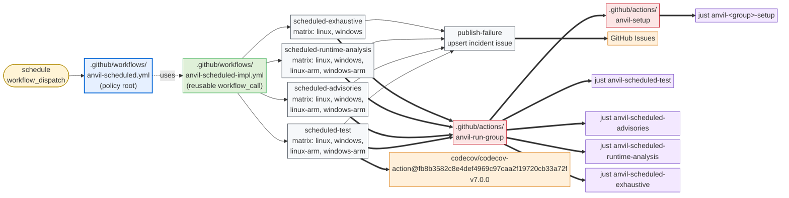

# GitHub Actions Integration

This document describes what `cargo anvil --backend github` emits for GitHub
Actions, and how a repo wires those files into its own cloud workflows.

anvil emits three layers, all owned by anvil with the standard owned-file flow (edit →
dirty → `.anvil-proposed` sibling on next update). The split is by what users actually
need to change:

1. **Root workflows** (`anvil-pr.yml`, `anvil-scheduled.yml` at `.github/workflows/`).
   Triggers, `permissions`, runner choice, any secret pass-through. anvil ships an
   opinionated default; users who need to customize edit in place and accept the
   proposal-on-update flow.
2. **Reusable workflows** (`anvil-pr-impl.yml`, `anvil-scheduled-impl.yml`), containing the
   impact jobs and the per-group jobs with all the impact-artifact upload/download
   plumbing. These change when anvil's groups or impact wiring evolve; most users won't
   ever edit them.
3. **Shared composite actions** (`.github/actions/anvil-*/`). The reusable
   workflows pass a constant group name to one `anvil-run-group` action, which
   runs setup plus the matching `just anvil-<tier>-<group>` recipe and surfaces
   the concrete failure without duplicating group membership. See
   [Failure attribution and commit statuses](#failure-attribution-and-commit-statuses).

See also:

- [README.md §6](./README.md#6-repo-layout) for the file-category model.
- [checks.md](./checks.md) for what each group runs.
- [local.md](./local.md) for the `just` recipes the composite actions invoke.
- [ado.md](./ado.md) for the ADO counterpart.

Concrete failed-recipe presentation is GitHub-specific. Azure Pipelines retains
the group stage and Just diagnostic in its logs but does not emit an equivalent
supplemental GitHub-style commit status; cross-backend parity is outside this
feature's scope.

## 1. Why three layers

- **Frequently-changing wiring** (group set, impact computation, fan-out, `needs:` graph)
  lives in the reusable workflows. Updates apply automatically; users don't have to merge
  changes.
- **Per-repo customization** (triggers, permissions, runner pool, secret scoping) lives
  in the root workflows. Users who customize them accept the cost of merging the
  `.anvil-proposed` sibling when the anvil defaults evolve — which is rare, since the
  root workflow is intentionally minimal.
- The reusable-workflow seam ([`workflow_call`][1]) is GitHub's first-class mechanism for
  exactly this: a workflow can call another workflow in the same repo, passing inputs and
  secrets. We use it so the root workflow stays small and policy-focused.

[1]: https://docs.github.com/en/actions/sharing-automations/reusing-workflows

The PR pipeline:


```mermaid
%%{init: {"flowchart": {"nodeSpacing": 10, "rankSpacing": 35, "padding": 3}, "themeVariables": {"fontSize": "16px"}}}%%
flowchart LR
    pr_evt([pull_request<br/>merge_group]):::trigger
    pr_root[".github/workflows/<br/>anvil-pr.yml<br/>(policy root)"]:::root
    pr_impl[".github/workflows/<br/>anvil-pr-impl.yml<br/>(reusable workflow_call)"]:::impl
    impact["impact-linux + impact-windows<br/>(2 jobs;<br/>outputs consumed by every group below)"]:::job
    pr_fast_job["pr-fast<br/>matrix: linux, windows,<br/>linux-arm, windows-arm"]:::job
    pr_test_job["pr-test<br/>matrix: linux, windows,<br/>linux-arm, windows-arm"]:::job
    pr_runtime_analysis_job["pr-runtime-analysis<br/>matrix: linux, windows,<br/>linux-arm, windows-arm"]:::job
    pr_mutants_job["pr-mutants<br/>matrix: linux, windows,<br/>linux-arm, windows-arm"]:::job
    impact_act[".github/actions/<br/>anvil-impact"]:::action
    setup_act[".github/actions/<br/>anvil-setup"]:::action
    run_group_act[".github/actions/<br/>anvil-run-group"]:::action
    codecov_act["codecov/codecov-action@fb8b3582c8e4def4969c97caa2f19720cb33a72f<br/>v7.0.0"]:::external
    impact_just["just anvil-impact"]:::recipe
    fast_just["just anvil-pr-fast"]:::recipe
    test_just["just anvil-pr-test"]:::recipe
    runtime_just["just anvil-pr-runtime-analysis"]:::recipe
    mutants_just["just anvil-pr-mutants"]:::recipe
    setup_just["just anvil-&lt;group&gt;-setup"]:::recipe

    pr_evt --> pr_root
    pr_root -. uses .-> pr_impl
    pr_impl --> impact
    pr_impl --> pr_fast_job
    pr_impl --> pr_test_job
    pr_impl --> pr_runtime_analysis_job
    pr_impl --> pr_mutants_job

    impact ==> impact_act
    pr_fast_job ==> run_group_act
    pr_test_job ==> run_group_act
    pr_test_job ==> codecov_act
    pr_runtime_analysis_job ==> run_group_act
    pr_mutants_job ==> run_group_act

    impact_act ==> setup_act
    impact_act ==> impact_just
    run_group_act ==> setup_act
    run_group_act ==> fast_just
    run_group_act ==> test_just
    run_group_act ==> runtime_just
    run_group_act ==> mutants_just
    setup_act ==> setup_just

    classDef trigger fill:#fff4d6,stroke:#b08800,stroke-width:1px;
    classDef root fill:#e6f0ff,stroke:#0366d6,stroke-width:2px;
    classDef impl fill:#dff0d8,stroke:#28a745,stroke-width:1px;
    classDef job fill:#f6f8fa,stroke:#586069,stroke-width:1px;
    classDef action fill:#fce5e5,stroke:#cb2431,stroke-width:1px;
    classDef external fill:#fff0db,stroke:#d97706,stroke-width:1px;
    classDef recipe fill:#f3e8ff,stroke:#6f42c1,stroke-width:1px;
```

The scheduled pipeline (same colour key):


```mermaid
%%{init: {"flowchart": {"nodeSpacing": 10, "rankSpacing": 35, "padding": 3}, "themeVariables": {"fontSize": "16px"}}}%%
flowchart LR
    sched_evt([schedule<br/>workflow_dispatch]):::trigger
    sched_root[".github/workflows/<br/>anvil-scheduled.yml<br/>(policy root)"]:::root
    sched_impl[".github/workflows/<br/>anvil-scheduled-impl.yml<br/>(reusable workflow_call)"]:::impl
    stest_job["scheduled-test<br/>matrix: linux, windows,<br/>linux-arm, windows-arm"]:::job
    sadv_job["scheduled-advisories<br/>matrix: linux, windows,<br/>linux-arm, windows-arm"]:::job
    srun_job["scheduled-runtime-analysis<br/>matrix: linux, windows,<br/>linux-arm, windows-arm"]:::job
    sexh_job["scheduled-exhaustive<br/>matrix: linux, windows"]:::job
    publish_job["publish-failure<br/>upsert incident issue"]:::job
    setup_act[".github/actions/<br/>anvil-setup"]:::action
    run_group_act[".github/actions/<br/>anvil-run-group"]:::action
    codecov_act["codecov/codecov-action@fb8b3582c8e4def4969c97caa2f19720cb33a72f<br/>v7.0.0"]:::external
    github_issues["GitHub Issues"]:::external
    stest_just["just anvil-scheduled-test"]:::recipe
    sadv_just["just anvil-scheduled-advisories"]:::recipe
    srun_just["just anvil-scheduled-runtime-analysis"]:::recipe
    sexh_just["just anvil-scheduled-exhaustive"]:::recipe
    setup_just["just anvil-&lt;group&gt;-setup"]:::recipe

    sched_evt --> sched_root
    sched_root -. uses .-> sched_impl
    sched_impl --> stest_job
    sched_impl --> sadv_job
    sched_impl --> srun_job
    sched_impl --> sexh_job
    stest_job --> publish_job
    sadv_job --> publish_job
    srun_job --> publish_job
    sexh_job --> publish_job

    stest_job ==> run_group_act
    stest_job ==> codecov_act
    sadv_job ==> run_group_act
    srun_job ==> run_group_act
    sexh_job ==> run_group_act
    publish_job ==> github_issues

    run_group_act ==> setup_act
    run_group_act ==> stest_just
    run_group_act ==> sadv_just
    run_group_act ==> srun_just
    run_group_act ==> sexh_just
    setup_act ==> setup_just

    classDef trigger fill:#fff4d6,stroke:#b08800,stroke-width:1px;
    classDef root fill:#e6f0ff,stroke:#0366d6,stroke-width:2px;
    classDef impl fill:#dff0d8,stroke:#28a745,stroke-width:1px;
    classDef job fill:#f6f8fa,stroke:#586069,stroke-width:1px;
    classDef action fill:#fce5e5,stroke:#cb2431,stroke-width:1px;
    classDef external fill:#fff0db,stroke:#d97706,stroke-width:1px;
    classDef recipe fill:#f3e8ff,stroke:#6f42c1,stroke-width:1px;
```

Every PR-tier group job declares `needs: [impact-linux, impact-windows]` so it can download the per-OS impact artifact. That fan-in is elided from the diagram to keep it readable; the scheduled tier has no such dependency because scheduled runs always operate on the full workspace.

## 2. Emitted artifacts

```text
.github/
├── actions/
│   ├── anvil-setup/action.yml         owned   (install just + group-scoped catalog tools)
│   ├── anvil-setup/just-problem-matcher.json
│   │                                  owned   (annotate failing Just recipes)
│   ├── anvil-run-group/action.yml      owned   (orchestrate any Just group)
│   ├── anvil-report-status/action.yml  owned   (publish per-job commit statuses)
│   ├── anvil-impact/action.yml        owned   (runs `just anvil-impact`, uploads impact artifact; omitted if .delta.toml disabled)
└── workflows/
    ├── anvil-pr-impl.yml              owned   (reusable workflow doing the wiring)
    ├── anvil-scheduled-impl.yml         owned   (reusable workflow for the scheduled tier)
    ├── anvil-pr.yml                   owned   (root workflow; triggers/permissions/runner)
    └── anvil-scheduled.yml              owned
```

All files are regular owned files tracked by the sidecar `.anvil.lock` manifest
(no in-file checksum line; see [updates.md §1](./updates.md#1-the-manifest)). Users
who customize the root workflow take ownership through the standard dirty-file
flow.

## 3. Root workflows

The default `anvil-pr.yml` anvil emits is the minimum needed to call the reusable
workflow:

```yaml
# .github/workflows/anvil-pr.yml
name: Anvil
on:
  pull_request: {}
  merge_group: {}
permissions:
  contents: read
jobs:
  validation:
    name: PR Job
    if: github.event_name == 'pull_request'
    uses: ./.github/workflows/anvil-pr-impl.yml
    permissions:
      contents: read
      statuses: write
      pull-requests: write
    with:
      base_ref: ${{ github.event.pull_request.base.sha }}
      publish_commit_statuses: true
    secrets: inherit
  merge-validation:
    name: PR Job
    if: github.event_name == 'merge_group'
    uses: ./.github/workflows/anvil-pr-impl.yml
    permissions:
      contents: read
    secrets: inherit
```

The two conditional callers keep the workflow name and reusable implementation
the same across events while granting write permissions only to pull-request
runs. Their internal IDs remain `validation` and `merge-validation`, while
both display names are `PR Job`. Together with the workflow display name,
GitHub renders the same user-facing `Anvil / PR Job / ...` hierarchy in the
pull-request checks UI for both event types without exposing implementation
IDs. The workflow display name is UI grouping rather than part of a check-run
name; branch protection sees contexts beginning with `PR Job / ...`.
Merge-group execution does not publish the supplemental status and never
receives `statuses: write` or `pull-requests: write`. The called PR
implementation intentionally declares no `permissions` blocks, so its jobs
inherit the selected caller's ceiling. Static job-level write requests would
make the read-only merge caller fail workflow validation before any check could
run.

The scheduled root workflow adds a schedule and `workflow_dispatch`:

```yaml
# .github/workflows/anvil-scheduled.yml
name: anvil-scheduled
on:
  schedule: [{ cron: '0 6 * * *' }]
  workflow_dispatch: {}
permissions:
  contents: read
jobs:
  anvil:
    uses: ./.github/workflows/anvil-scheduled-impl.yml
```

Common edits users make to the root workflow (these flip the file to "dirty" and produce
a `.anvil-proposed` sibling on the next `update` — see
[updates.md §5](./updates.md#5-the-decision-algorithm)):

- **Self-hosted runners**: pass `with: { linux_runner: 'self-hosted-rust', windows_runner: 'self-hosted-rust-win', linux_arm_runner: 'self-hosted-rust-arm', windows_arm_runner: 'self-hosted-rust-win-arm' }`
- **Different OS matrix scope**: not a workflow input. The matrices are part of the
  workflow's identity — adopters who want to add macOS, drop ARM, or otherwise change
  the OS axis fork the emitted `anvil-pr-impl.yml` / `anvil-scheduled-impl.yml`
  in their own repo and dirty-file-flow takes over from there. Surveyed-repo precedent
  (`oxidizer-github`, `oxidizer`) does the same.
  to the reusable workflow. The runner inputs are CSV-keyed by OS (see §4 for the
  exact contract).
- **Different OS matrix scope**: not a workflow input. The matrices are part of the
  workflow's identity — adopters who want to add macOS, drop ARM, or otherwise change
  the OS axis fork the emitted `anvil-pr-impl.yml` / `anvil-scheduled-impl.yml`
  in their own repo and dirty-file-flow takes over from there. Surveyed-repo precedent
  (`oxidizer-github`, `oxidizer`) does the same.
  (`linux`/`windows`/`macos`), not runner labels — runner labels come from the separate
  `*_runner` inputs.
- **Different schedule** for the scheduled tier.
- **Path filters** to skip the workflow on docs-only PRs (though anvil's
  `cargo delta impact` step already produces a `--skip` sentinel for the include lists
  when nothing relevant changed).

anvil ships two defaults in the root workflow that adopters typically keep but can
remove if they have specific reasons:

- `concurrency: { group: anvil-pr-${{ github.head_ref || github.ref }}, cancel-in-progress: true }`
  on `anvil-pr.yml`. Prevents two anvil runs from racing on the same PR
  branch — the newer push cancels the older. Removing it costs cloud workflows minutes but
  is otherwise harmless.
- `secrets: inherit` on the `anvil:` job. Forwards the calling repo's
  secrets (notably `CODECOV_TOKEN`) into the reusable workflow without each
  adopter having to enumerate them. Removing it disables Codecov uploads
  for private repos but doesn't affect anything else.

## 4. Owned reusable workflows

`anvil-pr-impl.yml` is where the wiring lives. Every per-group job downloads the per-OS
impact artifact into `target/anvil/impact/`, then invokes the shared `anvil-run-group`
action in `consume` mode; which tiers a group's checks actually consume from that cache
is the catalog's concern, not the wiring layer's. Moving a check between groups never
changes the reusable workflow.

Approximate shape (anvil writes this verbatim; users never edit it):

```yaml
# .github/workflows/anvil-pr-impl.yml   (owned by cargo-anvil)
on:
  workflow_call:
    inputs:
      linux_runner:       { type: string, default: ubuntu-latest }
      windows_runner:     { type: string, default: windows-latest }
      linux_arm_runner:   { type: string, default: ubuntu-24.04-arm }
      windows_arm_runner: { type: string, default: windows-11-arm }

jobs:
  # Impact runs per OS family (see §6.1): a downstream leg consumes the
  # impact set computed on ITS host, so an OS-conditional dep change is never
  # scoped out. Each job UPLOADS its target/anvil/impact cache as an artifact;
  # the two arm legs reuse their OS counterpart's artifact.
  impact-linux:
    runs-on: ${{ inputs.linux_runner }}
    steps:
      - uses: actions/checkout
        with: { fetch-depth: 0 }
      - uses: ./.github/actions/anvil-impact   # runs `just anvil-impact` + upload-artifact anvil-impact-Linux
  impact-windows:
    runs-on: ${{ inputs.windows_runner }}
    steps:
      - uses: actions/checkout@v4
        with: { fetch-depth: 0 }
      - uses: ./.github/actions/anvil-impact   # uploads anvil-impact-Windows

  pr-fast:
    name: "Check Group: Fast Checks (${{ matrix.os }})"
    needs: [impact-linux, impact-windows]
    strategy:
      fail-fast: false
      matrix:
        os: [linux, windows, linux-arm, windows-arm]
    runs-on: ${{ matrix.os == 'linux' && inputs.linux_runner
      || matrix.os == 'windows' && inputs.windows_runner
      || matrix.os == 'linux-arm' && inputs.linux_arm_runner
      || inputs.windows_arm_runner }}
    steps:
      - uses: actions/checkout
        with: { fetch-depth: 0 }  # semver-check needs origin/<base> resolvable for --baseline-rev
      # Download the impact cache computed on this leg's OS into
      # target/anvil/impact/ (arm reuses its OS-family artifact). pr-test /
      # pr-runtime-analysis / pr-mutants do the identical download.
      - uses: actions/download-artifact@v4
        with:
          name: anvil-impact-${{ startsWith(matrix.os, 'linux') && 'Linux' || 'Windows' }}
          path: target/anvil/impact
      - uses: ./.github/actions/anvil-run-group
        with:
          group: pr-fast
          impact_mode: consume   # scoped checks read the downloaded cache
        env:
          PR_TITLE: ${{ github.event.pull_request.title }}

  pr-test:
    name: "Check Group: Tests and Coverage (${{ matrix.os }})"
    # Tests + coverage: llvm-cov, doc-test, examples. Coverage upload
    # is gated to the canonical x86_64 Linux leg (omitted here for brevity).
    needs: [impact-linux, impact-windows]
    strategy:
      fail-fast: false
      matrix:
        os: [linux, windows, linux-arm, windows-arm]
    runs-on: ${{ matrix.os == 'linux' && inputs.linux_runner
      || matrix.os == 'windows' && inputs.windows_runner
      || matrix.os == 'linux-arm' && inputs.linux_arm_runner
      || inputs.windows_arm_runner }}
    steps:
      - uses: actions/checkout
      # preceded by the same per-OS download-artifact step as pr-fast
      - uses: actions/download-artifact@v4
        with:
          name: anvil-impact-${{ startsWith(matrix.os, 'linux') && 'Linux' || 'Windows' }}
          path: target/anvil/impact
      - uses: ./.github/actions/anvil-run-group
        with:
          group: pr-test
          impact_mode: consume
          free-disk-space: true

  # pr-runtime-analysis (miri + careful) and pr-mutants (mutants) follow the same
  # shape; pr-mutants additionally sets `env: BASE_REF` for diff-scoped
  # cargo-mutants, and the anvil-mutants-diff recipe self-skips on
  # aarch64-pc-windows-msvc (where cargo-mutants doesn't build).
```

Every multi-OS job hardcodes its OS axis as an inline YAML array. Per-leg runner
*labels* are inputs (so adopters can swap in self-hosted runners), but the OS axis
itself is part of the workflow's identity. Adopters who need a different shape (add
macOS, drop ARM, mix in exotic targets) fork the reusable workflow and let
dirty-file-flow take over. The previously-considered `fromJSON(inputs.X)` pattern
was rejected because it added a silent failure mode (mis-formatted inputs produced
empty matrices that GitHub Actions silently treats as "no legs to run") without
meaningfully expanding what adopters could customize — anyone who wants to change
the OS axis is almost certainly making other changes too.

The pr-* jobs gate on the impact jobs *succeeding*: their `needs: [impact-linux,
impact-windows]` uses GitHub's default behavior, so if an impact job fails the pr-*
jobs are skipped and the run fails at impact (we add no `if: always()` / `if:
!cancelled()` override that would let them run anyway). This keeps a broken impact a
blocking failure rather than leaving the run green with a lone red impact job.

The wiring never branches on impact's *output values*, though. When impact succeeds,
each group always runs; recipes inside the group decide whether a given check no-ops,
by testing for the literal sentinel `--skip` in the relevant include var. This matters
because unscoped checks (`deny`, `audit`, `aprz`, `pr-title`, `mutants-full`)
must run on every PR, including docs-only PRs where every tier comes back `--skip`. See
[local.md §4](./local.md#4-impact-scoping-via-the-anvil-impact-recipe) for the recipe-side
contract.

The scheduled reusable workflow is simpler — it omits the `impact` job and runs each group
full-workspace. Scheduled group jobs receive no `include_*` inputs at all; instead each
scheduled composite action hardcodes `ANVIL_IMPACT=off` in its run step, so `anvil-impact`
no-ops and every tier resolves to its full-workspace default (`--workspace`). The following
is deliberately a non-executable schematic; the generated
[`scheduled-impl-workflow.yml`](../../templates/github/scheduled-impl-workflow.yml)
is the canonical YAML:

```text
caller anvil-scheduled.yml
  permissions upper bound: contents:read + issues:write
  └─ called anvil-scheduled-impl.yml
       default reset: contents:read
       ├─ scheduled-test             (Linux/Windows × x64/ARM64)
       ├─ scheduled-advisories       (Linux/Windows × x64/ARM64)
       ├─ scheduled-runtime-analysis (Linux/Windows × x64/ARM64)
       ├─ scheduled-exhaustive       (Linux/Windows x64)
       └─ publish-failure
            needs: all four scheduled groups
            condition: at least one failure and publication not disabled
            job override: issues:write only
```

Every scheduled group invokes the shared `anvil-run-group` action. Those invocations
pass no `impact_mode`, so the executor's default (`off`) exports `ANVIL_IMPACT=off`,
which makes `anvil-impact` a no-op and every tier resolves to its `--workspace` default.
Impact scoping is purely a PR-tier optimization; the scheduled tier never benefits.

Cloud impact explicitly loads the repository's `.delta.toml`, including the managed
trip-wire patterns and any repository-owned parser, exclusion, or fixed comparison-
branch settings. Existing repositories that already define top-level
`trip_wire_patterns` retain that policy and receive an empty managed-region opt-out.

The reusable workflow declares a small input set so the root workflow can pass overrides:

| Input                | Type   | Default              | Meaning                                                |
|----------------------|--------|----------------------|--------------------------------------------------------|
| `linux_runner`       | string | `ubuntu-latest`      | Runner label for x86_64 Linux jobs and the single-leg `impact` job. |
| `windows_runner`     | string | `windows-latest`     | Runner label for x86_64 Windows jobs.                  |
| `linux_arm_runner`   | string | `ubuntu-24.04-arm`   | Runner label for aarch64 Linux jobs.                   |
| `windows_arm_runner` | string | `windows-11-arm`     | Runner label for aarch64 Windows jobs.                 |

The input surface is intentionally narrow: only per-leg *runner labels* are exposed,
because swapping in self-hosted runners is the one common need that doesn't require
otherwise touching the workflow. The OS matrix shape (which legs run) is fixed in the
workflow source — see the discussion under the PR snippet above.

The reusable workflows also declare an optional `workflow_call` secret
`CODECOV_TOKEN`. See §10 (Coverage upload) for how it's used.

We deliberately keep this input surface minimal. Anything more elaborate (e.g.
per-job runner overrides) lives in the user's own workflow, which can compose its own
`uses:`-of-reusable-workflow shape.

## 5. Shared group composite action

Anvil emits one `anvil-run-group` action, used by every group job in both
reusable workflows. The group name is data, not an emitted action path. This
keeps setup, output capture, failed-recipe extraction, status publication, and
failure propagation in one file in every adopting repository.

The action's impact input surface is a single `impact_mode` toggle (`consume`
for PR groups, `off` — the default — for scheduled groups). The impact *set* is
never threaded as `--package` inputs: it is shared as a downloaded artifact
(§6.1). The reusable workflow downloads `anvil-impact-<os>` into
`target/anvil/impact/` before invoking the action, and the group's scoped checks
read that cache directly via their `anvil-impact` dependency — the same code
path as a local run. The action's other inputs are the disk-cleanup switch
(`free-disk-space`), the status-publication switch (`publish_commit_statuses`),
and the PR-context strings a check needs (passed as environment variables by the
reusable workflow). Moving a check between groups or buckets remains a pure
catalog change.

```yaml
# .github/actions/anvil-run-group/action.yml  (owned)
name: anvil-run-group
description: Run an Anvil Just group and report its result.
inputs:
  group:
    description: Anvil group recipe name without the anvil- prefix.
    required: true
  impact_mode:
    description: |
      Impact-scoping mode exported as ANVIL_IMPACT before the group runs.
      "consume" (PR groups) trusts the impact cache the caller downloaded
      into target/anvil/impact/; "off" (scheduled groups, the default) runs
      every tier full-workspace. Fixed by tier at the call site.
    required: false
    default: "off"
  free-disk-space:
    description: Remove unused toolchains from GitHub-hosted runners before setup.
    required: false
    default: "false"
  publish_commit_statuses:
    description: Manage supplemental failure commit statuses for eligible PRs.
    required: false
    default: "false"
runs:
  using: composite
  steps:
    - id: setup
      uses: ./.github/actions/anvil-setup
      with:
        group: ${{ inputs.group }}
        free-disk-space: ${{ inputs.free-disk-space }}
    - id: run
      if: steps.setup.outcome == 'success'
      shell: bash
      env:
        ANVIL_GROUP: ${{ inputs.group }}
        # The impact set reaches scoped checks through the downloaded
        # target/anvil/impact cache (read via `_anvil-impact-include`), not
        # threaded --package strings. This action only fixes the mode.
        ANVIL_IMPACT: ${{ inputs.impact_mode }}
        GITHUB_TOKEN: ${{ github.token }}
      run: |
        log="$RUNNER_TEMP/anvil-$ANVIL_GROUP.log"
        set +e
        just "anvil-$ANVIL_GROUP" 2>&1 | tee "$log"
        status=${PIPESTATUS[0]}
        set -e
        failed_recipe="$(sed -n 's/^error: recipe `\([^`]*\)` failed\( on line [0-9][0-9]*\)\{0,1\} with exit code [0-9][0-9]*$/\1/p' "$log" | tail -n 1)"
        echo "failed_recipe=${failed_recipe:-anvil-$ANVIL_GROUP}" >> "$GITHUB_OUTPUT"
        echo "exit_code=$status" >> "$GITHUB_OUTPUT"
        exit "$status"
    - name: Publish supplemental Anvil commit status
      if: always() && inputs.publish_commit_statuses == 'true' && github.event_name == 'pull_request' && github.event.pull_request.head.repo.full_name == github.repository
      continue-on-error: true
      uses: ./.github/actions/anvil-report-status
      with:
        group: ${{ inputs.group }}
        setup_outcome: ${{ steps.setup.outcome }}
        exit_code: ${{ steps.run.outputs.exit_code }}
        failed_recipe: ${{ steps.run.outputs.failed_recipe }}
```

Input set on the shared group action:

| Input              | Default   | Notes                                                                                                                                  |
|--------------------|-----------|----------------------------------------------------------------------------------------------------------------------------------------|
| `group`            | required  | Group recipe suffix, such as `pr-fast` or `scheduled-test`.                                                                           |
| `impact_mode`      | `"off"`   | Exported as `ANVIL_IMPACT`. `consume` (PR groups) trusts the downloaded `target/anvil/impact` cache; `off` (scheduled groups) runs every tier full-workspace. |
| `free-disk-space`  | `"false"` | Forwarded to `anvil-setup`; ignored on macOS and self-hosted runners.                                                               |
| `publish_commit_statuses` | `"false"` | Best-effort management of supplemental failure commit statuses for same-repository pull requests. Requires `statuses: write`; clean runs only supersede prior failures. |

Generated workflows pass constant catalog group names. Both `anvil-run-group`
and `anvil-setup` carry the value through an `ANVIL_GROUP` environment
variable and quote the composed recipe name; they do not interpolate an action
input directly into shell source. The nested `anvil-setup` action rejects group
names outside `[a-z0-9-]+`; `anvil-run-group` invokes Just only when that setup
step succeeds, so validation necessarily precedes use of the value in the log
path and recipe name.

The reusable workflow sets `PR_TITLE` on the `pr-fast` group step and
`BASE_REF` on the `pr-mutants` group step. They are environment variables rather
than action inputs because only the recipes consume them.

The recipes themselves consume the downloaded impact cache (via
`_anvil-impact-include`) and only the PR-context env vars they need; the catalog
records the tier mapping (see
[checks.md §5](./checks.md#5-impact-scoping-check--include-mapping)).
Fixing only the mode (`consume`/`off`) at each group-action invocation, rather
than threading per-tier `--package` strings, keeps the right separation: wiring
is about "which jobs depend on impact and feed it forward", not about "which
check needs which env var."

The shared action is an implementation detail of Anvil's generated reusable
workflows. Anvil does not emit or support public per-group action paths.

### Failure attribution and commit statuses

GitHub fixes workflow job names before a job runs, so a matrix check named
`PR Job / Check Group: Fast Checks (linux)` cannot rename itself after
discovering that `anvil-license-headers` failed. The checks UI groups that name
under the `Anvil` workflow. Anvil instead presents the concrete failure through
the following mechanisms, all driven by Just's existing terminal diagnostic:

1. The problem matcher registered by `anvil-setup` promotes
   ``error: recipe `anvil-license-headers` failed with exit code 1`` to a
   GitHub annotation.
2. The `Run Anvil group` step itself returns Just's exit status after recording
   the recipe name and exit code for supplemental reporting. The failed step is
   therefore the step containing the complete, live recipe output; no
   synthetic failure step can displace or truncate the underlying diagnostic.
3. On eligible pull requests, `anvil-report-status` publishes a commit status
   whose reserved context namespace names the failed recipe and runner:

   ```text
   Anvil / license-headers [pr-fast] (linux-x64)
   ```

The group action streams normal Just output, captures the terminal failed
recipe, writes its outputs, and returns Just's status from that same step.
Subsequent reporting uses `always()` and is supplemental and best-effort, so it
still runs after a recipe failure without replacing the authoritative failed
step. The reporter neither invokes checks nor contains group membership.
Internal capture, parsing, status reconciliation, and test-harness details are
documented in the
[implementation guide](../implementation.md#github-group-execution-and-status-reporting).

When `publish_commit_statuses` is enabled, the shared reporter manages statuses
with:

| Field | Value |
|-------|-------|
| Commit | `github.event.pull_request.head.sha` |
| Failure context | `Anvil / <recipe> [<group>] (<runner>)` |
| State after setup failure | `error` |
| State after recipe failure | `failure` |
| Fresh success | No supplemental status |
| Superseded failure | `success` with a superseded description |
| Failure description | `<failed-recipe-without-anvil-prefix> failed` |
| Setup description | `setup failed before <group> ran` |
| Target URL | The originating GitHub Actions workflow run |

The runner suffix is derived from `RUNNER_OS` and `RUNNER_ARCH`, producing
values such as `linux-x64` and `windows-arm64`. The group segment prevents two
groups that reach the same recipe on the same runner from sharing a persistent
status identity. Contexts are limited to 100 characters by truncating only the
recipe portion.
When Just reports an `anvil-` recipe, the reporter removes that conventional
prefix from the context and description to keep the limited inline text
concise.

The concise `Anvil / <recipe>` context puts the failed check name immediately
after the product name. In GitHub's current alphabetical PR-check rendering it
also places typical check names before `PR Job / Check Group: ...`.
This is a presentation hint, not a correctness dependency: GitHub does not
document the ordering as a stable contract.

Cleanup runs after the group result is known. Keeping the old failure visible
while a rerun is pending avoids a temporary green result. On failure the
reporter publishes the current dynamic context before superseding another
failure from the same group and runner. On success it supersedes active prior
failures and creates no fresh supplemental row.

GitHub does not allow commit-status deletion. Superseded contexts therefore
remain as green historical rows with a description explaining that a later run
replaced them. The native workflow job remains the stable, authoritative
required check; supplemental statuses are presentation only. Each new commit
has its own status set, so discovery and supersession matter only for reruns of
the same commit.

Dynamic contexts are permanent repository metadata: every distinct
`Anvil / <recipe> [<group>] (<runner>)` context that is published can continue to appear
in GitHub's required-check picker even after it has been superseded. Repositories
must not configure these supplemental contexts as required checks. The bounded
native `PR Job / Check Group: ...` jobs are the only branch-protection
surface. Status cleanup is a best-effort, non-atomic operation; concurrent
reruns can temporarily race, but their native jobs remain authoritative.
Supplemental contexts must not be required, so a stale presentation row cannot
block correctly configured branch protection.

The reporter runs under `always()` and receives the setup outcome as well as
the Just outputs. A setup failure can therefore publish an `error` description
even though the group recipe never ran. Cancellation may prevent final steps
from running; the native GitHub Actions job remains the authoritative required
check in that case. The reporter validates that its event payload contains a
pull-request head SHA and fails with an explicit precondition error if it is
invoked directly from an unsupported event.

The reusable workflow input defaults to `false`. The generated pull-request
caller opts in and grants `statuses: write`; a customized root that has not
accepted the permission continues without supplemental statuses. Publication
is guarded to same-repository `pull_request` events. Fork PR tokens are
read-only, so forks retain the annotation and dynamically named step but skip
the status call.

Merge-group runs use a separate conditional caller with only `contents: read`.
Both conditional callers have the display name `PR Job`, so their called jobs
produce identical required-check contexts on pull-request and merge-group
commits even though their internal IDs and permissions differ. Merge-group runs
retain the normal Anvil jobs, annotations, and dynamically named steps but do
not publish supplemental statuses. This avoids exposing a write-capable token
while executing a synthetic merge that may contain fork-originated code, and
avoids redundant statuses on ephemeral merge-group commits.

Branch protection and rulesets must select the bounded
`PR Job / Check Group: <display name> (<platform>)` contexts. Pull-request and
merge-queue runs intentionally emit the same contexts, so one required-check
configuration applies to both event types. Supplemental
`Anvil / <recipe> [<group>] (<runner>)` statuses must never be selected.

Commit statuses are intentionally preferred over custom Check Runs for this
contract. GitHub Actions has no native workflow field for the inline status
description, so one REST call is still required. Check Runs provide richer
Markdown and annotations that this feature does not need, require more
lifecycle logic for dynamic names, and—when created with `GITHUB_TOKEN`—can be
placed in an unrelated GitHub Actions check suite such as Advanced CodeQL.
Commit statuses provide the required prominent name, inline description,
result, and log link without check-suite attribution.

### `anvil-setup`

`anvil-setup` is a composite action that installs `just`
(`cargo install just --locked`) and then invokes the catalog setup recipes. Its
`group` input controls which recipes run:

- empty (default): runs `just anvil-setup binstall` -- the full catalog. Use
  for local "give me everything" flows.
- `none`: skips the catalog setup entirely. Used by `anvil-impact`, which only
  needs `cargo-delta` and installs it itself afterwards.
- any other value (e.g. `pr-fast`, `scheduled-advisories`): runs
  `just anvil-<group>-setup binstall` -- only the tools, components, and
  toolchains that group actually needs. Ordinary group names contain only
  lowercase letters, digits, and hyphens. `anvil-run-group` passes its group
  input here, so a `pr-fast` matrix leg never installs cargo-mutants.

Before invoking Just, the action registers the generated
`just-problem-matcher.json`. Just already prints the exact failed dependency
recipe (for example, ``error: recipe `anvil-license-headers` failed with exit
code 1``), but GitHub otherwise exposes only its generic process-exit
annotation. The matcher promotes that existing diagnostic without wrapping
Just, parsing its output in a custom runner, or repeating group membership
in the action.

The action does not install Rust; it expects `cargo` on PATH (see §7).
`anvil-impact` is described in §6 below.

Its optional `free-disk-space` input defaults to `false`. When enabled on a
GitHub-hosted runner, it removes pre-installed toolchains that anvil's Rust checks do
not use: Android, Haskell/GHC, Swift and browser drivers on Linux; Android and
Haskell/GHC on Windows. This reclaims approximately 18 GB on Linux and 17 GB on
Windows. It is a no-op on macOS and self-hosted runners. The generated reusable 
workflows explicitly enable this input only for `pr-test` and `scheduled-test`, 
mirroring the testing-job integration in [microsoft/oxidizer#583](https://github.com/microsoft/oxidizer/pull/583).
Other groups retain the action's disabled default.

## 6. Impact scoping

`.github/actions/anvil-impact/action.yml` is a composite action that runs the shared
`anvil-impact` recipe — the same impact building block adopters run locally (see
[local.md §4](./local.md#4-impact-scoping-via-the-anvil-impact-recipe)). It:

1. `./.github/actions/anvil-setup` with `group: none` (bootstrap rust + just +
   cache; no catalog tools).
2. `just anvil-tool-cargo-delta-install binstall` -- the only tool this composite
   needs. **This is the only job that runs cargo-delta to compute the impact
   set.** (Group setup jobs also install cargo-delta as a prerequisite, but in
   `consume` mode they never run it -- they read the downloaded impact cache.)
3. `just anvil-impact`, which resolves the base ref (`_anvil-base-ref`), snapshots the
   base ref (in a throwaway worktree) and the working tree, runs
   `cargo delta impact`, and writes the durable cache under `target/anvil/impact/`:
   the per-tier `include_<tier>.txt` lists (via `_anvil-impact-format`), `impact.json`,
   and the `snapshots/`.
4. Uploads that whole directory as the `anvil-impact-<runner.os>` artifact
   (`actions/upload-artifact`).

### 6.1 How the impact result propagates to the group jobs

The impact set propagates as an **uploaded workflow artifact** — the entire
`target/anvil/impact/` cache — not as job outputs or environment variables. Each group
job **downloads** it and its scoped checks read the cache directly, exactly as a local
run does: this is the whole point — CI and local execution take the identical code
path (`anvil-impact` → `include_<tier>.txt` → `_anvil-impact-include`), rather than CI
threading pre-formatted strings that local runs never see. The chain in
`anvil-pr-impl.yml`:

1. **Two impact jobs**, `impact-linux` and `impact-windows`, each run the
   `anvil-impact` action, which uploads an `anvil-impact-Linux` / `anvil-impact-Windows`
   artifact. Impact is computed per OS *family* because an OS-conditional dependency
   (`[target.'cfg(target_os = …)'.dependencies]`) changes the reverse-dep set only in
   that host's `cargo metadata` graph, so a single-OS computation could scope out a
   cross-OS reverse-dependency; the two arm legs reuse their OS-family counterpart's artifact.
2. **Every group job** declares `needs: [impact-linux, impact-windows]` and, after
   checkout, downloads the matching leg's artifact into `target/anvil/impact/`,
   selecting by matrix OS — e.g.
   `name: anvil-impact-${{ startsWith(matrix.os, 'linux') && 'Linux' || 'Windows' }}`.
3. **The group composite action** (`group-action.yml`) runs `just anvil-<group>` with an
   impact mode fixed **by group class at emit time** (never probed from a file). PR groups —
   which always download the artifact — export `ANVIL_IMPACT=consume`. In consume mode
   `anvil-impact` is a pure no-op — it trusts the downloaded cache verbatim and
   **neither snapshots nor recomputes**, so it needs neither cargo-delta nor a fetched
   base ref (a group job installs the former and shallow-checks-out without the latter).
   Each scoped check then reads its category's scope from
   `target/anvil/impact/include_<tier>.txt` via `_anvil-impact-include` (into a local
   `$include` variable). This is why the group jobs stay lean and can't be tripped up by
   an environmental difference from the impact job.
4. **Scheduled group jobs download nothing** and always validate the full workspace, so
   their group action exports `ANVIL_IMPACT=off`. Like the PR `consume`, this is fixed by
   group class at emit time and is **not** derived from `target/anvil/impact/impact.state`: the
   mode is a property of the group class, not something probed at runtime. (`anvil-setup` no
   longer caches `target/` at all — see §setup — so the durable `impact.state` never
   travels through the build cache; the group-class-fixed mode also means no leftover on-disk
   state could ever flip a scheduled job into impact scoping and skip the full-workspace
   backstop.)

The wiring never gates jobs on the impact result — every job runs regardless of `--skip`
status. This is intentional: unscoped checks (`deny`, `audit`, `aprz`, `pr-title`,
`mutants-full`) must run on every PR even when every tier reports `--skip`. Steps that
need a per-tier side decision read the downloaded cache file directly (e.g. the Codecov
upload is gated on both coverage files existing via `hashFiles(...)`), never on a job
output.


The check → bucket mapping is in
[checks.md §5](./checks.md#5-impact-scoping-check--include-mapping).

## 7. Rust toolchain

anvil does not install Rust on GitHub. The composite actions assume `cargo` is on PATH.
GH-hosted runners ship with a recent stable Rust and `rustup` pre-installed; if your
`rust-toolchain.toml` pins a different channel, the first `cargo` invocation in a job
triggers `rustup` to download the pinned toolchain. For a published stable channel this
typically takes 10–30 seconds on Linux (somewhat longer on Windows and longer still for
nightly with components). The auto-install runs once per job and is not cached across
jobs by anvil — `~/.rustup` has high invalidation churn and the install cost is small
relative to the cached cargo registry / tool paths (§8). Repos that want to skip
even this per-job overhead can add their own toolchain-install step (e.g.
`dtolnay/rust-toolchain@stable`) before the anvil composite action runs.

On self-hosted runners or pre-baked images without rustup, the user adds a Rust install
step to their root workflow before the `uses:` of the reusable workflow:

```yaml
jobs:
  anvil:
    uses: ./.github/workflows/anvil-pr-impl.yml
    # Self-hosted? Add a setup workflow that runs first and uploads
    # toolchain to a shared cache, then reference it here.
```

Since reusable workflows cannot accept a "previous step" handoff, self-hosted
users that need additional preparation take ownership of the generated reusable
implementation workflow and add the preparation there. The generated composite
actions remain implementation details rather than a separately supported API.

`anvil-tool-rustc-validate-prereqs` (depended on by every check that needs rustc)
validates the installed `rustc` against the catalog minimum at recipe time; a
below-minimum `rustc` produces a clean failure message.

## 8. Caching

The `anvil-setup` composite action computes a cache key from runner OS and
architecture, the actual `rustc --version`, hashes of `Cargo.lock`,
`.cargo/config.toml`, `rust-toolchain.toml`, and `versions.just`, plus the workflow
job ID. Job discrimination prevents concurrent jobs from racing to save one key;
prefix restore keys still share prior installs across jobs.

The cache covers:

- The `cargo install`-ed tools installed by the catalog setup recipes (`~/.cargo/bin/`
  plus the `.crates.toml` / `.crates2.json` install ledgers) and the downloaded crate
  registry (`~/.cargo/registry/`). The key includes `${{ github.job }}`, so a `pr-test`
  cache hit doesn't have to wait on a `pr-fast` cache miss.

The `target/` build directory is deliberately **not** cached. A per-job, per-OS, per-arch
`target/` is large, and the many multi-GB entries would evict the high-value tool caches
under the Actions 10 GB per-repo cache limit (LRU) — so caching it is a net loss here,
with only modest dependency-recompile savings on top of the already-cached tools. Keeping
`target/` out of the cache also means the impact stage's downloaded `target/anvil/impact/`
artifact can never be clobbered by a `target/` cache restore.

Because dependency artifacts aren't cached, the impl workflows set `CARGO_INCREMENTAL=0`
(workflow-level `env:`): each job compiles from scratch anyway, and cargo's incremental
mode only adds overhead (and a multi-GB `target/debug/incremental/` dir) with no cross-run
benefit in that setting.

## 9. Security

The setup action uses `sudo rm -rf` only when `free-disk-space` is explicitly enabled
and the runner reports `runner.environment == 'github-hosted'`. It never performs disk
cleanup on self-hosted runners. Other composite-action steps install tools and invoke
`just`. The reusable workflow propagates only what the root workflow passes (and only
the inputs explicitly declared).

Recommended root workflow shape:

- `permissions: contents: read` at the workflow level. anvil's default ships with
  this.
- The pull-request reusable-workflow call grants `pull-requests: write` for
  advisory comments and `statuses: write` for opt-in supplemental commit statuses. The
  shared called workflow declares no permission overrides and inherits that
  caller ceiling. This gives its impact jobs the same scopes on trusted
  same-repository PR runs; the tradeoff avoids duplicating the implementation
  workflow while allowing the separate merge-group caller to remain read-only.
- The merge-group caller grants only `contents: read`; it cannot publish
  comments or statuses. Because the called workflow does not statically request
  write scopes, GitHub accepts and runs it under that ceiling.
- Status publishing is guarded to same-repository `pull_request` events. Fork
  PR tokens are read-only and never reach the status API step.
- The scheduled reusable-workflow call grants `issues: write` at job scope so its
  publisher can create or comment on the failure issue. The called workflow resets its
  default permissions to `contents: read`, then restores `issues: write` only on the
  publishing job. That job-level map omits `contents`, so the publisher cannot read
  repository contents; scheduled check jobs retain read-only access. The PR workflow
  never receives this permission.
- Scheduled-tier secrets, if any, live on `anvil-scheduled.yml` only — never on `anvil-pr.yml`.
- All cargo-tool installs done by the catalog setup recipes use `--locked` (with
  `cargo install` or `cargo binstall` depending on `installer`).

### Action pinning

Third-party actions are pinned in one of two ways, and the split is deliberate rather
than inconsistent.

Actions whose publisher has enabled GitHub [immutable releases][immutable] are pinned
by tag. In the generated workflows that is, at the time of writing,
`codecov/codecov-action@v7.0.0`, `marocchino/sticky-pull-request-comment@v3.0.5` and
`cargo-bins/cargo-binstall@v1.21.0`; a repository's own hand-maintained workflows apply
the same rule to the actions they use, so the list a reader sees there may be longer.
An immutable release locks its Git tag to one commit: the tag cannot be moved, and
cannot be deleted while the release exists. The tag name cannot be reused even after
the repository is deleted and recreated, and publishing generates a release
attestation covering the tag, commit SHA and assets. The tag is a stable identifier
under those rules, and unlike a SHA it stays readable in the diff when the pin is
bumped. Generated files carry a
`# immutable release, the tag cannot be moved` comment at each such pin, so the reason
a tag appears where a SHA is otherwise expected is visible at the use site.

Every other action is pinned by commit SHA with the version in a trailing comment, for
example `actions/checkout@3d3c42e5aac5ba805825da76410c181273ba90b1 # v7.0.1`.

Immutability is a property of one published release, not a standing guarantee about
the publisher. When bumping a tag-pinned action, confirm the new release still reports
it:

```console
$ gh api repos/codecov/codecov-action/releases/tags/v7.0.0 --jq .immutable
true
```

If that returns `false`, or the release is missing, pin the commit SHA instead.

[immutable]: https://docs.github.com/en/code-security/concepts/supply-chain-security/immutable-releases

## 10. Coverage upload

After `pr-test` (and `scheduled-test`) runs the `anvil-llvm-cov` recipe, the reusable
workflow uploads the resulting coverage files to Codecov from every leg of the matrix
except `windows-11-arm`. The upload condition uses `always()` plus a file-existence
guard: completed coverage reports are retained even when the coverage gate or a later
group recipe fails, while failures before both the all-features
(`lcov-all-features.info`) and no-default-features (`lcov-no-default.info`)
configurations complete do not trigger an empty or partial upload. The windows-arm leg is excluded because its
LLVM-coverage instrumentation produces `malformed instrumentation profile data: symbol
name is empty` errors that make the profile unusable. Coverage from every other leg is
necessary because OS/arch-gated code (`cfg(target_os = ...)`, `cfg(target_arch = ...)`)
is only exercised on its native target, so a single-leg upload would systematically
under-report the coverage of those branches. Codecov coalesces multiple uploads against
the same commit; we pass `flags: ${{ matrix.os }}` so each per-leg slice is also
queryable individually in the Codecov UI.

The upload step:

```yaml
- name: Upload coverage to Codecov
  if: always() && matrix.os != 'windows-arm' && hashFiles('target/coverage/lcov-all-features.info') != '' && hashFiles('target/coverage/lcov-no-default.info') != ''
  uses: codecov/codecov-action@v7.0.0 # immutable release, the tag cannot be moved
  with:
    files: target/coverage/lcov-all-features.info,target/coverage/lcov-no-default.info
    flags: ${{ matrix.os }}
    token: ${{ secrets.CODECOV_TOKEN }}
    fail_ci_if_error: false
```

The reusable workflow declares `CODECOV_TOKEN` as an optional `workflow_call` secret;
the root workflow's default `secrets: inherit` (see §3) forwards it without each adopter
having to enumerate. Public repos with Codecov OIDC trust configured need no token at
all; private repos set `CODECOV_TOKEN` at the repo level. `fail_ci_if_error: false`
keeps the build green when Codecov is unreachable (typical for internal repos that
can't reach `codecov.io`).

The scheduled upload has the same `always()` and file-existence semantics. It
additionally combines the OS flag with a `scheduled` marker
(`flags: scheduled,${{ matrix.os }}`) so PR vs scheduled streams stay distinguishable
in the Codecov UI while still being queryable per-OS.

anvil does not gate the PR on coverage. The lcov upload is informational; Codecov's
own status check is the gating layer when the adopter wants one (configured in Codecov,
visible as a separate required check in branch protection).

## 11. Scheduled failure issues

The GitHub scheduled reusable workflow publishes a failure as a repository issue by
default. The publisher depends on every scheduled group and uses `always()` so it can
inspect their terminal results even when one or more groups fail. It runs only when at
least one result is `failure`; successful, skipped, and cancelled runs do not create
issues.

The issue title is `[Anvil] Scheduled checks failed`, while the stable hidden marker
`<!-- anvil scheduled failure -->` identifies the repository's shared scheduled-failure
incident. Anvil and any legacy scheduled publisher that adopts this identity converge on
the same open issue. Each publisher makes one repository-scoped Search API request for
open issues whose bodies match the marker terms, then verifies the exact marker
client-side:

- If none exists, it creates one containing the failed group names and a link to the
  workflow run.
- If one exists, it adds the new failure details as a comment instead of creating a
  duplicate.

This is a bounded best-effort upsert, not a singleton guarantee. One Search request is
the selected boundary because a scheduled failure should spend a fixed, minimal amount
of API quota instead of paginating through repository issues; the marker is expected to
match at most one open incident. GitHub's search index is eventually consistent and the
request considers at most 100 results, so closely overlapping failures can occasionally
create duplicate incident issues. Marker-based identity prevents a human-authored issue
with the same title from being reused and survives a maintainer renaming an incident.

No label is required because repositories can remove or rename their default labels.
Here, "open incident" means an open marker-owned issue, not an automatically tracked
failure state. Successful runs do not close or update it. The issue remains open until a
maintainer resolves the underlying failure and closes it; a later failure after closure
creates a new incident issue.

This repository's legacy nightly mutation workflow intentionally uses the same title and
marker. Its mutation configuration remains distinct from Anvil's exhaustive group, but
an overlapping failure updates the same durable incident instead of creating a second
notification owner and a duplicate Teams post.

The publisher uses the workflow's short-lived `GITHUB_TOKEN`. The scheduled root call
allows `issues: write`, while the reusable workflow defaults to `contents: read` and
grants `issues: write` only to the publishing job. Scheduled check jobs therefore retain
read-only access. The publisher's job-level permission map omits `contents`, so it cannot
read repository contents, and it does not forward logs or environment data into the
issue. This narrow GitHub-native path also lets GitHub's Teams app relay issue
notifications without an external webhook or additional secret.

The generated root and implementation workflows must be updated together. A repository
that has taken ownership of the root workflow must retain `issues: write` on the reusable
workflow call (or apply the generated `.anvil-proposed` update) when adopting this job.
Repositories with Issues disabled cannot publish failure incidents. Missing permission or
disabled Issues deliberately fails the publishing job rather than silently losing the
notification; the original failing scheduled jobs remain visible alongside that error.

Repositories that do not want issue publication set the
`ANVIL_PUBLISH_FAILURE_ISSUE` Actions repository variable to `false`. This configuration
lives in repository settings instead of an Anvil-owned workflow, so the root workflow
stays on the automatic update path. The scheduled call retains `issues: write`; the
publisher's condition prevents use of that permission when publication is disabled.

## 12. Advisory PR comments

Recipes that surface non-blocking findings exit 0 and write a markdown body to
`target/anvil/comments/<NAME>.md` (see [checks.md §6](./checks.md#6-advisory-pr-comments)
for the cross-backend convention). The GitHub backend turns presence/absence of those
files into upserts/deletions of a sticky PR comment via
[`marocchino/sticky-pull-request-comment`](https://github.com/marocchino/sticky-pull-request-comment).

The wiring lives in the `pr-fast` job of `anvil-pr-impl.yml` (the only group whose
recipes emit comments today). Two steps run after the composite that executes the
`pr-fast` group:

```yaml
- name: Upsert anvil-semver advisory
  if: always() && github.event_name == 'pull_request' && matrix.os == 'linux'
      && github.event.pull_request.head.repo.full_name == github.repository
      && hashFiles('target/anvil/comments/semver.md') != ''
  uses: marocchino/sticky-pull-request-comment
  with:
    header: anvil-semver
    path: target/anvil/comments/semver.md
- name: Clear anvil-semver advisory
  if: always() && github.event_name == 'pull_request' && matrix.os == 'linux'
      && github.event.pull_request.head.repo.full_name == github.repository
      && hashFiles('target/anvil/comments/semver.md') == ''
  uses: marocchino/sticky-pull-request-comment
  with:
    header: anvil-semver
    delete: true
```

Conditions explained:

- `always()` keeps the comment in sync even if an unrelated `pr-fast` check failed; the
  advisory state is independent of the rest of the job's pass/fail.
- `github.event_name == 'pull_request'` skips the steps on `merge_group` and other
  triggers where there's no PR thread to post to.
- `matrix.os == 'linux'` picks the canonical x86_64 Linux leg so the four-OS matrix
  doesn't race on the same comment.
- `head.repo.full_name == github.repository` skips fork PRs. GitHub doesn't grant
  `pull-requests: write` to fork-PR workflow runs by default, so the action would 403.

Permissions: the reusable workflow's caller (`anvil-pr.yml`) declares
`pull-requests: write` on the `validation` job that calls
`anvil-pr-impl.yml`. The called workflow declares no permission overrides, so all
of its jobs inherit that caller ceiling. Only the guarded sticky-comment steps
use `pull-requests: write`. The separate merge-group caller grants only
`contents: read`, and fork-PR tokens remain read-only.

Adding a new advisory check is a two-step change: the recipe writes
`target/anvil/comments/<NEW>.md` (and removes it on a clean run); the workflow gains
a matching `Upsert anvil-<NEW>` / `Clear anvil-<NEW>` pair with
`header: anvil-<NEW>`. There's deliberately no auto-discovery loop over the
convention dir — explicit per-check steps keep stale comments deterministically
clearable when a check is removed from the catalog.
