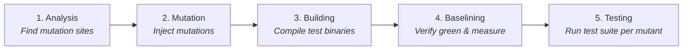
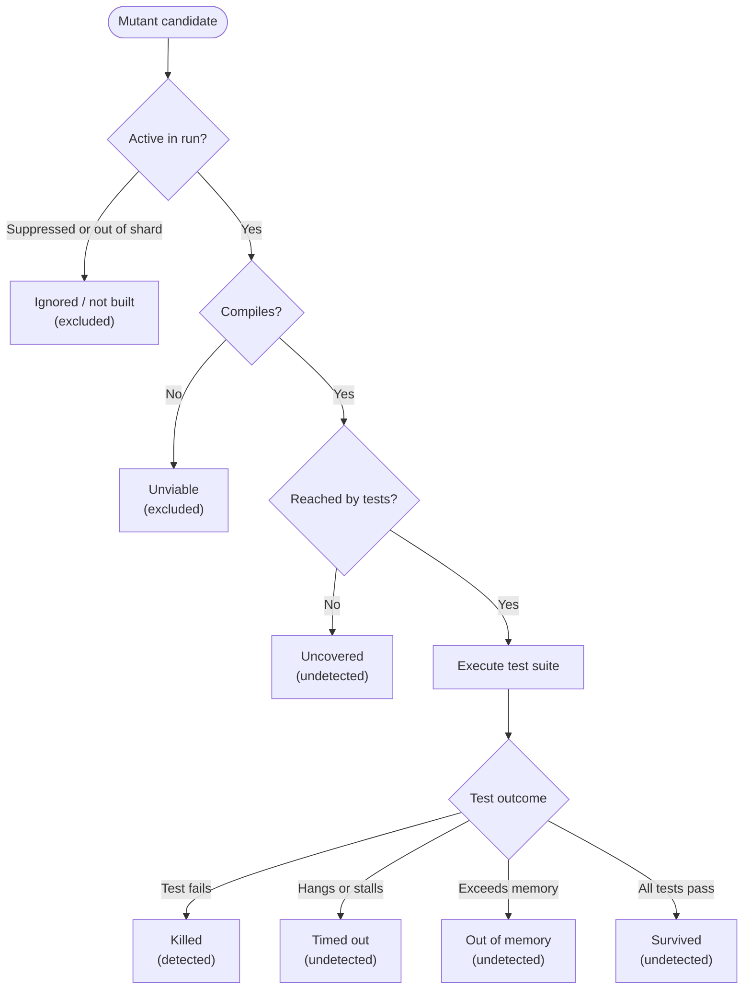
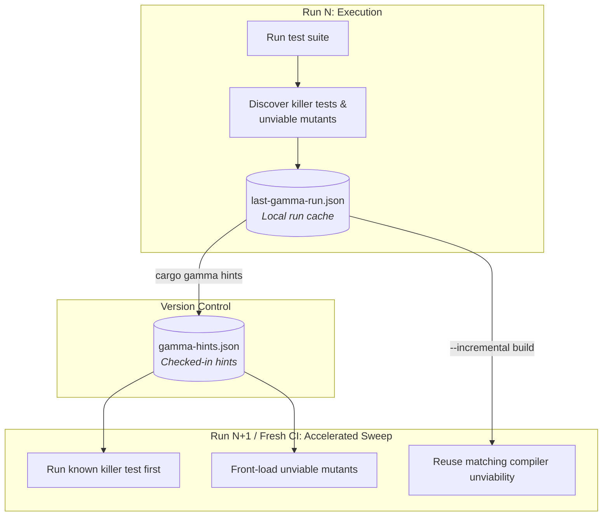

<div align="center">
 

# Cargo-Gamma

[](https://crates.io/crates/cargo-gamma)
[](https://docs.rs/cargo-gamma)
[](https://crates.io/crates/cargo-gamma)
[](https://github.com/microsoft/ox-tools/actions/workflows/anvil-pr.yml)
[](https://codecov.io/gh/microsoft/ox-tools)
[](../../LICENSE)
<a href="../.."></a>

</div>

Fast mutation testing for Rust.

* [Why mutation testing?](#why-mutation-testing)
  * [Mutation testing vs. coverage and fuzzing](#mutation-testing-vs-coverage-and-fuzzing)
* [Why `cargo-gamma`?](#why-cargo-gamma)
* [Getting started](#getting-started)
* [Mutators](#mutators)
* [Safety and test side effects](#safety-and-test-side-effects)
* [Run phases](#run-phases)
  * [Conditional compilation](#conditional-compilation)
  * [Doctests](#doctests)
  * [Scoping a run](#scoping-a-run)
  * [Differential mutation testing](#differential-mutation-testing)
    * [Compile-fail targets](#compile-fail-targets)
  * [Controlling a run](#controlling-a-run)
* [Verdicts and the score](#verdicts-and-the-score)
  * [How the mutation score is calculated](#how-the-mutation-score-is-calculated)
  * [Why 100% line coverage can still have uncovered mutants](#why-100-line-coverage-can-still-have-uncovered-mutants)
  * [Why some mutants cannot be killed](#why-some-mutants-cannot-be-killed)
  * [Acting on surviving mutants](#acting-on-surviving-mutants)
* [Killing mutants](#killing-mutants)
  * [Fixing timeouts, out-of-memory and unviable mutants](#fixing-timeouts-out-of-memory-and-unviable-mutants)
    * [Taking suppressions back out](#taking-suppressions-back-out)
  * [Hangs](#hangs)
    * [Bounding what a mutant allocates](#bounding-what-a-mutant-allocates)
    * [Telling a detection from a flaky test](#telling-a-detection-from-a-flaky-test)
* [Suppressing mutations](#suppressing-mutations)
  * [Choosing a channel](#choosing-a-channel)
  * [In-source directives](#in-source-directives)
    * [Selecting what to suppress](#selecting-what-to-suppress)
    * [Directive arguments](#directive-arguments)
    * [When a suppression stops earning its place](#when-a-suppression-stops-earning-its-place)
    * [The comment form](#the-comment-form)
  * [Where a directive can go](#where-a-directive-can-go)
  * [Stating what a site’s fate should be](#stating-what-a-sites-fate-should-be)
* [Configuration](#configuration)
  * [Where the file lives](#where-the-file-lives)
  * [Precedence](#precedence)
* [Known gaps](#known-gaps)
* [Reports](#reports)
* [Improving mutation performance](#improving-mutation-performance)
  * [Where the time goes](#where-the-time-goes)
  * [Optimizing compute-heavy suites](#optimizing-compute-heavy-suites)
  * [Checking in the hints file](#checking-in-the-hints-file)
  * [Running only the tests that reach the mutant](#running-only-the-tests-that-reach-the-mutant)
  * [Incremental runs](#incremental-runs)
  * [What a run remembers](#what-a-run-remembers)
  * [Diagnosing a slow run](#diagnosing-a-slow-run)
    * [Reporting a run that went wrong](#reporting-a-run-that-went-wrong)
  * [What to reach for](#what-to-reach-for)
* [Continuous integration](#continuous-integration)
  * [Exit codes](#exit-codes)
  * [Example GitHub Actions workflow](#example-github-actions-workflow)
  * [Sharding](#sharding)

A few additional docs of interest:

|Document|What it holds|
|--------|-------------|
|[docs/CMDLINE.md][__link0]|Every subcommand and option, grouped by category.|
|[docs/CONFIG.md][__link1]|Every configuration key, with examples.|
|[docs/MUTATORS.md][__link2]|Every mutator and profile, and what each one asks of a suite.|
|[docs/DESIGN.md][__link3]|How the tool works internally.|
|[docs/gamma.toml][__link4]|A fully documented configuration file to copy as a starting point.|

### Why mutation testing?

**Tests check your code. `cargo-gamma` checks your tests.**

Line coverage tells you which lines ran, but it cannot tell you whether your tests would notice if a
line were wrong. Mutation testing answers that question directly: it introduces small, deliberate bugs
(“mutants”) into your code and runs your test suite to see if your tests notice:

* **Killed mutant:** A test failed! Your test suite caught the bug.
* **Surviving mutant:** All tests passed. Your test suite didn’t notice the change, pointing out a
  blind spot or missing assertion with an exact file, line number, and diff.

As AI-generated tests proliferate, mutation testing is an important deterministic safety measure to
ensure that a generated test suite actually, you know, tests stuff. Without mutation testing, AI can easily
gas light you into thinking it wrote a robust test suite when it hasn’t.

#### Mutation testing vs. coverage and fuzzing

Mutation testing, code coverage, and fuzzing target different dimensions of software quality:

* **Code coverage** measures which statements and branches execute during a test run. It identifies
  untested paths, but cannot reveal whether existing assertions verify the correctness of executed code.

* **Fuzzing** generates pseudo-random inputs to discover panics, memory safety issues, or invariant
  violations in unmutated code under unexpected conditions.

* **Mutation testing** introduces deliberate semantic bugs into the source code to assess whether your
  test suite’s assertions detect logic errors.

High code coverage is a prerequisite for high mutation scores. Mutation testing evaluates the
sensitivity of your tests rather than just their reach.

### Why `cargo-gamma`?

`cargo-gamma` brings fast, comprehensive mutation testing to Rust projects of all sizes. There are other
mutation testing solutions for Rust, so why use `cargo-gamma`?

* **Speed.** Traditional mutation testers rebuild your crate for every single mutant, which can take hours or
  days for large workspaces. `cargo-gamma` compiles every mutant into a single instrumented test binary and activates them
  individually at runtime, turning multi-minute rebuilds into fast process launches. Finally, it remembers
  what it learned while running to accelerate subsequent runs and CI workflows with check-in-ready hints.
* **Thoroughness.** `cargo-gamma` tests over 100 mutator transforms across 23 families. It catches off-by-one
  errors (`<` vs `<=`), inverted conditions, arithmetic typos (`+` vs `-`), dropped statements, match
  guard errors, and literal tweaks.
* **Seamless workflow.** Works with your standard `cargo test` suite or `cargo-nextest`, provides built-in
  GitHub Actions annotations, and outputs rich interactive HTML reports and SARIF diagnostics.

Why is it called `cargo-gamma` you might ask? Because [gamma radiation][__link5]
induces genetic mutations (ref [The Hulk][__link6]).

### Getting started

To get going, install the tool:

```bash
cargo install cargo-gamma
```

Once installed, go to your favorite Rust workspace and enter:

```bash
cargo gamma
```

This will automatically rebuild your codebase with a bunch of mutations applied (don’t worry, it doesn’t
actually change your original source code as all the work `cargo-gamma` does happens on copied state in a cache
directory). Once your codebase is rebuilt, your test suite is executed repeatedly, each run with a
different code mutation enabled.

If it’s the first time you run mutation testing on your codebase, you’ll probably see a bunch of messages
such as:

```text
    SURVIVED src/ledger.rs:41:9: delete self.audit.push(entry); [stmt.delete_call]
```

These messages tell you that a specific mutation was applied to your source code which was not detected by
your test suite. In other words, it points out a weakness in your test suite.

Once you know what all the surviving mutants are in your codebase, your next task is to add more tests to
your test suite to kill those mutants.

### Mutators

`cargo-gamma` supports a large set of mutators. These are selected to represent real-world errors that can
emerge in a codebase and should ideally be detected by a codebase’s test suites.

[Mutators][__link7] is the full reference of all mutators, with a table per family, every
mutator’s academic alias, and a note on what the mutator catalog deliberately omits and why.
`cargo gamma list mutators` prints the same thing resolved against your current selection.

A [mutator preset][__link8] groups the catalog by what a mutant disturbs. For example,
`@control` includes all the mutators that change which code runs rather than what it computes, and `@numeric`
is literal replacement and expression perturbation.

The `@default` mutator selection enables the main catalog; additional low-yield mutators live in `@pedantic` and are
not enabled by default.

```bash
cargo gamma run --mutators @control --file src/dispatch.rs
cargo gamma run --mutators @default,@pedantic
```

### Safety and test side effects

`cargo-gamma` injects machine-generated mutations to simulate bugs. If your test suite performs
destructive operations (such as deleting files, modifying shared databases, making network requests, or
communicating with external APIs), a mutated condition or path could lead to unintended side effects (for
example, altering path resolution during cleanup routines).

To ensure safe and reliable execution:

* **Use isolated test environments.** Run mutation testing inside containers, virtual machines, or disposable
  CI workers.
* **Keep tests hermetic.** Restrict file I/O to temporary directories created per test and avoid production
  credentials or live network endpoints in test suites.
* **Process isolation.** If tests share mutable global state or process resources, use `--nextest`
  to execute tests in dedicated processes.

### Run phases

If you have a big codebase and a thorough test suite, mutation testing can take a long time (hours or days).
`cargo-gamma` implements a large number of optimizations to minimize this. Let’s explore how `cargo-gamma` does its
work to start understanding these optimizations.

A run moves through these phases, in order:



|Phase|What happens|What it costs|
|-----|------------|-------------|
|**Analysis**|Parse source tree and identify mutation sites.|Seconds|
|**Mutation**|Copy workspace to temporary location and introduce<br>all mutations.|Seconds|
|**Building**|Compile instrumented tree.<br>Unviable mutants are eliminated.|Seconds or minutes, this does a full debug build|
|**Baselining**|Run unmutated suite to verify baseline<br>duration and peak memory.|One suite run|
|**Testing**|Test in parallel, stopping at<br>first test failure.|N test runs — where all<br>the time goes|

The Building phase will take a little longer than a normal debug build of your workspace/crate,
the Baselining phase will take a little longer than one run of your test suite. And the Testing phase
will take (number-of-mutants * time-it-takes-to-run-your-test-suite / N) where N varies based on the test suite.
In an idealized setting, N is around 2. So if you have a test suite that takes 1/2 hour to run and you have
10,000 mutants, you can see how this would take a while.

As it runs, `cargo-gamma` learns about your codebase and keeps track of how it could improve end-to-end mutation testing
performance in the future. You can capture this knowledge as *hints* that get saved in the repo and then
used by subsequent mutation testing runs by individuals or by the CI system. More on hints and mutation testing
performance below.

#### Conditional compilation

Mutation sites are found by reading source, so they can be located in code the build is not going to compile —
a module behind a `#[cfg(feature = ...)]` whose feature is off, or one behind `#[cfg(windows)]` on
Linux. Such a mutant cannot change what any test observes, so it would otherwise survive every run
and be reported as `survived` with no practical way to kill it.

As part of the baseline build, `cargo-gamma` leverages the compiler’s evaluation to identify the
set of mutation sites which are not actually being built, and those are marked as `not built` and
removed from the score computation. Deferring to the compiler rather than re-evaluating `#[cfg]`
predicates means this covers features, target platform and everything else cargo and rustc already
agreed on, with no second opinion to disagree with the first.

You can use the `--all-features` and `--features` flags to control which feature is targeted during
mutation testing. `--all-features` is usually the right choice for most scenarios to ensure a codebase
is robust.

Two practical limits are worth knowing:

* **`cfg_attr` is not expanded:** `cargo-gamma` evaluates direct `#[cfg(...)]` attributes, but does not expand conditional attributes like `#[cfg_attr(...)]`. For example, a function marked `#[cfg_attr(windows, inline)]` is always mutated regardless of the target platform because `cfg_attr` conditionally applies inner attributes rather than conditionally removing the item itself.

* **Undecidable `cfg` predicates are kept, not dropped:** If a `#[cfg(...)]` predicate references a custom flag or syntax that the build configuration cannot definitively resolve (such as `#[cfg(custom_flag)]` when no `--cfg custom_flag` is declared, or compiler-internal predicates like `#[cfg(version("..."))]`), `cargo-gamma` treats the condition as unknown rather than assuming it is `false`. The item remains in the mutation candidate population; if it turns out not to compile during the build, its mutants are cleanly withdrawn as `unviable` rather than skewing the score.

#### Doctests

Documentation tests are not built, run, timed or reported. `cargo test --doc` is never invoked, so a mutant
whose only coverage is an example in a doc comment is reported `uncovered`, and one that a doctest
would have caught is reported `survived`.

This is a deliberate cost decision rather than an oversight. The schema exists so that a mutant
costs one test-process launch instead of one rebuild; `rustc` compiles and links a separate binary
per doctest, so admitting them would reintroduce a per-mutant compile for exactly the tests that
tend to assert least about behavior. A crate whose real coverage lives in its doc examples is
better served by promoting those examples into `#[test]` functions, which makes them faster for
`cargo test` as well.

The consequence to keep in mind when reading a report: on a crate that leans on doctests, the score
is a lower bound, and the `uncovered` count is the place the difference shows up.

#### Scoping a run

You can choose which packages get mutated, and which packages’ tests are used while testing:

```bash
cargo gamma run -p ledger -p ledger-core   # mutate only these packages
cargo gamma run --test-package ledger      # let this package's tests judge a mutant too
cargo gamma run --exclude-test conformance # keep a test target out of the oracle
cargo gamma run --test-workspace           # let every package's tests judge a mutant
```

By default, each mutant is judged by tests from its own package. That applies both to a run inside
`ledger-core` and to a whole-workspace run containing it: crates that depend on `ledger-core` are
not consulted for its mutants. This keeps the cost from becoming a function of the
reverse-dependency graph.

It also keeps the score a property of the crate. Judging a library by everything that links it means
it scores well because some dependent happens to exercise it — and a refactor over in that dependent
silently withdraws the coverage with nothing to report it.

Nothing is overstated by the cap. A mutant no admitted test binary reaches is reported as
`uncovered`, not as a survivor: the run says *nothing tests this*, which is true, rather than *your
tests missed this*, which would not be.

To change the oracle, ask for it. `--test-package` names the packages whose tests should judge
instead of using each mutant’s own package, which is what a workspace that keeps its integration
tests in a package of their own wants; if a run finds no test at all reaching the mutated code, it
names the packages that could and suggests the flag.
`--test-workspace` lets every package’s tests decide, which is the most thorough oracle available
and costs a workspace-wide build and test run per mutant. It lifts the cap, not reachability: a
mutant no test binary links is still `uncovered` rather than a survivor.

Within the cap, reachability is still an optimization: a test binary that cannot link the mutated
code is never built or run.

`--test-package` works at package granularity, which is too coarse when the tests you want as an
oracle and the tests you do not share a package. `--include-test` and `--exclude-test` match cargo
*target* names with `*` and `?` globs, which is the finest granularity cargo offers: a package’s
unit tests take the name of the lib or bin they live in, and each file under `tests/` is a target
named after the file. Exclusion is applied last, so `--include-test "*" --exclude-test "conformance_*"`
means what it looks like.

The usual reason to reach for this is a corpus that is not an oracle at all — conformance suites,
fuzz seeds, golden-file comparisons — sitting in the same package as the tests that are. Those
target failures say nothing about whether a mutant was noticed, and letting them convict inflates
the score.

#### Differential mutation testing

Restrict the mutation sites to the lines a change touches, which dramatically speeds up
the testing phase when used to handle pull requests in a CI environment:

```bash
git diff origin/main | cargo gamma run --in-diff -
cargo gamma run --in-diff change.patch
```

##### Compile-fail targets

A `trybuild` or `compiletest_rs` target is an expensive special case, and a run says so before it
builds anything:

```text
warning 1 test target invokes the compiler once per case, so every mutant pays for a full rustc run
        and almost none are convicted by it: `router_compile_fail` in routerama (trybuild).
        If it is not part of what should be judging these mutants, exclude it with
        `--exclude-test router_compile_fail`.
        Left in, it is likely to make this run take hours.
```

The cost is real: such a target has been measured putting a single mutant at one to two minutes,
which turns a run of a few thousand mutants into a multi-day one. What it asserts is that some code
*fails* to compile, and a mutated function body in another crate almost never changes that — so
nearly every mutant pays the full price and is convicted by something else anyway.

Nothing is excluded for you. On a proc-macro crate `trybuild` is often the *primary* oracle: a
mutant that corrupts a diagnostic message is caught there and nowhere else, so excluding it by
default would gut the oracle for exactly the code the technique suits best, and the mutants would
come back as survivors rather than as anything visibly wrong. Whether the catch rate justifies the
price is yours to weigh, so the run states the price and the flag and leaves the decision alone.

#### Controlling a run

```bash
cargo gamma run --jobs 8                      # mutants tested in parallel
cargo gamma run --test-timeout-multiplier 2.0 # multiple of each test binary's baseline duration
cargo gamma run --minimum-test-timeout 5      # floor under the computed budget
cargo gamma run --build-timeout 600           # bound the single build
cargo gamma run --min-score 80                # fail the run below a score
cargo gamma run --dry-run                     # report the plan without building anything
cargo gamma run --show-killed                 # list what the suite killed, not just what survived
cargo gamma run --show-unviable               # list the mutants that could not compile
cargo gamma run --leak-dirs                   # keep incomplete scratch trees for inspection
cargo gamma run --cache-dir /fast/disk        # put reusable workspace and build state here
cargo gamma run --artifact-dir reports        # put all five user-facing artifacts here
cargo gamma clean                             # delete this workspace's reusable cache
cargo gamma run --incremental build           # default: reuse unviability and checked hints
cargo gamma run --incremental no              # cold run: build and test everything from scratch
```

A run computes each mutant’s budget from the unmutated suite, so a fast suite gets a tight one.
`--minimum-test-timeout` stops a loaded machine from reporting scheduling noise as a hang. The build
is paid for exactly once, so a build that never finishes costs the whole run; `--build-timeout` and
`--build-timeout-multiplier` bound it, and a build that outstays its budget is stopped.

The workspace is copied to `workspace/` under cargo-gamma’s cache before anything is rewritten,
and Cargo artifacts stay beside it in `target/` so repeated runs compile incrementally.
`--cache-dir` moves the reusable state: it gets the copy off a slow or network filesystem. The
path names the cache itself and must be empty on first use; cargo-gamma marks it as belonging to
that workspace and refuses to let another workspace adopt or share it. A workspace-specific lock
in cargo-gamma’s default external cache serializes commands targeting the same original
workspace, while a second lock protects redirected cache state.

`cargo gamma clean` deletes the workspace-specific cache after taking the same lock as a run.
It leaves published reports under `target/cargo-gamma`, checked-in hints and source suppressions
untouched.

As soon as a measured run acquires that directory, it truncates its `gamma-progress.log`. Every
mutant verdict is appended and flushed there as it
arrives, using the console’s outcome-line format but without color or redraw escapes. Unlike the
console, the journal includes ordinary killed mutants as well as survivors, timeouts, memory exhaustion,
flakes and uncovered mutants. An interrupted run therefore leaves every complete verdict it had
already reached available for recovery, even though its final reports were never written.

What gets copied follows version control: files git tracks are always copied, whatever an ignore
rule says about them. `--copy-ignored` adds the untracked ones, and is for the build that reads
something a shared `.gitignore` excludes — a generated module, a downloaded fixture — which would
otherwise have to be fixed by editing an ignore file that is not this tool’s to edit. It copies
everything else the tree has ever built too, so expect a run with it on to be slower to start.

Reports normally go to `target/cargo-gamma` in the original workspace. `--artifact-dir` moves
all five together and creates the destination if needed; `--cache-dir` never changes them.

Every run writes what it learned to `last-gamma-run.json` in the cache: which mutants did not
compile and which test killed each mutant. A repeated run reads it back (enabled by default with
`--incremental build`), so it avoids rediscovering compiler unviability and tries the previous
killer when canonical iteration reaches its binary. Killer tests are hints, not cached verdicts:
every mutant is executed again before it contributes to the score. Reusing unviability requires
the same compiler, Cargo configuration, and
build policy plus unchanged compilation inputs. See
[What a run remembers](#what-a-run-remembers) for the details; `--incremental no` performs a cold
run. `cargo gamma hints` promotes the parts that cannot move a score into `gamma-hints.json`,
which you can commit so a fresh CI container starts warm.

Control how the tree is compiled and how the tests are invoked:

```bash
cargo gamma run --all-features
cargo gamma run --features serde,rayon --no-default-features
cargo gamma run --profile gamma           # use an optimized profile defined in Cargo.toml
cargo gamma run --cargo-arg --offline
cargo gamma run --cargo-test-arg --skip --cargo-test-arg slow_
cargo gamma run -- --skip slow_           # the same thing, for arguments that need no escaping
cargo gamma run --nextest                 # a process per test, for suites that need the isolation
```

An optimized profile can be the right trade because the build is paid once and thousands of
mutants run against it. Avoid using `release` without considering its semantics: it normally turns
`debug_assertions` and overflow checks off, so mutants those checks would have caught may survive
instead. [Optimizing compute-heavy suites](#optimizing-compute-heavy-suites) defines a safer
opt-in profile and explains when it pays.

Three flags pass arguments through, and they go to two different places. `--cargo-arg` is handed to
**cargo**, so it controls the build: `--offline`, `--locked`, `--frozen` and anything else cargo
understands. `--cargo-test-arg` and everything after `--` are handed to **every test binary**, so
they control the harness: `--skip`, `--test-threads`, `--nocapture`. The last two are the same
destination and are concatenated in the order written, so pick whichever reads better — `--` is
shorter and needs no escaping, while `--cargo-test-arg` can be interleaved with other flags,
survives being appended to by a wrapper script, and is the form the
[`cargo-test-args`][__link9] configuration key takes, which a file cannot write as a trailing
`--`.

A mutant is usually caught by one test, so a binary is stopped at the first test that announces a
failure rather than run to the end — on a suite whose slow tests come after a fast one, that is most
of the run. This relies on the harness being the only thing writing to the output being read, which
is true because libtest captures each test’s output and replays it only once every test has
finished. Passing `--nocapture` or `--show-output` (or setting `RUST_TEST_NOCAPTURE`) breaks that,
since a test’s own writing then lands among the harness’s and could be mistaken for a verdict, so
the run falls back to reading each binary to completion. Scores are identical either way; only the
time differs.

By default the built test binaries are executed directly, which is where much of the speed comes
from. Some suites cannot pass that way: a test that mutates the environment, leans on a global, or
installs a process-wide handler only holds when it has a process to itself. Under the default runner
such a suite is red before any mutant is applied, and a red baseline stops the run — there is
nothing to measure against. `--nextest` gives each test its own process, which makes those
trees measurable at all.

It costs less than it appears to. Nextest is handed the already-built tree and never invokes cargo,
so the single build is still paid for once, and budgets, ordering, timeouts and memory accounting
work as they do otherwise. It does need `cargo-nextest` on the path. The two runners agree on the
verdicts for any suite that passes under both.

Point the run somewhere other than the current directory, or say explicitly that the whole workspace
is in scope:

```bash
cargo gamma run --dir ../ledger    # analyze a workspace elsewhere
cargo gamma run --workspace        # every package: accepted for symmetry with cargo, already the default
```

Reach an error type that does not implement `Default`:

```bash
cargo gamma run --error 'MyError::Io' --error 'MyError::Eof'
```

Each value becomes its own `fn_value.err_with` mutant on every function returning a `Result`.

By default each test binary gets a budget derived from how long that binary took with no mutant active, because a
mutant that turns a loop bound into an infinite loop should be cut off quickly. `--test-timeout-multiplier` changes how much
slower than the baseline a mutant may run in that binary before it is called a timeout, and `--minimum-test-timeout` provides a floor under the budget.

Some mutants cannot compile — replacing a body with `Some(Default::default())` only works when the
type implements `Default`. These are withdrawn automatically, rebuilt without, and reported as
unviable rather than counted against the score. Withdrawal is iterative, because rustc reports only
the errors it reaches before it gives up, so a large tree can need several rounds to converge.
`--rollback-rounds` raises the cap; raise it when a run stops with a rollback-limit error and the
withdrawal counts it is printing are still falling.

Two flags control what the terminal sees. Both take `auto`, `always` or `never`, and both default to
`auto`, which means “on when standard error is a terminal”:

```bash
cargo gamma run --color never --progress never   # what a CI log wants
```

`--progress` governs the live counter, which is redrawn in place and therefore turns a CI log into
thousands of near-identical lines when nothing is there to interpret the escapes. `--color` governs
styling alone, so a log can stay colorless without losing the progress the flag would otherwise
suppress.

The two builds a run performs — the instrumented tree, then the baseline test binaries — are the
longest silences in it, so cargo’s own progress bar is shown while they run, alongside the first few
compiler errors. Only errors: an instrumented tree emits a great many warnings, and none of them say
whether the build will produce the binaries the run needs. `--show-build` lets the rest of cargo’s
output through unfiltered, which is what to reach for when the build itself is what is going wrong:

```bash
cargo gamma run --show-build
```

Every test process a run launches, baseline included, has `CARGO_GAMMA=1` set. A suite that drives
cargo itself needs this: a nested build inside the scratch tree fails for reasons unrelated to any
mutant, and that shows up as a red baseline before a single mutant runs.

Be aware of what stepping aside costs. A test that returns early on `CARGO_GAMMA` is not deciding
anything, so every mutant only that test could have caught is reported as a survivor rather than as
uncovered — the score falls, and the reason is invisible. Prefer moving cargo-driving tests into a
test target of their own and naming it to [`--exclude-test`][__link10]: the run
then knows those tests were withheld and says so in the oracle note, instead of silently crediting
their absence to your code.

### Verdicts and the score

Every mutant ends in a verdict classified as detected, undetected, or excluded from scoring:



|Verdict|In the report|Meaning|In the score|
|-------|-------------|-------|------------|
|Killed|`killed`|A test failed while this mutant was active|detected|
|Timed out|`timeout`|The budget or the stall detector cut it off before an assertion rejected it|**undetected**|
|Out of memory|`outofmem`|It passed the memory ceiling before an assertion rejected it|**undetected**|
|Survived|`survived`|Every reachable test passed|**undetected**|
|Uncovered|`uncovered`|No test in scope reached this mutation site|**undetected**|
|Unviable|`unviable`|The mutation does not compile|excluded|
|Ignored|`ignored`|Withdrawn by a directive, attribute or config rule|excluded|
|Not built|`notbuilt`|Conditional compilation kept this file out of the build|excluded|
|Flaky|`flaky`|The suite failed with no mutant active too, so nothing was established|excluded|
|Not run|`pending`|Never judged — outside shard, settled by<br>earlier report, run ended first, or the machine<br>refused to start the test binary|excluded|

The middle column is the name a JSON report carries and a log can be grepped for; the console uses
the same words.

#### How the mutation score is calculated

The **mutation score** is detected over detected-plus-undetected:

```text
                             killed
score =  ─────────────────────────────────────────────────────────  × 100
         killed + timed out + out of memory + survived + uncovered
```

Unviable, ignored, never-built, flaky and unrun mutants are in neither half. They were never really
tested, and counting them either way would be a statement about your tests that your tests did not
make.

Only a failing assertion increases the numerator. Timeout, out-of-memory, survivor, and
uncovered verdicts increase only the denominator. An excluded verdict changes neither. If
there are no scored mutants at all, the displayed ratio is 100%, but `--min-score` treats the
run as ungraded rather than allowing an empty population to pass a quality gate.

Uncovered mutants are in the denominator and never in the numerator, so they cost you exactly what
a survivor costs you. That is deliberate. *Which* mutants went undetected is a diagnosis, and “no
test reaches this code” is a different problem from “the tests that ran it did not notice” — so the
report never merges them. But *how much* of the code is defended is one number, and code no test
reaches is undefended.

The [mutation-testing-elements][__link11]
schema treats its `Timeout` status as detected. Gamma exports timeout and out-of-memory
verdicts as schema `Survived` with a reason that preserves the actual outcome, so the standard
report UI computes this same fail-closed score.

#### Why 100% line coverage can still have uncovered mutants

Line coverage and gamma’s `uncovered` verdict need not measure the same population. Coverage tools
can deliberately remove code from their denominator with Rust’s `#[coverage(off)]` attribute (often
written conditionally as `#[cfg_attr(coverage_nightly, coverage(off))]`). Gamma still mutates that
production code unless it is explicitly suppressed, so a mutation guard there can be reached by no
selected test while the coverage report remains at 100%.

Other legitimate mismatches have the same shape:

* a coverage service may combine operating systems, feature sets or test targets that are absent
  from this gamma run;
* cfg-disabled code and proc-macro or build-time code may compile without executing during gamma’s
  runtime census;
* line coverage can mark a line even though a particular expression or branch on that line did not
  execute; and
* doctests are not part of gamma’s runtime oracle.

`Uncovered` therefore means exactly that no selected runtime test activated this mutation site’s
gamma guard **in this run**. It does not claim that every coverage upload omitted the source line.
The remedy depends on intent: add a runtime test, align gamma’s platform/features/test-targets with
the coverage job, or [suppress the mutant](#suppressing-mutations) when it is intentionally outside
the oracle (for example unstable `Debug` text). A coverage exclusion is not automatically a mutation
exclusion: deliberately uncounted code can still contain behavior worth testing.

#### Why some mutants cannot be killed

Some mutations produce a program that behaves identically to the original. Swapping `<` for `<=` on
a bound nothing ever reaches, changing a value that is overwritten before it is read, altering a
log message, reordering two independent operations — the code is different and the behavior is not.
These are **equivalent mutants**, and no test can kill one, because there is nothing to observe.

There are two general approaches for dealing with unkillable mutants:

* When a survivor is genuinely unkillable, say so in the source with a
  [suppression directive](#suppressing-mutations) — `#[gamma::skip(reason = "…")]` — which is
  reviewable and survives a clean checkout. Prefer that over widening an exclusion.
* When a whole mutator produces mostly equivalent mutants in your code, drop it for that tree with
  [`--mutators`](#mutators) or the `mutators` key in [configuration](#configuration).

#### Acting on surviving mutants

A surviving mutant is an observation about your test suite. When triaging survivors:

1. **Prioritize high-impact code:** Focus first on core business logic, public APIs, boundary
   conditions, and safety-critical invariants rather than non-functional code (like debug logging).
1. **Cluster by function or module:** Multiple survivors in the same function usually point to a
   single missing test scenario rather than multiple independent test gaps.
1. **Prefer public contract assertions:** Write tests against the public API to verify observable
   behavior rather than writing tests that tightly couple to internal private implementation details.
1. **Distinguish non-functional and cache code:** If a survivor alters an internal cache, memoization,
   or logging path that produces identical functional results, test its observable telemetry or suppress
   it explicitly with `#[gamma::skip(reason = "performance cache")]`.

### Killing mutants

#### Fixing timeouts, out-of-memory and unviable mutants

Some sites cannot usefully be mutated — a hand-written spin loop, a driver poll, a reactor. `fix`
runs the suite and writes the suppression for you:

```bash
cargo gamma suppress --dry-run-suppress             # print the diff, change nothing
cargo gamma suppress                                # timeouts and out-of-memory mutants
cargo gamma suppress --eligible timeout             # timeouts only
cargo gamma suppress --eligible timeout,outofmem,unviable   # also those that would not compile
```

The default covers both `timeout` and `outofmem`, because both are a mutant the machine stopped
rather than a mutant the suite convicted, and both cost a full budget every run to reach the same
answer. A run that produces either verdict prints a hint pointing to this command. `unviable`
stays opt-in: a mutant that will not compile is cheap to re-establish, and suppressing it hides a
mutator that may simply need narrowing.

A site stopped for more than one reason gets one directive per reason, each naming the verdict that
actually applied, so a later reader can tell which mutators hung from which ones exhausted memory.

**A surviving mutant is never eligible, and cannot be made eligible.** A survivor is a real gap in
the test suite; suppressing it would remove the gap from the score rather than from the code, and
the moment that is possible every score the tool reports becomes unfalsifiable.

Generated directives name the exact mutators that tripped — never a family, never `all` — and carry
a tag, a reason and the date, so they can be audited later. After writing, discovery runs again and
the suppressed set is compared in both directions: every intended mutant must now be suppressed, and
nothing else may have become suppressed. If either check fails, every edit is reverted.

The result is a baseline that a later run can be compared against: anything new is a regression
introduced by the change under review. Review the diff before committing it — a bulk suppression is
a snapshot of what one run could not resolve on one day, not a judgment that any of it should stay
that way.

##### Taking suppressions back out

A suppression that has stopped earning its place can be removed the same way it was written:

```bash
cargo gamma unsuppress            # print the diff, change nothing
cargo gamma unsuppress --apply    # remove them
```

It removes exactly the directives a run reports as suppressing nothing, and the preview is the
default — the reverse of `suppress`, because a directive written in error can be read back and
reverted at leisure, while one deleted in error takes its reason with it.

Nothing is built and no test is run: whether a directive governs a mutant is a fact about the
source, so this costs a discovery pass. Only a directive that is the whole content of its own line
is removed; one attached to a line of code, wrapped in a `cfg_attr`, or spread over several lines is
named and left for a person, because there is no line whose deletion would take the directive and
nothing else. Afterwards discovery runs again and the population is compared: removing a directive
that suppressed nothing cannot change anything, so if anything does change, every edit is reverted.

#### Hangs

Deleting a statement or relaxing a loop condition makes runaway loops common, and a hung mutant is
the most expensive verdict a run can produce — it is the only one whose cost is decided by how long
you are willing to wait. Waiting out a timeout derived from a slow binary means spending significant
time to learn that a one-line change made a twelve-millisecond test spin forever.

So the run does not wait. The baseline measures the longest a healthy suite legitimately goes
without saying anything, and a mutant that goes quiet for much longer than that is presumed hung and
cut off. The budget is calibrated rather than fixed, because a suite whose slowest test takes half a
minute goes half a minute quiet when it is perfectly healthy, and a constant would either accuse it
or be too loose to help a suite of millisecond unit tests.
The last test named by the harness is a landmark rather than a diagnosis: parallel harnesses
announce tests when they finish, so the test still spinning may be one the harness has not named.

##### Bounding what a mutant allocates

A mutation can turn bounded allocation into unbounded allocation — a loop bound inverted, a
capacity computed by multiplication instead of division. The timeout does eventually stop such a
mutant, but only after it has taken the machine into swap, and possibly after the kernel has killed
something that had nothing to do with the run.

`--memory enforce` is the default, on the same reasoning as the timeout: the user who most needs
protecting from a runaway allocation is the one who never thought to ask for it. Each test binary’s
whole process tree is metered during the baseline, and every mutant of that binary is then held to a
ceiling derived from what it measured — by default the larger of twice the baseline peak and the
baseline peak plus 128 MiB. The multiplier governs large suites; the headroom governs small ones,
where doubling a few megabytes would leave no room for a lazily initialized table.

A mutant stopped for reaching its ceiling is reported as `OUTOFMEM` and counted in its own
column of the summary, with a note naming the binary, the peak it reached and the ceiling it passed:

```text
OUTOFMEM src/buffer.rs:5:15: replace steps.min(4) with steps.max(4) [iter.min_to_max]:
         `subject-2181f69f` reached 192.6 MB, past the 192.6 MB this run allowed it

Summary 1 mutant (0 killed, 0 survived, 0 timed out, 1 out of memory, 0 uncovered => 0.0%)
```

It counts as undetected, like a timeout: the resource guard established that the mutant changed
behavior, but no test assertion rejected it. It gets its own outcome because its remedy is
different from a completed survivor’s. It is also the outcome most likely to be wrong: a ceiling
set too tight can stop a healthy mutant, which is why the note carries both numbers.

`--memory measure` meters and reports without ever stopping a mutant, which is what to use if you
want the numbers before you trust the ceiling. `--memory off` disables both. A mutant whose site is
genuinely allowed to allocate this much can be taken out of the run for good with `cargo gamma suppress`, which treats `outofmem` as eligible by default alongside `timeout`.

##### Telling a detection from a flaky test

Nothing about a red test says the mutant made it red. A test that fails now and then would otherwise
be scored as a kill every time it happened to fail while a mutant was active — inflating the score
by however many mutants it was run against, invisibly, because the report has no way to show it.

So every failing test is re-run with no mutant active before the kill is believed. If it fails that
time too, the suite is what is unreliable, and the mutant is reported as `FLAKY`:

```text
FLAKY src/ledger.rs:41:9: delete self.audit.push(entry); [stmt.delete_call]:
      test `audit::retries` in `unit-2181f69f` fails with no mutant active as well as with one,
      so this mutant was never judged

Summary 2 mutants (2 killed, 0 survived, 0 timed out, 0 out of memory, 0 uncovered => 100.0%),
        1 flaky mutant never judged
```

It is deliberately neither a kill nor a survivor. Crediting the mutant would let one unreliable test
manufacture detections; calling it a survivor would claim the tests have a gap and send you to write
an assertion for code an assertion already covers. Nothing was established, so it stays out of the
score entirely — the way an unviable mutant does — and the report names the test to fix, which is the
only thing anybody can act on here. Incremental runs retry flakes rather than carrying them forward.

The confirmation costs one extra run per kill, of the cheapest kind: it stops at the first failing
test rather than running the whole binary. `--no-confirm` turns it off, which buys that time back at
the price of a score that counts flakes as kills and cannot show you which ones they were.

### Suppressing mutations

Not every surviving mutant is a missing test. A mutant can be *equivalent* — a program that behaves
identically, so no test could ever tell them apart — or it can sit in code that is deliberately
untested. Both cost a reviewer attention every run until somebody records the decision, and a
suppression is that record.

Every mutator has a stable, well-known name of the form `family.transform`. That one name is the
vocabulary for the command line, the report, and every suppression channel.

#### Choosing a channel

The available suppression and test-selection channels differ in where the decision lives and in
how visible it is to the next person to read the code.

|Channel|Scope|Where it lives|Reach for it when|
|-------|-----|--------------|-----------------|
|`#[gamma::skip]`|item, block, statement, expression|beside code|one specific site is equivalent or untested|
|`// #[gamma::skip]`|the same syntax in a comment|beside code|site cannot carry an attribute or in clean source|
|`exclude-trait-impls`|implementations of named traits|`gamma.toml`|one cross-cutting project policy covers every matching implementation|
|`--mutators !fam`|the whole run|CLI or config|whole mutation class does not apply|
|`--exclude-file`|all mutants in matching files|CLI or config|generated, vendored, or unowned files|
|`--exclude-test`|tests that run, not mutants|CLI or config|slow or flaky test should not judge mutants|

The first two are almost always the right answer. A directive next to the code says *this* mutant is
equivalent and says why; a config-level exclusion says nothing about any individual site and quietly
grows to cover code written years later that nobody ever considered.
A trait exclusion list is the exception for a deliberate cross-cutting policy. It compares each
configured identifier with the final segment of the trait path as written, without name
resolution, so `exclude-trait-impls = ["Debug", "Display"]` covers qualified and unqualified
implementations of either trait without matching report prose. Put the reason in a comment
beside the list, as with `exclude-files`.

`--exclude-test` is the odd one out: it does not suppress a mutant at all, it narrows the test suite
each mutant is run against. Excluding a test makes mutants *harder* to kill, not easier.

#### In-source directives

A directive is written in the `gamma` namespace:

```rust
#[gamma::skip]                         // do not generate mutants here
#[gamma::expect_survived]              // mutants here are expected to survive
#[gamma::expect_killed]                // mutants here are expected to be killed
#[gamma::test_timeout_multiplier(3.0)] // override timeout multiplier for mutants here
```

Or using the generic `#[gamma]` attribute:

```rust
#[gamma(test_timeout_multiplier = 3.0)]
#[gamma(3.0)]
```

Anything else in the `gamma::` namespace is a usage error rather than something quietly ignored, so
a typo in a directive name is reported instead of silently disabling nothing. Attributes in other
namespaces, including `mutants::`, are left alone.

##### Selecting what to suppress

A bare directive covers everything:

```rust
#[gamma::skip]
fn hash_seed() -> u64 {
    0x9E37_79B9_7F4A_7C15
}
```

Arguments narrow it, using exactly the same grammar as `--mutators` — mutator names, family prefixes,
mutator presets written with `@`, and `!` negation, comma separated:

```rust
#[gamma::skip(relational)]                  // one family
#[gamma::skip(relational.lt_to_le)]         // one mutator
#[gamma::skip(@arithmetic)]                 // a profile
#[gamma::skip(arith, literal.int)]          // several selectors
#[gamma::skip(@all, !fn_value)]             // everything but one family
```

Sharing the grammar is deliberate. A selector you worked out at the command line while narrowing
down a result pastes straight into the source once you decide the answer is permanent.

On an item, a directive is a real attribute:

```rust
#[gamma::skip(arith, reason = "fixed-point math, checked by proptest")]
fn scaled(a: i64, b: i64) -> i64 {
    a * b / 1000
}
```

`#[cfg_attr(…, gamma::skip(…))]` is honored too. The predicate is deliberately not evaluated:
suppression states an intent about a site, and that intent does not change with the build
configuration.

##### Directive arguments

Named arguments may follow the selectors in any position:

```rust
#[gamma::skip(
    literal,
    reason = "the seed is arbitrary; any value works",
    tag = "equivalent"
)]
fn hash_seed() -> u64 {
    0x9E37_79B9_7F4A_7C15
}

#[gamma(test_timeout_multiplier = 2.5)]
fn slow_algorithm(data: &[u8]) -> usize {
    data.len() * 2
}
```

* `reason` is free text and appears in the report and in `cargo gamma explain`, so the next person to
  wonder about the gap gets the answer without a `git blame`.
* `tag` is a short label you choose, which lets a report be grouped by category — `equivalent`, `perf`,
  `unsafe` — and lets a review ask how many suppressions of a given kind a change added.
* `test_timeout_multiplier` overrides the timeout multiplier for the annotated mutants. When that mutant is tested, the multiplier specified in the attribute overrides the default specified in configuration or via `--test-timeout-multiplier` (scaled against the test binary’s measured baseline duration and respecting `--minimum-test-timeout`).
  A positional multiplier may appear anywhere in the argument list, but a directive may state
  exactly one multiplier across the positional spelling and the named aliases
  `test_timeout_multiplier`, `timeout_multiplier`, `multiplier`, and `factor`. A second value is
  a usage error.

Both `reason` and `tag` are optional, but a `skip` with no `reason` is a decision nobody can audit.

##### When a suppression stops earning its place

A run names every `skip` directive that suppressed nothing:

```text
Unused 2 skip directives suppressed nothing and may no longer be needed
  src/parse.rs:118: skip(arith) — the compiler folds this
  src/hash.rs:42: skip(literal)
```

This is the one part of a report nobody can audit from the outside. Once the code under a directive
changes, the directive keeps applying to nothing, and it still reads as a deliberate decision that
something there is untestable. Naming it is what lets that decision be revisited.

A directive is only named when this run actually had a mutant to offer it. `--mutators relational` never
generates an `arith` mutant, so it never condemns a `skip(arith)`; a file outside `--package`, a
shard that did not hold it, or an `--in-diff` that skipped it is never scanned at all. The note is
never a failure — a directive can be legitimately idle for one run.

##### The comment form

Attributes in statement and expression position are still unstable in Rust, so every directive has a
comment spelling, which is character-for-character the attribute with `//` in front:

```rust
// #[gamma::skip(literal, reason = "the seed is arbitrary")]
fn hash_seed() -> u64 {
    0x9E37_79B9_7F4A_7C15
}
```

```rust
// #[gamma::skip(arith)]
let total = a * scale + offset;
```

It exists for the places an attribute cannot go, and for codebases that would rather not carry a
tool’s attributes in shipped source. It behaves identically otherwise, and when expression
attributes stabilize, deleting the two slashes turns each of these into real Rust. This includes
the single-multiplier rule described above.

#### Where a directive can go

An attribute may be placed on any of:

* a free function (`fn`)
* an inherent or trait method (`impl` / `trait` body)
* an `impl` block, covering everything in it
* a `mod`, covering everything in it
* a statement
* an expression

A **comment on its own line** governs the outermost construct that begins after it. A **trailing
comment** — one following code on the same line — governs the widest span that starts on that line.
So this suppresses the whole `if`, not just the condition:

```text
if a < b && c > d {   // #[gamma::skip(relational)]
```

while this suppresses only the statement that follows:

```rust
// #[gamma::skip(stmt)]
counter += 1;
```

Placing a directive on a `mod` or an `impl` is the bluntest form: it will keep covering code added to
that block long after the reason it was written stops applying. Prefer the narrowest placement that
covers the site.

#### Stating what a site’s fate should be

`skip` stops a mutant being generated. `expect_survived` and `expect_killed` still generate it, still
run it, and turn the result into an assertion — they are claims about the suite rather than
instructions to the generator. If the outcome disagrees with the claim, the run reports each
divergence and exits 2.

```rust
#[gamma::expect_killed(relational, reason = "the boundary here is load-bearing")]
fn within(value: u32, limit: u32) -> bool {
    value < limit
}
```

```rust
#[gamma::expect_survived(reason = "logging only; nothing observes this")]
fn trace(&self) { ... }
```

An `expect_survived` mutant that is killed by a failing assertion is reported, and so is an
`expect_killed` mutant that survives, times out, exhausts memory, or is uncovered. Timeout and
memory exhaustion satisfy `expect_survived` because no assertion rejected the mutant. That makes
the annotation self-correcting: when somebody finally writes the test that covers this code, the
run tells you the note is stale instead of leaving it to rot.

Use `expect_survived` where `skip` is tempting but the gap is a real gap you intend to close, and
`expect_killed` to pin coverage you consider load-bearing so that a later change cannot quietly
remove it.

A mutant that never ran — one that failed to compile, or that was suppressed — is not judged, since
it is not evidence about the suite either way.

To see what a mutator does and how to switch it off:

```bash
cargo gamma explain relational.lt_to_le   # a mutator
cargo gamma explain @arithmetic           # everything a preset selects
```

To write directives in bulk for the mutants a run could not decide on, see
[Fixing timeouts, out-of-memory and unviable mutants](#fixing-timeouts-out-of-memory-and-unviable-mutants).

### Configuration

Command-line campaign settings can be persisted in `gamma.toml`, so a project that has settled
on a set of options does not have to repeat it in every CI job and every developer’s shell
history. The file also holds project policy such as trait implementation exclusions:

```toml
mutators      = ["@arithmetic", "@relational", "stmt"]
exclude-files = ["src/generated/**"]
exclude-tests = ["conformance_*"]
min-score     = 70.0
artifact-dir  = "target/cargo-gamma"

# Debug output is diagnostic text without a stable formatting contract.
exclude-trait-impls = ["Debug", "Display"]

[shard]
count = 30
```

**[docs/CONFIG.md][__link12] documents every key.** [docs/gamma.toml][__link13] is a
file listing all of them with their defaults, commented out — copy it and delete what you do not
need:

```bash
cp docs/gamma.toml gamma.toml
```

#### Where the file lives

`gamma.toml`, in the directory being analyzed. Two flags override that:

```bash
cargo gamma run --config ci/gamma.toml   # read this file instead
cargo gamma run --no-config              # read nothing
```

An explicit `--config` path must exist. Asking for a file and silently getting the defaults because
the path was misspelled is exactly the failure that check is there to prevent, whereas a missing
conventional file is the ordinary case and is not an error.

#### Precedence

A flag given on the command line wins over the file; the file wins over the built-in default. For
the list-valued keys — `files`, `packages`, `errors` and the rest — the two **concatenate**, so
adding one exclusion at the command line does not silently drop the ones the project agreed on. Use
`--no-config` for a run that should ignore what is checked in entirely.

```toml
# gamma.toml
mutators = [
    "@all",
    "!stmt",   # too many equivalent mutants in the parser
]
exclude-files = ["src/generated/**"]
min-score = 80.0
```

`.cargo/mutants.toml` is not supported and is never read. Configure Gamma independently in
`gamma.toml`.

### Known gaps

Doctests are not built or run, so a mutant whose only coverage is a doctest is reported as a survivor.

Types are read syntactically rather than resolved, so a type alias is not seen through and falls
back to `Default::default()`. Where the tool can tell that no such guess could hold — a bare type
parameter, an associated type projected out of one, a `Box<dyn Trait>`, or an `impl Trait` that is
not an iterator — it withholds the mutant instead of generating one that cannot compile. The same
absence of type resolution is why `expr` occasionally perturbs an expression that turns out not to
be numeric.

An `impl Trait` return that is not an iterator is still passed over. `impl Future` is the case that
comes up most, and cargo-mutants does not cover it either.

### Reports

```bash
cargo gamma run                                             # JSON, HTML and SARIF reports
cargo gamma run --artifact-dir reports                      # move every artifact together
```

Every run writes all three reports without being asked. Normally they are
`target/cargo-gamma/gamma-report.html`, `gamma-report.json`, and `gamma-report.sarif` in the
original workspace. [`--artifact-dir`](#controlling-a-run) moves the complete set to another
directory and creates it when necessary. `--cache-dir` only relocates internal reusable state.

The JSON is the [`mutation-testing-elements`][__link14]
interchange format, which is what the Azure DevOps and GitHub mutation report extensions consume, so
no translation step is needed.

The HTML is a single self-contained file: the viewer and the results are both embedded, so it opens
from a CI artifact, a file share, or a machine with no network at all. There is no mode that loads
the viewer from elsewhere: loading an external viewer would allow remotely supplied JavaScript to
read and disclose the source and results embedded in the report.

### Improving mutation performance

Mutation testing with schemas is orders of magnitude faster than rebuilding per mutant because the
build is paid once for the entire population. Even so, running thousands of mutants against a large
test suite takes time. Improving performance means knowing where time is spent and applying the
right combination of levers: checking in hints for warm CI runs, the default case-level test
selection, incremental runs with `--incremental`, and tuning timeouts and harness options.

#### Where the time goes

A run’s cost separates into build, baseline, and per-mutant work; identifying the dominant term
guides performance tuning.

```text
total ≈ build × rounds  +  baseline  +  Σ per mutant (launch + tests until something fails)
        └── fixed ──────────────────┘   └── scales with the population ──────────────────┘
```

**The build is the fixed cost, and it buys the whole population.** Every mutant lives in one
compiled artifact, selected at runtime, so a build is paid once no matter how many mutants there
are. This inverts the usual advice: with a per-mutant build you minimize the population, and here
you can afford a much richer catalog. It also means a *narrow* run is the worst deal this tool
offers — asking for twenty mutants in one file still pays the whole build. If you are iterating on a
single file, expect the build to dominate completely, and leverage `--incremental` (enabled by
default) across runs so unchanged files are amortized.

**A build is “once” but not always “one”.** Mutants that cannot compile are found by building,
reading the compiler’s diagnostics, withdrawing the mutants they blame, and building again.
Compilation is phased — a type error hides the borrow error behind it — so unviable mutants surface
in waves, and each wave is another round. A workspace where a quarter of the population does not
compile can spend a long time here before a single test runs.

You mostly pay this once. A run remembers which mutants failed to compile and skips them next time,
so a second run over an unchanged tree spends materially fewer rounds:

```text
      Cached 3356 mutants known not to compile, carried forward rather than rebuilt
```

The memory is a record and nothing depends on it. It stops being *believed* whenever the file a
mutant lives in changes, whenever the features differ, and whenever the toolchain does — because a
mutant that could not compile against one version of the surrounding types may compile against the
next, and assuming otherwise would quietly drop a mutant that might have survived out of the
denominator. What survives a mismatch is the order: the mutants that failed last time are still the
ones worth compiling first, and being wrong about that costs the order and nothing else. Deleting
`last-gamma-run.json` only ever costs time, and `--incremental no` ignores it for one run.

**Killed mutants are cheap; survivors are expensive.** A kill stops at the first test that fails —
the run stops at the first binary that convicts, and inside that binary at the first failing test.
A survivor has to run every reachable test binary to completion in order to prove that nothing
caught it. A codebase with many survivors is slow *because* it is under-tested, and the run gets
faster as the suite gets better.

**A re-run goes straight to the test that caught each mutant.** “The first test that fails” still
means paying for every test the harness happened to run ahead of it. A run records which test caught
each mutant, and the next run tries that one test on its own before anything else — so a re-killed
mutant costs one test rather than a partial binary. On a suite where the killing test is halfway
down the list, this is most of the sweep.

It is a guess, and it is checked rather than believed: the named test is actually run, and if it no
longer exists, no longer fails, or names a binary this run has excluded, the ordinary whole-binary
sweep runs behind it and reaches exactly the verdict it would have reached anyway. Nothing here can
move a score. A stale entry costs one filtered test process and is then dropped.

The run record holds it, keyed by mutant identity, so an edit elsewhere in the file leaves it intact
and a site that genuinely changed simply stops matching. It sits outside the digested part of the
record on purpose: a feature change discards cached build facts, and discarding the hints along with them
would make the map cold on exactly the runs it is worth the most on. `--incremental no` turns it off
along with everything else the record holds.

**Your suite’s speed is the multiplier.** It is paid once per mutant, so a fixture built per test
process, a sleep, or a network call is not slow once — it is slow thousands of times. This is
usually the single highest-leverage thing to fix, and unlike everything else here it costs no
signal and helps every other workflow.

**Hangs cost more than everything else.** A mutant that turns a loop counter into an infinite loop
is stopped only by its timeout, and then re-run to confirm the timeout was real. That budget has a
floor under it, so on a fast suite one hang can cost what several thousand judged mutants cost.
`--minimum-test-timeout` lowers the floor and makes every hang cheaper.

**Instrumented code is not free.** Every mutation site becomes a runtime branch, and tests build
without optimizations by default, where those branches are real calls rather than something the
optimizer folds away. A crate whose tests drive a hot path through mutated code pays that on every
mutant run. If your suite is compute-heavy and your crate builds quickly, this is the case where an
optimized profile can recover the most time.

#### Optimizing compute-heavy suites

Use a custom profile when the diagnostics show that mutant execution, rather than builds or I/O,
dominates the run. Parser, regex, cryptography, schema, numeric, and transformation suites are
common candidates. Put this profile in the workspace root `Cargo.toml`:

```toml
[profile.gamma]
inherits = "dev"
opt-level = 2
debug-assertions = true
overflow-checks = true
```

Then select it explicitly:

```bash
cargo gamma run --profile gamma
```

The profile keeps development-mode assertions and overflow checks while optimizing the code paid
once per mutant. It remains opt-in because it is not a universal win: a build-heavy narrow run
may spend more compiling than it saves, and an I/O-bound suite has little CPU time to recover.
Compare a representative shard before adopting it for a long campaign.

The active Cargo profile is part of a run’s build context. Changing it invalidates
unviability reuse, and the changed code generation can change which mutants tests catch even
when development checks remain enabled. Scores produced under different profiles are therefore
not directly comparable. Choose the profile before a long campaign and keep it fixed across every
run or shard whose scores will be compared or merged.

#### Checking in the hints file

Every cold run — such as a fresh CI container where `target/` is not preserved — starts with an
empty killer map and an unguided build, on exactly the runs that cost the most.
`cargo gamma hints` promotes the two pieces of information that cannot move a score into a file you
can commit:

```bash
cargo gamma run                       # learn killer tests and unviable mutants
cargo gamma hints --dry-run           # see what would be promoted
cargo gamma hints                     # write gamma-hints.json
```

Later runs read `gamma-hints.json` automatically without any command-line flags. Only two
kinds of information are promoted into the hints file, and neither can change an answer:

* **Killer hints** — which test caught each mutant. Canonical binary order is preserved, and the
  named test narrows its own binary only when filtering cannot replace another outcome. It is run
  rather than believed, so a stale hint costs one filtered process before falling back to the
  standard whole-binary sweep.
* **Build order** — which mutants failed to compile for whoever promoted the file. These are *not*
  carried as verdicts. They are spliced in and offered to the compiler first, on their own, so a
  mutant that really is unviable is blamed in a single probe round without another mutant’s error
  hiding it. A hint that is wrong produces a mutant that compiles, stays live, and is judged exactly
  as if it had never been named.

#### Running only the tests that reach the mutant

By default gamma narrows a mutant to the test cases that actually execute its line, instead of every
test in every binary that links its package.

It needs no coverage instrumentation and no second build, because the instrumented tree is already
carrying the probe. Every mutation site is a call into the gamma runtime, so running the suite once
with that runtime in *census* mode records exactly which sites each test reached — a finer
measurement than a coverage region, and keyed by the very thing a mutant is named by.

The relation it measures is exact rather than conservative, which is unusual for something built on
coverage. A mutant sits at one site and changes nothing whatsoever before that site executes, so a
test that reaches the site without a mutant reaches it with one too; and a test that never reaches
the site never fires the mutant at all, so its run is identical to the baseline’s and it still does
not reach the site. There is no third case.

Two things follow. Mutants whose site no test reaches are reported as **uncovered** rather than as
survivors — a real correction, because blaming your assertions for code nothing calls sends you to
strengthen tests that were never the problem. And a survivor stops being the expensive case: instead
of running every reachable test to completion, it runs the handful that could have caught it.

Gamma does not pay that cost blindly. It considers only binaries that can reach selected pending
mutants, and only those mutants’ sites. It measures each binary’s listing launch as a startup-cost
proxy and skips case discovery when the projected launches cannot repay even the maximum work they
could save during the sweep. When discovery proceeds, that same maximum saving is its time budget.
It also stops sampling a binary once every relevant site is reached by more than half its tests,
because those sites will use the whole binary anyway.

Reachability can vary in a suite whose control flow depends on threads, the clock, randomness or
hash iteration order. Use `--whole-test-binaries` for that uncommon case. It skips the census and
runs every selected test in each reachable binary, trading speed for a conservative oracle:

```bash
cargo gamma run --whole-test-binaries
```

The default assumes a test reaches the same code every time it runs. A suite whose control flow
turns on threads, the clock, the network or hash iteration order can be censused on a run where some
test did not reach a site it usually does, and the mutant that test would have caught is then
reported as surviving. Only a complete census may exclude tests or establish that a site is
uncovered. A test positively observed before the economic budget expires is retained only as a
checked hint: gamma tries it when filtering cannot replace another outcome, accepts an actual
failure as a kill, and otherwise falls back to the whole binary. A failure from a complete census
selection is checked by rerunning the whole binary before its outcome is assigned. A binary that
cannot be listed or whose sample fails is not narrowed at all.

#### Incremental runs

During development, a previous run can avoid repeated compiler work without carrying its test
verdicts into a new score:

```bash
cargo gamma run --incremental build         # default: reuses unviability and checked hints
cargo gamma run --incremental no            # cold run: build and test everything from scratch
```

In `build` mode (the default), compiler-unviable mutants are skipped only when the compilation
context and inputs match. Every killed, survived, timed-out, out-of-memory, flaky, ignored, or
uncovered mutant is evaluated again. A previous killer is tried first, but its result is checked
and the ordinary suite follows when it no longer kills the mutant.

#### What a run remembers

Three things carry knowledge from one run to the next, and they differ in exactly one way that
matters: **how long they last, and therefore how much they are believed.**



||Lives in|Lasts|Believed|
|-|--------|-----|--------|
|The run record|cache `last-gamma-run.json`|Until the cache is deleted|Matching compiler unviability; killer tests are checked hints|
|The hints file|`gamma-hints.json`|Forever, and through review|Never — every hint is checked|
|A skip directive|Your source|Forever, and through review|Always — you wrote it|

The record is the tool’s own memory and it is written on every run. It holds compiler unviability
and checked killer hints alongside a cryptographic snapshot of compilation inputs. It is keyed by
the mutant’s content id, which hashes the file, the item path, the mutator and the replacement.

A run adopts only compiler unviability under a matching build context. Test outcomes are
observations that can vary even when every captured input is unchanged, so they are never reused.

**A skip directive is not a cache and must never be treated as one.** `cargo gamma suppress` writes
a finding into the source, where it is reviewed, committed, and survives a clean checkout. That is a
claim you stand behind. Everything in the record — and everything in the hints file, committed or
not — is a convenience that must be safe to delete: removing the cargo-gamma cache and
`rm gamma-hints.json` cost you time and nothing else.

#### Diagnosing a slow run

Mutation testing is the kind of tool that gets adopted enthusiastically, runs for four hours, and is
then quietly deleted from the CI configuration. Two options exist to prevent that.

```bash
cargo gamma run --estimate            # project the run once the fixed cost is measured, then carry on
cargo gamma run --artifact-dir reports # write every user-facing artifact here
```

`--estimate` reports at the exact point a run stops measuring and starts waiting. Everything behind
it was measured rather than guessed — the build really built, the baseline really ran, and mutants
that cannot compile were really withdrawn. It prints one line and then continues, because stopping
there would throw away the build it just paid for:

```rust
    Estimate 14m if none hang, 3.1h if 15% do, for 18 751 mutants at 16 jobs;
             9.7h worst case for test time, before per-mutant overhead
```

The range is wide on purpose, and each end is labeled with what produces it. The worst case bounds
time spent *running tests*; per-mutant process launch, scheduling and reporting are not in it, so a
run with a very short suite will overshoot the figure. What a run costs is
decided less by how many mutants there are than by how many of them hang: a mutant that turns a
loop counter into an infinite loop is stopped only by its timeout, which has a floor under it, and
is then re-run to confirm. On a suite that finishes in a second, one hang can cost as much as
several thousand mutants that do not. Nothing measurable before the mutants execute can say how
many there will be, so it is reported as the thing that decides the answer rather than averaged
into a single confident number that would be wrong by two orders of magnitude.

If the top of that range is intolerable, `--minimum-test-timeout` is the lever: it sets the floor
under a mutant’s budget, and lowering it makes every hang cheaper.

The advice document is written on every run, to `target/cargo-gamma/gamma-perf-advice.md`;
`--artifact-dir` moves it with the other artifacts. It turns a finished run into a Markdown document: a list of findings, each a measured
symptom, a named cause, a remedy, and — never omitted — what the remedy costs in signal. It closes
with the per-family cost and survivor table the low-yield finding is drawn from.

```markdown
### crates/parser/src/tables.rs alone is 34% of the population (1 204 mutants)

- 11m of CPU time, 2 survivors found there

**Remedy.** If it is generated, tabular or macro-expanded code, exclude it with `--exclude-file` or
the `exclude-files` config key. If it is hand-written, this is not a problem — it is where the logic
is.

**Costs.** Exactly 1204 mutants stop being tested, 2 of which are currently finding gaps in the
suite.

### Yield by family

| Family | Mutants | CPU | Survivors | Survivors/CPU-h |
|---|---:|---:|---:|---:|
| `relational` | 4 210 | 22m | 61 | 166.4 |
| `arith` | 1 980 | 11m | 9 | 49.1 |
```

Every mitigation available here trades information for time. A recommendation that hides the trade
is worse than no recommendation, because it will be taken.

The same diagnosis is appended to the GitHub Actions job summary whenever `--annotations` is
active, so the panel a team reads every morning carries not just the score but what to do about it.

##### Reporting a run that went wrong

Advice is written for the person who owns the tree. A bug report is read by someone who does not
have it, cannot run it, and has only what the reporter thought to paste. So every run also writes
`target/cargo-gamma/gamma-diagnostics.json`: one machine-readable record of what the run did, small enough to
attach to an issue.

```bash
cargo gamma run --artifact-dir reports      # move the bundle with the other artifacts
cargo gamma run --diag-names names          # do not redact; the tree is public anyway
```

It is written unconditionally, and on purpose. A flag that has to be set *before* the run is one
nobody has set by the time the run turns out to be slow, or wrong, or six hours long — and asking
for it again means paying for the whole run twice.

The document holds the tool and toolchain versions, the host’s shape, the settings that actually
took effect and where each came from, the population and its outcomes, per-round build results with
rustc error codes, the withdrawal reasons, the wall-clock split between fixed cost and testing, the
duration percentiles, and the per-mutator and per-package breakdowns. It never holds source text,
never holds a mutant’s replacement expression, and never holds an absolute path — a test asserts all
three.

Names are hashed by default: package, file and binary names become twelve hex characters, which
keeps rows distinguishable and groupable without naming an unreleased codebase. `--diag-names names`
turns that off and `--diag-names omitted` drops the names entirely. Mutator names and rustc error
codes are never redacted, because they are the tool’s own vocabulary and the mutator axis is the
most useful thing in the document.

The file carries its own `schemaVersion`, independent of the mutation-testing-elements version the
JSON report follows, so a diagnostic tool can tell what it is reading.

#### What to reach for

What to reach for, in rough order of what it costs you:

|If the time is going to|Try|What it costs|
|-----------------------|---|-------------|
|the suite itself|make the suite faster; check for per-test fixtures, sleeps and network calls|nothing|
|cold CI runs starting from scratch|check in `gamma-hints.json` with `cargo gamma hints`|nothing|
|the build, on a narrow run|incremental execution (`--incremental`)|nothing|
|non-deterministic test reachability|`--whole-test-binaries`|every selected case in a reachable binary is repeated for every mutant|
|unviable convergence across checkouts|`cargo gamma hints` or `cargo gamma suppress`|nothing|
|hangs|lower `--minimum-test-timeout`|a genuine hang is caught sooner but a slow test may be misread as one|
|a whole-population run in CI|`--shard-count` with `cargo gamma merge`|a verdict is up to one rotation old|
|one generated or tabular file|`--exclude-file`|those mutants stop being tested|
|the population being too broad|narrow `--mutators`|whole mutator families stop being tested|

The last three trade information for time. Everything above them does not.

### Continuous integration

A mutation report that lives in an artifact zip is a report nobody reads, so the findings are
delivered where the reviewer already is.

```bash
cargo gamma run --artifact-dir reports        # then upload reports/gamma-report.sarif
```

Inside GitHub Actions, no flag is needed at all: `--annotations` defaults to `auto`, which detects
the runner and then writes surviving mutants to the diff as workflow annotations and a score table
to the job summary. `--annotations none` turns it off, `--annotations github` forces it on.

All three surfaces publish **survivors only**. A killed mutant is the tool working, and reporting it
would bury the signal under its own success. Uncovered mutants are included, because “no test
reaches this” is a stronger finding than “a test reached it and said nothing”.

Both surfaces are capped at what GitHub actually accepts: ten annotations per step, because that is
all GitHub keeps of a level and printing more produces a log full of commands that had no effect,
and five thousand SARIF results within ten megabytes, because a larger upload is rejected whole
rather than trimmed. When a cap bites, the run says so and the full population stays in the report.

SARIF rule identifiers are the stable mutator names, so GitHub’s grouping and dismissal work per
mutator: a team can permanently dismiss every `literal.int_zero` alert without touching anything
else, and that decision keeps applying to code written next year. Results are fingerprinted by the
content-addressed mutant ID, so an alert follows its code through reformatting instead of being
dismissed and resurrected. The level is `note` by default, because a surviving mutant is an
observation about the test suite rather than a defect in the code, and drowning the security tab is
how a good signal gets turned off; `--sarif-level warning` raises it.

#### Exit codes

|Code|Meaning|
|----|-------|
|`0`|The run finished and every gate that was configured passed.|
|`1`|Usage error: an argument, a filter pattern or a configuration key was wrong.|
|`2`|The run finished and a gate failed: score was below `--min-score`, or a `gamma::expect` was contradicted.|
|`3`|The run could not proceed: the baseline failed, the tree would not compile, or scratch dir was in use.|
|`70`|An internal error. This is a bug; the message says what to report.|

**Surviving mutants do not fail the process on their own.** A run with survivors and no gate exits
`0`, deliberately: adopting mutation testing on an existing codebase starts with survivors, and a
tool that fails the build on the first day is a tool that gets removed on the second. A CI job that
wants survivors to be fatal says so:

```bash
cargo gamma run --min-score 100          # any survivor fails the job
cargo gamma run --min-score 80           # a ratchet you can raise over time
```

`--min-score` is the ratchet worth reaching for. Setting it to the score you have today makes the
number impossible to lose ground on, and raising it is a one-line change with a visible owner.

#### Example GitHub Actions workflow

To run mutation testing on pull requests and track results in GitHub:

```yaml
name: Mutation Testing

on:
  pull_request:
    branches: [main]

jobs:
  gamma:
    runs-on: ubuntu-latest
    steps:
      - uses: actions/checkout@v4
        with:
          fetch-depth: 0

      - uses: dtolnay/rust-toolchain@stable

      - uses: Swatinem/rust-cache@v2

      - name: Install cargo-gamma
        run: cargo install cargo-gamma

      - name: Run mutation testing on changed files
        run: |
          git diff origin/main | cargo gamma run \
            --in-diff - \
            --min-score 80 \
            --artifact-dir target/cargo-gamma

      - name: Upload SARIF report
        uses: github/codeql-action/upload-sarif@v3
        if: always()
        with:
          sarif_file: target/cargo-gamma/gamma-report.sarif
          category: cargo-gamma

      - name: Upload HTML report
        uses: actions/upload-artifact@v4
        if: always()
        with:
          name: mutation-report
          path: target/cargo-gamma/gamma-report.html
```

#### Sharding

Mutation testing a large workspace exhaustively does not fit in a nightly CI budget. Split the
population into shards and run a different one each night:

```bash
cargo gamma run --shard-count 30 --shard-index 7
```

Shards are assigned by hashing each mutant’s content-addressed identity, and two consequences matter
in practice. A mutant keeps its shard as the code around it changes, so coverage accumulates across
nights instead of resetting whenever somebody edits a file. And raising the shard count moves only
the mutants that have to move, rather than reshuffling everything and throwing away the rotation you
had already paid for.

Keep each night’s report and merge the rotation to get a score for the whole population:

```bash
cargo gamma run --shard-count 30 --shard-index $((10#$(date +%j) % 30)) \
    --artifact-dir reports/$(date +%F)
cargo gamma merge reports --window 45 --min-score 70 --html-report merged.html
```

Merging unions verdicts by mutant identity and keeps the most recent one. Because identity is
content-addressed, a mutant whose code has since been edited is not credited with the verdict its
predecessor earned — it reappears as never tested, which is also how it stays out of the
denominator.

Removing the *old* identity needs one more thing, because a union by itself never drops anything: at
least one input has to be an unsharded run or listing, which states the complete population of every
file it covers. An identity absent from the newest such input has been withdrawn, and the summary
counts it under `Withdrawn`. A sharded report describes only its own slice, so it never withdraws
anything — merge a full `list mutants --json` alongside the rotation to keep the denominator honest:

```bash
cargo gamma list mutants --json-report reports/current.json
cargo gamma merge reports --window 45
```

The summary also reports how fresh the verdicts are and which shards the rotation has yet to visit.


<hr/>
<sub>
This crate was developed as part of <a href="../..">The Oxidizer Project</a>. Browse this crate's <a href="https://github.com/microsoft/ox-tools/tree/main/crates/cargo-gamma">source code</a>.
</sub>

 [__link0]: docs/CMDLINE.md
 [__link1]: docs/CONFIG.md
 [__link10]: docs/CMDLINE.md#full-option-reference
 [__link11]: https://github.com/stryker-mutator/mutation-testing-elements
 [__link12]: docs/CONFIG.md
 [__link13]: docs/gamma.toml
 [__link14]: https://github.com/stryker-mutator/mutation-testing-elements
 [__link2]: docs/MUTATORS.md
 [__link3]: docs/DESIGN.md
 [__link4]: docs/gamma.toml
 [__link5]: https://en.wikipedia.org/wiki/Gamma_ray
 [__link6]: https://en.wikipedia.org/wiki/hulk
 [__link7]: docs/MUTATORS.md
 [__link8]: docs/MUTATORS.md#mutator-presets
 [__link9]: docs/CONFIG.md
