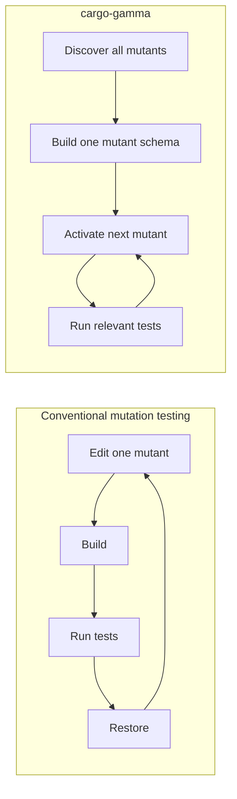
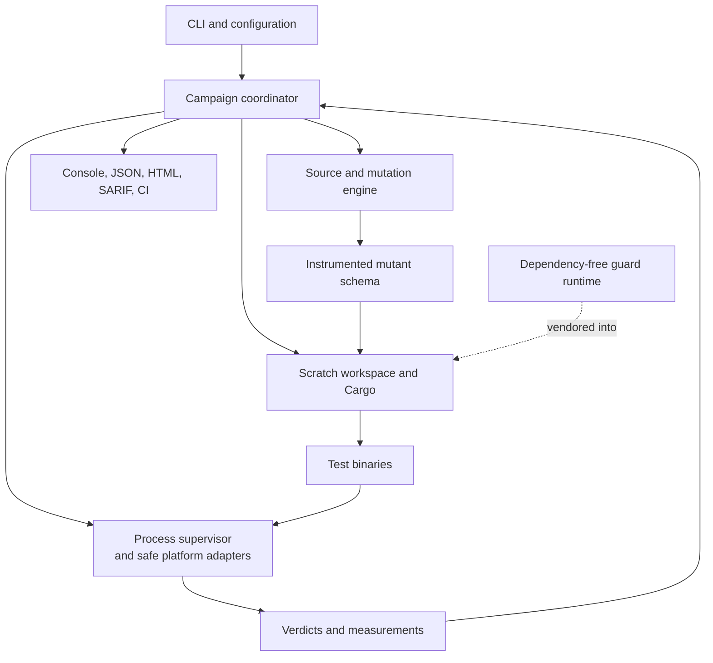
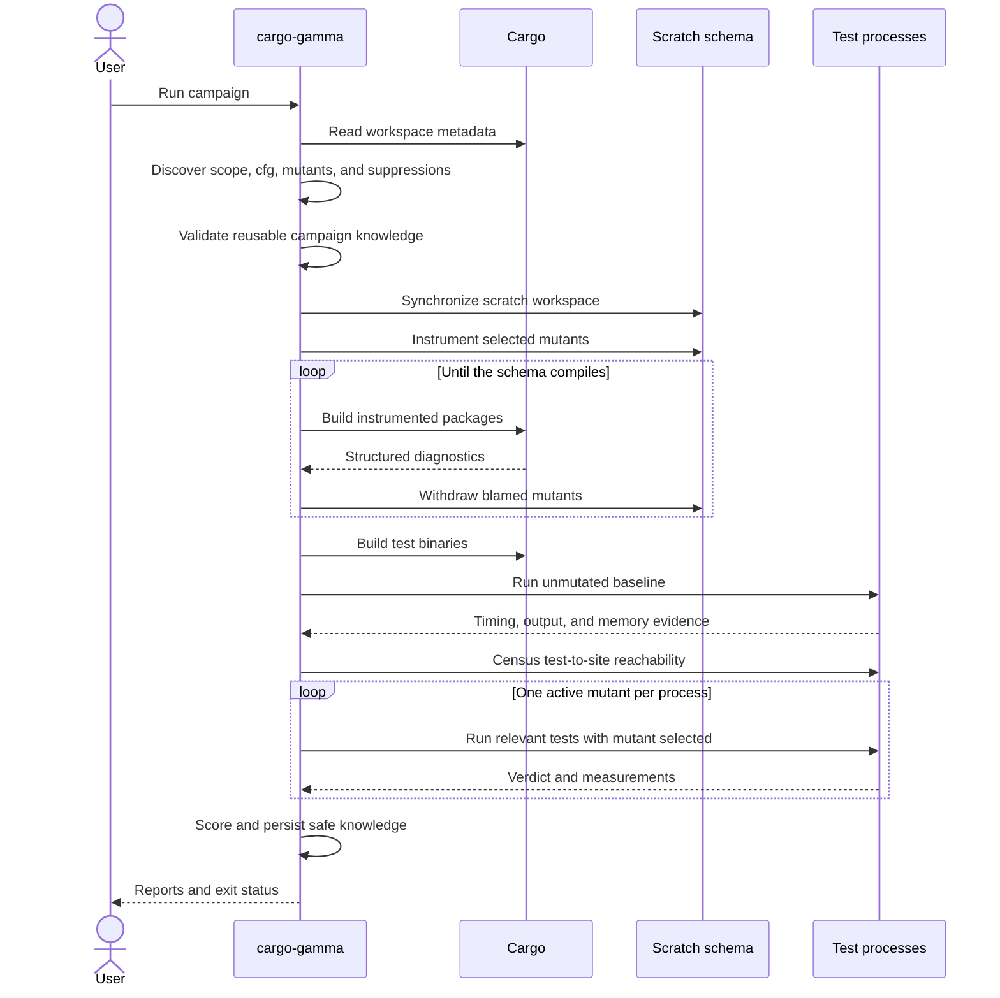

# How cargo-gamma works

This document describes the architecture of cargo-gamma: the model that makes it fast, the stages
of a mutation campaign, the boundaries that preserve correctness, and the trade-offs the design
makes. It intentionally does not describe source modules, internal helper types, test fixtures, or
how to extend the implementation.

For commands, configuration, mutator names, and operational advice, see
[the README](../README.md).

## Contents

- [The architectural idea](#the-architectural-idea)
- [System boundaries](#system-boundaries)
- [A campaign from start to finish](#a-campaign-from-start-to-finish)
- [Discovering the campaign](#discovering-the-campaign)
- [Representing every mutant in one program](#representing-every-mutant-in-one-program)
- [Building a viable schema](#building-a-viable-schema)
- [The scratch workspace](#the-scratch-workspace)
- [Establishing the oracle](#establishing-the-oracle)
- [Selecting only tests that can matter](#selecting-only-tests-that-can-matter)
- [Executing mutants safely](#executing-mutants-safely)
- [Identity and knowledge across campaigns](#identity-and-knowledge-across-campaigns)
- [Verdicts and scoring](#verdicts-and-scoring)
- [Reports and integrations](#reports-and-integrations)
- [Correctness principles](#correctness-principles)
- [Costs and limitations](#costs-and-limitations)

## The architectural idea

Mutation testing asks whether a test suite would detect small defects. A conventional mutation
tester changes one location, recompiles, runs tests, restores the source, and repeats:

```text
total cost ≈ mutants × (build + tests)
```

That model becomes impractical when a workspace has thousands of mutants and compilation takes
minutes.

cargo-gamma instead compiles all selected mutants into one set of test binaries. Each mutation is
placed behind a runtime guard, and a process-local selector activates exactly one guard:

```text
total cost ≈ one instrumented build + mutants × selected tests
```

This representation is a **mutant schema**. It removes compilation from the per-mutant loop. The
remaining problem is to minimize the tests and process time needed to decide each verdict without
changing the verdict itself.



The design therefore optimizes three different costs:

1. **Fixed campaign cost:** discovery, copying, instrumentation, and one build.
2. **Per-mutant cost:** process launch plus the tests capable of observing that mutant.
3. **Failure cost:** extra time needed to classify compilation failures, hangs, flaky behavior,
   and excessive memory use without turning them into false detections.

## System boundaries

The architecture has four principal domains.



### Campaign coordinator

The coordinator owns policy: command and configuration precedence, package and test selection,
incremental reuse, scheduling, scoring, and reporting. It combines evidence from the other domains
but does not parse Rust or implement operating-system containment itself.

### Source and mutation engine

The engine discovers mutation sites, evaluates source-level suppression, gives sites stable
identities, and emits instrumented source. It is deterministic for a given source and mutation
selection. It does not know about Cargo processes, test verdicts, timeouts, or reports.

### Scratch workspace and Cargo

The workspace boundary keeps all rewriting away from the checkout. It prepares a buildable copy,
injects the guard runtime, preserves Cargo's view of path dependencies and configuration, and owns
the build artifacts reused during the campaign.

### Process supervisor

The supervisor launches one contained process tree, observes output and resource use, and guarantees
that termination reaches descendants. Campaign policy decides whether the observed process means
pass, kill, timeout, stall, or memory exhaustion; the supervisor provides the race-sensitive
mechanism.

### Guard runtime

The injected runtime is intentionally tiny, dependency-free, and independent of cargo-gamma's own
dependency graph. Adding dependencies, features, or a build script to it could perturb feature
unification in the workspace under test and change what the tests prove.

## A campaign from start to finish

A campaign is an ordered evidence pipeline. Later stages depend on facts established by earlier
ones; they are not interchangeable background jobs.



The visible phases correspond to these architectural stages:

- **Analyzing:** configuration, Cargo metadata, source discovery, and any safe incremental
  validation.
- **Copying:** synchronizing the checkout into the scratch workspace.
- **Mutating and building:** collecting candidates, rewriting source, and converging on a schema
  Cargo accepts.
- **Baselining:** proving the unmutated test oracle is green and measuring its behavior.
- **Optimizing:** learning which tests reach which mutation sites.
- **Testing:** activating and judging the remaining mutants.
- **Reporting:** projecting one verdict set onto its output surfaces.

## Discovering the campaign

Discovery answers four questions before source is changed:

1. Which Cargo packages and targets are in scope?
2. Which source files are compiled under the selected features, target, profile, and Rust flags?
3. Which mutation sites and suppressions exist in those files?
4. Which test targets can link each mutated package?

Cargo metadata supplies package ownership, target roots, features, and dependency relationships.
The selected Cargo build settings also determine the active `cfg` predicates. Treating source that
the build never compiles as ordinary live code would create mutants no test could execute and
misreport them as test-suite failures.

The source engine parses Rust for structure and spans but rewrites the original bytes rather than
pretty-printing an AST. Textual rewriting preserves comments, formatting, macros, and literal
spelling. Byte-accurate spans are therefore part of the correctness model, not merely an
implementation choice.

Selection narrows the population before expensive work:

- package, file, mutator, and diff selection decide what may become a mutant;
- conditional-compilation evidence excludes code absent from this build;
- suppressions withdraw explicitly accepted sites;
- sharding assigns stable portions of the population to separate campaigns.

In-source suppression has two equivalent channels. Whole items can use the inert
`#[gamma::skip]` attribute supplied by the `cargo-gamma-attrs` package. Statements and expressions,
where custom attributes remain unstable, can use the comment spelling
`// #[gamma::skip(...)]`. The source engine interprets the comment form;
the attribute crate validates the compiled form while expanding to the annotated item unchanged.
For `cfg_attr`, a definitely false predicate leaves the nested directive inactive, a true
predicate applies it, and an unknown predicate applies it conservatively rather than manufacturing
a survivor the author believed suppressed.

Every uncertainty fails toward **keeping** work. Running an unnecessary mutant costs time; silently
dropping a valid mutant improves the score without evidence.

## Representing every mutant in one program

An expression mutation is encoded as a branch:

```rust
// original
a < b

// instrumented
(if ::gamma_rt::a(7u32) { (a) <= (b) } else { a < b })
```

The environment selects ordinal `7` for the lifetime of one test process. All other guards return
false and execute the original program.

Blocks and statements use equivalent forms suited to their syntax:

| Site | Schema form |
|---|---|
| Expression | Produce the replacement value |
| Block | Replace the block body |
| Iterator-returning block | Wrap original and replacement in a shared `Either` type so opaque `impl Iterator` arms agree |
| Loop control | Conditionally execute the replacement while retaining the original diverging tail |
| Statement | Delete or replace the statement |
| Match-arm pattern | Add a false guard so matching falls through to a later wildcard arm |

Statement deletion is split into concrete mutators such as `stmt.delete_call` and
`stmt.delete_assign`, so selection and suppression name the operation precisely.

### Exactly one active mutant

Only one mutant is active in a process. This invariant has three consequences:

- a failing test can be attributed to one mutant;
- workers can share immutable binaries safely;
- nested guards need instrumented children only in their original branch.

The last point prevents exponential source growth. If an outer mutant is active, no nested mutant
can also be active, so the outer replacement arm can contain plain original text. Deeply nested
sites can still make the encoding grow superlinearly because enclosing guards repeat parts of the
original expression.

### Semantic restraint

Instrumentation duplicates source text rather than introducing temporary bindings. A temporary
could change moves, borrows, short-circuit behavior, or destruction order. The schema may affect
code size, inlining, and layout, but it must preserve the unmutated program's observable semantics.

The selection channel is process-local environment state captured by the runtime. On Linux the
runtime reads the immutable environment image saved by `exec`, so an earlier native constructor
cannot race the capture by starting a thread that changes the live environment. cargo-gamma sets
variables on each child before launch and never mutates its own environment to select mutants.
Absence and acquisition failure are distinct: absence selects the baseline, while an open or read
failure emits a fixed runtime marker and terminates startup. The parent recognizes that marker
before interpreting either libtest or nextest status and records the run as unmetered, so a mutant
that was requested but never activated cannot become a phantom survivor or kill.

## Building a viable schema

Some syntactically valid mutations are not well typed. A replacement may require a trait the
original type does not implement, or may violate a type-specific operator rule. In a mutant schema,
one such mutation can prevent every test binary from being built.

cargo-gamma resolves this with a rollback fixpoint:

1. Instrument the currently admitted population.
2. Ask Cargo to build while continuing past independent failures.
3. Attribute structured compiler diagnostics to mutation guards.
4. Withdraw every blamed mutant.
5. Rewrite only files whose admitted population changed.
6. Repeat until the schema compiles or convergence can no longer be established safely.

Withdrawn mutants are reported as unviable. They are not silently discarded, because the score is
meaningful only when its excluded population remains visible.

Workspace packages are handled in dependency order so that failures are localized and useful work
can progress without waiting for one global rollback loop. A final workspace build applies Cargo's
real feature unification and produces the test binaries.

Diagnostic attribution uses guard locations in the instrumented text, not original line numbers.
Instrumentation changes line positions, and nested mutations can share original spans. The mutated
branches themselves do not overlap, allowing a compiler error inside a branch to identify the
specific replacement that caused it.

## The scratch workspace

The checkout is never instrumented in place. cargo-gamma maintains a scratch area containing:

- a synchronized source workspace under `workspace/`;
- the vendored guard runtime;
- Cargo build artifacts under `target/`;
- incremental campaign records and transient execution data.

Normal runs publish `gamma-report.json`, `gamma-report.html`, `gamma-report.sarif`,
`gamma-perf-advice.md`, and `gamma-diagnostics.json` under the original workspace's
`target/cargo-gamma/`. `last-gamma-run.json` and `gamma-progress.log` remain cache state. An explicit
`--cache-dir` relocates only reusable cache state. `--artifact-dir` relocates all five published
artifacts together, and its directory is created when absent.

The source tree preserves symlinks and honors workspace ignore rules. Relative path dependencies
that leave the workspace are anchored to their original locations so moving the workspace does not
change Cargo's dependency graph.

Only one cargo-gamma command may operate on an original workspace at a time. A process-held lock in
that workspace's default external cache applies even when `--cache-dir` redirects reusable state.
Conditional source, configuration, and hints publication uses this lock on every platform, so
Windows never needs persistent sibling lock files in the checkout.

An explicit `--cache-dir` names the cache base itself and must be empty on first use. cargo-gamma
writes an ownership marker tying it to the original workspace and takes a second process-held lock
for that cache. An unmarked non-empty directory and a cache owned by another workspace are refused
before migration, synchronization, or cleanup can alter their contents. The two lock domains
prevent both collisions: commands sharing an original workspace cannot race publication, and
different workspaces cannot race over redirected reusable state. The operating system releases
both locks automatically when their owner exits.

Successful campaigns retain the synchronized tree and build artifacts. A later campaign performs a
delta synchronization:

- byte-identical inputs remain untouched, preserving Cargo's incremental state;
- changed inputs are replaced and receive a fresh modification time;
- inputs removed from the checkout are removed from the cached workspace;
- generated artifacts remain outside the synchronized source tree.

`cargo gamma clean` takes the campaign lock and removes the workspace-specific cache contents. It
does not remove published reports under `target/cargo-gamma`, durable hints, or source suppressions.

Correct invalidation is more important than avoiding a copy. Preserving an old timestamp on changed
bytes could let Cargo reuse an artifact compiled from stale source.

## Establishing the oracle

The **oracle** is the set of tests allowed to decide a mutant's verdict. It is established before
any mutant is judged. Warnings about unusually expensive test harnesses are restricted to this set,
so tests in unrelated workspace packages are not presented as costs of the run.

### Baseline

The unmutated test binaries run first. A red baseline stops the campaign: if a test already fails,
every mutant appears detected and the mutation score becomes meaningless.

The baseline also measures:

- duration per test binary;
- the longest legitimate period without harness progress;
- peak memory where the host can measure it.

Timeout, stall, and memory policies derive from these observations rather than from a machine-
independent constant. The baseline and mutant runs use the same harness and execution environment.

### Harnesses

By default, cargo-gamma launches libtest binaries directly. Direct launch avoids invoking Cargo for
every mutant.

Nextest mode provides process isolation for suites that cannot run safely on libtest's shared
threaded process. cargo-gamma prepares nextest's description of the already-built binaries once,
then reuses it; allowing nextest to rebuild for every mutant would reintroduce compilation into the
inner loop.

## Selecting only tests that can matter

After removing per-mutant builds, test execution is the dominant cost. cargo-gamma narrows it using
evidence that preserves the verdict.

### Package reachability

By default, each mutant is judged only by test binaries from the package that owns it. A
whole-workspace campaign therefore behaves like one package-local campaign per member rather than
letting reverse dependents improve another package's score. `--test-package` names a different
oracle, and `--test-workspace` admits every workspace package.

Within the admitted package set, a test binary cannot execute code it does not link. The Cargo
dependency graph identifies binaries that cannot reach a mutated package, and those binaries are
omitted. Uncertain relationships are treated as reachable.

### Guard census

Package reachability is coarse: many tests link a crate but never execute a particular line. The
guard runtime therefore has a census mode in which guards record that their sites were reached while
always returning the original branch.

Only test binaries that can reach selected pending mutants are census candidates, and only those
mutants' sites are retained. Each test is run separately when the census proceeds. Its recorded site
set becomes the exact candidate set for that test under deterministic execution:

- if the baseline test reaches a site, it can observe that site's mutant;
- if it does not reach the site, activating the site cannot change anything before the site is
  reached, so that test remains irrelevant.

Case selection must pay for itself. Listing launch time is multiplied by the number of listed cases
as a startup-cost estimate. The census is skipped when that estimate is at least the serial upper
bound on everything selection could save: one whole baseline duration per reachable
mutant/binary pair. If it proceeds, that upper bound is also the census deadline. Sampling a binary
stops once every selected site has been reached by more than half its tests, because the sweep would
run that binary whole for every such site regardless of further attribution.

Only a complete, non-empty census can exclude a test or establish that a site is uncovered. Positive
reach observations collected before the deadline are retained as checked hints. A filtered census
failure is provisional and the whole binary is rerun before assigning its canonical outcome,
because filtering changes runtime, peak memory, and failure order. Incomplete-census cases run
first only when filtering cannot bypass another outcome from that binary, and any result other than
a kill falls back to the whole binary. A malformed, empty, absent, or failed sample discards that
binary's census. Unmeasured reach always means “run everything,” never “nothing was reached.”

Each census file belongs to one process. A descendant that inherits `GAMMA_CENSUS` and links the
runtime appends a second census to the same file; the reader detects records after the first seal,
discards the binary's census, and safely falls back to running its complete tests for every mutant.

Suites whose reachability is nondeterministic can disable census-based narrowing and use complete
test binaries.

### Cheapest evidence first

Prior killers narrow work only after canonical iteration reaches their binary. A previous killer is
only a hint: when its test is rerun, it must convict again, and filtering is used only when that
binary cannot instead produce a resource, confirmation-flake, or metering outcome. If the hint
cannot be used or does not convict, normal testing continues. Stale hints can waste work but cannot
settle or change a verdict.

The first observed test failure settles a mutant, so remaining tests are stopped. This is safe only
when harness output is unambiguous; modes that interleave user output with harness protocol disable
early interpretation and fall back to the process exit status.

## Executing mutants safely

Workers share the immutable schema and build artifacts. For each mutant they launch a fresh process
with that mutant's ordinal selected. One process provides isolation for environment state, static
state, crashes, and resource accounting.

Every launch is treated as a process **tree**, not a single PID. Tests may start servers, child
tools, or nested Cargo processes. Timeout and cancellation must terminate descendants as well as the
direct test binary.

Platform containment uses the strongest suitable primitive:

- Unix process groups provide descendant-directed signaling;
- Linux cgroup v2 provides process-tree memory accounting and enforcement;
- Windows job objects provide descendant lifetime and memory control.

Containment is active before user code can escape into an untracked descendant. Cleanup follows an
observe, terminate, release, and reap lifecycle so that slots and platform resources cannot be
reused while an earlier process tree still exists.

### Timeouts and stalls

A hard timeout is calibrated from baseline duration. Suspected timeouts receive a confirmation run
with a larger budget because a loaded host can starve a healthy process, and a false timeout lowers
the score and can fail the run.

The stall detector uses harness progress rather than additional instrumentation. A mutant process
that remains silent far longer than the baseline's longest silence is terminated early. Without a
baseline there is no honest silence threshold, so stall detection is disabled. The last test the
harness announced is a landmark rather than a diagnosis because parallel harnesses announce tests
when they finish, not when they begin.

### Memory

Memory ceilings derive from each baseline binary's peak plus configured multiplier and headroom.
Exceeding the ceiling is distinct from a test failure or timeout because the remedy is different.

When the host cannot provide trustworthy process-tree enforcement, inherited defaults degrade
explicitly, while a user-requested guarantee fails rather than pretending to be active.

### Flakiness

A failing mutant run is confirmed where policy requires it. A failure that disappears without any
source change is reported as flaky rather than credited as a kill. Flaky evidence must not improve
the score or become durable campaign knowledge.

## Identity and knowledge across campaigns

Line numbers are unsuitable mutant identities: formatting or inserting a function would rename the
whole population. A mutant ID instead derives from stable semantic context, including:

- workspace-relative file;
- enclosing item identity;
- mutator and replacement;
- normalized source at the site;
- occurrence and `replacement_index` where needed to distinguish repeated forms.

Comments and insignificant inter-token whitespace do not move an identity; literal contents do.
The digest is rendered as twelve hex characters. The identity joins reports, shards, suppressions,
SARIF findings, and incremental records.

### Incremental knowledge

The scratch area stores facts and hints learned by an earlier campaign:

| Knowledge | How it is reused | Why it is safe |
|---|---|---|
| Build ordering | Tried first, then checked by the compiler | A stale order changes cost only |
| Prior killer | Test is tried first, then must fail again | A stale hint changes cost only |
| Unviability | Reused only under matching compilation context and source | Otherwise a valid mutant could disappear from the score |
Test verdicts are never reused. A kill is one observation of a potentially nondeterministic test
suite; unchanged source, configuration, toolchain, and environment cannot prove that the next
observation will agree. Each run therefore re-establishes every score-bearing outcome.

Build incremental mode captures compilation inputs before execution. It reads and hashes regular
workspace files and external path dependencies while excluding generated build, version-control, and
cached workspaces.

Build scripts can read paths Cargo does not declare. When their complete input set cannot be known,
unviability reuse is disabled rather than guessed.

`--incremental no` and dry runs do not probe cache context, resolve cache-only external inputs,
hash the workspace, or load a prior campaign record.

### Durable hints and suppressions

Build-order and killer hints can be promoted into a version-controlled artifact because they never
settle a verdict without being checked. Deleting that artifact can cost time but cannot change the
answer.

Suppression is different. It is a reviewed policy decision and therefore lives in source or
configuration, not in an ephemeral cache. A cache directory must always be safe to delete without
losing accepted policy. A run that produces a timeout or out-of-memory verdict points to
`cargo gamma suppress`, which writes the corresponding reviewed suppression.

### Sharding and merging

Mutants are assigned to shards with stable hashing so changing the shard count moves only the
necessary fraction of the population. Reports merge by mutant identity, keeping freshness and
withdrawal explicit.

A shard describes only its slice and cannot prove that a missing mutant was withdrawn. Only an
unsharded, complete population can withdraw identities from an accumulated report.

## Verdicts and scoring

A verdict states what evidence the campaign obtained:

| Verdict | Meaning | Score treatment |
|---|---|---|
| `killed` | A relevant test failed with the mutant active | Detected |
| `timeout` | The mutant exceeded a confirmed time or stall budget before an assertion rejected it | Undetected |
| `outofmem` | The mutant exceeded its memory ceiling before an assertion rejected it | Undetected |
| `survived` | Every relevant test passed | Undetected |
| `uncovered` | No test reached the mutation site | Undetected |
| `unviable` | The mutation could not compile | Excluded |
| `ignored` | Explicit policy suppressed the mutant | Excluded |
| `notbuilt` | The selected build did not compile that source | Excluded |
| `flaky` | The observed failure was not repeatable | Excluded and retried |

The mutation score is:

```text
detected / (detected + undetected)
```

Only `killed` enters the numerator. Timeouts and memory exhaustion establish that the mutant
changed resource behavior, but they remain undetected because no test assertion rejected the
change. Consequently, `--min-score 100` fails closed on either outcome.

Excluded mutants remain visible but make no claim about test quality because they were never
validly judged.

An empty denominator is printable but not gradeable. A score gate must fail structurally when no
mutant was judged; it must never pass by interpreting an empty campaign as 100 percent.

The distinctions between `survived`, `uncovered`, `unviable`, and `notbuilt` are architectural:
they may all involve no failing test, but they prescribe different action. Collapsing them would
make the report easier to serialize and harder to use correctly.

## Reports and integrations

One verdict model feeds every output surface:

- the console emphasizes actionable survivors and exceptional resource outcomes;
- the mutation-testing-elements JSON report is the interchange artifact;
- the HTML report provides a browsable, optionally self-contained view;
- SARIF and CI annotations place survivors on changed source;
- the diagnostics bundle records campaign phases and measurements;
- the progress journal preserves completed verdict lines if a campaign is interrupted.

Console guidance is labelled `Hint`; incomplete, truncated, or unsaved output is labelled
`warning`. Routine internal adjustments are silent.

Reports are projections, not independent calculations. The console, JSON, HTML, merged report, and
score gate must agree because they consume the same outcomes and scoring rules.

Limits imposed by CI platforms are explicit. Truncating annotations or SARIF silently would make a
successful upload look like the complete result.

## Correctness principles

The architecture is governed by a small set of rules.

### Never improve the score on uncertainty

Ambiguous source stays in scope. Unknown reachability runs more tests. Missing census data runs the
whole binary. Untrusted cache state is ignored. These choices may cost time but cannot hide a
test-suite gap.

### Measure before deriving policy

Timeouts, stall thresholds, memory ceilings, and test ordering derive from the same baseline and
host that judge the mutants. Cross-machine constants would be simultaneously too tight and too
loose.

### Keep policy separate from mechanism

The source engine does not decide verdicts. The process supervisor does not decide score treatment.
The runtime does not know campaign policy. This keeps safety-critical platform behavior from being
entangled with user-facing choices.

### One mutant, one process, one explanation

Exactly one active mutant keeps causality clear. A process failure, timeout, or memory event belongs
to one source change, and a report can explain that change without disentangling interactions among
mutants.

### Caches may save time, never supply faith

Durable verdicts require matching source, build, execution context, workspace inputs, and test
evidence. Weaker information may influence order but not outcome. Deleting all cached state changes
performance only.

### Refuse silent configuration failures

Unknown configuration, unmatched selectors, and impossible test filters are errors. A campaign that
quietly ignores user intent can produce a precise score for the wrong population.

## Costs and limitations

The mutant-schema design makes large campaigns practical, but it is not free.

- **The instrumented build is larger and slower.** Source duplication and guards increase compile
  time and may affect inlining and code layout. Instrumented binaries are not suitable for
  benchmarking application performance.
- **One bad mutation can affect the shared build.** The rollback loop contains this cost, but each
  convergence round is sequential fixed work.
- **Process launch remains per mutant.** Activating several mutants together would confound
  causality, so launch overhead is the floor left after compilation is removed.
- **Survivors remain expensive.** Proving that nothing detects a mutant requires exhausting all
  relevant tests. Better-tested code is generally faster to mutation-test because kills terminate
  early.
- **Deterministic census reachability is an assumption.** Nondeterministic suites may need whole-
  binary execution, trading speed for a conservative oracle.
- **Doctests are outside the model.** Rust compiles them as separate programs, which would
  reintroduce per-mutant compilation.
- **Guards perturb generated code.** They preserve intended unmutated semantics but alter size and
  layout, and may expose stack or compiler limits in unusually deep code.
- **Resource containment depends on the host.** Linux and Windows provide strong process-tree
  facilities; other environments may provide less, and requested guarantees are refused when they
  cannot be honored.
- **The workspace environment must be sound on platforms without an immutable startup image.**
  Linux reads the environment snapshot captured by `exec`; other Unix targets rely on constructor-
  time capture and therefore cannot support an earlier native initializer concurrently mutating
  the process environment.

The central trade remains favorable for large Rust workspaces: pay a more complex fixed build once
to remove compilation from thousands of mutant decisions, then spend effort only where evidence is
still needed.
