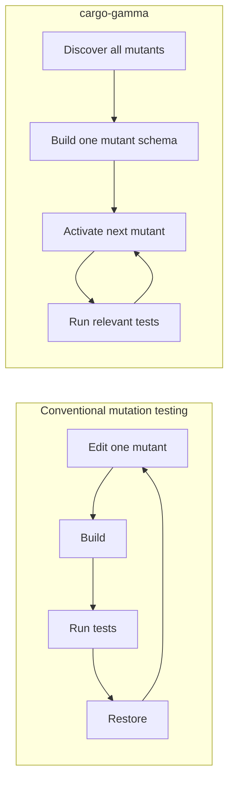
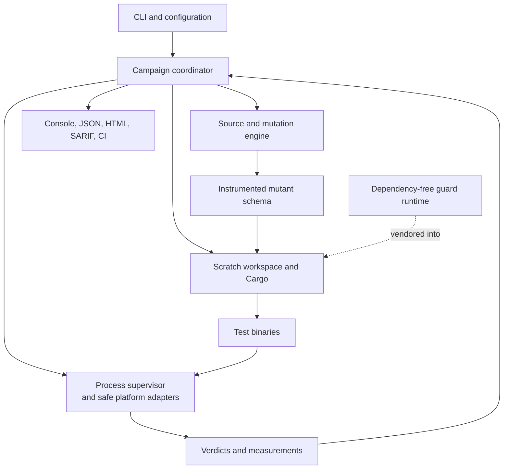
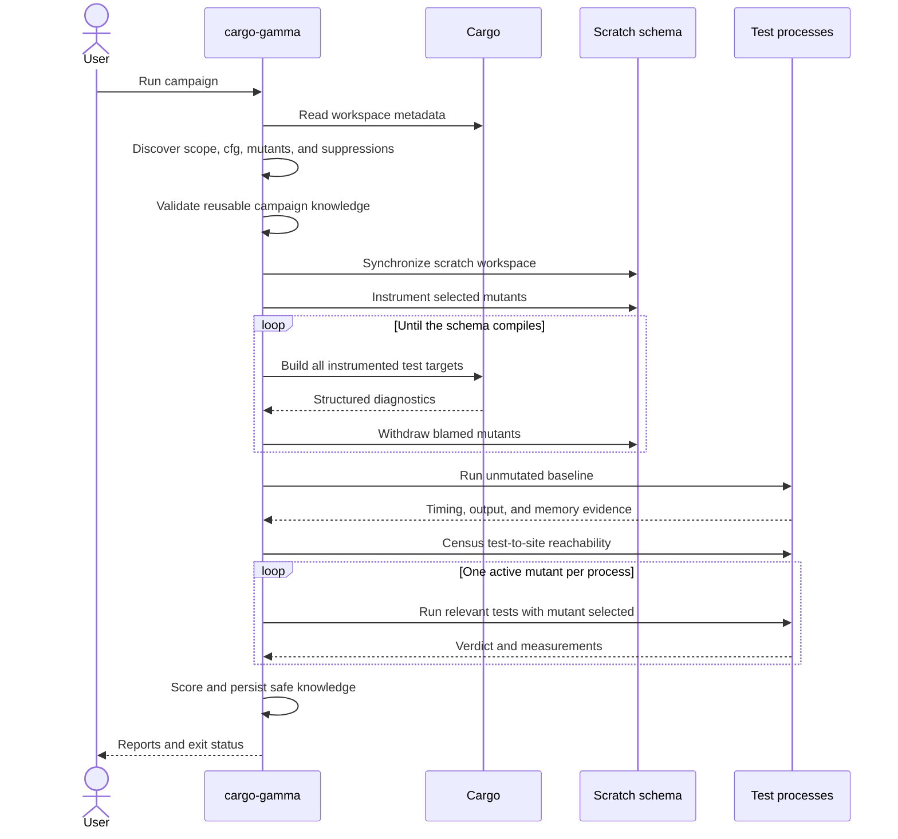

# How cargo-gamma works

This document describes the architecture of cargo-gamma: the model that makes it fast, the stages
of a mutation campaign, the boundaries that preserve correctness, and the trade-offs the design
makes. It intentionally does not describe source modules, internal helper types, test fixtures, or
how to extend the implementation.

Those mechanics are recorded in the [implementation guide](IMPLEMENTATION.md).

For commands, configuration, mutator names, and operational advice, see
[the README](../README.md).

## Contents

- [The architectural idea](#the-architectural-idea)
- [System boundaries](#system-boundaries)
- [A campaign from start to finish](#a-campaign-from-start-to-finish)
- [Discovering the campaign](#discovering-the-campaign)
- [Representing every mutant in one program](#representing-every-mutant-in-one-program)
- [Building a viable schema](#building-a-viable-schema)
- [The scratch workspace](#the-scratch-workspace)
- [Establishing the oracle](#establishing-the-oracle)
- [Selecting only tests that can matter](#selecting-only-tests-that-can-matter)
- [Executing mutants safely](#executing-mutants-safely)
- [Identity and knowledge across campaigns](#identity-and-knowledge-across-campaigns)
- [Verdicts and scoring](#verdicts-and-scoring)
- [Reports and integrations](#reports-and-integrations)
- [Correctness principles](#correctness-principles)
- [Costs and limitations](#costs-and-limitations)

## The architectural idea

Mutation testing asks whether a test suite would detect small defects. A conventional mutation
tester changes one location, recompiles, runs tests, restores the source, and repeats:

```text
total cost ≈ mutants × (build + tests)
```

That model becomes impractical when a workspace has thousands of mutants and compilation takes
minutes.

cargo-gamma instead compiles all selected mutants into one set of test binaries. Each mutation is
placed behind a runtime guard, and a process-local selector activates exactly one guard:

```text
total cost ≈ one instrumented build + mutants × selected tests
```

This representation is a **mutant schema**. It removes compilation from the per-mutant loop. The
remaining problem is to minimize the tests and process time needed to decide each verdict without
changing the verdict itself.


```mermaid
flowchart LR
    subgraph Conventional["Conventional mutation testing"]
        C1[Edit one mutant] --> C2[Build]
        C2 --> C3[Run tests]
        C3 --> C4[Restore]
        C4 --> C1
    end

    subgraph Gamma["cargo-gamma"]
        G1[Discover all mutants] --> G2[Build one mutant schema]
        G2 --> G3[Activate next mutant]
        G3 --> G4[Run relevant tests]
        G4 --> G3
    end
```

The design therefore optimizes each component of campaign cost:

1. **Fixed campaign cost:** discovery, copying, instrumentation, and one build.
2. **Per-mutant cost:** process launch plus the tests capable of observing that mutant.
3. **Failure cost:** extra time needed to classify compilation failures, hangs, flaky behavior,
   and excessive memory use without turning them into false detections.

## System boundaries

The architecture separates responsibilities into the following domains.


```mermaid
flowchart TB
    User[CLI and configuration] --> Coordinator[Campaign coordinator]
    Coordinator --> Engine[Source and mutation engine]
    Coordinator --> Workspace[Scratch workspace and Cargo]
    Coordinator --> Supervisor[Process supervisor<br/>and safe platform adapters]

    Engine --> Schema[Instrumented mutant schema]
    Schema --> Workspace
    Workspace --> Binaries[Test binaries]
    Binaries --> Supervisor
    Supervisor --> Verdicts[Verdicts and measurements]
    Verdicts --> Coordinator
    Coordinator --> Reports[Console, JSON, HTML, SARIF, CI]

    Runtime[Dependency-free guard runtime] -. vendored into .-> Workspace
```

### Campaign coordinator

The coordinator owns policy: command and configuration precedence, package and test selection,
incremental reuse, scheduling, scoring, and reporting. It combines evidence from the other domains
but does not parse Rust or implement operating-system containment itself.

The command-line surface follows the same boundary: each subcommand exposes only settings consumed
by that operation. Run-only controls such as progress are not global. `list` separates population
and registry modes so `list mutants`, `list files`, `list mutators`, and `list presets` each
document only their applicable selection and output controls; bare `list` remains shorthand for
`list mutants`.

### Source and mutation engine

The engine discovers mutation sites, evaluates source-level suppression, gives sites stable
identities, and emits instrumented source. It is deterministic for a given source and mutation
selection. Each candidate records whether source-visible evidence proves the replacement,
whether it is an unresolved optimistic guess, or whether the user explicitly supplied it. The
classification is diagnostic evidence rather than an automatic filter. The ordinary default
withholds only measured noisy optimistic site classes; a non-default selector that includes the
applicable mutator admits them. `explain` and `list mutators` expose which mutators apply this
explicit-selection rule. The engine does not know about Cargo processes, test verdicts, timeouts,
or reports.

### Scratch workspace and Cargo

The workspace boundary keeps all rewriting away from the checkout. It prepares a buildable copy,
injects the guard runtime, preserves Cargo's view of path dependencies and configuration, and owns
the build artifacts reused during the campaign.

### Process supervisor

The supervisor launches one contained process tree, observes output and resource use, and guarantees
that termination reaches descendants. Campaign policy decides whether the observed process means
pass, kill, timeout, stall, or memory exhaustion; the supervisor provides the race-sensitive
mechanism.

### Guard runtime

The injected runtime is intentionally tiny, dependency-free, and independent of cargo-gamma's own
dependency graph. Adding dependencies, features, or a build script to it could perturb feature
unification in the workspace under test and change what the tests prove.

Every instrumented package is linked to the same runtime vendored for the campaign. An existing
dependency on cargo-gamma's implementation crate is redirected to that copy; an unrelated
dependency occupying the `gamma_rt` crate name is refused. This keeps every guard in one test
process on the same active-mutant and census state. Redirecting an existing dependency preserves
its `features` and `default-features` settings — including workspace-level declarations, member
overrides of `workspace = true`, and target-specific declarations — so a package that already opted
into a runtime feature keeps that selection after the redirect.

## A campaign from start to finish

A campaign is an ordered evidence pipeline. Later stages depend on facts established by earlier
ones; they are not interchangeable background jobs.


```mermaid
sequenceDiagram
    actor User
    participant Gamma as cargo-gamma
    participant Cargo
    participant Schema as Scratch schema
    participant Tests as Test processes

    User->>Gamma: Run campaign
    Gamma->>Cargo: Read workspace metadata
    Gamma->>Gamma: Discover scope, cfg, mutants, and suppressions
    Gamma->>Gamma: Validate reusable campaign knowledge
    Gamma->>Schema: Synchronize scratch workspace
    Gamma->>Schema: Instrument selected mutants

    loop Until the schema compiles
        Gamma->>Cargo: Build all instrumented test targets
        Cargo-->>Gamma: Structured diagnostics
        Gamma->>Schema: Withdraw blamed mutants
    end

    Gamma->>Tests: Run unmutated baseline
    Tests-->>Gamma: Timing, output, and memory evidence
    Gamma->>Tests: Census test-to-site reachability

    loop One active mutant per process
        Gamma->>Tests: Run relevant tests with mutant selected
        Tests-->>Gamma: Verdict and measurements
    end

    Gamma->>Gamma: Score and persist safe knowledge
    Gamma-->>User: Reports and exit status
```

The visible phases correspond to these architectural stages:

- **Analyzing:** configuration, Cargo metadata, and discovery of the workspace source scope.
- **Copying:** synchronizing the checkout into the scratch workspace.
- **Mutating:** collecting candidates and rewriting every selected target package.
- **Building:** checking all instrumented test targets together, withdrawing compiler-rejected
  mutants until the complete schema checks, then building the converged binaries once.
- **Baselining:** proving the unmutated test oracle is green and measuring its behavior.
- **Optimizing:** learning which tests reach which mutation sites.
- **Testing:** activating and judging the remaining mutants.
- **Reporting:** projecting one verdict set onto its output surfaces.

## Discovering the campaign

Discovery answers four questions before source is changed:

1. Which Cargo packages and targets are in scope?
2. Which source files are compiled under the selected features, target, profile, and Rust flags?
3. Which mutation sites and suppressions exist in those files?
4. Which test targets can link each mutated package?

Cargo metadata supplies package ownership, target roots, features, and dependency relationships.
The selected Cargo build settings also determine the active `cfg` predicates. Treating source that
the build never compiles as ordinary live code would create mutants no test could execute and
misreport them as test-suite failures.

The source engine parses Rust for structure and spans but rewrites the original bytes rather than
pretty-printing an AST. Textual rewriting preserves comments, formatting, macros, and literal
spelling. Byte-accurate spans are therefore part of the correctness model, not merely an
implementation choice.

Selection narrows the population before expensive work:

- package, file, mutator, and diff selection decide what may become a mutant;
- conditional-compilation evidence excludes code absent from this build;
- explicitly tagged project policy can mark every implementation whose final written trait-path
  segment is a named unqualified Rust identifier as ignored, without coupling selection to path
  qualification or human-readable report text;
- suppressions withdraw explicitly accepted sites;
- sharding assigns stable portions of the population to separate campaigns.

Trait-name policy is deliberately lexical. `impl Debug`, `impl fmt::Debug`, and
`impl core::fmt::Debug` share the final written identifier `Debug`, while an imported alias retains
the identifier written in the implementation. Without rustc name resolution, discovery cannot
semantically distinguish identically named imported traits. Matching mutants remain in reports
with an `ignored` verdict and configuration suppression reason. Each rule records whether it
matched during discovery, and an unmatched rule is a usage error rather than a silent no-op; this
makes a typo in selection policy visible before it can quietly change the mutation population.

In-source suppression has two equivalent channels. Whole items can use the inert
`#[gamma::skip]` attribute supplied by the `cargo-gamma-attrs` package. Statements and expressions,
where custom attributes remain unstable, can use the comment spelling
`// #[gamma::skip(...)]`. The source engine interprets the comment form;
the attribute crate validates the compiled form while expanding to the annotated item unchanged.
Both channels permit one timeout multiplier per directive across positional and named spellings;
stating another is a usage error rather than an ordered override. A genuinely bare directive
selects every mutator in scope, while every comma-delimited argument in a non-bare directive must
be non-empty; malformed leading, repeated, comma-only, and trailing commas are usage errors rather
than alternate spellings of the all-mutator form.
For `cfg_attr`, a definitely false predicate leaves the nested directive inactive, a true
predicate applies it, and an unknown predicate applies it conservatively rather than manufacturing
a survivor the author believed suppressed.

The same selector language also supports `#[gamma::expect_survived(...)]` and
`#[gamma::expect_killed(...)]`, with equivalent comment spellings for statements and expressions.
These are assertions about the test oracle, not suppressions: governed mutants still run and still
count normally. Once a governed mutant has a score-bearing outcome, a disagreement fails the
campaign's correctness gate. `expect_killed` requires `killed`;
`expect_survived` accepts every undetected outcome — `survived`, `uncovered`, `timeout`, or
`outofmem` — because its assertion is that the suite did not detect the mutant, not that execution
completed normally. Unviable, ignored, not-built, flaky, and pending mutants prove neither
expectation. An expectation that currently governs no mutant is not reported as an idle
suppression.

`#[gamma::test_timeout_multiplier(...)]` and its `timeout_multiplier` compatibility spelling apply
a positive per-site multiplier to the normal baseline-derived timeout. They change how long the
mutant is allowed to run, not how it is scored, and may be combined with a skip or expectation
directive only when the site states one unambiguous multiplier.

Every uncertainty fails toward **keeping** work. Running an unnecessary mutant costs time; silently
dropping a valid mutant improves the score without evidence.

A file cargo-gamma cannot analyze but `rustc` can build — one nested past the parser's recursion
limit, for instance — is reported as an unanalyzable file rather than failing the campaign, and this
holds whether the file was selected for mutation or read only for the module declarations it
contributes. The reported set is keyed and ordered by absolute path, so narrowing a selection moves
such a file between the two paths without moving it in the report, and two runs over one workspace
name the same files in the same order regardless of which worker claimed which file. When a
declaration-only file is skipped, the modules only it declares are treated as absent, exactly as if
the selection had never mentioned it.

## Representing every mutant in one program

An expression mutation is encoded as a branch:

```rust
// original
a < b

// instrumented
(if ::gamma_rt::a(7u32) { (a) <= (b) } else { a < b })
```

The environment selects ordinal `7` for the lifetime of one test process. All other guards return
false and execute the original program.

Blocks and statements use equivalent forms suited to their syntax:

| Site | Schema form |
|---|---|
| Expression | Produce the replacement value |
| Block | Replace the block body |
| Iterator-returning block | Wrap original and replacement in a shared `Either` type so opaque `impl Iterator` arms agree |
| Iterator-valued expression | Wrap original and replacement in a shared `Either` type so pipeline transformations retain one concrete type |
| Loop control | Conditionally execute the replacement while retaining the original diverging tail |
| Statement | Delete or replace the statement |
| Match-arm pattern | Add a false guard so matching falls through to a later wildcard arm |

Statement deletion is split into concrete mutators such as `stmt.delete_call` and
`stmt.delete_assign`, so selection and suppression name the operation precisely.

### Exactly one active mutant

Only one mutant is active in a process. This invariant has three consequences:

- a failing test can be attributed to one mutant;
- workers can share immutable binaries safely;
- nested guards need instrumented children only in their original branch.

The last point prevents exponential source growth. If an outer mutant is active, no nested mutant
can also be active, so the outer replacement arm can contain plain original text. Deeply nested
sites can still make the encoding grow superlinearly because enclosing guards repeat parts of the
original expression.

### Semantic restraint

Instrumentation duplicates source text rather than introducing temporary bindings. A temporary
could change moves, borrows, short-circuit behavior, or destruction order. The schema may affect
code size, inlining, and layout, but it must preserve the unmutated program's observable semantics.

The selection channel is process-local environment state captured by the runtime. On Linux the
runtime reads the immutable environment image saved by `exec`, so an earlier native constructor
cannot race the capture by starting a thread that changes the live environment. cargo-gamma sets
variables on each child before launch and never mutates its own environment to select mutants.
Absence and acquisition failure are distinct: absence selects the baseline, while an open or read
failure emits a fixed runtime marker and terminates startup. The parent recognizes that marker
before interpreting either libtest or nextest status and records the run as unmetered, so a mutant
that was requested but never activated cannot become a phantom survivor or kill.

That distinction covers the census request as well as the ordinal. An environment image that could
not be read says nothing about whether a census was asked for, so it is never reported as a census
that was not requested; the run fails at startup instead. A census file the coordinator asked for
and never receives would otherwise look like a binary that reached no site at all, which is the one
census answer that can wrongly exclude tests.

Signal delivery interrupts a read without failing it, so the capture retries a bounded number of
times. The budget is spent across the whole capture rather than per read, so a stream of
interruptions cannot refill it between chunks; exhausting it is an acquisition failure like any
other, never a silent absence and never an unbounded spin inside a constructor.

## Building a viable schema

Some syntactically valid mutations are not well typed. A replacement may require a trait the
original type does not implement, or may violate a type-specific operator rule. In a mutant schema,
one such mutation can prevent every test binary from being built.

cargo-gamma resolves this with a rollback fixpoint:

1. Instrument the currently admitted population.
2. Ask Cargo to check every selected test target while continuing past independent failures.
3. Attribute structured compiler diagnostics to mutation guards.
4. Withdraw every blamed mutant.
5. Rewrite only files whose admitted population changed.
6. Repeat until the schema checks or convergence can no longer be established safely.
7. Build the converged test targets once to produce the baseline binaries. If code generation or
   linking exposes a failure that checking could not, converge that final build under the same
   bounded attribution rules.

Withdrawn mutants are reported as unviable. They are not silently discarded, because the score is
meaningful only when its excluded population remains visible.

The source collector prevents a mutation before this loop only when syntax proves the replacement
invalid. Its local evidence distinguishes explicit and inferred integer, unsigned, floating-point,
textual, optional, and temporal values; expected types flow through local returns, arguments,
fields, casts, indices, and initializers. Proven unsigned zeroes do not receive `-1`, proven floats
use floating-point perturbation units, and proven non-additive values do not receive integer
operators. Option-producing chains are kept out of iterator-shaped rewrites. Ambiguous external
trait implementations, constructors, moves, and overloaded operators remain candidates: guessing
that they are invalid could remove a viable survivor and improve the score incorrectly.

Each compiler-blamed unviable mutant retains a bounded reason: rustc's primary error code when
present, a normalized and length-capped primary-message category, and whether a primary span
identified the generated replacement text. Quoted source fragments, path-shaped tokens, and
unbounded rendered diagnostics are not retained. Follow-on diagnostics cannot replace the first
attributed root cause. Proof builds that isolate a compiler failure without an attributable span
use a fixed `isolated compiler failure` category. Mutants abandoned because a build could not be
converged remain `notbuilt`, not unviable.

All selected target packages are instrumented before compilation begins. cargo-gamma asks Cargo to
check their test targets together, letting Cargo schedule independent packages concurrently and one
compiler round withdraw failures from unrelated packages without repeatedly paying for code
generation and linking. After check convergence, one build produces the test binaries consumed by
baseline measurement. Example and benchmark targets are not built: cargo-gamma does not execute
them, so they are not part of its compilation oracle. A selected package with mutations but no test
target is still included in schema checking; after its source is proven buildable, its mutants are
reported uncovered rather than being mistaken for a build cargo-gamma failed to perform.

During convergence, the normal progress display says only how many unviable mutants have been found;
Cargo's per-invocation unit counter and isolation diagnostics are hidden because their changing
denominators do not measure progress toward a converged schema. `--show-build` retains Cargo's raw
build narration for troubleshooting. When convergence completes, cargo-gamma reports the unviable,
viable, and not-built counts. If a diagnostic cannot be attributed directly, cargo-gamma reads the
failing Cargo package and target from the structured message. Isolation starts with mutants in
diagnostic files, expands to the failing package, and only then to that package's transitive dependency cone.
Within each tier, rustc's error code orders mutators whose compile-time effects can plausibly cause
that diagnostic ahead of type- and trait-invariant value changes. The complete tier is always tried
if the compiler does not prove the narrower heuristic sufficient, so unusual const-generic or
downstream effects cannot hide a viable cause. Unrelated and downstream packages never enter the
candidate set. Each proof checks only the failing target and activates exactly the requested
candidate subset; every other pending mutant, including candidates from another tier, is restored
to pristine source. This is what prevents a cross-tier interaction from being blamed on either
member individually.
The implementation retains diagnostic evidence about the admitted population, rewritten-file
count, Cargo reuse and rebuild counts, and failing targets without adding it to the normal console
display. Independent failing targets from one global check are isolated
together and withdrawn before the next global check, rather than forcing one complete workspace
round per target.

Diagnostic attribution uses guard locations in the instrumented text, not original line numbers.
Instrumentation changes line positions, and nested mutations can share original spans. The mutated
branches themselves do not overlap, allowing a compiler error inside a branch to identify the
specific replacement that caused it. A non-empty replacement is compiler-blamed directly only
when a diagnostic span identifies generated replacement text. An enclosing or fallback diagnostic
instead triggers proof-build isolation before that mutant can be reported as unviable. Deletions
have no generated replacement text, so containment and gated flow-sensitive attribution remain
valid evidence for them. Within one compiler batch, exact generated-text attribution takes
precedence over deletion fallbacks so follow-on diagnostics cannot withdraw neighboring mutants;
any independent failure is exposed by the next rollback round. Isolation admits at most 4,096
candidates and performs at most 32 proof checks for one failing target. One Cargo convergence
invocation examines at most 64 diagnostic contexts and therefore launches at most 2,048 proof
checks. The candidate and per-context proof limits cover binary narrowing of a 4,096-candidate
target with interaction work left over. The invocation-wide proof ceiling is derived from the
context and local-proof limits so every admitted context can use its complete allowance; contexts
with larger dependency cones run first so diagnostic order cannot strand most of the population.
Contexts left after either invocation-wide limit are reported as `notbuilt`, with the unresolved
target named. These values may be raised only from deterministic
candidate, context, and invocation counts from representative campaigns, not from host-specific
wall-clock samples. Isolation never falls back to workspace-wide isolation. Proof builds preserve
the failed invocation's selected package roots and therefore its Cargo feature-unification graph;
only the active mutation subset and graph-equivalent target work are narrowed. A mutant is
compiler-unviable only after the target checks without it and
fails with it while every mutation outside the candidate population remains fixed. A minimal group
that fails only in combination is recorded as a compiler interaction: one deterministic member is
excluded as `notbuilt`, without calling any member individually unviable, and the rest remain in the
schema. Direct compiler blame takes precedence if another diagnostic context also leaves that mutant
unresolved or includes it in an interaction. Isolation work does not consume the configured rollback-round allowance; a confirmed mutant
is charged to the ordinary failed round that required isolation.

Proof results are memoized within a diagnostic context. In particular, halves already proved clean
while detecting an interaction are not launched again when delta debugging begins; an
indeterminate timeout remains indeterminate and consumes its original proof-budget slot.

Convergence evidence is decoded only when an event consumer opts in. The normal console consumes
only the monotonic compiler-unviability census, while diagnostic reporters can request rewritten
paths, Cargo reuse/rebuild counts, and failed targets. The public event surface exposes standard
path views rather than committing consumers to the internal Camino representation.

Target-frontier acceptance was evaluated and rejected. A deterministic direct/downstream/
interaction command-count model found that a clean global check takes one invocation, whereas
checking target frontiers and still performing the required global confirmation takes at least one
invocation per frontier plus that confirmation. Removing the confirmation is unsound: Cargo feature
unification and interactions spanning targets can make individually clean frontiers fail together.
The implementation therefore retains global confirmation and does not accept packages one at a
time.

## The scratch workspace

The checkout is never instrumented in place. cargo-gamma maintains two coordinated scratch areas.
The external per-workspace area contains:

- a synchronized source workspace under `workspace/`;
- the vendored guard runtime;
- the stable process-held workspace lock.

A configured platform cache home that physically resolves inside the original workspace is
refused. In the split layout the source walk excludes the target-resident campaign cache, not the
external scratch destination; accepting that placement would let an all-files copy recurse into
the workspace it is creating.

The resolved Cargo target directory contains
`cargo-gamma/cache/<workspace-identity>/`, which contains:

- Cargo build artifacts under `target/`;
- incremental campaign records and transient execution data, including census files,
  `last-gamma-run.json`, `gamma-progress.log`, and `gamma-selection.jsonl`.

The external per-workspace cache holds a small `campaign-location` locator naming the campaign
base used by the latest completed run. State-consuming commands first ask Cargo for the selected
directory's current workspace, then accept only the locator owned by that workspace. Failure to
resolve current workspace identity is an error rather than permission to adopt potentially stale
state. Completion publishes the record before the locator and advertises postprocessing commands
only after resolving the locator back to that record.

Normal runs publish `gamma-report.json`, `gamma-report.html`, `gamma-report.sarif`,
`gamma-perf-advice.md`, and `gamma-diagnostics.json` under the original workspace's
`target/cargo-gamma/`. `last-gamma-run.json`, `gamma-progress.log`, and
`gamma-selection.jsonl` remain reusable cache state rather than published artifacts. The selection
journal is append-only, flushed during the campaign, and remains non-verdict scheduling telemetry.
It retains at most 64 MiB per campaign, ending with an explicit truncation record when further
attempts are omitted; reaching that diagnostic ceiling never stops mutant execution.
Its attempt-level interpretation is described under
[Cheapest evidence first](#cheapest-evidence-first). An explicit `--cache-dir`
retains the all-in-one layout and relocates the synchronized workspace, Cargo artifacts, and
campaign state together. The default external synchronized workspace exposes the original
checkout's version-control metadata to build scripts. When `--cache-dir` explicitly relocates that
workspace, a repository whose build scripts require checkout-visible Git metadata must choose a
cache beneath the same repository. To move heavy compiler artifacts independently, leave
`--cache-dir` unset and use Cargo's `CARGO_TARGET_DIR` environment variable or `build.target-dir`
configuration; cargo-gamma resolves that target and places campaign artifacts beneath it without
relocating the source workspace. `--artifact-dir` relocates all five published artifacts together,
and its directory is created when absent. A relative configured artifact directory is interpreted
relative to the invoking process for both publication and `explain`.

The diagnostics bundle uses schema version 5 and contains aggregate algorithm-health telemetry
rather than one row per mutant. Build withdrawals are grouped by package, mutator, error code,
normalized message category, and whether the primary diagnostic span identified the replacement
site. Every group is retained so a failed run remains fully classifiable after its scratch tree is
removed; legacy omitted-group and omitted-mutant fields remain readable but new bundles leave them
at zero. Package identifiers and free-form message categories both follow the bundle's redaction
policy: names remain readable, hashed values remain groupable, and omitted values carry no
source-authored text. Exact compiler-withdrawn mutant records, including their source identities
and replacements, remain in the local completed or incomplete campaign record rather than in the
shareable diagnostics bundle. Absent replacement-site evidence in a legacy bundle remains unknown
rather than being interpreted as an observed non-replacement span. Build rounds attribute newly
withdrawn mutants to packages while retaining the round's actual workspace-wide elapsed time;
they do not invent per-package build durations. Mutator, package, and confidence breakdowns report
generated and viable populations,
kills, survivors, compiler-confirmed unviability, CPU time, and distinct killing tests observed
only in that group. Killing-test identity includes the package, Cargo target kind and name, and
harness test name, so equal test names in different binaries remain distinct. This additional detail is
diagnostic-file-only and does not add console output or campaign phases. Census telemetry records candidate binaries and sites, listing attempts
and successes, the estimated walk
cost and economic-gate decision, sample launches, and complete versus partial evidence. Sweep
telemetry records whole, case-selected, hinted-fallback, and uncovered
decisions; named tests available and selected; exact and generalized candidate/probe/hit funnels
split into item, reach, file, and census tiers; and each package's first mutant start and final
completion relative to the sweep start. Package CPU time remains in the package breakdown, while
the package sweep span is wall time and may overlap other packages under concurrency.

Those five files are the completed-run set. Before a build starts, cargo-gamma removes the prior
`baseline-failures/` tree; inability to remove it stops the run so stale records cannot be mistaken
for current failures. A baseline failure publishes one stable, filesystem-safe directory per
failed test beneath
`baseline-failures/<package>/<target>/tests/<test-name>/`. Unnamed binary-level failures use
categorical leaves such as `timeout`, `out-of-memory`, `enumeration-failure`,
`environment-failure`, and `anonymous-failure`. Components are length-bounded and valid on Windows
and Unix. The common path stays readable; when sanitized, truncated, case-folded, or duplicate
identities collide, a short BLAKE3 suffix derived from package, target, package-id, executable,
failure kind, and test identity disambiguates them deterministically. Each failure directory
contains `failure.json` and `diags.json`.

The baseline record uses `schemaVersion: 1` and records the failure kind and reason; package,
target, runner, executable, and working directory; cargo-gamma's explicit environment overrides;
failing and last-observed tests; termination, elapsed time, budget, peak, and memory limit; and
safely encoded stdout and stderr tails. Each stream retains at most 64 KiB and 2,000 lines, and the
record says when output was truncated. Direct libtest baselines run to completion within their time
and memory budgets instead of stopping at the first `FAILED` announcement. A record retains at most
64 named failures and reports how many additional names were omitted; libtest's trailing captured
output remains retained. Mutant attempts still stop at the first killing test. All retained
binaries settle before one concise aggregate error reports the failure count and directs the reader
to `baseline-failures/`. The canonical diagnostics and each
successfully published `failure.json` and `diags.json` are announced with a `Wrote` line using the
platform's native path separator, while the verbose per-failure summaries are not repeated. Both
early-failure artifacts are written before the failed scratch workspace is removed.
The diagnostics retain the settled plan from the completed instrumented build, so population,
unviable, pending, mutator, and package data already known before the baseline failure are not
replaced by an empty survey skeleton.
The same failure publishes compiler-confirmed unviability to
`incomplete-gamma-learning.json` before scratch cleanup. That record contains no test-derived
verdicts; a later run may adopt only its compiler outcomes, under the same source and complete
compilation-context guards as a completed record. A successful completed-record publication
atomically replaces this incomplete generation.

The source tree preserves symlinks and honors workspace ignore rules. Relative path dependencies
that leave the workspace are anchored to their original locations so moving the workspace does not
change Cargo's dependency graph.

The 0.3 compatibility boundary and adopter actions are recorded in
[the migration guide](MIGRATION.md). In particular, case-level census is
opt-in, whole-binary mode explicitly disables case selection, promoted hints
use YAML, and baseline failures use a per-failure directory tree.

Only one cargo-gamma command may operate on an original workspace at a time. A process-held lock in
that workspace's default external scratch area applies even when `--cache-dir` redirects reusable state.
Conditional source, configuration, and hints publication uses this lock on every platform, so
Windows never needs persistent sibling lock files in the checkout.

The default external scratch base lives under the user cache directory as
`cargo-gamma/<identity>`. The target-resident campaign base is
`<resolved-target>/cargo-gamma/cache/<identity>`. The identity is the first sixty-four bits of the
BLAKE3 digest of the resolved physical workspace root, rendered as sixteen hex characters.
Filesystem aliases of the same existing root therefore share one cache and lock domain, while
workspaces configured to share a Cargo target directory retain separate campaign state. The
algorithm is pinned by cargo-gamma rather than borrowed from the
standard library's default hasher, which is explicitly free to change between releases: this name is
where the lock serializing every source-changing command for one workspace lives, so two binaries
that derived different names for one workspace would rewrite one tree concurrently while each
observed no contention. Sixty-four bits is a directory name a user reads, and a collision is caught
rather than trusted — the default base also carries the ownership marker, and a second workspace
landing on the same name is refused with a usage error naming both roots and suggesting
`--cache-dir`. An unmarked cache containing anything other than the lock created while claiming it
is refused rather than adopted.

Before creating, claiming, or cleaning default state, cargo-gamma independently verifies both
derived paths. The external scratch must be an identity directory directly beneath the dedicated
`cargo-gamma` namespace; the campaign cache must be the same identity directly beneath
`<resolved-target>/cargo-gamma/cache`. A malformed path is refused before a lock, ownership marker,
synchronized workspace, Cargo target, or removal can touch it. These checks are deliberately
separate from path construction so a defect there cannot redefine what counts as a valid cache.

An explicit `--cache-dir` names the cache base itself and must be empty on first use. cargo-gamma
writes an ownership marker tying it to the original workspace and takes a second process-held lock
for that cache. An unmarked non-empty directory and a cache owned by another workspace are refused
before synchronization or cleanup can alter their contents. The two lock domains prevent both
collisions: commands sharing an original workspace cannot race publication, and different
workspaces cannot race over redirected reusable state. The operating system releases both locks
automatically when their owner exits.

A redirected cache is somewhere the invoking user chose, which means it can be somewhere other
people can reach — and its contents are executed: the synchronized tree is built and its tests are
run. Three refusals apply before anything is written there. The base may not be a symbolic link or
anything other than a directory, checked both before and after it is created, so a redirect cannot
be aimed through a link at a target it does not name. On Unix, every directory on the path to the
base must be owned by the invoking user or by root and must not be group- or world-writable unless
the Unix sticky bit is set, which restricts removal and renaming of entries to their owner, the
directory owner, or a privileged process. This is the rule OpenSSH applies to a home directory, and
it allows shared temporary directories that use the sticky bit by design. The ownership marker is
created exclusively, so a marker planted in advance is a refusal rather than something to
overwrite, and it is read through the same handle its identity was taken from.

These are ownership checks, not a proof that nothing changed between the check and the use: a
directory the operating system reports as private cannot be made public by an unprivileged
stranger, but nothing here makes the sequence atomic, and none of it constrains a privileged user or
the directory's own owner. On Windows the check does not exist. Its security model is per-object
access-control lists (ACLs), which the standard library does not expose, so cargo-gamma performs no
ownership test there and claims none; a redirected cache on Windows is trusted exactly as far as
the directory the user named is.

Successful campaigns retain the external synchronized tree and target-resident build artifacts. A later campaign performs a
delta synchronization:

- byte-identical inputs remain untouched, preserving Cargo's incremental state;
- changed inputs are replaced and receive a fresh modification time;
- inputs removed from the checkout are removed from the cached workspace;
- generated artifacts remain outside the synchronized source tree.

`cargo gamma clean` takes the campaign lock and removes both the current workspace-specific
external scratch contents and target-resident campaign-cache contents. It preserves the external
lock and ownership markers and does not remove published reports under `target/cargo-gamma`,
durable hints, or source suppressions. Both cache locations are named in the output; a workspace
with nothing cached is told so. Cache identity uses the current stable naming scheme without a
migration path, and state from the former all-external layout is neither read nor migrated.

Correct invalidation is more important than avoiding a copy. Preserving an old timestamp on changed
bytes could let Cargo reuse an artifact compiled from stale source.

## Establishing the oracle

The **oracle** is the set of tests allowed to decide a mutant's verdict. It is established before
any mutant is judged. Warnings about unusually expensive test harnesses are restricted to this set,
so tests in unrelated workspace packages are not presented as costs of the run.

### Baseline

The unmutated test binaries run first. Direct libtest binaries are allowed to complete after a
failure announcement, within the existing time and memory budgets, so one pass discovers every
failure the harness reports and retains its final panic and captured-output section. A test-failing
binary is not retried: even a passing retry would make the baseline flaky and therefore unusable,
so relaunching it cannot allow the campaign to proceed. A terminal failure does not cancel other
retained binaries: every selected binary executes exactly once, all settle, then one error reports
the failure count and artifact directory. The red
baseline still stops the campaign before mutants run, because a test that already fails makes every
mutant appear detected and the mutation score meaningless.

The baseline also measures:

- duration per test binary;
- the longest legitimate period without harness progress;
- peak memory where the host can measure it.

Its completion summary reports both the number of tests that ran and the number of test binaries
across which they ran; custom harnesses that do not announce a test count still report the binary
count and elapsed time.

Timeout, stall, and memory policies derive from these observations rather than from a machine-
independent constant. The baseline and mutant runs use the same harness and execution environment.

### Harnesses

By default, cargo-gamma launches libtest binaries directly. Direct launch avoids invoking Cargo for
every mutant. Before the first launch, cargo-gamma reconstructs Cargo's test-process environment
once from the successful build stream and `cargo metadata`. Each binary receives its package's
`CARGO_MANIFEST_*` and `CARGO_PKG_*` values, build-script `OUT_DIR` and `rustc-env` values, and,
for integration tests and benchmarks, `CARGO_BIN_EXE_*` paths. The shared environment carries the
Cargo and rustup toolchain selection and reproduces Cargo's executable and dynamic-library search
paths. Test listing, the baseline, and mutant attempts all use that same environment.

Nextest mode provides process isolation for suites that cannot run safely on libtest's shared
threaded process. cargo-gamma prepares nextest's description of the already-built binaries once,
then reuses it; allowing nextest to rebuild for every mutant would reintroduce compilation into the
inner loop. Cargo-gamma supplies the same Cargo package and toolchain context to nextest, while
nextest remains responsible for its runner-specific `NEXTEST_*` values and may normalize values
according to its own compatibility contract. A resource-bearing selection limits nextest itself to
one concurrent test process, matching the one-thread direct-libtest contract.

## Selecting only tests that can matter

After removing per-mutant builds, test execution is the dominant cost. cargo-gamma narrows it using
evidence that preserves the verdict.

The complete operational sequence—from loading hints through census admission, mutant queue
construction, and per-mutant test selection—is summarized in
[Scheduling](SCHEDULING.md).

### Package reachability

By default, each mutant is judged only by test binaries from the package that owns it. A
whole-workspace campaign therefore behaves like one package-local campaign per member rather than
letting reverse dependents improve another package's score. `--test-package` names a different
oracle, and `--test-workspace` admits every workspace package.

`--test-lib` narrows the admitted target kinds to library unit-test harnesses. Preflight and final
test compilation use Cargo's `test --no-run --lib` selection. Fallback preserves the admitted
package scope and may broaden target kinds only within that scope; library-only selection never
adds integration, binary, example, or benchmark harnesses. A selected package with no
runnable library test harness is an error rather than a successful empty oracle. Target-pattern
validation retains package ownership: a library target declared only by another workspace member
cannot satisfy an admitted package's `--include-test` or `--exclude-test` pattern.

Within the admitted package set, a test binary cannot execute code it does not link. The Cargo
dependency graph first identifies binaries that cannot reach a mutated package. Cargo Gamma then
interposes on the successful preflight's rustc invocations and combines their exact artifact,
primary-source, dependency-file, and `--extern` relationships with Cargo's artifact messages. Test
targets proven not to link any pending mutated source are omitted from subsequent builds, baseline
measurement, census, and mutant judgement.

Compiler capture is an optimization, never an oracle by itself. A missing or corrupt capture,
ambiguous artifact association, unsupported target kind, opaque path dependency, or untraceable
workspace `--extern` abandons target-level narrowing and retains package-level behavior. If a build
using exact Cargo target selectors fails, the same build is retried with all admitted target kinds
before the failure can affect a verdict: all test targets normally, or all selected packages'
library targets under `--test-lib`. Unknown relationships therefore run or build more tests; they
never hide one.

### Guard census

Package reachability is coarse: many tests link a crate but never execute a particular line. The
guard runtime therefore has a census mode in which guards record that their sites were reached while
always returning the original branch.

The census is an experimental optimization disabled by default. Passing
`--optimize-test-execution`, or setting `optimize-test-execution = true`, requests it; the request
still has to pass the economic gate below. A default run performs no census listing or sampling.
Exact killer hints, persisted generalized reach hints, and in-run item/file learning remain active,
and anything they do not kill conservatively falls back to the complete reachable binary.
`--whole-test-binaries` explicitly suppresses all case-level selection and conflicts with the
census opt-in. Diagnostics distinguish a disabled census from one declined by the economic gate,
and distinguish incomplete checked-hint evidence from a complete census.

Only test binaries that can reach selected pending mutants are census candidates, and only those
mutants' sites are retained. The census first runs deterministic groups: top-level libtest module
prefixes when test names expose a hierarchy, or stable contiguous chunks otherwise. A group's
recorded sites are conservatively attributed to every test in that group. Mixed groups are
subdivided only when their measured launch cost is clearly less than the remaining mutant work
that finer attribution could save. This produces the same safe relation as an exact per-case walk:

- if the baseline test reaches a site, it can observe that site's mutant;
- if it does not reach the site, activating the site cannot change anything before the site is
  reached, so that test remains irrelevant.

Case selection must pay for itself. Listing launch time and observed group costs estimate the
sampling work. The census is skipped when that estimate is at least the serial upper bound on
everything selection could save: one whole baseline duration per reachable mutant/binary pair. If
it proceeds, that upper bound is also the census deadline. Refinement stops when its extra launches
cannot conservatively repay themselves, or once every selected site has been attributed to more
than half the suite, because the sweep would run that binary whole for those sites regardless.

Only a complete, internally consistent census hierarchy can exclude a group or establish that a
site is uncovered. Positive reach observations collected before the deadline, or before a failed
or inconsistent subdivision, are retained as checked hints. A filtered census
failure is provisional and the whole binary is rerun before assigning its canonical outcome,
because filtering changes runtime, peak memory, and failure order. Incomplete-census cases run
first only when filtering cannot bypass another outcome from that binary, and any result other than
a kill falls back to the whole binary. A malformed, empty, absent, or failed sample discards that
binary's census. Unmeasured reach always means “run everything,” never “nothing was reached.”

Each census file belongs to one process. A descendant that inherits `GAMMA_CENSUS` and links the
runtime appends a second census to the same file; the reader detects records after the first seal,
discards the binary's census, and safely falls back to running its complete tests for every mutant.

The runtime holds the census file name in a fixed-size buffer it terminates itself, rather than
trusting the environment image to have supplied a terminator. A name too long for that buffer
leaves the process in census mode with no file it can open: nothing is recorded and nothing is
sealed, so the reader discards that binary's census exactly as it discards a truncated one. Census
mode is never silently downgraded to a normal run, because a censused test that behaved like an
uncensused one would be indistinguishable from a test that reached nothing.

The censused test controls the file at that path for as long as it runs, and the coordinator that
reads it back afterward outlives every mutant it judges. Reading is bounded, before anything is
allocated from the file's contents, to the largest whole census the runtime protocol can ever
produce — one record per possible site plus its overflow and seal markers. A file larger than that,
sparse or not, is refused rather than trusted to be as small as it claims, and refusal discards that
binary's census exactly as a malformed one does.

Suites whose reachability is nondeterministic can disable census-based narrowing and use complete
test binaries.

### Cheapest evidence first

Prior killers narrow work only after canonical iteration reaches their binary. A previous killer is
only a hint: when its test is rerun, it must convict again, and filtering is used only when that
binary cannot instead produce a resource, confirmation-flake, or metering outcome. If the hint
cannot be used or does not convict, normal testing continues. Stale hints can waste work but cannot
settle or change a verdict.

Learning generalizes successful exact probes within one run and across promoted run records. Exact
tests learned from the same `(source file, enclosing item)` are ranked ahead of test binaries that
killed another mutant in the source file. Seed evidence records why a candidate may be explored;
only kills against another mutant count as transfer hits. Transfer hits, misses, and observed cost
rank candidates. Two transfer misses without a hit retire a candidate until new evidence exists.

Generalized probes are admitted only when their observed cost does not exceed the fallback work
their smoothed transfer probability can avoid. Unmeasured candidates receive one bounded
exploration opportunity. Each mutant tries at most two same-item tests and one binary from each
generalized tier. A tier with eight attempts and no hit stops exploring for that campaign; a hit
keeps it open. Exact mutant hints and canonical fallback are unaffected, so admission can change
cost but never a verdict.

Only a test failure is a transfer hit and only a clean passing run is a transfer miss. Timeouts,
stalls, memory exhaustion, flakes, enumeration failures, metering loss, and otherwise unjudged
launches are inconclusive: they are recorded in `gamma-selection.jsonl` but do not train candidate
hit/miss rankings. A clean canonical pass contributes half-weight negative evidence to an
already-known item or file binary candidate. This evidence can lower its priority or make its
expected economics unattractive, but never creates a candidate, excludes a test binary, or changes
a verdict. It is weaker than an observed transfer miss because the canonical run was selected for
verdict completeness rather than as a direct probe of that candidate. Two canonical misses
therefore equal one transfer miss and interact with the ordinary two-miss retirement rule only
after four such passes.

Workers choose mutants at assignment time rather than advancing through a fixed queue. The first
unhinted assignment for an item is its scout. While it runs, workers prefer files with no active
mutant and then inactive items in the least-contended file. If only still-cold siblings of that
active item remain, workers wait on a scheduler state change instead of starting redundant work or
sleeping for a duration. The scout publishes its exact-test and file/reach learning before releasing
the reservation, so every awakened sibling sees the result. Hinted work is already informed and may
share an active item.

The durable generalized-hint schema stores seed and transfer evidence for those item and file
rankings plus interned census reach sets keyed by stable source-site identity. It is independently
versioned and shared by the run record and checked-in hints artifact. Older generalized schemas are
ignored rather than migrated, without discarding exact per-mutant probes from an otherwise valid
checked-in artifact.
Diagnostics report candidates, attempts, hits, and rejected candidates separately for exact mutant
hints and for generalized item, reach, file, and census tiers. Every admitted generalized candidate
is rerun before use; persistence never turns reach or historical ordering into a verdict.

Hint promotion is a projection of persisted campaign state, not another discovery pass. After
resolving and validating the current workspace identity, it uses the campaign ledger's persisted
workspace-relative source paths without a source walk, parsing, or mutant regeneration. Stale
identities remain safe because every hint is checked before use. Incremental promotion preserves
unrelated entries; `--replace` intentionally drops them and requires a valid completed campaign
record before changing the artifact. Older records that lack an exact path preserve supported
generalized and compiler-ordering knowledge while omitting the unmappable exact entry. Incremental
promotion treats a missing, corrupt, oversized, or unsupported campaign record as no promotable
knowledge; replacement and commands that reconstruct source edits, such as `cargo gamma suppress`,
load the record strictly and report those conditions as errors.

Ordinary mutant launches reuse the census wire protocol to report whether the active guard was
reached, without another subprocess. Positive observations promote that binary for later mutants
in the same item or file. A sealed, passing, whole-binary observation that did not reach the guard
may exclude that binary only for another replacement of the exact same stable source site, and only
while deterministic reach narrowing is enabled. Filtered, failed, incomplete, or nondeterministic
observations never establish absence. Reports count launches avoided by sweep-derived reach
evidence separately from other learned-order savings.

The first observed test failure settles a mutant, so remaining tests are stopped. Direct libtest
processes are supervised and terminated when their unambiguous `FAILED` announcement is observed;
cargo-gamma does not pass libtest's unstable `--fail-fast` flag to stable harnesses. Nextest uses
its supported fail-fast option. Modes that interleave user output with harness protocol disable
early interpretation and fall back to the process exit status.

## Executing mutants safely

Workers share the immutable schema and build artifacts. For each mutant they launch a fresh process
with that mutant's ordinal selected. One process provides isolation for environment state, static
state, crashes, and resource accounting.

Before any baseline or mutant process starts, cargo-gamma discovers source-declared shared
resources from the finalized test environment and installs one admission policy. Baseline, census,
filtered probes, whole-binary fallbacks, and confirmations all use that same coordinator, so
calibration and verdict execution observe identical contention limits. Resource-marker discovery
uses the baseline memory policy, because it executes the same test binary before per-mutant limits
exist.

Every launch is treated as a process **tree**, not a single PID. Tests may start servers, child
tools, or nested Cargo processes. Timeout and cancellation must terminate descendants as well as the
direct test binary.

Platform containment uses the strongest suitable primitive:

- Unix process groups provide descendant-directed signaling;
- Linux cgroup v2 provides a boundary a descendant cannot leave, plus process-tree memory
  accounting and enforcement;
- Windows job objects provide descendant lifetime and memory control.

A process group is escapable: one unprivileged `setsid` or `setpgid` call removes a descendant from
it, and every later signal to the group misses that descendant. Containment is therefore not
conditional on whether memory is being measured. Every launch enters a cgroup leaf on Linux and a
job object on Windows, including launches that request no accounting at all, such as test listing
and census; the memory request decides only whether that boundary's readings are reported.

This yields exactly three outcomes, with no silent fourth:

- **Sealed.** The launch is inside a boundary its descendants cannot renounce.
- **Refused.** The host can seal a subtree but this launch could not be given one. The launch does
  not happen; one mutant is recorded as unjudged rather than run unreachable.
- **Best effort.** The host offers no unprivileged process-tree boundary at all — every Unix that
  is not Linux, and any Linux without a usable delegated cgroup. Containment silently falls back to
  the process group; absence of a warning does not prove that sealed containment was available.

Containment is active before user code can escape into an untracked descendant. Cleanup follows an
observe, terminate, release, and reap lifecycle so that slots and platform resources cannot be
reused while an earlier process tree still exists. An observation that finds the leader already
reaped by somebody else revokes every capability naming it by number — its process-group id and its
retained child handle — before returning, since both may already name a replacement; the boundary
named by directory or handle is swept first, while it can still only reach this run's descendants.

Preparation happens once per launch, and ownership is what makes that true rather than a check that
could be worked around. On Linux preparation appends a pre-exec step that moves the child into one
specific leaf; a command prepared twice would walk its child through both leaves while only the last
is reported as its boundary, or through one that has since been removed, failing the spawn outright.
Preparation therefore consumes the command and yields a prepared launch, which is the only thing
that can start the child and never surrenders the command again — so there is nothing left to
prepare a second time, and no run-time mark that a caller could clear. Waiting out a transient spawn
shortage re-spawns the prepared launch already in hand; only one of the children it produces is
adopted.

The terminal-signal boundary registered for a launch is owned by that launch's boundary itself, and
released when the boundary is dropped. A signal handler must never be left holding a descriptor
whose owner has closed it, since the number it names is one the kernel is free to reissue and the
handler's next terminal signal would then act on whatever now answers to it. Tying the registration
to the boundary's own lifetime removes the possibility of a caller releasing it late, twice, or not
at all; the release waits for any handler sweep still using the descriptor before it returns.

### Timeouts and stalls

A hard timeout is calibrated from baseline duration. Suspected timeouts receive a confirmation run
with a larger budget because a loaded host can starve a healthy process, and a false timeout lowers
the score and can fail the run.

The stall detector uses harness progress rather than additional instrumentation. A mutant process
that remains silent far longer than the baseline's longest silence is terminated early. Without a
baseline there is no honest silence threshold, so stall detection is disabled. The last test the
harness announced is a landmark rather than a diagnosis because parallel harnesses announce tests
when they finish, not when they begin.

### Memory

Memory ceilings derive from each baseline binary's peak plus configured multiplier and headroom.
Exceeding the ceiling is distinct from a test failure or timeout because the remedy is different.

When the host cannot provide trustworthy process-tree enforcement, inherited defaults degrade
explicitly, while a user-requested guarantee fails rather than pretending to be active.

### Flakiness

A failing mutant run is confirmed where policy requires it. A failure that disappears without any
source change is reported as flaky rather than credited as a kill. Flaky evidence must not improve
the score or become durable campaign knowledge.

## Identity and knowledge across campaigns

Line numbers are unsuitable mutant identities: formatting or inserting a function would rename the
whole population. A mutant ID instead derives from stable semantic context, including:

- workspace-relative file;
- enclosing item identity;
- mutator and replacement;
- normalized source at the site;
- occurrence and `replacement_index` where needed to distinguish repeated forms.

Comments and insignificant inter-token whitespace do not move an identity; literal contents do.
Occurrence positions are reserved before confidence-based default selection, so a site present in
both default and explicit populations keeps the same identity when an earlier optimistic site is
withheld from the default population.
Identity scheme 6 assigns those reservations in source order. Reports stamped with an earlier
scheme are incompatible and cannot contribute persisted verdicts to the current population.
The digest is rendered as twelve hex characters. The identity joins reports, shards, suppressions,
SARIF findings, and incremental records.

`run --mutant <ID>` repeats to select an exact current population. Every requested ID must resolve
after normal discovery and selection; stale, unknown, suppressed, or filtered IDs fail rather than
silently yielding an empty campaign. Executed repair runs establish fresh verdicts and do not adopt
cached verdicts; `--dry-run` previews the exact selection without claiming a verdict. `explain <ID>`
resolves the same current identity and adds verdict context from the
current configured artifact directory's `gamma-report.json`; `--report` overrides that path. An
explicit retained report remains explainable when its source site or workspace is no longer
present, using the identity version recorded by that report.
Explicit report files are untrusted presentation input. Their paths, source fragments, test names,
and other strings receive the same control-character encoding at the terminal boundary as live
campaign data.

### Incremental knowledge

The target-resident campaign cache stores facts and hints learned by an earlier campaign:

| Knowledge | How it is reused | Why it is safe |
|---|---|---|
| Build ordering | Tried first, then checked by the compiler | A stale order changes cost only |
| Prior killer | Test is tried first, then must fail again | A stale hint changes cost only |
| Unviability | Reused only under matching compilation context and source | Otherwise a valid mutant could disappear from the score |
Test verdicts are never reused. A kill is one observation of a potentially nondeterministic test
suite; unchanged source, configuration, toolchain, and environment cannot prove that the next
observation will agree. Each run therefore re-establishes every score-bearing outcome.

Compiler convergence is the semantic type-and-trait oracle for facts syntax cannot establish. It
checks the active target, feature set, compiler, configuration, and dependency graph rather than
depending on a separate analyzer whose view might differ. When convergence completes but a later
baseline phase fails, its exact compiler outcomes and ordering are written to the incomplete
learning record. A later run can therefore reuse definitive negative answers without turning
uncertain external `Default`, constructor, arithmetic, or move behavior into source-level
suppression.

Build incremental mode captures compilation inputs before execution. It reads and hashes regular
workspace files and external path dependencies while excluding generated build, version-control, and
cached workspaces.

Build scripts can read paths Cargo does not declare. When their complete input set cannot be known,
unviability reuse is disabled rather than guessed.

`--incremental no` does not probe cache context, resolve cache-only external inputs, or load a
prior campaign record. A real completed run still snapshots its workspace source generation and
writes the outcome ledger used by explicit postprocessing commands; that evidence is never adopted
by the run that records it. Because every measured run publishes this state, including
`--incremental no`, measured runs for one workspace are serialized by its process-held workspace
lock. Dry runs neither adopt nor write campaign state and do not take that lock.

Incremental-cache eligibility and completed-campaign publication are separate decisions. An
incomplete conservative input snapshot—for example, because a build script can read undeclared
paths—prevents later verdict reuse, but does not discard source bytes and outcomes the completed
campaign already observed. The completed ledger is published from that captured generation and
postprocessing commands validate each affected current source site when they consume it. Publishing
learning first must not leave a knowledge-only record in place of the final ledger; publication
failure preserves the prior complete generation, is reported explicitly, and suppresses advice for
a command whose required outcomes were not saved.
An existing readable campaign-state generation with an unsupported top-level version is never
treated as an empty record for publication: cargo-gamma leaves it byte-for-byte intact and reports
that a compatible tool or explicit removal is required. Corrupt cache state may still be replaced
because it carries no readable versioned contract.

### Durable hints and suppressions

Build-order and killer hints can be promoted into a version-controlled artifact because they never
settle a verdict without being checked. Deleting that artifact can cost time but cannot change the
answer. `gamma-hints.yaml` groups exact hints by source file and interns repeated killer identities.
Ordinary promotion updates knowledge produced by the selected run and preserves everything else;
`--replace` is the explicit request to rebuild from only that selected population. The artifact's
context is provenance, not an admission gate: it records the repository HEAD SHA and UTC generation
date, while every retained hint remains subject to execution or compilation.

Automatic hint consumption remains best-effort: malformed or unsupported knowledge is ignored
because an optimization cannot be allowed to stop a run. Explicit incremental promotion has the
opposite failure policy. It refuses an existing artifact it cannot understand rather than replacing
unknown knowledge with a partial generation; `--replace` is the explicit permission to discard it.
That refusal includes an unsupported independently versioned generalized section, whose future
fields cannot be preserved by today's typed serializer. Publication compares against the exact
YAML bytes used for the merge, so another writer's intervening generation
causes a conflict instead of being overwritten. YAML is published atomically and read back before
success is reported, so interruption cannot leave a partially written artifact.

Suppression is different. It is a reviewed policy decision and therefore lives in source or
configuration, not in an ephemeral cache. A cache directory must always be safe to delete without
losing accepted policy. A run that produces a timeout or out-of-memory verdict points to
`cargo gamma suppress`, which reads the persisted outcome ledger and previews the corresponding
reviewed suppression after using Cargo metadata to validate the current workspace identity, but
without synchronization, compilation, baselining, or test execution. Preview performs the same
external-source and recoverability preflight as apply, but describes the diff as proposed because
only the applied tree can be rediscovered and checked for missed or collateral suppressions.
`--apply` writes the proposed edits, verifies the resulting mutant population, and reverts them if
that verification fails, matching `unsuppress`. The ledger records stable
identity, verdict, workspace-relative source, mutator, source-site identity and location,
source-generation evidence, and the optional bounded compiler reason for unviable mutants.
Suppression edits only
uniquely matched unchanged or moved sites, reports stale or ambiguous sites instead of guessing,
and verifies the source-level effect transactionally without altering the ledger or progress log.

### Sharding and merging

Mutants are assigned to shards with stable hashing so changing the shard count moves only the
necessary fraction of the population. Reports merge by mutant identity, keeping freshness and
withdrawal explicit.

A report records the mutant-ID scheme used to produce its identities. A report that omits this
metadata is treated as using the current scheme. When inputs explicitly identify different
schemes, merge isolates the newest scheme and reports every excluded input rather than counting
identities from different namespaces together. A rotation that spans an identity change must
therefore be restarted or completed with reports from the new scheme. When either `--min-score`
or `--max-flaky` is requested, any excluded input fails the gate because the requested population
is incomplete. The same fail-closed rule rejects missing shards and inputs that disagree about the
shard count: neither a score nor a flaky count over a partial or inconsistent rotation describes
the selected population.

A shard describes only its slice and cannot prove that a missing mutant was withdrawn. Only an
unsharded, complete population can withdraw identities from an accumulated report.

## Verdicts and scoring

A verdict states what evidence the campaign obtained:

| Verdict | Meaning | Score treatment |
|---|---|---|
| `killed` | A relevant test failed with the mutant active | Detected |
| `timeout` | The mutant exceeded a confirmed time or stall budget before an assertion rejected it | Undetected |
| `outofmem` | The mutant exceeded its memory ceiling before an assertion rejected it | Undetected |
| `survived` | Every relevant test passed | Undetected |
| `uncovered` | No test reached the mutation site | Undetected |
| `unviable` | The mutation could not compile | Excluded |
| `ignored` | Explicit policy suppressed the mutant | Excluded |
| `notbuilt` | The selected build did not compile that source | Excluded |
| `flaky` | The observed failure was not repeatable | Excluded and retried |
| `pending` | The run ended without judging the mutant | Excluded; makes a requested score or flaky gate incomplete |

The mutation score is:

```text
detected / (detected + undetected)
```

Only `killed` enters the numerator. Timeouts and memory exhaustion establish that the mutant
changed resource behavior, but they remain undetected because no test assertion rejected the
change. Consequently, `--min-score 100` fails closed on either outcome.

Flaky outcomes remain outside that percentage because they are inconclusive, but `--max-flaky`
provides an independent run and merge gate. The default has no flaky budget; a configured value
fails when the current result contains more flaky findings than allowed. Because confirmation is
what distinguishes a flaky failure from a reliable kill, this gate conflicts with `--no-confirm`.

Excluded mutants remain visible but make no claim about test quality because they were never
validly judged.

An empty denominator is printable but not gradeable. A requested score or flaky gate must fail
structurally when no mutant was judged; it must never pass by interpreting an empty campaign as a
perfect score or zero flaky outcomes. Likewise, either gate fails when any mutant remains pending:
neither a score nor a flaky count over only the completed subset describes the selected population.

The distinctions between `survived`, `uncovered`, `unviable`, and `notbuilt` are architectural:
they may all involve no failing test, but they prescribe different action. Collapsing them would
make the report easier to serialize and harder to use correctly.

## Reports and integrations

One verdict model feeds every output surface:

- the console emphasizes actionable survivors, exceptional resource outcomes, and flaky tests;
- the mutation-testing-elements JSON report is the interchange artifact;
- the HTML report provides a browsable, self-contained view;
- SARIF and CI annotations place survivors on changed source;
- the diagnostics bundle records campaign phases and measurements;
- the progress journal preserves completed verdict lines if a campaign is interrupted.

Report source content comes from a retained snapshot inside the synchronized campaign workspace,
validated against the digest discovery recorded before publication. The original checkout may
change or delete files after discovery without changing the report. Artifact keys, locations,
diagnostics, console descriptions, and `projectRoot` nevertheless retain original
workspace-relative and original-project identities; cache paths are never published.

`--only-survivors` reads `gamma-report.json` from the effective artifact directory and intersects
its genuine survivor IDs with the population discovered from the current source. The effective
directory is `target/cargo-gamma` by default or the value of `--artifact-dir` when configured.
Timeout and memory-limit outcomes are not selected even though the interchange schema exports them
as `Survived`. This supports focused confirmation after tests are added without carrying any prior
verdict forward.

Command help follows the workspace Cargo-tool convention: green bold headings and usage,
cyan bold literals, cyan placeholders, and package author/version metadata.

The ordinary live display uses one active phase line at a time. Workspace discovery begins with
`Analyzing the workspace` and completes as `Analyzed the workspace`. Compiler convergence replaces
Cargo's invocation-local unit counters with the monotonic number of unviable mutants found. After
baseline measurement it
opens a `Planning` phase, reports how many pending mutants have had their scheduling work
constructed while reachability, optional census work, hints, projections, and the sweep queue are
prepared, and closes that phase before workers start. `--dashboard` replaces the planning bar and
subsequent testing bar with a multiline, in-place dashboard containing mutant outcomes,
test-selection effectiveness, and test-process costs. The completed
`Planning N/N mutants planned` line remains above the live testing dashboard just as the completed
baseline line does. It uses the same terminal eligibility as `--progress`,
selects small, medium, or large layouts from the current terminal width, adapts when the window is
resized, and redraws no more than once per second.
While sweep workers are quiet, the coordinator emits a one-second heartbeat so a repaint deferred
by that rate limit is eventually flushed and wall-clock-derived values remain current. Matching the
heartbeat to the repaint limit avoids coordinator wakeups that cannot produce a visible update.
The layouts use Unicode box drawing and hierarchy rather than ASCII approximations. Headings,
separators, and outcome rows use semantic color when the resolved `--color` policy permits it and
remain structurally identical without color.
The testing header is the ordinary cargo-style progress line. In the large layout, a mutant panel
and equal-height test-execution panel share the first row, with a centered hints panel beneath.
Each panel derives its width from its longest rendered row, retaining one space of inner padding
rather than reserving a fixed right margin; metric values therefore remain inside the border.
Label and value columns use a consistent three-space gutter across all panels.
The mutant panel uses an adaptive waffle: one cell per mutant through 100 mutants and a fixed
10-by-10 percentage grid above that. The fixed grid keeps large populations readable at ordinary
terminal widths while giving each cell an approximately one-percent meaning; the gutter is the
smallest spacing that keeps label and value columns visually distinct across all layouts. Its
legend reports unviable, pending, killed, survived,
timed-out, out-of-memory, flaky, and uncovered counts in that order, plus the mutation score.
The hints panel reports only explicit and inferred hint counts and hit rates. The execution panel
reports binary count, busy workers, recent throughput, whole and filtered selections,
average and maximum selection runtime, selections per completed mutant, the measured baseline memory peak
when available, and estimated time avoided by successful hints. Execution metric values share one
right edge even when a value, such as recent throughput with its unit, is wider than the usual
numeric column.
Each refresh is emitted as one synchronized terminal update so the previous frame is not visibly
erased before its replacement is ready. The dashboard records the visible width of every rendered
row, moves back by the corresponding physical row count, and erases to the end of the screen.
Recomputing that count at the current terminal width handles resize reflow without relying on the
terminal's global saved-cursor slot, which another program may overwrite or a terminal may not
implement.
`SURVIVED`, `TIMEOUT`, `OUTOFMEMORY`, and `FLAKY` verdicts remain durable one-line announcements
above the dashboard rather than transient table content. When progress is disabled or standard
error is not a terminal, the dashboard is not drawn and the completed summary remains the complete
console account.

The JSON report is written straight from the verdict model rather than rebuilt through a generic
tree first, and is validated in that form. Object keys follow schema declaration order, and
per-file entries follow path order, making output byte-for-byte reproducible across runs.

After findings, one blank line introduces a compact ordered footer: `Summary:`, `Stats  :` for an
executed campaign, an actionable `Note   :` and indented entries for idle directives, the
conditional suppression note, the conditional hints-promotion reminder, then one `Wrote  :` line
per published artifact. The stats line reports elapsed wall time, distinct participating test
binaries, mutant-test subprocess launches, and exact plus generalized hint probes that killed
their mutant. It is absent for dry runs and runs that never reached test execution. All labels
start in column one, use the same width and styled emphasis, and artifact paths use the host's
native separators. Hints promotion is recommended only when the successfully persisted campaign
state is resolvable through the same locator used by the command and would add, correct, or remove
exact killer or compiler-ordering knowledge in the checked-in hints artifact. Generalized
seed/transfer counter churn alone does not trigger the reminder. Suppression is recommended only
when that same resolvable state contains the timeout or out-of-memory outcomes the command will
consume.
Incomplete, truncated, or unsaved output is labelled `warning`. Routine internal adjustments are
silent.

Everything a rendered artifact shows that the repository controls — paths, source fragments, test
names, mutator notes, and a build tool's own diagnostics — is control-character encoded before it
reaches a terminal or a CI log. The campaign writes real escape sequences of its own to draw the
progress display, so a filename able to write them too could erase the line above it, forge a
verdict, or attach a terminal hyperlink to someone else's URL. A build tool's color and bold SGR
parameters are allowed through, followed by a trusted reset that contains the style to the relayed
line. Other presentation effects and every non-SGR terminal control — cursor motion, erasure,
operating-system commands, and the C0/C1 controls including newline — are rendered visibly as an
escape rather than executed.

The HTML report loads no code from anywhere: the viewer is embedded, always. A report carries the
complete source of every file it describes, so loading an external viewer would allow remotely
supplied JavaScript to read and disclose the embedded source and results. The viewer bundle is
vendored, reviewed, and versioned in-tree; a remote artifact could only be trusted if it were
pinned by an integrity digest established here, which the vendored build cannot establish for a
published one. No external-viewer mode is exposed.

A mutant's published reason is built from what the campaign observed about it — an outcome, a
killing test, a memory ceiling — never from a child process's own captured output. When nextest
cannot enumerate a binary's tests with a mutant active, the campaign confirms the mutant caused it
before scoring a kill, but the raw enumeration output stays out of every published report: a test
or a nextest extension inherits this run's environment, and repeating that output verbatim would
extend a run's secret-retention boundary into every uploaded artifact. That output is still raised
locally as a best-effort console diagnostic: only a bounded tail is submitted, and the command-wide
note cap may discard it when earlier diagnostics have filled the queue. Any retained text remains
local to the run.

Reports are projections, not independent calculations. The console, JSON, HTML, merged report, and
score gate must agree because they consume the same outcomes and scoring rules.

Process exit status is another projection of that model: `0` means the command and every requested
gate or expectation passed, `1` is invalid usage or configuration, `2` is a completed command whose
correctness, score, or flaky gate failed, `3` means the requested answer could not be completed, and
`70` marks an internal cargo-gamma panic. A score or flaky gate also fails with `2` when no mutant
was judged or selected mutants remain pending; without either gate those states are reportable
results rather than implicit grading policy.

Limits imposed by CI platforms are explicit. Truncating annotations or SARIF silently would make a
successful upload look like the complete result.

## Correctness principles

The architecture is governed by a small set of rules.

### Never improve the score on uncertainty

Ambiguous source stays in scope. Unknown reachability runs more tests. Missing census data runs the
whole binary. Untrusted cache state is ignored. These choices may cost time but cannot hide a
test-suite gap.

### Measure before deriving policy

Timeouts, stall thresholds, memory ceilings, and test ordering derive from the same baseline and
host that judge the mutants. Cross-machine constants would be simultaneously too tight and too
loose.

### Keep policy separate from mechanism

The source engine does not decide verdicts. The process supervisor does not decide score treatment.
The runtime does not know campaign policy. This keeps safety-critical platform behavior from being
entangled with user-facing choices.

### One mutant, one process, one explanation

Exactly one active mutant keeps causality clear. A process failure, timeout, or memory event belongs
to one source change, and a report can explain that change without disentangling interactions among
mutants.

### Source names shared resources; execution policy sizes them

Tests declare stable semantic resource names with `#[gamma::resource("name")]`.
Function declarations require a test attribute such as `#[test]` or
`#[tokio::test]`; inline module declarations apply to the containing test target.
The coordinator discovers declarations through an ignored-only libtest listing, so an ordinary
test whose name resembles the reserved marker encoding cannot acquire resources or alter harness
threading without a resource attribute.
Declarations do not embed a machine-dependent concurrency value. `gamma.toml` and
repeatable command-line overrides assign capacities, with an unspecified
declared resource defaulting to one. Admission applies consistently to
baseline, census, mutant, and confirmation launches so calibration and verdict
execution observe the same contention policy. Gamma discovers declarations
through ignored test-harness markers and refuses to run when a selected libtest harness
cannot be enumerated, because source text cannot reliably reveal imported or renamed attributes.
A custom harness that has no libtest registry cannot contain those markers and contributes no
declarations. A launch that may consume a declared resource runs its libtest harness with one test
thread, keeping the admitted process from consuming the same resource concurrently from several
tests.

### Caches may save time, never supply faith

Durable verdicts require matching source, build, execution context, workspace inputs, and test
evidence. Weaker information may influence order but not outcome. Deleting all cached state changes
performance only.

### Refuse silent configuration failures

Unknown configuration, unmatched selectors, and impossible test filters are errors. A campaign that
quietly ignores user intent can produce a precise score for the wrong population.

### Coverage that a host cannot provide is reported, not skipped

Containment, metering, and terminal-signal handling depend on capabilities supplied by the host
environment, and no host is obliged to offer all of them. Such a test is marked ignored, so that
every runner names it as missing coverage, and fails outright when it is asked for by name on a host
that cannot supply what it needs. A test that returns early and reports success hides the absence of
the coverage, not just the absence of the capability.

Tests that change process-wide state which cannot be restored — an interrupt registry that has been
told a run is ending, a fixed set of watch slots — must run in a process of their own or against an
isolated injected instance. Left in the shared one, they decide what unrelated tests are able to do
next, and which tests those are depends on the harness's scheduling rather than on anything the
suite states. Production-handler exercises therefore run in child processes, while registry and
cgroup lifetime tests use isolated registries with injected recording killers.

### Testing progress

The testing progress display reports completed and total mutants plus observed
verdict counts. It deliberately omits an ETA because scheduling, resource
contention, timeouts, confirmation runs, and learned test selection make a
live completion forecast misleading.

## Costs and limitations

The mutant-schema design makes large campaigns practical, but it is not free.

- **The instrumented build is larger and slower.** Source duplication and guards increase compile
  time and may affect inlining and code layout. Instrumented binaries are not suitable for
  benchmarking application performance.
- **One bad mutation can affect the shared check.** The rollback loop contains this cost, but each
  convergence round is sequential fixed work. Unattributed failures add bounded, target-scoped
  proof checks before the final test-binary build.
- **Process launch remains per mutant.** Activating several mutants together would confound
  causality, so launch overhead is the floor left after compilation is removed.
- **Survivors remain expensive.** Proving that nothing detects a mutant requires exhausting all
  relevant tests. Better-tested code is generally faster to mutation-test because kills terminate
  early.
- **Deterministic census reachability is an assumption.** Nondeterministic suites may need whole-
  binary execution, trading speed for a conservative oracle.
- **Doctests are outside the model.** Rust compiles them as separate programs, which would
  reintroduce per-mutant compilation.
- **Guards perturb generated code.** They preserve intended unmutated semantics but alter size and
  layout, and may expose stack or compiler limits in unusually deep code.
- **Resource containment depends on the host.** Linux and Windows provide strong process-tree
  facilities; other environments may provide less, and requested guarantees are refused when they
  cannot be honored. Where no sealed boundary exists, containment silently falls back to best
  effort, and a descendant that deliberately leaves its process group can still outlive the run.
  Linux additionally treats the memory interface as part of the same capability, so a kernel too
  old to expose it falls back to best effort even though its cgroup could have held the subtree.
- **The workspace environment must be sound on platforms without an immutable startup image.**
  Linux reads the environment snapshot captured by `exec`; other Unix targets rely on constructor-
  time capture and therefore cannot support an earlier native initializer concurrently mutating
  the process environment.

The central trade remains favorable for large Rust workspaces: pay fixed compiler-convergence and
test-binary generation costs up front to remove compilation from thousands of mutant decisions,
then spend effort only where evidence is still needed.
