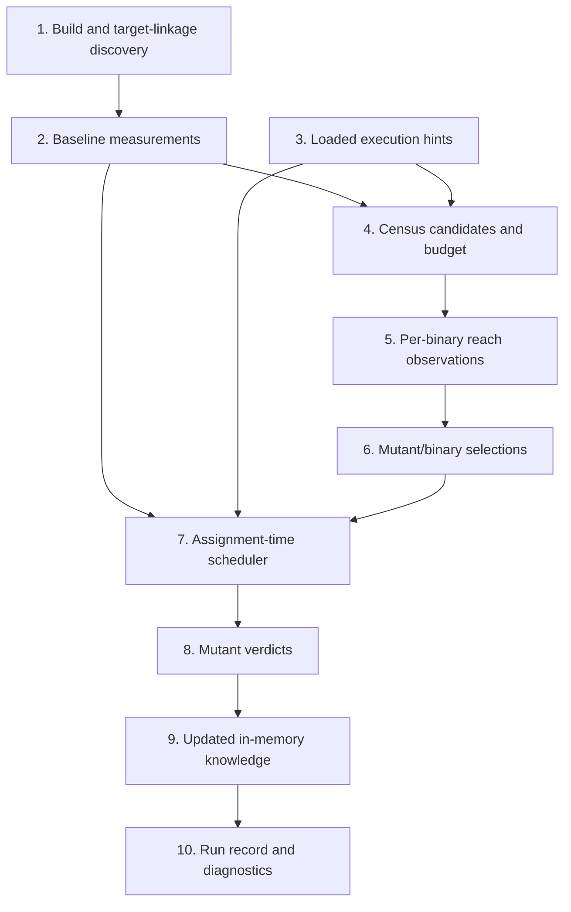

# Scheduling

This document describes how cargo-gamma chooses test work, beginning with
target-linkage discovery before the unmutated baseline. It covers the current
implementation, not a proposed replacement.

## Contents

1. [Target-linkage discovery](#1-target-linkage-discovery)
2. [Baselining](#2-baselining)
3. [Loading hints](#3-loading-hints)
4. [Census admission](#4-census-admission)
5. [Census walk](#5-census-walk)
6. [Projecting census results](#6-projecting-census-results)
7. [Scheduling mutant work](#7-scheduling-mutant-work)
8. [Testing one mutant](#8-testing-one-mutant)
9. [Learning during the sweep](#9-learning-during-the-sweep)
10. [Persistence and reporting](#10-persistence-and-reporting)



## 1. Target-linkage discovery

**Goal:** avoid building, baselining, censusing, or running test binaries that
can be proven unrelated to every pending mutant.

This is a logical scheduling phase within the existing build/preflight work; it
does not currently have its own progress-display label. Its purpose is to
remove test targets proven unable to link any pending mutated source before
paying to baseline or census them.

### 1.1. Coarse package admission

**Goal:** establish the broad set of test binaries policy and Cargo's package
graph permit to judge each mutant.

- The configured test scope first admits packages:
  - package-local testing admits the mutant's own package;
  - `--test-package` admits named oracle packages;
  - `--test-workspace` admits the workspace.
- Cargo dependency analysis then removes admitted package/binary relationships
  that cannot reach the mutated package.
- Unknown package relationships fail open and remain admitted.

This is crate/package-level reachability. It says that a binary may link the
mutated crate, not that it links a particular source file or executes a
particular mutation site.

**Output:** a conservative mapping from each mutant's package to the test
binaries permitted to judge it.

### 1.2. Compiler-captured exact source linkage

**Goal:** refine package-level candidates to test binaries that actually link
each pending mutated source file.

Phase 1.2 cannot replace phase 1.1:

- package admission is policy: a reverse-dependent package may link the source
  but is not allowed to judge it unless `--test-package` or `--test-workspace`
  admits that package;
- exact linkage is optional evidence and can be unavailable or ambiguous, so
  phase 1.1 is the conservative fallback;
- exact linkage only narrows the admitted set; it never introduces a binary
  excluded by package policy.

Conceptually, final candidates are the package-policy candidates intersected
with proven source-linked binaries when exact evidence is available. Without
that evidence, the package-policy candidates remain unchanged.

During the successful Cargo preflight, cargo-gamma installs itself as a
`RUSTC_WRAPPER`. The wrapper:

- forwards every invocation to the configured original wrapper or `rustc`;
- returns that compiler process's representable exit code to Cargo unchanged
  (or failure when it cannot launch the compiler or obtain an exit code);
- records only successful compiler invocations;
- records the crate name and type, `--test` state, primary Rust source,
  output directory, extra filename, and every path-bearing `--extern`;
- marks an invocation opaque when an external dependency cannot be associated
  with a concrete artifact path.

Cargo's JSON `compiler-artifact` messages independently identify each package,
target kind, target source, executable, and emitted artifact. Cargo-gamma
associates a test artifact with a compiler capture only when:

- the target source matches;
- the capture is a test compilation;
- output directory, crate name, and extra filename identify the artifact; and
- every artifact Cargo reported for that compilation yields the same answer.

Starting at that test compilation, cargo-gamma walks the captured `--extern`
graph:

- registry and Git artifacts terminate traversal because their source is
  outside the workspace;
- workspace artifacts are resolved to exactly one captured compiler
  invocation and traversed recursively;
- each invocation's dep-info file contributes its workspace-relative Rust
  source dependencies;
- the dep-info must include the invocation's primary source.

The result is a set of workspace source files proven to feed each test binary.
Cargo-gamma uses it twice:

- derive exact `--test <name>` Cargo selectors for integration-test targets;
- retain package-level `--tests` selection for library, binary, and example
  unit-test harnesses, which `cargo build` cannot name exactly;
- discard built test binaries whose proven linked-source set contains no
  pending mutated file.

This analysis is an optimization, never exclusion by assumption. Missing or
corrupt captures, ambiguous artifact matches, opaque workspace dependencies,
missing dep-info, inconsistent Cargo artifacts, or unsupported target kinds
abandon exact narrowing. The run retains the coarser package-level result. If
the exact-selector build fails, cargo-gamma retries the build with all test
targets before that failure can affect a mutant.

**Output:**

- each test binary annotated with either a proven set of linked workspace
  source files or `unknown`;
- exact Cargo target selectors when every relevant association is known;
- the retained test-binary set, after removing only binaries proven unrelated
  to every pending mutant.

## 2. Baselining

**Goal:** prove that the unmutated test oracle is green and measure the
execution characteristics later mutant runs must be compared against.

Cargo-gamma runs every retained test binary without an active mutant.

**Output:** for each test binary:

- package, target, executable, and the linked-source result established above;
- whole-binary duration;
- number of tests, when the harness reported it;
- timeout, stall, and memory calibration;
- the binary's candidate mutated source files: proven linked files when exact
  capture succeeded, or conservative package-level candidates when linkage is
  unknown. Neither case proves that a test executes a particular mutation
  site; that is the census's job.

## 3. Loading hints

**Goal:** start with previously learned test ordering instead of rediscovering
every likely killer and useful binary from scratch.

When incremental behavior is enabled, cargo-gamma merges:

- `gamma-hints.yaml`, the checked-in hints artifact; and
- `last-gamma-run.json`, the local run record, which wins on conflicts.

A mutant ID is the content-derived identifier of one specific generated
replacement. It is derived from the workspace-relative source file, enclosing
item, mutator, normalized original site text, occurrence, and replacement
index. It is independent of the run-local ordinal and source line number, so
unrelated edits elsewhere in a file do not invalidate it.

Hints can contain:

- an exact previously killing `{ package, target, test }` for a mutant ID;
- ranked exact tests for a stable `(source file, enclosing item)`;
- ranked test binaries for a source file;
- test sets known to reach a stable source site;
- likely compiler-unviable mutants, used only for build ordering.

Hints are guesses, not verdicts. A test or binary named by a hint is run again
before it can affect the result. Missing, stale, corrupt, or unsupported hints
fall back to colder scheduling.

The version-3 YAML artifact groups exact mutant hints by workspace-relative source
file. Each file group contains a deterministic table of distinct killer
identities, and its mutant entries refer to those identities by index. The
source path and repeated package, target, and test strings therefore occur
once per shared group instead of once per mutant. Generalized item, file, and
reach hints retain their independently versioned representation and interned
reach-test sets.

Its `context` contains the repository HEAD SHA and UTC generation date only.
Those fields explain where the artifact generation came from; they do not gate
score-neutral hints or attribute incrementally retained knowledge to that
commit. Legacy JSON versions 1 and 2 remain readable while no YAML artifact
exists. The next successful promotion publishes and verifies YAML before
removing JSON. Malformed artifacts, foreign producers, and unsupported
versions are ignored rather than partially trusted.

**Output:**

- mutant ID to exact candidate killer;
- `(source file, item)` to ranked candidate tests;
- source file to ranked candidate binaries;
- stable source site to previously observed reaching tests;
- likely-unviable mutant IDs for build ordering only.

## 4. Census admission

**Goal:** decide whether spending test launches now to learn site reachability
is likely to avoid more test execution during the mutant sweep.

The census is disabled by default. `--optimize-test-execution` or the equivalent
`optimize-test-execution = true` configuration enables this experimental phase;
without the opt-in, cargo-gamma performs no census listing or sampling launches.
`--whole-test-binaries` conflicts with the opt-in and explicitly suppresses all
case-level selection.

When enabled, the census asks which baseline tests execute each pending mutation site.
Here, **cost** is the estimated time spent listing tests and launching census
scopes. **Savings** is the upper bound on future whole-binary baseline time
that narrower test selections could avoid across all pending mutants.

- Only binaries that may link pending mutated code are candidates.
- A mutant with a usable exact killer hint does not add to the census's
  potential savings, although its site may ride along in a census justified by
  other mutants.
- Maximum possible savings is the sum of whole-binary baseline durations over
  eligible mutant/binary pairs.
- Each binary is asked to list its tests, with a 30-second listing limit.
- Initial scopes are top-level test-module groups when names expose that
  structure; otherwise they are deterministic contiguous chunks.
- Estimated initial census cost is:

  ```text
  max(test-listing duration, 5 ms) * initial scope count
  ```

- The census is skipped when that estimate is not less than the maximum
  possible savings.
- If admitted, the maximum possible savings also becomes the global census
  deadline.

**Output:**

- a mapping from each pending `(mutated package, source file)` to its potential
  test binaries;
- a mapping from each census-candidate binary to the pending site ordinals it
  should observe;
- initial test scopes for each candidate binary;
- estimated census cost, maximum possible savings, and the admission decision.

When census is disabled or declined, the empty census carries no negative
reachability evidence. Exact and generalized probes remain active, and a probe
that does not kill falls back to the complete reachable binary.

Diagnostics classify census as `disabled`, `declined`, `incomplete`, or
`complete`. Attempted census timing, candidate binary and site counts, listing
attempts and successes, estimated walk cost and admission, sampling launches,
and complete versus partial binary evidence accompany the latter two states,
allowing its sweep savings to be compared with its cost.

## 5. Census walk

**Goal:** measure which baseline test groups execute which pending mutation
sites, without changing program behavior.

The current census walk is serial: binaries and their scopes are sampled one
after another even though `jobs` is passed into the census API.

For each scope:

- No mutant is active.
- Every reached guard writes its site ordinal to the census stream.
- The scope must pass and produce a complete, sealed, internally consistent
  stream.
- Every reached site is conservatively attributed to every test in that
  scope.

A scope is subdivided only when:

- it contains more than one test;
- it reaches some, but not all, wanted sites; and
- twice the estimated subdivision launch cost is less than the remaining
  mutant-test work that subdivision could save.

The resulting per-binary data contains:

- ordered test names;
- mutation-site ordinal to reaching-test-set mappings;
- deduplicated reaching-test sets;
- measured scope costs;
- whether the hierarchy completed;
- the number of sample processes launched.

**Output:** per test binary, a site-ordinal-to-reaching-test-set map, measured
scope costs, a completeness flag, and the total number of census launches.

## 6. Projecting census results

**Goal:** turn raw reach observations into conservative instructions the
mutant sweep can execute safely.

For each mutant and test binary, census data becomes one of:

| Selection | Meaning | Sweep behavior |
|---|---|---|
| `Whole` | No usable narrowing | Run the complete binary |
| `Uncovered` | A complete census proved no test reaches the site | Skip the binary |
| `Selected` | A complete census identified the reaching tests | Run only those tests |
| `Hinted` | An incomplete census observed some reaching tests | Try them first, then fall back to the whole binary |

Additional rules:

- A reaching set containing more than half the binary's tests becomes `Whole`.
- Missing, malformed, failed, or inconsistent evidence never proves absence.
- A non-passing `Selected` run is repeated against the whole binary before its
  outcome is accepted because filtering can change resource use and failure
  order.

**Output:** a `(mutant, test binary) -> Whole | Uncovered | Selected(tests) |
Hinted(tests)` selection map used by cost estimation and execution.

## 7. Scheduling mutant work

**Goal:** overlap independent work, expose useful learning before related work
starts, and avoid leaving expensive work as a long serial tail.

Cargo-gamma estimates each pending mutant's serial test cost:

- exact killer hint: baseline duration of the hinted binary;
- `Selected`: measured duration of the selected tests;
- `Whole`: whole-binary baseline duration;
- `Hinted`: whole-binary baseline duration because fallback may be required;
- `Uncovered`: zero.

The cost order is still partitioned into package queues and interleaved. That
order supplies deterministic package-fair, longest-work-first secondary
priority, but workers no longer claim it through a fixed cursor. A worker asks
the scheduler for an assignment only when it is ready to run one.

For unhinted work the scheduler ranks distance first:

1. an item in a file with no active mutant;
2. an inactive item in an active file, preferring the least-contended file;
3. no assignment for a still-cold item that already has an unhinted scout
   active.

The third rule is stronger than file separation because an exact same-item
test is more reusable than file-level binary evidence. Within the same
distance tier the scheduler preserves package turns, prefers greater learning
leverage per estimated evaluation cost, retains longest-work-first value, and
finally uses the stable pre-sweep order. Learning leverage is the number of
pending siblings that can reuse the scout.

A mutant with an exact killer hint is already informed and may share an active
item. It still participates in file contention so cold work is steered toward
more independent files when possible.

The explicit tail policy is **wait for learning**: when only unhinted
same-item conflicts remain for a cold item, capacity stays idle until the
active item changes state. Once that scout publishes, its informed siblings
may run concurrently. The waiter holds no file or item reservation and blocks
on the scheduler condition variable; there is no duration-based sleep or
timeout.

**Output:** immutable work metadata and a synchronized assignment-time
scheduler tracking remaining work and active file/item reservations.

## 8. Testing one mutant

**Goal:** reach the first trustworthy verdict with the least test work while
preserving canonical failure, resource, and metering precedence.

Reachable binaries have a canonical order:

1. binaries from the mutant's own package;
2. binaries from other selected test packages;
3. shorter baseline duration first within each tier;
4. stable package, target, and path tie-breakers.

Evidence is attempted in this order:

1. The mutant's exact checked-in or local killer hint.
2. Persisted exact-site reach candidates.
3. Ranked same-item exact tests.
4. Binaries observed reaching the same item.
5. Binaries observed reaching another site in the same file.
6. Binaries that killed another mutant in the same file.
7. Canonical census-selected or whole-binary execution.

The first valid detection stops testing that mutant. Candidate results from a
later binary are held until canonical iteration reaches that binary, so they
cannot bypass an earlier timeout, resource failure, flake, or metering error.

**Output:** one mutant outcome, elapsed time, optional killing test, and
optional diagnostic note.

## 9. Learning during the sweep

**Goal:** let completed mutant work improve the ordering of related mutants
that have not yet committed to their test work.

The scheduler makes the first assigned unhinted mutant in an item its scout.
Same-item siblings remain unreserved while it runs. Workers use unrelated
files first, then inactive items in the least-contended active file. If no
independent item remains, they wait for a scheduler state-change notification
rather than for an elapsed duration.

A completed mutant publishes:

- its exact killing test for later mutants in the same item;
- its killing or reaching binary for later mutants in the same file;
- safe negative reach evidence for another replacement at the exact same
  stable source site.

The worker publishes all exact-test, reaching-binary, file-binary, and safe
negative-reach learning before releasing its file/item reservation. Releasing
the reservation wakes waiters, so a related follow-on assignment observes the
completed learning. Hinted mutants are not spaced, but their checked result is
published before their reservation is released in the same way.

**Output:** updated in-memory exact killers, ranked item/file candidates, and
safe exact-site reach exclusions for work that has not started yet.

## 10. Persistence and reporting

**Goal:** preserve score-neutral scheduling knowledge for later campaigns and
report whether census and hints repaid their execution cost.

After the sweep:

- exact mutant killers and generalized item/file/reach knowledge are stored in
  the local run record;
- `cargo gamma hints` incrementally promotes applicable knowledge into
  `gamma-hints.yaml`, preserving entries outside its selection; `--replace`
  deliberately rebuilds it from the selected population;
- build-round diagnostics attribute each round's withdrawals to packages. The
  elapsed time remains the measured workspace-wide Cargo invocation and is not
  divided into fictitious package durations;
- census diagnostics report admission size, listing and sampling work, and
  complete versus partial evidence;
- selection diagnostics count whole, case-selected, hinted-fallback, and
  uncovered decisions, plus selected and available named tests;
- hint funnels report candidates, attempts, and hits for exact mutant hints and
  generalized item, reach, file, and census tiers;
- package sweep timelines report first start, final completion, and wall span
  relative to sweep start. These spans can overlap under concurrency and are
  distinct from the package CPU totals; and
- diagnostics retain total launches and launches saved, including the subset
  saved by learned reach evidence.

Promotion writes version 3 YAML atomically. File groups, mutant entries, killer
tables, generalized identities, and interned reach sets use canonical ordering,
so equivalent knowledge produces identical reviewable bytes regardless of
discovery or completion order. A no-op preserves `generated_on` and produces no
file change. A changed generation records the current HEAD SHA and UTC date.
Incremental promotion refuses a malformed, foreign, or unsupported existing
artifact rather than treating it as empty; `--replace` is the explicit
permission to discard such a generation. This includes unsupported
independently versioned generalized data, which today's serializer cannot
round-trip without losing future fields. Publication and legacy cleanup compare
against the exact YAML and JSON bytes used by the merge, so a concurrent update
is left intact and reported as a conflict.

Persisted knowledge changes ordering and selection only. It never carries a
verdict into a new campaign without executing the relevant test again.

**Output:** `last-gamma-run.json`, promoted `gamma-hints.yaml` when requested,
final reports, and diagnostics containing census and sweep effectiveness
metrics.
