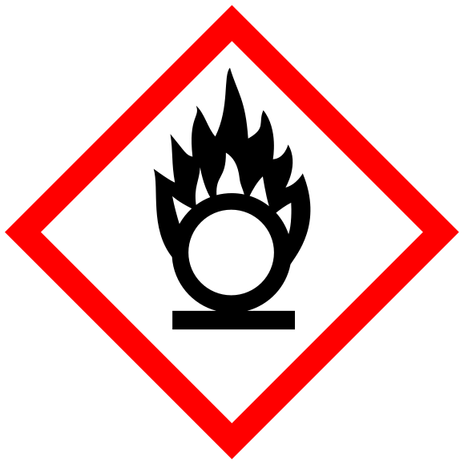

 

# Cargo-Release-Guard

Rehearse selected release candidates without unpublished workspace dependency shortcuts.

Invoke `cargo release-guard check --base origin/main --output-dir <fresh-directory>`.
The guard never publishes or edits the development checkout. See `--help` for
candidate-report reuse, explicit selections, and feature/test-runner options.

This crate was developed as part of <a href="../..">The Oxidizer Project</a>. Browse this crate's <a href="https://github.com/microsoft/ox-tools/tree/main/crates/cargo-release-guard">source code</a>.

