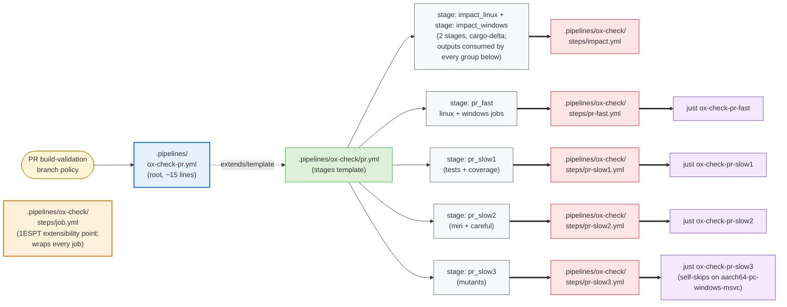
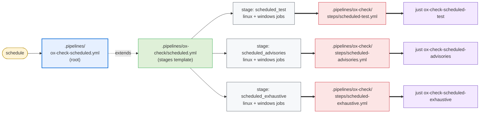

# Azure DevOps Pipelines Integration

This document describes what `cargo ox-check update --backend ado` emits for Azure DevOps
Pipelines, and how a repo wires those files into its own CI.

ox-check emits three layers, all owned by ox-check with the standard owned-file flow (edit →
dirty → `.ox-check-proposed` sibling on next update). The split is by what users actually
need to change:

1. **Root pipelines** (`ox-check-pr.yml`, `ox-check-scheduled.yml` at `.pipelines/`). Triggers,
   runner pool, secret variable groups, and the optional `extends:` to a compliance
   template (1ESPT/SubstratePT/CloudBuild) live here. ox-check ships an opinionated default;
   users who need to customize edit in place and accept the proposal-on-update flow.
   ox-check's emitted root pipelines contain **no** references to compliance harnesses —
   wrapping with 1ESPT is purely a user-side edit.
2. **Stages templates** (`ox-check/pr.yml`, `ox-check/scheduled.yml`), containing the impact job
   and the per-group jobs with all the dependency / output-variable plumbing. These
   change when ox-check's groups or impact wiring evolve; most users won't ever edit them.
3. **Per-group step templates** (`ox-check/steps/*.yml`). Each is a multi-step template that
   runs setup + the matching `just ox-check-<tier>-<group>` recipe.

See also:

- [design.md §6](./design.md#6-repo-layout) for the file-category model.
- [checks.md](./checks.md) for what each group runs.
- [local.md](./local.md) for the `just` recipes the templates invoke.
- [github.md](./github.md) for the GitHub Actions counterpart.

## 1. Why three layers

- **Frequently-changing wiring** (group set, impact computation, fan-out, output-variable
  plumbing) lives in the stages template. Updates apply automatically; users don't have
  to merge changes.
- **Per-repo customization** (triggers, runner pool, compliance harness, secrets) lives
  in the root pipeline. Users who customize it accept the cost of merging the
  `.ox-check-proposed` sibling when the ox-check defaults evolve — which is rare, since the
  root pipeline is intentionally minimal.
- **Compliance composition** is purely a user concern. ox-check's stages template is plain
  ADO YAML; 1ESPT/SubstratePT/CloudBuild composition happens in the user's root pipeline
  by way of `extends:` and `parameters.stages`.

The PR pipeline:



(`steps/job.yml` is the per-job wrapper that every step template invokes; rather than draw four dotted "wraps via" edges from each `pr-*` step into the wrapper -- which the auto-layout struggles with -- the relationship is summarised inside the wrapper node and in §4.1.)

The scheduled pipeline (same colour key):



Legend:
- **Yellow** triggers — branch-policy PR validation (ADO ignores the YAML `pr:` trigger on Azure Repos) and `schedule:` for the scheduled tier.
- **Blue** root pipeline — user-customizable, minimal; this is where adopters insert `extends: template: 1es-pt-pipeline.yml` or other compliance harnesses.
- **Green** stages template — owned, carries the wiring (stage set, `dependsOn:`, output variable plumbing).
- **Grey** stages — one per group; the PR-tier group stages fan in via `dependsOn:` from both impact stages.
- **Red** step templates — per-group, the unit invoked by each job in a stage.
- **Orange** job wrapper — owned but expected to be edited by adopters whose ADO instance requires `templateContext:` blocks (1ESPT/SDL/build provenance). Once edited, the dirty-file flow Proposes future updates as siblings.
- **Purple** just recipe — the actual check execution.

The diagrams flow left-to-right; mermaid stacks same-rank siblings vertically by default. Every per-group step template (`pr-fast.yml`, `pr-slow{1,2,3}.yml`, `scheduled-*.yml`) `template:`s `setup.yml` as its first step; that uniform dependency is elided from the diagram to keep it readable. Every PR-tier group stage declares `dependsOn: [impact_linux, impact_windows]` so it can read the cargo-delta output variables; this fan-in is summarised inside the impact node rather than drawn as edges.

Note the ADO topology differs from GitHub Actions in two places:
1. **No reusable workflow indirection**: ADO `extends:` is one-shot; the root pipeline extends a single template. We compensate by putting all stages in `pr.yml` / `scheduled.yml` as direct templates.
2. **Per-job wrapper**: the `steps/job.yml` template is ADO-specific. GitHub composite actions are uniform; ADO 1ESPT requires per-job extensibility hooks that the wrapper exposes through its `name`/`pool`/`steps`/`artifacts` parameter contract (see §4.1).

## 2. Emitted artifacts

```text
.pipelines/
├── ox-check-pr.yml                    owned   (root PR pipeline)
├── ox-check-scheduled.yml               owned   (root scheduled pipeline)
└── ox-check/
    ├── pr.yml                      owned   (PR-tier stages template)
    ├── scheduled.yml               owned   (scheduled-tier stages template)
    └── steps/
        ├── setup.yml               owned   (install just + catalog tools)
        ├── impact.yml              owned   (cargo-delta impact step; omitted if .delta.toml disabled)
        ├── job.yml                 owned-but-user-customizable
        │                                   (per-job wrapper; takes `name`,
        │                                    `pool`, `steps`, `artifacts`;
        │                                    users edit to inject 1ESPT
        │                                    `templateContext:` etc.)
        ├── pr-fast.yml             owned   (one step template per group)
        ├── pr-slow1.yml            owned
        ├── pr-slow2.yml            owned
        ├── pr-slow3.yml            owned
        ├── scheduled-test.yml        owned
        ├── scheduled-advisories.yml  owned
        └── scheduled-exhaustive.yml  owned
```

All files are regular owned files tracked by the sidecar `.ox-check.lock` manifest
(no in-file checksum line; see [updates.md §1](./updates.md#1-the-manifest)).
`steps/job.yml` deserves special mention: it is emitted as owned (so first-time
adoption gets a working file with no extra steps), but is *expected* to be
customized by adopters whose ADO instance requires extension templates
(1ES PT, SubstratePT, M365PT). Once a user edits it, the standard dirty-file
flow kicks in — subsequent ox-check updates Propose into a `.proposed` sibling
rather than overwriting. The stages templates address the wrapper only via its
parameter contract (`name`, `pool`, `steps`, `artifacts`), so the wrapper can
diverge arbitrarily without blocking stage-shape updates. See §4.1.

## 3. Root pipelines

The default `ox-check-pr.yml` ox-check emits is the minimum needed to run ox-check's stages
template. PR validation for the pipeline is configured via Azure DevOps branch policies in
the project UI — the YAML `pr:` trigger is ignored for Azure Repos and only relevant for
GitHub-hosted repos consumed via an Azure Pipelines service connection (in which case the
adopter adds their own `pr:` block).

```yaml
# .pipelines/ox-check-pr.yml
trigger: none

stages:
- template: ox-check/pr.yml
  parameters:
    linuxPool:   { vmImage: ubuntu-latest }
    windowsPool: { vmImage: windows-latest }
```

The scheduled root pipeline adds a schedule:

```yaml
# .pipelines/ox-check-scheduled.yml
trigger: none
pr: none

schedules:
- cron: "0 6 * * *"
  displayName: ox-check scheduled
  branches:
    include: [main, master]
  always: true

stages:
- template: ox-check/scheduled.yml
  parameters:
    linuxPool:   { vmImage: ubuntu-latest }
    windowsPool: { vmImage: windows-latest }
```

The schedule lists both `main` and `master` so adopters using either canonical-branch
name get coverage out of the box. ADO matches each entry against existing branches; an
entry that matches nothing contributes nothing, so a repo using only `main` runs the
schedule exactly once per cron tick.

For an internal/compliance pipeline, the user replaces their root pipeline with one that
extends 1ESPT/SubstratePT and passes ox-check's stages template as the stages parameter,
overriding the pools with the team's 1ESPT pools:

```yaml
# .pipelines/ox-check-pr.yml (user-edited for 1ESPT)
trigger: none

resources:
  repositories:
  - repository: 1ESPipelineTemplates
    type: git
    name: 1ESPipelineTemplates/1ESPipelineTemplates
    ref: refs/tags/release

extends:
  template: v1/1ES.Unofficial.PipelineTemplate.yml@1ESPipelineTemplates
  parameters:
    pool: { name: <your-default-1ESPT-pool> }
    stages:
    - template: /.pipelines/ox-check/pr.yml@self
      parameters:
        linuxPool:   { name: <your-1ESPT-linux-pool> }
        windowsPool: { name: <your-1ESPT-windows-pool> }
```

The `extends:` keyword, the resources block, and the pool definitions are entirely the
user's business. ox-check's `pr.yml` is a plain stages template that drops in unchanged.
The default matrix is Linux + Windows in all cases — adopters who want a narrower or
wider matrix edit the emitted stages template directly (taking ownership via the
dirty-file flow).

## 4. Owned stages templates

**ARM coverage gap (ADO).** Unlike GitHub, ADO has no Microsoft-hosted ARM agents
(no `vmImage` exists for Linux aarch64 or Windows aarch64). The ADO backend's default
matrix is therefore x86_64 only — `linuxPool` (`ubuntu-latest`) + `windowsPool`
(`windows-latest`). This matches the platforms list `oxidizer`'s root pipelines emit.
Adopters with self-hosted ARM agents extend the stages template in their own root
pipeline (or fork the emitted stages); ox-check itself does not ship ARM legs on ADO.
The catalog and recipes are identical across backends — the asymmetry is purely in the
wiring layer's default OS matrix. See
[checks.md §1](./checks.md#1-groups-and-tiers) for the per-group OS scope tables.

The `pr.yml` stages template is where the wiring lives. Every per-group step template
takes the same three impact-include parameters unconditionally; which ones a group's
checks actually consume is the catalog's concern, not the wiring layer's. This means
moving a check between groups (e.g. `clippy` from `pr-fast` to `scheduled-advisories`)
never changes the stages template.

### 4.1 Per-job wrapper (`steps/job.yml`) — the 1ESPT extensibility point

Every job in `pr.yml` and `scheduled.yml` is rendered through a wrapper template at
`.pipelines/ox-check/steps/job.yml` rather than declared inline. The wrapper exists
to give adopters whose ADO instance requires extension templates (1ES PT,
SubstratePT, M365PT, custom corporate templates) a single, narrow place to inject
the per-job boilerplate those templates require — `templateContext:` blocks,
build-provenance attributes, SDL hooks, custom checkout depths, etc. — without
forking the much larger owned stages templates.

The contract is intentionally small and stable:

| Parameter   | Type       | Required | Meaning                                                                                                                                                                                |
|-------------|------------|----------|----------------------------------------------------------------------------------------------------------------------------------------------------------------------------------------|
| `name`      | `string`   | yes      | Job name; ADO derives the display name from it.                                                                                                                                        |
| `pool`      | `object`   | yes      | Pool block, passed verbatim to ADO's `pool:` key. `linuxPool` and `windowsPool` at the stage level are object parameters, so users can override their shape (e.g. `{ name, os, image }` for 1ESPT). |
| `steps`     | `stepList` | yes      | Body of the job. Templated step lists are fine — the wrapper splices them in via `${{ each step in parameters.steps }}: - ${{ step }}`.                                                |
| `artifacts` | `object`   | no       | List of pipeline artifacts to publish. Each item: `{ name: string, path: string }`. Default wrapper appends one `PublishPipelineArtifact@1` per entry; 1ESPT wrappers translate the same list into `templateContext.outputs.pipelineArtifact` blocks. The stages templates don't need to know which backend they're targeting. |

The default wrapper ox-check ships is six lines of logic:

```yaml
parameters:
  - { name: name, type: string }
  - { name: pool, type: object }
  - { name: steps, type: stepList }
  - { name: artifacts, type: object, default: [] }
jobs:
  - job: ${{ parameters.name }}
    pool: ${{ parameters.pool }}
    steps:
      - ${{ each step in parameters.steps }}:
          - ${{ step }}
      - ${{ each artifact in parameters.artifacts }}:
          - task: PublishPipelineArtifact@1
            displayName: Publish ${{ artifact.name }}
            condition: succeededOrFailed()
            inputs:
              targetPath: ${{ artifact.path }}
              artifact: ${{ artifact.name }}
```

A 1ESPT user replaces the wrapper body with something like:

```yaml
jobs:
  - job: ${{ parameters.name }}
    pool: ${{ parameters.pool }}
    templateContext:
      inputs:
        - input: checkout
          repository: self
          fetchDepth: 0
      outputs:
        - ${{ each artifact in parameters.artifacts }}:
            - output: pipelineArtifact
              targetPath: ${{ artifact.path }}
              artifactName: ${{ artifact.name }}
              condition: succeededOrFailed()
    steps:
      - ${{ each step in parameters.steps }}:
          - ${{ step }}
```

`pool` shape is *also* an extensibility point — `linuxPool` / `windowsPool` are
`type: object` at the stage level, so the same root-pipeline that swaps in a
1ESPT-shaped pool (`{ name, os, image }` instead of `{ vmImage }`) doesn't need
any other changes.

**Why a dedicated wrapper file rather than parameterizing the stages template?**
Because the wrapper is short and stable, but the stages template is long and
changes often (new groups, new dependsOn rules, new impact-output wiring). Putting
the user's customization in a separate file means stages updates flow through
without merging, and the user's wrapper changes survive every ox-check upgrade.

**Why is the wrapper "owned" rather than "proposed-once"?** So that first-time
adoption needs zero extra steps — a fresh `cargo ox-check update` writes a
working wrapper and the pipeline runs. The dirty-file behavior kicks in only
after the user actually edits the file: from then on, ox-check Proposes into
`.proposed` siblings on conflict. This is the same mechanism every other owned
file uses; the wrapper isn't special — it just happens to be the one file most
internal adopters will customize.

**Template-path note.** Each entry in the `steps:` parameter at the call site
contains a `template:` reference (e.g. `template: steps/pr-fast.yml`). ADO
resolves template paths relative to the file containing the `template:`
keyword, which for parameters defined at the call site is the stages template
itself — so the path is written relative to `pr.yml` / `scheduled.yml`, *not*
relative to `steps/job.yml`.

### 4.2 Stages template shape

Approximate shape (ox-check writes this verbatim; users normally don't edit it):

```yaml
# .pipelines/ox-check/pr.yml   (owned by cargo-ox-check)
parameters:
  - name: linuxPool
    type: object
    default: { vmImage: ubuntu-latest }
  - name: windowsPool
    type: object
    default: { vmImage: windows-latest }

stages:
  - stage: impact
    displayName: ox-check impact
    jobs:
      - template: steps/job.yml
        parameters:
          name: compute
          pool: ${{ parameters.linuxPool }}
          steps:
            - template: steps/impact.yml

  - stage: pr_fast
    displayName: ox-check pr-fast
    dependsOn: impact
    condition: succeededOrFailed()
    variables:
      include_modified: $[ stageDependencies.impact.compute.outputs['compute.include_modified'] ]
      include_affected: $[ stageDependencies.impact.compute.outputs['compute.include_affected'] ]
      include_required: $[ stageDependencies.impact.compute.outputs['compute.include_required'] ]
    jobs:
      - template: steps/job.yml
        parameters:
          name: linux
          pool: ${{ parameters.linuxPool }}
          steps:
            - template: steps/pr-fast.yml
              parameters:
                include_modified: $(include_modified)
                include_affected: $(include_affected)
                include_required: $(include_required)
      - template: steps/job.yml
        parameters:
          name: windows
          pool: ${{ parameters.windowsPool }}
          steps:
            - template: steps/pr-fast.yml
              parameters: { ...same... }

  # pr_slow1, pr_slow2, and pr_slow3 each follow the same shape and
  # run as independent parallel stages.
```

The wiring never gates jobs on impact output. Each group always runs; recipes inside
the group decide whether a given check no-ops by testing for the literal sentinel
`--skip` in the relevant include var. This matters because unscoped checks (`fmt`,
`deny`, `audit`, `aprz`, `pr-title`, `mutants-full`) must run on every PR. See
[local.md §4](./local.md#4-impact-scoping-pass-through-env-vars) for the recipe-side
contract.

ADO's `strategy.matrix` doesn't compose with stage-output expressions cleanly (the
expansion happens at compile time but the values aren't available until impact has
run), so ox-check unrolls the OS axis into two explicit jobs (`linux` and `windows`)
at template-compile time. Setting `windowsPool: {}` in the user's root pipeline can
elide the Windows job entirely if their root pipeline is shaped to support that.

The scheduled stages template is simpler — it omits the `impact` stage and runs each
group full-workspace, with the same `linuxPool` / `windowsPool` parameter shape and
the same `steps/job.yml` delegation. Scheduled step templates don't receive any
`include*` parameters; they default to empty strings and recipes fall through to
`--workspace`.

If `.delta.toml`'s managed region is disabled
([updates.md §opt-out](./updates.md#6-opting-out-in-file-stubs)), the impact step is
unaffected — `cargo delta impact` uses its own defaults when the config file is missing
or empty.

## 5. Per-group step templates

Each per-group step template has the **same** uniform parameter surface — the three
impact-include variables plus a per-template handful of PR-context strings. This means
the stages template doesn't need to know which include vars a group's checks consume;
it just threads all three to every group. Moving a check between groups (or between
buckets) is a pure catalog change.

```yaml
# .pipelines/ox-check/steps/pr-fast.yml  (owned by cargo-ox-check)
parameters:
- name: prTitle
  type: string
  default: $(System.PullRequest.Title)
- name: includeModified
  type: string
  default: ""
- name: includeAffected
  type: string
  default: ""
- name: includeRequired
  type: string
  default: ""
steps:
- template: setup.yml
- script: just ox-check-pr-fast
  displayName: ox-check pr-fast
  env:
    PR_TITLE: ${{ parameters.prTitle }}
    OX_CHECK_INCLUDE_MODIFIED: ${{ parameters.includeModified }}
    OX_CHECK_INCLUDE_AFFECTED: ${{ parameters.includeAffected }}
    OX_CHECK_INCLUDE_REQUIRED: ${{ parameters.includeRequired }}
```

Uniform parameter set on every per-group template:

| Parameter         | Default | Notes                                                                                                              |
|-------------------|---------|--------------------------------------------------------------------------------------------------------------------|
| `includeModified` | `""`    | Forwarded as `OX_CHECK_INCLUDE_MODIFIED`. `--skip` → recipe exits 0. Empty → recipe defaults to `--workspace`.     |
| `includeAffected` | `""`    | Forwarded as `OX_CHECK_INCLUDE_AFFECTED`. Same semantics.                                                          |
| `includeRequired` | `""`    | Forwarded as `OX_CHECK_INCLUDE_REQUIRED`. Same semantics.                                                          |

Per-group additions (only where the group consumes PR-context strings the recipe needs):

| Template                  | Extra parameters                                                        |
|---------------------------|-------------------------------------------------------------------------|
| `pr-fast.yml`             | `prTitle` (default `$(System.PullRequest.Title)`)                       |
| `pr-slow3.yml`            | `prBaseRef` (default `$(System.PullRequest.TargetBranch)`)              |
| `pr-slow1.yml`, `pr-slow2.yml`, `scheduled-*.yml` | —                                                                       |

`$(System.PullRequest.*)` are auto-populated by ADO on PR build-validation runs. No
manual web-UI wiring is needed.

The recipes themselves consume only the env vars they need; the catalog records the
mapping (see [checks.md §5](./checks.md#5-impact-scoping-check--env-var-mapping)).
Threading all three to every template costs a few lines per step template but is the
right separation: wiring is about "which jobs depend on impact and feed it forward", not
about "which check needs which env var."

These templates are consumed primarily by ox-check's own stages template. Users who want to
plug individual groups into an unrelated pipeline can `template:` them directly without
passing any include parameters — they default to empty (recipes fall back to
`--workspace`) — and only override what they want to scope.

### `setup.yml` and `impact.yml`

`setup.yml` installs `just` (`cargo install just --locked`) and runs
`just ox-check-setup`. Does not install Rust; expects `cargo` on PATH --
provided by the user's msrustup step in 1ESPT pipelines or by a previous step in OSS
pipelines (see §6).

`impact.yml` runs `cargo delta impact --format json` against
`$(System.PullRequest.TargetBranch)` (or `$BASE_REF` if set) and formats each tier into
a pre-built `--package …` string or the sentinel `--skip`. The three results are
exported as ADO output variables via `##vso[task.setvariable variable=…;isOutput=true]`:

- `compute.include_modified`
- `compute.include_affected`
- `compute.include_required`

Downstream jobs reference them via `dependencies.impact.outputs['compute.<name>']`
inside the runtime macro `$[ … ]` (rather than the compile-time `${{ … }}` macro)
because output variables aren't resolved until the producing job has finished. The
stages template handles all that — users don't write it.

The check → bucket mapping is in
[checks.md §5](./checks.md#5-impact-scoping-check--env-var-mapping). The recipe-side
mechanics are in [local.md §4](./local.md#4-impact-scoping-pass-through-env-vars).

## 6. Rust toolchain

ox-check does not install Rust on ADO. The step templates assume `cargo` is on PATH. The
user's root pipeline (or compliance template) installs Rust before the ox-check stages run.

Why ox-check doesn't ship a Rust install step:

- **1ESPT compliance.** Compliance pipelines install Rust via msrustup
  (Microsoft-internal). The standard `RustInstaller` ADO task is not used. ox-check must
  emit nothing that conflicts with that.
- **Toolchain choice is a repo decision.** msrustup channels (`ms-prod-1.93`, etc.) are
  repo-policy questions ox-check has no business making.

In the OSS / non-1ESPT case, the user adds a `RustInstaller@1` task (or a rustup
shell script) to their root pipeline before the ox-check stages template runs. A typical
placement: a setup stage that `dependsOn`s nothing and runs first, followed by the ox-check
stages.

`_ox-check-require` (invoked by every check recipe) validates the installed `rustc` against
the catalog minimum at recipe time; missing or below-minimum `rustc` produces a clean
failure message. For nightly-requiring checks (miri, careful, udeps), the failure message
suggests asking the team's pipeline owner to add `nightly` to msrustup.

## 7. Caching

`setup.yml` computes a cache key from: OS, rustc version (read from
`rust-toolchain.toml`), `Cargo.lock`, `.cargo/config.toml`, and the binary's embedded
catalog hash. Uses the ADO pipeline workspace cache (`Cache@2` task). `CARGO_HOME` is
pinned to a workspace-scratch location to keep cache scoping predictable.

The cache covers:

- The `cargo install`-ed tools from `ox-check-setup` (step 4 of the recipe).
- The `target/` directory (per ox-check recipe; a per-recipe cache scope means a `pr-slow1`
  cache hit doesn't have to wait on a `pr-fast` cache miss).

Cache scoping inside 1ESPT-compliant pipelines is bounded by the template's allowed cache
namespaces; the emitted cache step uses the project-scoped namespace by default and the
user can override via a parameter on `setup.yml` if their compliance policy requires a
different one.

## 8. Security

The step templates do nothing privileged on their own — they just install tools and
invoke `just`. The user's root pipeline controls service-connection scoping, secret
variable groups, and approval gates.

Recommended user-pipeline shape:

- PR pipelines and scheduled pipelines are separate root files (so they can have separate
  triggers, separate variable groups, and different `extends:` if needed).
- Scheduled-tier variable groups (with any external-service credentials) are referenced only by
  the scheduled pipeline.
- All cargo-tool installs done by `setup.yml` use `--locked`. No `cargo-binstall`.

## 9. Incremental adoption

For repos with an existing 1ESPT-extending pipeline, adopting ox-check is incremental:

1. Run `cargo ox-check update --backend ado` to emit owned templates and root pipelines.
2. Either delete the emitted root pipelines (`.pipelines/ox-check-{pr,scheduled}.yml`) if they
   conflict with the repo's existing ones, or edit the existing pipelines to call out to
   `ox-check/pr.yml` / `ox-check/scheduled.yml`.
3. In the repo's existing pipeline, add a stage that does
   `template: /.pipelines/ox-check/pr.yml@self` under `parameters.stages` of the 1ESPT
   `extends:` block.
4. Verify the stage runs green on a PR.
5. Optionally split into individual group stages by hand if the compliance template
   requires it.

ox-check's owned templates compose cleanly with the 1ESPT `enableStages` flag system: each
group is its own job inside the `OX_CHECK_pr` stage, so 1ESPT can gate or split them as
needed. The pre-existing repo-specific compliance steps (msrustup, NuGet pushes, signing,
…) keep running alongside the ox-check stage. ox-check does not own the pipeline's shape —
it just contributes a stage.

## 10. Coverage upload

After `pr-slow1` (and `scheduled-test`) runs the `ox-check-llvm-cov` recipe, the stages
template adds a `PublishCodeCoverageResults@2` step on the Linux job that ingests
`target/coverage/cobertura.xml`. The cobertura format is the modern recommendation for
the task (lcov is not accepted) and is produced alongside lcov.info by the same
instrumented test run.

```yaml
- task: PublishCodeCoverageResults@2
  condition: and(succeededOrFailed(), ne(variables.skip, 'true'))
  displayName: Publish coverage
  inputs:
    summaryFileLocation: target/coverage/cobertura.xml
    failIfCoverageEmpty: false
```

Only the Linux leg uploads; the Windows leg produces equivalent data but uploading both
would either overwrite or double-count depending on the ADO version. The
`condition: ne(variables.skip, 'true')` skips the upload when impact scoping decided no
tests needed to run; `failIfCoverageEmpty: false` keeps the step from failing the build
when the upstream cobertura file is missing (e.g. a tooling issue or a skip outcome that
didn't get caught by the condition).

The data appears in the ADO build page's "Code Coverage" tab natively — totals, file
tree, and a per-file annotation view. ADO does not natively compute diff coverage
between PR and base; that's a known limitation of the platform (see `coverage.md`
for the unified-coverage discussion).

ox-check does not gate the PR on coverage. The cobertura upload is informational;
adopters who want gating add `BuildQualityChecks@9` (Microsoft DevLabs marketplace
task) downstream of the test step and configure it via their branch policy.

## 11. Advisory PR comments

Recipes that surface non-blocking findings exit 0 and write a markdown body to
`target/ox-check/comments/<NAME>.md` (see [checks.md §6](./checks.md#6-advisory-pr-comments)
for the cross-backend convention). The ADO backend turns presence/absence of those
files into upserts/deletions of a sticky PR comment via the Azure DevOps REST API
(ADO has no marketplace equivalent of marocchino's sticky-comment action; the REST
path is the supported way).

The wiring lives in the `pr_fast` stage of `pr-stages.yml`, as a pwsh step that runs
on the canonical Linux leg after the `pr-fast` group's `bash: just ox-check-pr-fast`
step:

```yaml
- task: PowerShell@2
  displayName: ox-check advisory PR comments
  condition: and(succeededOrFailed(), eq(variables['Build.Reason'], 'PullRequest'))
  env:
    SYSTEM_ACCESSTOKEN: $(System.AccessToken)
  inputs:
    targetType: inline
    pwsh: true
    script: |
      # iterate known files, find existing thread by HTML marker,
      # PATCH first comment / POST new thread / set status: closed
```

Key ADO-specific details:

- **Marker-based thread lookup**. ADO comments have no "sticky header" parameter; we
  embed an HTML marker (`<!-- ox-check-<NAME> -->`) as the first line of the comment
  body. The script lists PR threads (`GET pullRequests/{id}/threads`), finds the one
  whose first comment contains the marker, and PATCHes its first comment with the new
  body or sets the thread `status` to `closed` when there's nothing to report. The
  marker is invisible to human readers.
- **`$(System.AccessToken)` opt-in**. ADO does not expose `System.*` variables to
  scripts by default. The step explicitly maps it via `env:`, and `checkout` must run
  with `persistCredentials: true` so the token actually carries write permission.
- **Build identity permission**. The "Project Collection Build Service (<org>)"
  identity needs **Contribute to pull requests** on the repo. 1ESPT pipelines usually
  have this; vanilla ADO sometimes requires a one-time admin grant. Without it the
  REST call returns 403 and the comment is silently skipped (the step is wrapped to
  exit 0 on auth failures so it doesn't break PRs in repos that haven't opted in).
- **No fork story**. ADO's PR-from-fork support is limited compared to GitHub; the
  REST call works for same-org PRs, which is the only case 1ESPT actually supports
  on internal repos. Forks fail closed (no comment posted) rather than fail open
  (build red).
- **Canonical leg**. As on the GitHub side, the step runs only on the Linux job so the
  Linux/Windows matrix doesn't race on the same thread.

Adding a new advisory check is a two-step change: the recipe writes
`target/ox-check/comments/<NEW>.md` (and removes it on a clean run); the pwsh step's
`@checks` table gains a `@{ name = '<NEW>'; file = 'target/ox-check/comments/<NEW>.md' }`
entry. There's deliberately no auto-discovery loop over the convention dir — explicit
per-check entries keep stale comments deterministically clearable when a check is
removed from the catalog.
